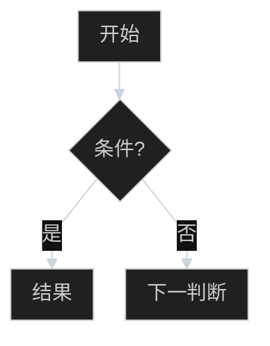
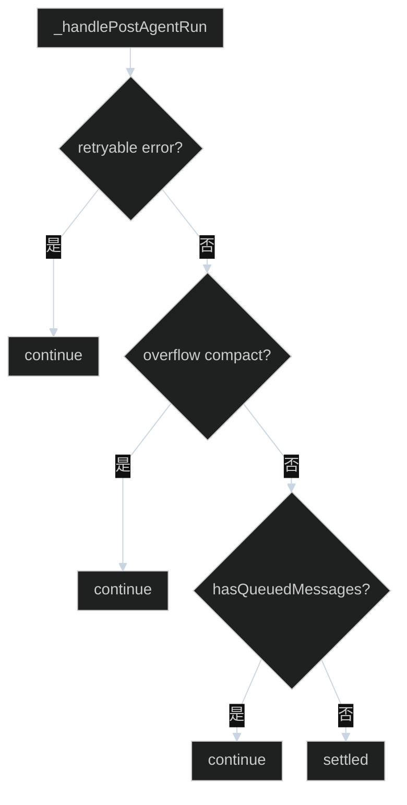

# Mermaid 绘图规则

教学笔记里的流程图：看清结构，不抢正文。先定主轴和出口，再写节点。

## 何时用哪种方向

| 图在讲什么 | 方向 | 例子 |
|------------|------|------|
| 一串判断 / 几道门 / 要不要停 | `flowchart TB` | 停机四道门、兜底 |
| 短链路、无回边的流水线 | `flowchart LR` | 一次 LLM 调用、tool 预检 |
| 分层（入口 / Interactive / Core） | `flowchart TB` + `subgraph` | 三层调用栈 |

默认 **TB**。LR 只用于「从左到右一遍走完、没有绕回起点」的图。

## 主轴与出口

判断链画成竖轴：

- **否 / 继续** → 往下（主轴）
- **是 / 结束 / 结果** → 往右（出口）
- 菱形里只写短问句，以 `?` 结尾
- 边上只写 `是` / `否` / `有` / `无`，细节放节点或图上方的 `function flow`



## 连线

- 必须 `curve: linear`（直线）。不要默认曲线。
- 不要 `stepAfter` / `step`：横向 + 直角折线 + 回边会缠在一起。
- 不要画绕全图的回边。循环写成节点文案（`continue：再进停机`）或落到「续跑 LLM」这种终点，不连回起点。
- 不要多条边汇进同一个结果框。每个 `是` 接到自己的结果节点（`C1` / `C2` / `C3`），哪怕文案相同。
- 中间语义需要被看见时，用节点，不要只写在很长的边标签上。

## 疏密

紧凑，但节点和字不能挤在一起。

| 项 | 取值 |
|----|------|
| `rankSpacing` | 28–36 |
| `nodeSpacing` | 24 |
| `padding` | 8 |
| `fontSize` | 15px（节点很少时 16px） |

不要把 spacing 收到 16/10 以下。不要靠 LR + 折线「压扁」一张本来该竖着读的判断图。

## 标签

- 一框一件事。菱形不超过约 12 个字。
- 少用 `<br/>`，除非矩形里确实有两行职责。
- 顺序门用 ①②③④。
- 图旁已有 `function flow` 时，图只保留结构，不复述整段逻辑。

## 皮肤（固定）

每张 flowchart 都带这段 `init`，再按角色 `classDef`。

```text
%%{init: {"theme": "dark", "flowchart": {"curve": "linear", "rankSpacing": 28, "nodeSpacing": 24, "padding": 8}, "themeVariables": {"fontSize": "15px", "background": "#000000", "lineColor": "#CBD5E1", "clusterBkg": "#111111", "clusterBorder": "#C4B5FD", "titleColor": "#FDE68A", "edgeLabelBackground": "#111111"}}}%%
```

无 subgraph 时可去掉 `clusterBkg` / `clusterBorder` / `titleColor`。

| 角色 | class | fill / stroke / color |
|------|-------|------------------------|
| 入口 / IO | `start` | `#BFDBFE` / `#93C5FD` / `#1E3A8A` |
| 过程 | `step` | `#A5F3FC` / `#67E8F9` / `#155E75` |
| 判断 | `dec` | `#FEF08A` / `#FDE047` / `#713F12` |
| Core / 产品层 | `core` | `#E9D5FF` / `#D8B4FE` / `#6B21A8` |
| 失败 / 动作 | `bad` | `#FBCFE8` / `#F9A8D4` / `#831843` |
| 成功 / 结束 | `ok` | `#BBF7D0` / `#86EFAC` / `#14532D` |
| subgraph | `wrap` | `#111111` / `#C4B5FD` / `#FDE68A` |

## 好 vs 坏

**好：竖轴、出口在右、无回边、边很短**



**坏（不要再这样画）**

- `flowchart LR` + `curve: stepAfter` + 绕回起点
- 两条边同时进同一个节点，边标签写成「是：不因这批续 LLM」
- 菱形里塞一整句「Interactive 兜底：还开不开新一轮？」
- 为压高度把 `rankSpacing` 收到 16

## 出图步骤

1. 这张图只回答一个问题。
2. 选 TB 还是 LR（有判断链就 TB）。
3. 列出主轴节点；每个判断的「是」单独一个出口节点。
4. 套 init 模板和配色。
5. 自检：无绕圈回边、无多线汇合、菱形短、边只有 是/否、直线。
