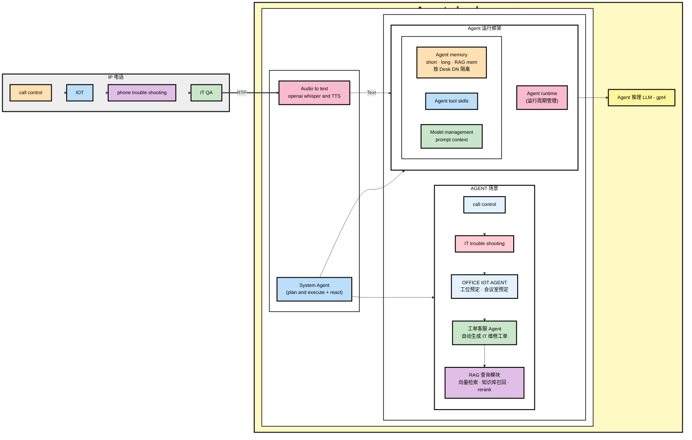
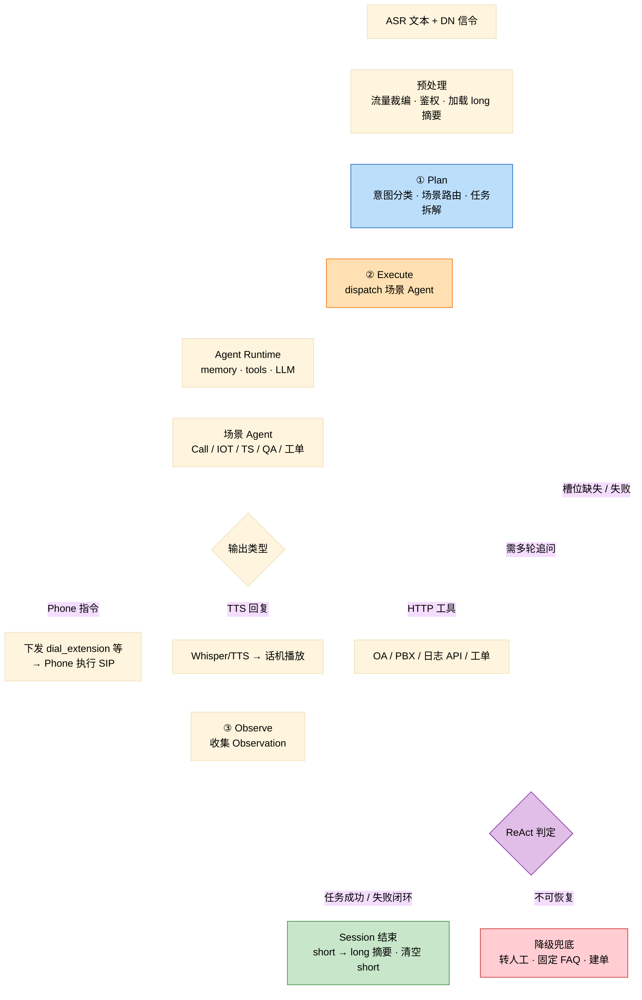
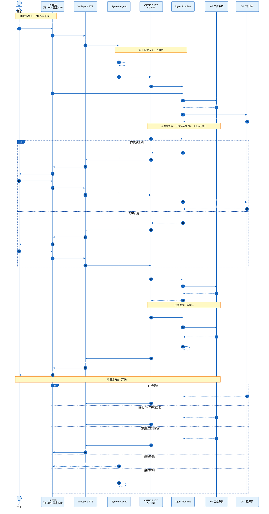
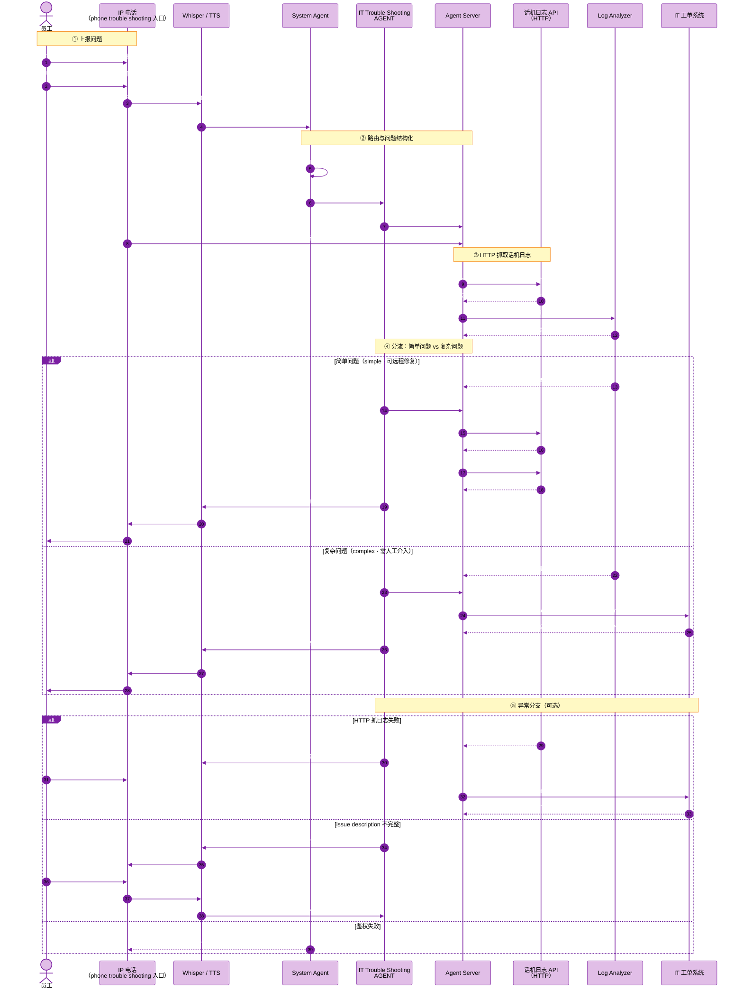
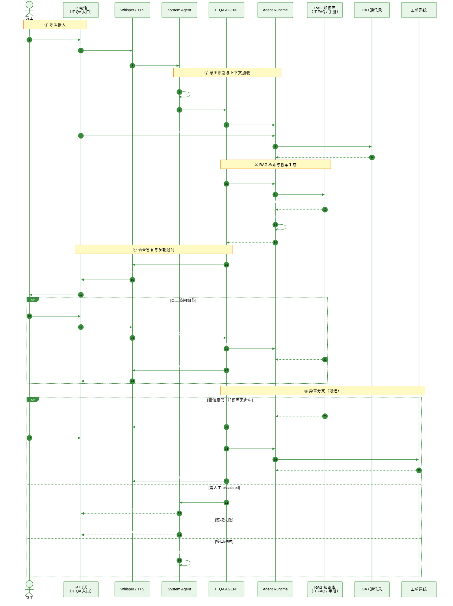
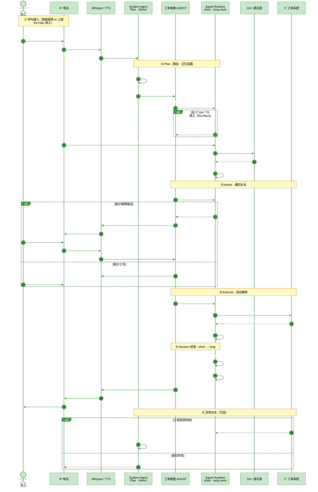

# IP PHONE AI Agent 架构图



## 数据流说明

1. **IP 电话**（call control / IOT / phone trouble shooting / IT QA）通过 **RTP** 将实时音频送入 Agent 服务端。
2. **Audio to text**（OpenAI Whisper + TTS）完成语音转文字，以 **Text** 形式进入 **Agent 运行框架**。
3. **System Agent**（plan and execute + ReAct）负责编排，协调 **AGENT 场景**（含 call control / IT 排障 / IOT / 工单客服 / **RAG 查询**）与 **Agent 运行框架**。
4. **Agent 运行框架** 包含运行周期管理、**三层记忆**（short / long / RAG mem，按 Desk DN 隔离）、工具技能、模型与 prompt 上下文管理。
5. 底层 **Agent 推理 LLM（GPT-4）** 为全链路提供推理能力。

## Agent 记忆体系（short · long · RAG mem）

> **设计原则**：Server 为**每一台 Desk Phone**（固定 DN ↔ 工位）维护独立记忆空间；同一工位上的多通呼叫、多员工使用时，以 DN 为边界隔离上下文，避免串话。

### 三种记忆对比

| 维度 | Short Memory（短期记忆） | Long Memory（长期记忆） | RAG Mem（检索记忆） |
|---|---|---|---|
| **本质** | 当前通话 / 当前任务的多轮上下文 | 该 Desk 的历史行为与偏好摘要 | 外部知识库检索结果（非对话历史） |
| **生命周期** | 单次呼叫或单次 Agent 任务内有效；任务结束或超时 TTL 清空 | 跨通话持久化；按 DN 长期保留，定期摘要压缩 | 每次查询实时召回；Top-K 片段注入当轮 Context，不写入对话历史 |
| **存储位置** | Server 内存 / Redis（热数据） | Server DB / 向量摘要库（按 DN 分区） | 云端向量库 + 文档库（**全局共享**，非 per-phone 存储） |
| **隔离键** | `{ desk_dn, session_id }` | `{ desk_dn }` | 查询时可带 `{ desk_dn, 场景 }` 作过滤，库本身共享 |
| **典型内容** | 本轮已说工号、被叫消歧结果、多轮追问、工具调用链 | 该 Desk 近期预定记录、历史报障、常用联系人、上次未完成任务 | IT FAQ 片段、话机排障 SOP、OA 政策段落 |
| **谁写入** | Agent Runtime 每轮自动追加 | 任务成功/失败时摘要写入；定时 Job 压缩 | RAG 查询模块检索后注入 Prompt，**不持久化为用户记忆** |
| **谁读取** | 同通对话内所有 Agent（Call / IOT / QA / TS） | 新通话开始时预加载「该 Desk 近期摘要」 | IT QA、排障等场景 Agent 按需调用 RAG 模块 |

### 应用场景（按 Call Flow）

| 场景 | Short Memory | Long Memory | RAG Mem |
|---|---|---|---|
| **Call Control** | 同名消歧「研发部张三 vs 测试部张三」；通话中「再转前台」 | 该 Desk 常呼联系人 Top-N | — |
| **IOT 工位预定** | 本轮工号 E10258、时段补全追问 | 该 Desk 近 7 天预定历史 | — |
| **Phone Trouble Shooting** | 本轮 issue description、日志分析结论 | 该 Desk 历史报障次数、上次根因 | 排障手册片段（若启用 RAG 辅助） |
| **IT QA** | 多轮追问「证书无效怎么办」上下文 | 该 Desk 高频 IT 问题标签 | **主用**：VPN/打印机/权限 FAQ 检索 |

### Server 按 Desk Phone 隔离记忆

```
Desk A-302（DN=8201）          Desk B-405（DN=8305）
┌─────────────────────┐        ┌─────────────────────┐
│ short: session_001  │        │ short: session_042  │
│  · 当前多轮对话      │        │  · 当前多轮对话      │
├─────────────────────┤        ├─────────────────────┤
│ long: dn=8201       │        │ long: dn=8305       │
│  · 近 30 天预定摘要  │        │  · 历史报障 2 次     │
│  · 常呼：张三、前台   │        │  · 常问：VPN 问题    │
└─────────────────────────────────────────────────────┘
         │                              │
         └──────────┬───────────────────┘
                    ▼
         RAG Mem（全局知识库 · 共享只读）
         IT FAQ · 排障手册 · OA 政策
```

**关键规则**

1. **DN 是 Desk 记忆主键**：Flexible Seating 下员工会变，但**话机 DN 固定绑定工位**；Server 以 DN 分区 short/long，员工工号写入 short 会话槽位，不替代 DN 分区键。
2. **Short 不跨通**：Call Control 外呼成功即结束 session；新摘机 = 新 `session_id`，继承同 DN 的 long 摘要可选预加载。
3. **Long 做摘要不写 raw log**：仅存结构化摘要（预定单号、工单号、偏好），控制 token 与隐私。
4. **RAG Mem 是「查出来的知识」不是「用户聊出来的」**：与 short/long 分离，避免把 FAQ 片段误当对话历史；检索结果仅注入当轮 Prompt。
5. **端侧零记忆**：IP Phone 薄客户端不存 short/long/RAG，全部在 Agent Server；话机只透传 DN + RTP。

### Short → Long 压缩流转

**会压缩存入，但有条件、有筛选**——不是 short 全量 dump 到 long。

```
session 进行中                    session 结束（成功 / 失败 / 超时）
┌──────────────────┐              ┌─────────────────────────────────┐
│ Short Memory     │   摘要压缩    │ Long Memory（dn=8201）           │
│ · 多轮 raw 对话   │ ──────────►  │ · 结构化摘要 merge 进已有 long   │
│ · 工具调用明细    │  LLM 提取    │ · 丢弃闲聊 / 重复追问 / 中间态    │
│ · 临时槽位        │  关键事实    │ · 保留：工单号、预定单、根因、偏好  │
└──────────────────┘              └─────────────────────────────────┘
        │                                      │
        └── session 清空（TTL）                   └── 跨通保留，定期再压缩
```

| 阶段 | 行为 |
|---|---|
| **Session 内** | 每轮对话、工具结果追加到 short；long 可选**只读预加载**（如「该 Desk 常呼张三」） |
| **Session 结束** | Runtime 触发 **summarize → merge**：LLM 从 short 提取关键事实，**结构化写入** long |
| **写入 long 的** | 预定单号、工单号、报障根因、常呼联系人、高频 IT 问题标签、未完成任务指针 |
| **不写入 long 的** | 完整对话原文、TTS 话术、RAG 检索片段、失败的多轮追问中间态 |
| **Short 之后** | 清空或归档到冷存储（审计用）；**下一通新 session 不继承 raw short** |
| **Long 再压缩** | 定时 Job 对 long 做 rolling summary，避免无限膨胀（如「近 30 天」窗口） |

**示例**

- IOT 预定成功：short 里有 5 轮追问 → long 只存 `{ 工位:A-302, 工号:E10258, 订单:RES-001, 时间 }`
- Trouble Shooting 建单：short 里有完整 issue + 日志分析 → long 只存 `{ 报障次数+1, 上次根因:DNS, 工单:INC-0091 }`
- Call Control 外呼成功：short 有消歧对话 → long 可选更新 `{ 常呼:张三↑ }`；无价值的则不写

**RAG Mem 不参与此流转**：检索片段只在当轮 Prompt 中使用，不进入 short 持久层，更不写入 long。

## System Agent 编排流程（Plan · Execute · ReAct）

> **System Agent** 是 Agent Server 的**全局调度中枢**，位于 ASR 文本输入与场景 Agent 之间，负责：**Plan（规划）→ Execute（执行）→ ReAct（推理-行动-观察循环）**，并统一做流量裁编、权限鉴权、降级兜底。

### 三阶段职责

| 阶段 | 职责 | 输入 | 输出 |
|---|---|---|---|
| **Plan** | 理解意图、选场景、拆子任务、定工具链 | ASR 文本 + DN + short/long 预加载 | 任务计划 `TaskPlan`（目标 Agent、步骤列表、成功条件） |
| **Execute** | 按计划 dispatch 场景 Agent，驱动 Runtime / Tools / LLM | `TaskPlan` | 工具调用结果、Phone 指令、TTS 话术 |
| **ReAct** | 观察执行结果，决定继续 / 追问 / 重规划 / 结束 | Observation（工具回传、Phone 状态、用户新语音） | 下一轮 Thought + Action，或 session 结束 |

### 整体流程



### ReAct 循环（Thought → Action → Observation）

System Agent 与场景 Agent 在 **Agent Runtime** 内共用同一 ReAct 循环；**Plan 只在 session 首轮或重规划时触发**，Execute + ReAct 可迭代多轮。

```
┌─────────────────────────────────────────────────────────────┐
│  Thought（推理）                                               │
│  LLM 结合：用户文本 + short 上下文 + long 摘要 + 上轮 Observation │
│  → 决定下一步 Action 或判定任务完成                              │
├─────────────────────────────────────────────────────────────┤
│  Action（行动）                                                │
│  · 调用 Tool Skill（get_dn_by_name / fetch_phone_logs …）     │
│  · dispatch 场景 Agent 子步骤                                  │
│  · 下发 Phone 控制指令（dial_extension / reboot …）            │
│  · 生成 TTS 追问话术                                           │
├─────────────────────────────────────────────────────────────┤
│  Observation（观察）                                           │
│  · 工具返回（通讯录、日志、工单号）                              │
│  · Phone 回传（call_established / call_failed）                │
│  · 用户新语音（ASR 补槽）                                      │
│  → 写回 short memory，进入下一轮 Thought                        │
└─────────────────────────────────────────────────────────────┘
```

| ReAct 分支 | 触发条件 | System Agent 行为 |
|---|---|---|
| **继续 Execute** | 槽位已补全，尚需下一步工具/指令 | 同场景内下一轮 Action |
| **Re-Plan** | 意图变更（如 Call 中途改 IOT）、消歧失败需换策略 | 重新 Plan，可切换场景 Agent |
| **追问用户** | 缺工号 / 缺被叫 / issue 不完整 | Action = TTS 追问 → 等待 Observation |
| **成功结束** | 满足 TaskPlan 成功条件（如 call_established、预定成功） | 停止循环，short 摘要 → long |
| **失败结束** | 工具失败且降级策略耗尽 | 建单 / 转人工 / 播报兜底话术 |

### Plan 阶段详解

**1. 意图分类（路由到 IP 电话入口 / 场景 Agent）**

| 用户意图信号 | 路由目标 |
|---|---|
| 「呼叫 / 转接 / 会议」 | Call Control Agent |
| 「预定工位 / 会议室」 | OFFICE IOT Agent |
| 「话机坏了 / 注册不上 / 没声音」 | IT Trouble Shooting Agent |
| 「VPN 怎么用 / IT 政策」 | IT QA Agent（+ RAG） |
| 「提交工单 / 报修」 | 工单客服 Agent |

**2. 任务拆解（TaskPlan 示例）**

Call Control「呼叫研发部张三」：
```
TaskPlan:
  goal: dial_extension 成功
  steps:
    1. get_dn_by_name(张三, 研发部) → 被叫 DN
    2. [若同名] TTS 消歧
    3. dial_extension(callee_dn, caller_dn) → Phone
  success: Phone 回传 call_established
```

**3. 上下文装配（Plan 时一次性加载）**
- `{ desk_dn }` → long 摘要（常呼联系人、历史报障）
- 新建 / 续用 `{ desk_dn, session_id }` → short
- 场景 Prompt 模板（Model management）

### Execute 阶段详解

System Agent **不直接调工具**，而是：
1. 将 TaskPlan **dispatch** 给对应场景 Agent
2. 场景 Agent 通过 **Agent Runtime** 调用 Tools / LLM
3. Runtime 将每轮 Action / Observation **追加到 short memory**
4. 需 Phone 侧动作时，Runtime 下发指令（非 Server 发 SIP）

### 与各 Call Flow 的映射

| Call Flow | Plan | Execute | ReAct 典型循环 |
|---|---|---|---|
| **Call Control** | 路由 Call · 拆 get_dn_by_name → dial_extension | 查通讯录 → 下发 dial_extension | 同名消歧 1~2 轮 → Phone call_established 结束 |
| **IOT 预定** | 路由 IOT · DN→工位 · 需工号+时段 | get_desk_by_phone · reserve_desk | 缺工号追问 → 补槽 → 预定成功 |
| **Trouble Shooting** | 路由 TS · 封装 issue + DN | HTTP 抓日志 · analyze_logs | simple 修复 / complex 建单 |
| **IT QA** | 路由 QA · 判断是否需 RAG | rag_search · generate_answer | 多轮追问 → 低置信度 Re-Plan → 工单 Agent |
| **工单客服** | 路由工单 · 拆槽位（工号/issue/类别） | get_employee · create_it_ticket | 缺槽追问 → 建单成功 → short→long |

### 降级兜底（System Agent 全局职责）

Plan / ReAct 任意阶段可触发，**优先于场景 Agent 继续循环**：

| 异常 | 降级策略 |
|---|---|
| 鉴权失败 | 拒绝执行，TTS 提示联系管理员 |
| 工具 / HTTP 超时 | 重试 1 次 → 播报固定 FAQ 或建单 |
| LLM 低置信 / 幻觉 Guard | 转 RAG 复核或转人工 |
| Phone 离线 | 仅文本/TTS 响应，或建单 |
| 并发 / 流量超限 | 流量裁编，排队或简化 Plan |

### 与 Runtime 的分工

| 模块 | 职责 |
|---|---|
| **System Agent** | 跨场景编排、Plan/Re-Plan、鉴权、降级、ReAct 终止判定 |
| **场景 Agent** | 单场景业务逻辑、槽位填充、领域 Prompt |
| **Agent Runtime** | session 生命周期、short/long 读写、工具调用、LLM 推理、Phone 指令通道 |
| **LLM（GPT-4）** | Thought 生成、摘要压缩、Grounded 答案 |

---

## Call Control Call Flow

> 场景：员工通过 IP 电话 **call control** 入口以自然语音发起**呼叫控制**（外呼拨号、转接、会议、保持/恢复）。System Agent 路由至 **Call Control Agent**，通过 **`get_dn_by_name`** 按姓名查询被叫完整信息；外呼时 **Server 下发指令至话机**，话机根据指令构造并发送 **SIP Call Message** 完成实际呼出；话机 **DN** 标识主叫线路。

```mermaid
---
config:
  securityLevel: loose
  theme: base
  themeVariables:
    fontSize: 17px
    fontFamily: Arial, Microsoft YaHei, sans-serif
    darkMode: false
    background: '#ffffff'
    mainBkg: '#ffffff'
    actorBkg: '#ffe0b2'
    actorBorder: '#ef6c00'
    actorTextColor: '#000000'
    actorLineColor: '#ef6c00'
    signalColor: '#ef6c00'
    signalTextColor: '#ffffff'
    messageTextColor: '#ffffff'
    labelTextColor: '#ffffff'
    labelBoxBkgColor: '#ef6c00'
    labelBoxBorderColor: '#e65100'
    noteBkgColor: '#fff9c4'
    noteBorderColor: '#f57c00'
    noteTextColor: '#000000'
    loopTextColor: '#000000'
    sequenceNumberColor: '#000000'
    lineColor: '#ef6c00'
    textColor: '#000000'
    primaryTextColor: '#000000'
  sequence:
    useHtmlLabels: true
    messageFontSize: 17
    actorFontSize: 17
    noteFontSize: 16
    messageMargin: 40
    wrap: true
    showSequenceNumbers: true
  themeCSS: |
    .actor { fill: #ffe0b2 !important; stroke: #ef6c00 !important; stroke-width: 2px !important; }
    text.actor, text.actor-box { fill: #000000 !important; stroke: none !important; font-size: 17px !important; font-weight: 600 !important; }
    .messageText, .labelText, text.messageText, text.labelText {
      fill: #ffffff !important;
      color: #ffffff !important;
      stroke: none !important;
      font-size: 17px !important;
      font-weight: 500 !important;
    }
    .labelBox { fill: #ef6c00 !important; stroke: #e65100 !important; stroke-width: 1.5px !important; }
    .labelBox foreignObject, .labelBox foreignObject div, .labelBox foreignObject span, .labelBox foreignObject p {
      background-color: #ef6c00 !important;
      color: #ffffff !important;
      font-size: 17px !important;
      padding: 4px 8px !important;
    }
    .actor-line { stroke: #ef6c00 !important; stroke-width: 2.5px !important; }
    .messageLine0, .messageLine1 { stroke: #ef6c00 !important; stroke-width: 2.5px !important; }
    .messageLine0 .arrow-head, .messageLine1 .arrow-head { fill: #ef6c00 !important; stroke: #ef6c00 !important; }
    .noteText { fill: #000000 !important; }
    .loopLine { stroke: #666666 !important; stroke-width: 2px !important; }
    .loopText { fill: #000000 !important; font-weight: bold !important; }
---
sequenceDiagram
    autonumber
    actor User as 员工
    participant Phone as IP 电话<br/>（call control 入口）
    participant ASR as Whisper / TTS
    participant Sys as System Agent
    participant CC as Call Control AGENT
    participant RT as Agent Runtime
    participant Dir as OA / 通讯录
    participant PBX as Cisco PBX<br/>（SIP 交换）

    Note over User, Phone: ① 呼叫接入
    User->>Phone: 摘机 / 按下 call control 快捷键
    User->>Phone: 「帮我呼叫研发部的张三」
    Phone->>ASR: RTP 音频 + 主叫 DN 信令上行
    ASR->>Sys: 文本「帮我呼叫研发部的张三」

    Note over Sys, RT: ② 意图识别与主叫鉴权
    Sys->>Sys: 流量裁编 · 权限鉴权 · 意图分类
    Sys->>CC: 路由至 Call Control AGENT
    CC->>RT: 加载 Call Control Prompt + 短期记忆
    Phone->>RT: 上报主叫 DN（外显线路绑定）
    RT->>Dir: 工具调用 get_dn_by_name(姓名=张三, 部门=研发部)
    Dir-->>RT: 被叫全量信息<br/>姓名=张三 · DN=8201 · 分机=8201<br/>工号=E10023 · 部门=研发部 · 手机 · 邮箱 · 线路状态=idle

    Note over CC, PBX: ③ 槽位补全与被叫消歧
    alt 未提供被叫
        RT-->>CC: 缺少被叫姓名
        CC->>ASR: 生成追问「请说出要呼叫的姓名」
        ASR->>Phone: TTS 音频 + 屏幕文本
        Phone->>User: 语音/屏幕追问
        User->>Phone: 「张三」
        Phone->>ASR: RTP 音频
        ASR->>CC: 补全被叫姓名槽位
        RT->>Dir: get_dn_by_name(姓名=张三)
        Dir-->>RT: 返回被叫全量信息
    else 同名多人
        Dir-->>RT: get_dn_by_name 命中 2 条：研发部张三 · 测试部张三
        CC->>ASR: 「您要呼叫研发部张三还是测试部张三？」
        ASR->>Phone: TTS 消歧追问
        Phone->>User: 语音/屏幕选择
        User->>Phone: 「研发部的」
        Phone->>ASR: RTP 音频
        ASR->>CC: 确认被叫
        RT->>Dir: get_dn_by_name(姓名=张三, 部门=研发部)
        Dir-->>RT: 被叫全量信息 · DN=8201
    end
    CC->>RT: 从 get_dn_by_name 结果读取线路状态

    Note over CC, Phone: ④ 外呼执行 — Agent 调用成功条件
    CC->>RT: 调用 dial_extension(被叫 DN=8201, 主叫 DN)
    RT->>Phone: 下发 dial_extension 指令<br/>{ callee_dn: 8201, caller_dn: 主叫 DN }
    Phone->>Phone: 解析 dial_extension 指令 · 构造 SIP Call Message
    Phone->>PBX: Phone 发起<br/>SIP INVITE / Click-to-dial 信令 → 被叫 8201
    PBX-->>Phone: 200 OK · 通话建立成功
    Phone->>RT: 回传 call_established · success
    RT-->>CC: Agent 调用成功 ✓（本次任务完成）
    CC->>ASR: 「已为您接通研发部张三 8201」
    ASR->>Phone: TTS 确认
    Phone->>User: 进入通话 · 屏幕展示被叫信息

    Note over User, PBX: ⑤ 通话中扩展指令（可选）
    alt 转接
        User->>Phone: 「转接到行政前台」
        Phone->>ASR: RTP 音频
        ASR->>CC: 意图 transfer_call
        CC->>RT: get_dn_by_name(姓名=行政前台)
        RT->>Dir: 按姓名查询被叫全量信息
        Dir-->>RT: 行政前台 · DN=8000 · 分机 · 部门 · 状态
        CC->>RT: transfer_call(目标 DN=8000, 模式=attended)
        RT->>Phone: 下发 transfer_call 指令
        Phone->>PBX: Phone 发起 SIP REFER / 咨询转信令
        PBX-->>Phone: 转接成功
        Phone->>RT: 回传 transfer_success
        CC->>ASR: TTS「已为您转接行政前台」
    else 三方会议
        User->>Phone: 「把李四也拉进来开会」
        ASR->>CC: 意图 start_conference
        CC->>RT: get_dn_by_name(姓名=李四) + start_conference
        RT->>Dir: 按姓名查询被叫全量信息
        Dir-->>RT: 李四 · DN · 分机 · 部门 · 状态
        RT->>Phone: 下发 start_conference 指令
        Phone->>PBX: Phone 发起三方会议 SIP 信令
        PBX-->>Phone: 会议建立 · CONF-001
        Phone->>RT: 回传 conference_established
        CC->>ASR: TTS 播报会议已建立
    else 保持 / 恢复
        User->>Phone: 「先帮我 hold 一下」
        CC->>RT: hold_call()
        RT->>Phone: 下发 hold_call 指令
        Phone->>PBX: Phone 发起 SIP re-INVITE hold
        PBX-->>Phone: 通话已保持
        Phone->>RT: 回传 hold_success
        CC->>ASR: TTS「通话已保持」
    end

    Note over CC, PBX: ⑥ 异常分支（可选）
    alt 被叫忙线 / 呼出失败
        PBX-->>Phone: 486 Busy / 4xx 失败
        Phone->>RT: 回传 call_failed · reason=Busy
        RT-->>CC: Agent 调用失败
        CC->>ASR: 「张三正在通话中，是否稍后再拨？」
    else 无人接听
        PBX-->>Phone: 408 No Answer
        Phone->>RT: 回传 call_failed · reason=NoAnswer
        RT-->>CC: Agent 调用失败
        CC->>ASR: 「无人接听，是否转语音信箱？」
    else 联系人不存在
        Dir-->>RT: get_dn_by_name 无匹配记录
        CC->>ASR: 「未找到该联系人，请重新说出姓名」
    else 外呼权限不足
        Sys-->>Phone: 降级：该线路禁止外呼，请联系管理员
    else 接口超时
        Sys->>Sys: 降级兜底 · 重试 / 播报固定提示
    end
```



### 关键步骤说明

| 阶段 | 动作 | 说明 |
|---|---|---|
| ① 呼叫接入 | RTP + 语音指令 | 通过 IP 电话 **call control** 入口发起，主叫 DN 随信令上行 |
| ② 意图路由 | System Agent 分发 | 识别为呼叫控制，加载主叫线路上下文 |
| ③ 被叫解析 | `get_dn_by_name` | 按姓名（+ 部门）一次查回 DN · 分机 · 工号 · 部门 · 联系方式 · 线路状态；同名消歧 |
| ④ 外呼执行 | dial_extension → Phone 呼出 | Server 将 `dial_extension` 发给 Phone；**Phone 发起 SIP INVITE / Click-to-dial**；通话建立 → Agent 成功 |
| ⑤ 通话中控制 | 指令 → Phone SIP | 转接/会议/保持均由 Server 下发指令，**Phone 执行对应 SIP 信令** |
| ⑥ 异常处理 | 降级兜底 | 忙线 / 无应答 / 联系人未命中 / 外呼权限 / 超时 |

### 涉及工具 Skills

- `get_dn_by_name` — **核心查询**：按姓名（可选部门/拼音）一次返回被叫**全量信息**（DN · 分机 · 工号 · 部门 · 手机 · 邮箱 · 线路状态）；转接/会议/外呼均复用此接口
- `dial_extension` — 将 `{ callee_dn, caller_dn }` **发给 Phone**；Phone 本地 SIP 呼出；Phone 回传 `call_established` 即 **Agent 调用成功**
- `transfer_call` — 盲转 / 咨询转（attended / blind），目标 DN 来自 `get_dn_by_name`
- `start_conference` — 发起三方或多方会议桥接，参会人 DN 来自 `get_dn_by_name`
- `hold_call` / `resume_call` — 通话保持与恢复
- `get_employee_by_id` — 根据工号校验主叫外呼权限（扩展场景）

### 设计要点

- **call control 入口**：IP 电话栈首模块，与 IOT / 排障 / IT QA 并列，RTP 统一上行 ASR。
- **`get_dn_by_name` 一次查全**：语音说出「张三」即可查回被叫 DN 及通讯录全字段，无需多次工具调用。
- **主叫 DN 绑定**：外呼外显号码、权限策略与计费线路均与话机 DN 关联。
- **Phone 执行全部 SIP 信令**：Server 只下发 `dial_extension` / `transfer_call` 等指令；**SIP INVITE / Click-to-dial、REFER、re-INVITE 均由 Phone 本地发起**；通话建立成功 = Agent 调用成功。
- **消歧与追问**：`get_dn_by_name` 返回多条同名记录时 TTS 消歧；缺姓名则追问。
- **通话中 ReAct**：转接、拉会等场景同样通过 `get_dn_by_name` 解析目标被叫，短期记忆保留当前通话上下文。

---

## IOT 工位预定 Call Flow

> 场景：**Flexible Seating（灵活工位）**。每个工位上的 IP 电话有**固定 DN**（`DN ↔ 工位号` 一对一），话机标识**物理工位**；员工预定须报**工号 ID** 标识身份，同一员工可在不同时段预定不同工位。



### 关键步骤说明

| 阶段 | 动作 | 说明 |
|---|---|---|
| ① 呼叫接入 | RTP + DN 上行 | 每个 Desk 固定 DN，话机标识**物理工位** |
| ② 双重定位 | DN → 工位 · 工号 → 员工 | DN 解析 A-302；工号 E10258 校验员工身份 |
| ③ 槽位补全 | 工号 + 日期/时段 | 缺工号则追问「请说出工号」；工位由话机 DN 自动确定 |
| ④ 预定执行 | 工号 + 工位 + 时段 | 创建 Flexible 预定单，员工可跨工位预定 |
| ⑤ 异常处理 | 降级兜底 | 工号无效 / DN 未绑定 / 时段冲突 / 鉴权失败 / 超时 |

### 涉及工具 Skills

- `get_desk_by_phone` — 根据 Desk 固定 DN 查询工位号、楼层、园区
- `get_employee_by_id` — 根据**工号 ID** 校验员工身份（非 DN 推断）
- `query_desk_availability` — 查询指定工位在目标时段是否可用
- `reserve_desk` — 创建预定单：`工号 + 工位号 + 时段`
- `cancel_desk_reservation` — 取消已有预定（扩展场景）

### 设计要点

- **DN ↔ 工位（固定）**：每个 Desk 部署一台 IP 话机，DN 与工位号一对一绑定，标识物理位置。
- **工号 ↔ 员工（灵活）**：员工无固定工位，预定时必须报**工号 ID**；同一工号可在不同时段预定不同 Desk。
- **预定三元组**：`{ 工号, 工位号, 时段 }` — 员工走到目标工位，用该 Desk 话机 + 工号完成预定。
- **Flexible 改选**：当前 Desk 已满时，引导员工至同层其他可用 Desk 的话机重新预定。

---

## Phone Trouble Shooting Call Flow

> 场景：员工通过 IP 电话 **phone trouble shooting** 入口**上报问题**（话机未注册、无音、杂音等）。Server 收到 DN 与问题描述后，以 **HTTP Request** 向话机/管理平台**抓取日志**，经 **Log Analyzer** 分析；**简单问题**远程修复并闭环，**复杂问题**自动创建 **IT 工单**（附原始日志 + issue description）。



### 关键步骤说明

| 阶段 | 动作 | 说明 |
|---|---|---|
| ① 上报问题 | RTP + issue description | 员工语音描述故障，DN 随信令自动上报 |
| ② 问题结构化 | Agent 路由 | System Agent 分发至 IT Trouble Shooting，封装 `{ DN, issue_description }` |
| ③ HTTP 抓日志 | Server → 话机 API | `GET /api/phone/{DN}/logs` 拉取原始日志，送入 Log Analyzer |
| ④ 分流处理 | simple / complex | **简单**：远程修复并 TTS 确认；**复杂**：建 IT 工单（附 logs + issue description） |
| ⑤ 异常处理 | 降级兜底 | 日志抓取失败仍可按描述建单；issue 不完整则追问 |

### 涉及工具 Skills

- `fetch_phone_logs_http` — Server 通过 **HTTP Request** 按 DN 抓取话机 SIP/系统日志（`GET /api/phone/{DN}/logs`）
- `get_phone_status_http` — HTTP 查询话机注册状态（`GET /api/phone/{DN}/status`）
- `analyze_logs` — 结合 **issue description** 与原始日志，输出根因、严重级别、simple/complex 判定
- `fix_simple_issue` — 简单问题远程修复（如 `POST /api/phone/{DN}/reboot`）
- `create_it_ticket` — 复杂问题时创建 IT 工单，**必附** `issue_description` + `logs_raw` + `log_summary`
- `merge_issue_description` — 多轮语音追问后合并完整问题描述（扩展场景）

### 设计要点

- **上报即触发**：员工说出 issue description 后，Server 立即 HTTP 抓日志，无需人工介入。
- **日志 + 描述双输入**：Log Analyzer 同时消费用户描述与设备日志，提高 simple/complex 判定准确率。
- **简单问题就地解决**：DNS 闪断、注册超时等可自愈场景，Server 直接 HTTP 下发修复指令。
- **复杂问题带证据建单**：工单 payload 包含 **原始日志 + issue description + 分析摘要**，IT 工程师可直接跟进。
- **HTTP 统一接口**：话机日志、状态查询、远程重启均通过 REST API，与 Cisco/话机管理平台解耦。

---

## IT QA Call Flow

> 场景：员工通过 IP 电话 **IT QA** 入口发起语音问答，查询 IT 政策、操作指引、故障自助步骤。System Agent 路由至 **IT QA Agent**，结合 **RAG 知识库** 生成带引用的回答；无法解答时转工单或人工。



### 关键步骤说明

| 阶段 | 动作 | 说明 |
|---|---|---|
| ① 呼叫接入 | RTP + 语音提问 | 通过 IP 电话 **IT QA** 入口发起，可携带工号 |
| ② 意图路由 | System Agent 分发 | 识别为 IT 问答，加载员工上下文（工号/DN/部门） |
| ③ RAG 检索 | 知识库召回 + LLM | 从 IT FAQ/手册检索，生成带置信度的结构化答案 |
| ④ 语音答复 | TTS + 屏幕展示 | 分步指引播报；支持多轮追问（ReAct） |
| ⑤ 异常处理 | 转工单 / 人工 | 低置信度自动建单；复杂问题转 IT 坐席 |

### 涉及工具 Skills

- `get_employee_by_id` — 根据工号获取员工身份、部门、常用终端类型
- `get_desk_by_phone` — 根据 DN 获取工位/楼层（辅助定位网络区域）
- `rag_search_it_kb` — IT 知识库向量检索（FAQ、操作手册、故障码）
- `generate_grounded_answer` — 基于检索片段生成带引用答案与置信度
- `create_it_ticket` — 低置信度或用户请求时自动创建 IT 工单
- `escalate_to_human` — 转接 IT 人工坐席（扩展场景）

### 设计要点

- **IT QA 入口**：IP 电话栈独立模块，与 IOT / 排障 / 工单场景并列，RTP 统一上行。
- **RAG 优先**：标准 IT 问题（VPN、密码、打印机、权限）优先知识库命中，减少幻觉。
- **工号 + DN 双上下文**：工号标识员工身份；DN 标识呼叫来源工位，辅助网络/区域判断。
- **多轮对话**：同一通话内支持追问，短期记忆保留上下文。
- **Graceful 降级**：置信度不足 → 自动工单；仍无法解决 → 转人工坐席。

---

## 工单客服 Agent Call Flow

> 场景：员工通过 IP 电话发起 **IT 维修工单**（直接报修，或由 IT QA / Trouble Shooting **Re-Plan 转入**）。System Agent **Plan** 路由至 **工单客服 Agent**，经 **ReAct** 补全工号与 issue description，自动调用工单系统建单；成功后 **short → long** 摘要写入该 Desk DN。



### 关键步骤说明

| 阶段 | Plan / Execute / ReAct | 说明 |
|---|---|---|
| ① 呼叫接入 | — | 直接报修；或 IT QA / TS 低置信、complex 时 **Sys Re-Plan** 转入 |
| ② Plan + 记忆 | **Plan** | 路由工单 Agent；`short(dn,session)` + `long(dn)` 预加载；上游 short 可继承 issue |
| ③ 槽位补全 | **ReAct** | Thought→Action(TTS 追问)→Observation(补槽写 short) |
| ④ 建单执行 | **Execute** | `create_it_ticket`；Observation=工单号即成功条件 |
| ⑤ 闭环 | **ReAct 终止** | short 摘要 merge → long；清空 short；TTS 播报工单号 |
| ⑥ 异常 | Sys 降级 | 建单失败重试 / 转人工 |

### 涉及工具 Skills

- `get_employee_by_id` — 校验报修人工号、部门
- `get_desk_by_phone` — DN → 工位/楼层，写入工单定位字段
- `create_it_ticket` — 自动创建 IT 维修工单（issue_description + 工号 + DN/工位 + 类别）
- `merge_issue_from_session` — 合并上游 Agent（QA/TS）short 中的 issue / 日志摘要（Re-Plan 场景）
- `escalate_to_human` — 建单失败转 IT 人工（扩展场景）

### 设计要点

- **独立场景 + 上游汇入**：可直接报修；IT QA 低置信、TS complex 时 System Agent **Re-Plan** 路由至此，**继承 short 上下文**。
- **Plan · Execute · ReAct 完整闭环**：Plan 定 TaskPlan（槽位+建单）；Execute 调工单 API；ReAct 补槽直至 Observation 满足成功条件。
- **记忆按 DN 隔离**：建单成功后 `{ 工单号, 类别 }` 摘要写入 **long(dn)**，供后续同 Desk 通话预加载。
- **与 RAG 无关**：工单场景不检索 FAQ，纯结构化建单 + 多轮补槽。

---

## 面经记录（2026-07-22）

> **背景**：面试围绕本 IP Phone AI Agent 架构追问；以下两题当时未答好，补全可直接口述的标准口径。
>
> 高频考点：**电话 Agent 不是「问一次答一次」，而是「多轮 Loop + 上下文不断变大」**——Token 与 Loop 设计是同一条因果链上的两面。

### 题 1：场景的 Token 消耗

#### 面试官想听什么

1. **一次 LLM 调用**里 token 从哪来  
2. **一个场景完整闭环**要调几次模型（loop 轮数）  
3. 怎么**控成本**（否则话机并发场景账单会爆）

#### 单次调用构成（固定公式）

```
单次 input  ≈ System Prompt + Tool Schema + Long 摘要 + Short 历史 + RAG 片段 + 本轮用户/Observation
单次 output ≈ Thought + Action(JSON) 或 TTS 话术
场景总消耗  ≈ Σ 每轮 (input + output)   // loop 几轮就乘几
```

补充：

- ASR / TTS **不占** LLM token，但 short 每多一轮追问，**下一轮 input 几乎整段重传**。
- 有 Prompt Cache 时：`system + tools` 前缀尽量稳定；中途换 toolset / 重建 system prompt 会打爆缓存、放大费用。

#### 按场景的量级对比

| 场景 | 典型轮数 | Token 大头 | 相对成本 | 一句话 |
|---|---|---|---|---|
| **Call Control** | 1–3（消歧） | Tool schema + short 消歧对话 | **低** | 工具少、几乎无 RAG，成功条件明确就停 |
| **IOT 预定** | 2–4（补工号/时段） | Short 槽位多轮 | **中低** | 槽位补全驱动 loop，每轮 short 变长 |
| **Trouble Shooting** | 2–5 | **日志文本**进 context 极易爆 | **高** | 绝不能把原始日志全塞 prompt，要摘要/截断 |
| **IT QA + RAG** | 1–N 追问 | **Top-K 文档块**每轮注入 | **中高** | RAG 是主成本；K 与 chunk 大小直接决定账单 |
| **工单客服** | 2–4 | Short 补槽 + 建单结果 | **中** | 结构化槽位，成功建单即停 |

**面试可用的粗估口径**（量级感即可，不必精确到个位）：

- Call 成功路径：约 **2–5k tokens / session**（含 1–2 次 tool 循环）
- IOT / 工单：约 **5–15k**（追问 2–3 轮）
- IT QA：约 **8–30k+**（取决于 Top-K、每块长度、追问次数）
- 排障若把日志原文塞进去：轻松 **几十 k / 轮** —— 这是风险点，必须主动说出来

#### 控 Token 的设计点（对照本架构）

1. **Long 只存结构化摘要**，不写 raw 对话（控 token + 隐私）
2. **RAG 只当轮注入**，不进 short/long，避免 FAQ 永久污染历史
3. **场景路由后只挂必要 tools**，不要把全量 tool schema 每轮都带上
4. **排障：日志先 summarize / 截断再进 LLM**
5. **Short 有 TTL + session 结束清空**；过长则中途压缩
6. **成功条件明确就停 loop**（`call_established` / 预定成功 / 工单号），禁止空转
7. Prompt Cache：保持 `system + tools` 前缀稳定，避免中途换 toolset

#### 20 秒口述开场

> 我们按场景算：单次 = prompt + tools + 记忆 + RAG；总消耗 = 轮数 × 单次。Call 最低，IT QA / 排障最高；省钱靠摘要记忆、裁剪 tools、RAG 当轮注入、明确停条件。

---

### 题 2：Loop Agent 的设计

#### 面试官想听什么

不是背 ReAct 名词，而是能否画出 **while 循环 + 终止 + 失败兜底**，并落到 IP Phone（Observation 含 Phone 回传与用户 ASR）。

#### 核心循环（伪代码）

```
while steps < max_steps and budget > 0:
    Thought  ← LLM(system + tools + memory + last_obs)
    if Final / 成功条件满足: break
    Action   ← 调 tool / 下发 Phone 指令 / TTS 追问
    Observation ← 工具结果 / SIP 状态 / 用户 ASR
    写入 short memory
    若意图变了 → Re-Plan；不可恢复 → 降级
session 结束 → short 摘要 merge → long；清空 short
```

#### 三层分工（对照本架构）

| 层 | 在 Loop 里干什么 |
|---|---|
| **System Agent** | 外层：Plan 路由场景、Re-Plan、鉴权、降级、**何时停** |
| **场景 Agent** | 内层：本场景槽位 / 工具链（Call / IOT / TS / QA / 工单） |
| **Agent Runtime** | 真正跑循环：memory / tools / LLM / Phone 通道 |

#### 与「单次 Chat」的差别（必提）

| | 单次 Chat | Loop Agent |
|---|---|---|
| 轮次 | 一轮结束 | Observation **回灌**，下一轮 Thought 依赖上轮结果 |
| Observation | 通常只有文本/API | 电话场景还有 **Phone 回传、用户语音补槽** |
| 终止 | 模型答完即止 | 成功条件 / `max_steps` / 预算 / 挂机 / 降级 |

#### 终止条件表

| 类型 | 例子 |
|---|---|
| **成功** | `call_established`、预定单号、工单号、RAG 高置信答完 |
| **预算** | `max_steps`（如 6–10）、token / 时间 budget |
| **用户** | 挂机、说「取消」 |
| **失败降级** | 工具超时耗尽 → 转人工 / 固定 FAQ / 建单 |

#### Call Control 30 秒口述（完整 Loop 示例）

1. **Plan**：意图=呼叫 → TaskPlan：`get_dn_by_name` → `dial_extension`
2. **Loop1**：查通讯录 → 同名 → Observation=多人
3. **Loop2**：TTS 消歧 → 用户选「研发部」→ Observation 写 short
4. **Loop3**：下发 dial → Phone `call_established` → **停**
5. short→long 更新常呼；清空 short

#### 设计时必说的 4 个坑

1. **死循环**：无成功条件 / 模型一直重试同一 tool → 必须 `max_steps` + 相同失败计数熔断
2. **上下文爆炸**：每轮全量 history → 中途压缩或只保留槽位状态机
3. **角色错乱**：两轮同 role 消息、中途乱插 system → 破坏缓存与消息交替约束
4. **外层 vs 内层**：System 管路由和停；场景管业务；禁止场景无限 Re-Plan 跨场景乱跑（除非显式 Re-Plan）

#### 20 秒口述开场

> Runtime 跑 Thought→Action→Observation；System Agent 负责 Plan / 停 / 降级；场景 Agent 跑业务。电话 Observation 含工具、SIP 状态和用户 ASR；成功或 max_steps / 降级才出循环，然后 short 压进 long。

---

### 两题串联（收尾金句）

**电话场景的成本 ≈ Loop 次数 × 每轮上下文长度。**  
Token 题问「花多少」；Loop 题问「为什么会乘、怎么停」——答完 Loop，Token 的控费手段自然接得上。
