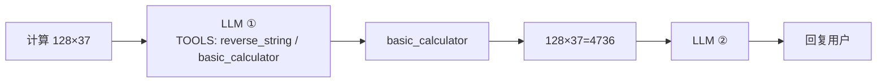
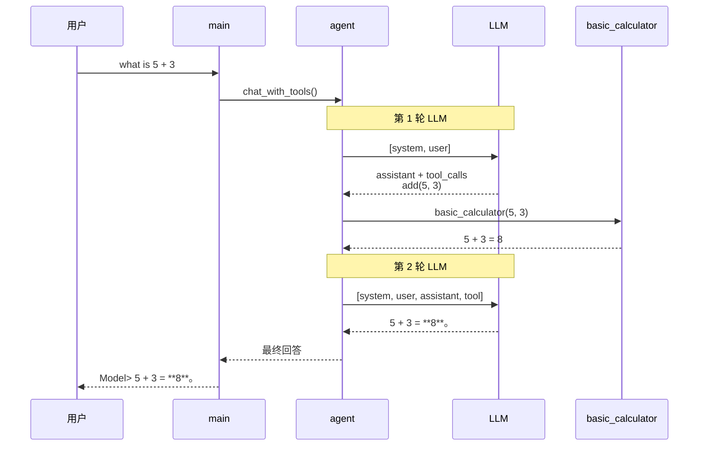
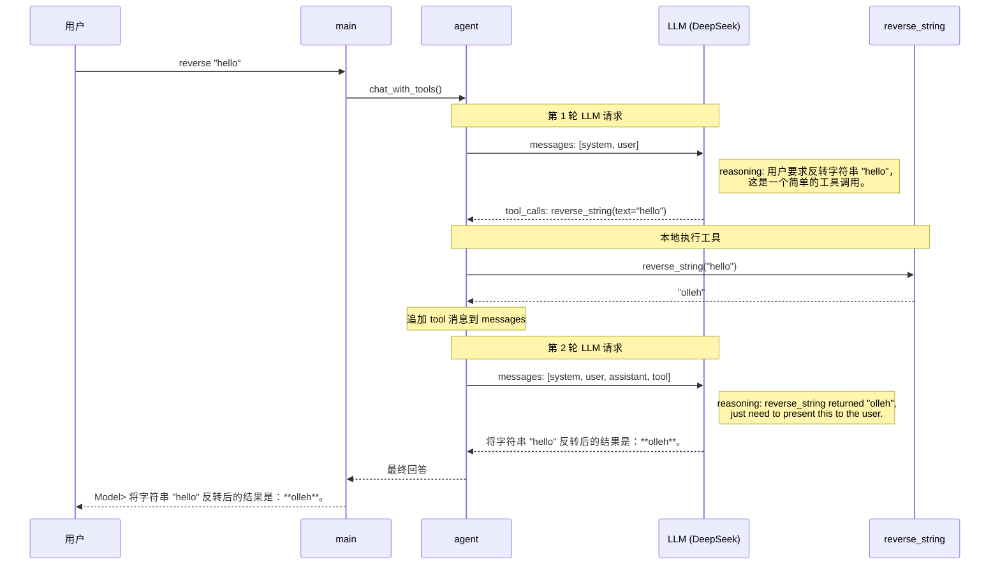

# LLM Function Calling 小工程

演示如何通过 OpenAI Function Calling 协议让 LLM 调用本地 Python 函数。

## 目录结构

```
01-small-llm-function-call-project/
├── main.py                  # 入口：控制台交互循环
├── agent/
│   ├── agent.py             # Function Calling 编排（工具执行 + 对话循环）
│   └── prompt.py            # System Prompt 定义
├── llm/
│   └── llm.py               # LLM 调用封装（API 请求 + JSON 日志）
├── tools/
│   ├── __init__.py          # 工具注册中心（TOOL_HANDLERS + TOOLS）
│   ├── reverse_string.py    # 工具：反转字符串
│   └── basic_calculator.py  # 工具：四则运算
├── .env.example             # 环境变量模板
└── README.md
```

## 模块说明

| 模块 | 职责 |
|------|------|
| `main.py` | 加载环境变量，创建 OpenAI 客户端，控制台交互 |
| `agent/agent.py` | 组装 messages、执行本地工具、驱动两轮 LLM 调用 |
| `agent/prompt.py` | 定义 `SYSTEM_PROMPT`，描述可用工具与行为约束 |
| `llm/llm.py` | 调用 DeepSeek API；`call_llm` 自动打印请求/响应 JSON |
| `tools/` | 定义工具函数与 JSON Schema，统一注册导出 |

## 工具说明

| 工具 | 参数 | 功能 |
|------|------|------|
| `reverse_string` | `text: str` | 将字符串反转，如 `"hello"` → `"olleh"` |
| `basic_calculator` | `operation, a, b` | 四则运算，`operation` 可选：`add / subtract / multiply / divide` |

## 快速开始

### 1. 安装依赖

```bash
pip install openai python-dotenv
```

### 2. 配置 API Key

```bash
cp .env.example .env
```

编辑 `.env`，填入你的 DeepSeek API Key：

```
DEEPSEEK_API_KEY=your_api_key_here
```

### 3. 运行

```bash
python main.py
```


## 流程图

### 横版概览

以「计算 128 乘以 37」为例：



### 时序图

以实际日志「what is 5 + 3」为例，展示各模块间的调用顺序：



| 步骤 | 日志标记 | messages 变化 |
|------|----------|---------------|
| ① | `>>> LLM request` | 发送 `[system, user]` |
| ② | `<<< LLM response` | 返回 `tool_calls: basic_calculator(add, 5, 3)` |
| ③ | 本地执行 | 工具返回 `5 + 3 = 8`，追加 `[tool]` |
| ④ | `>>> LLM request` → `<<< LLM response` | 发送 4 条 messages，返回最终文本 |

以实际日志「reverse "hello"」为例，展示 `reverse_string` 工具的完整调用链路：



| 步骤 | 日志标记 | messages 内容 |
|------|----------|---------------|
| ① | `=======>>> LLM request` | 发送 `[system, user]`，共 2 条 |
| ② | `=======<<< LLM response` | 返回 `tool_calls: reverse_string(text="hello")`，content 为空 |
| ③ | 本地执行 | 调用 `reverse_string("hello")` → `"olleh"`，追加 `tool` 消息 |
| ④ | `=======>>> LLM request` | 发送 `[system, user, assistant, tool]`，共 4 条 |
| ⑤ | `=======<<< LLM response` | 返回最终自然语言回答 |

## 扩展

### 新增工具

1. 在 `tools/` 下新建文件，实现函数和 `SCHEMA`（参考 `reverse_string.py`）。
2. 在 `tools/__init__.py` 中导入并注册到 `TOOL_HANDLERS` 和 `TOOLS`。
3. 更新 `agent/prompt.py` 中的 `SYSTEM_PROMPT`，告知 LLM 新工具名称与用途。
4. `agent/agent.py`、`llm/llm.py` 和 `main.py` 无需修改。

### 修改 System Prompt

编辑 `agent/prompt.py` 中的 `SYSTEM_PROMPT` 即可。
