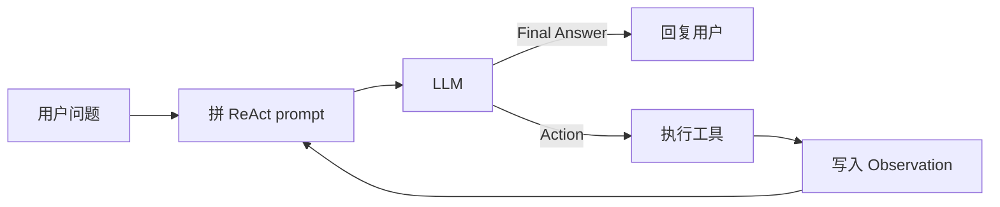
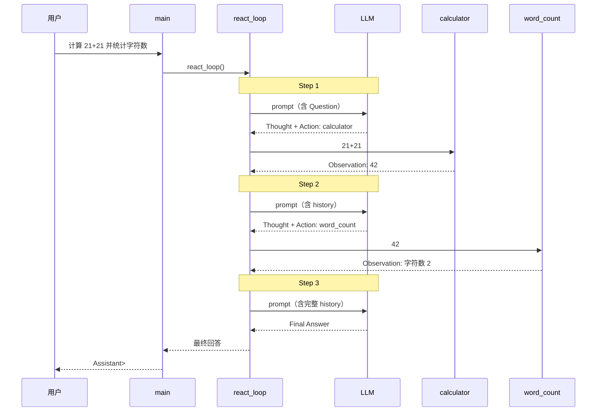

# ReAct Agent 示例

简化版 ReAct（Reasoning + Acting）循环：LLM 按 **Thought → Action → Observation** 格式推理，必要时调用工具，最后给出 **Final Answer**。

## 目录结构

```
02-Agent_react/
├── main.py                  # 入口
├── agent/
│   ├── loop.py              # ReAct 主循环
│   ├── prompt.py            # 提示词构建 / Action 解析
│   ├── types.py             # Tool 定义
│   ├── config.py            # 环境变量加载
│   ├── llm/
│   │   ├── deepseek.py      # DeepSeek 调用 + JSON 日志
│   │   └── log.py           # print_message / print_messages
│   └── tools/
│       ├── calculator.py
│       ├── current_time.py
│       └── word_count.py
├── requirements.txt
├── .env.example
└── Readme.md
```

## 模块说明

| 模块 | 职责 |
|------|------|
| `main.py` | 加载环境变量，组装工具与 LLM，启动 ReAct 循环 |
| `agent/loop.py` | ReAct 主循环：拼 prompt → 调 LLM → 执行工具 → 写入 history |
| `agent/prompt.py` | 构建 ReAct prompt，解析 `Action` / `Action Input` |
| `agent/llm/deepseek.py` | 调用 DeepSeek API；自动打印请求/响应 JSON |
| `agent/llm/log.py` | JSON 日志工具（与 01 工程风格一致） |
| `agent/tools/` | 工具实现与注册 |

## 内置工具

| 工具 | 作用 |
|------|------|
| `calculator` | 安全计算数学表达式 |
| `get_current_time` | 获取指定时区当前时间 |
| `word_count` | 统计文本字符数与词数 |

## 快速开始

### 1. 安装依赖

```bash
cd 02-Agent_react
pip install -r requirements.txt
```

### 2. 配置 API Key

```bash
cp .env.example .env
```

编辑 `.env`，填入 DeepSeek API Key：

```
DEEPSEEK_API_KEY=your_api_key_here
```

### 3. 运行

```bash
python main.py
```


## 流程图

### 横版概览



### 时序图

以默认问题为例（2 次工具调用，3 轮 LLM）：



| 步骤 | 日志标记 | 说明 |
|------|----------|------|
| ① | `Step 1` + `LLM request/response` | LLM 决定调用 calculator |
| ② | `Tool execution` | 本地计算 `21+21 = 42` |
| ③ | `Step 2` + `LLM request/response` | LLM 决定调用 word_count |
| ④ | `Tool execution` | 统计 `"42"` 字符数 |
| ⑤ | `Step 3` + `LLM response` | 输出 Final Answer |

## ReAct 单轮格式

```
Thought: 我需要先计算 ...
Action: calculator
Action Input: 21+21
        ↓ 工具执行
Observation: 42
        ↓ 下一轮
Thought: 已有结果
Final Answer: 42
```

## 扩展

### 新增工具

1. 在 `agent/tools/` 新建文件，实现 `run(input: str) -> str`。
2. 在 `agent/tools/__init__.py` 的 `build_default_tools()` 中注册。
3. `agent/prompt.py` 会自动从 tools 字典读取工具描述，无需额外修改。

### 新增 LLM

在 `agent/llm/` 添加实现，返回 `Callable[[str], str]` 即可接入 `react_loop`。
