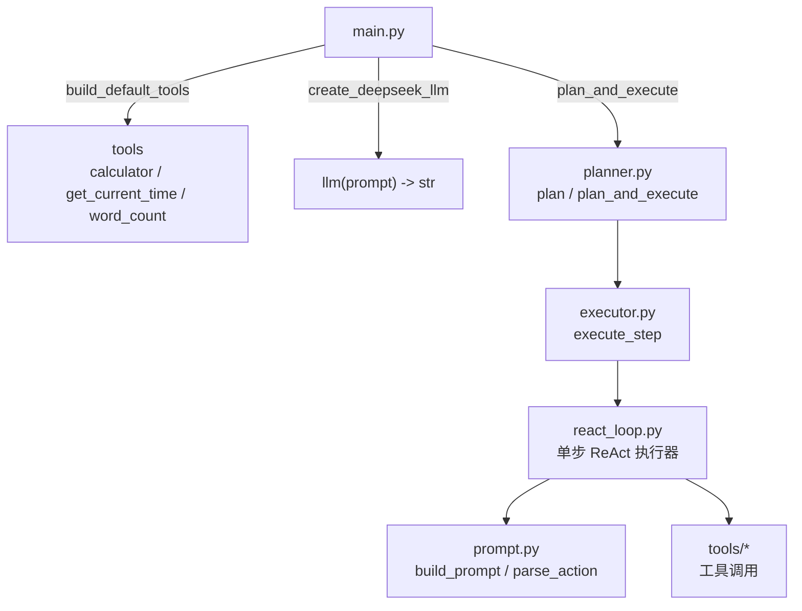
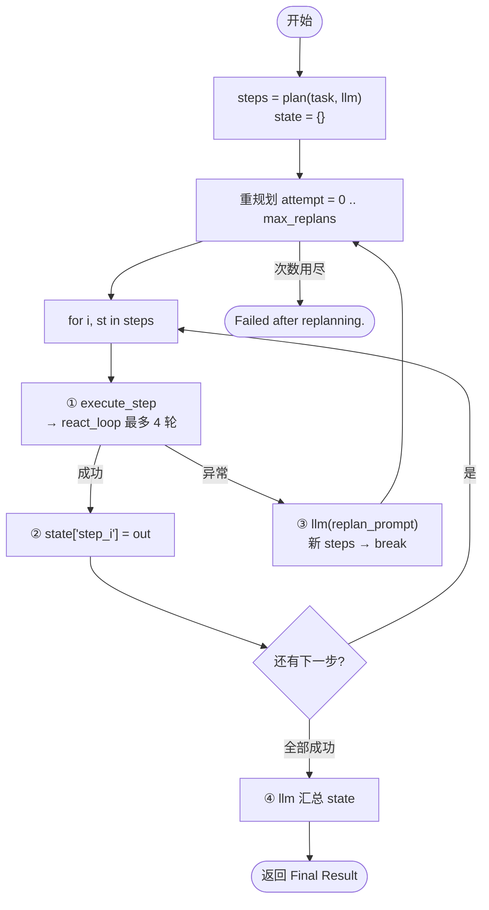
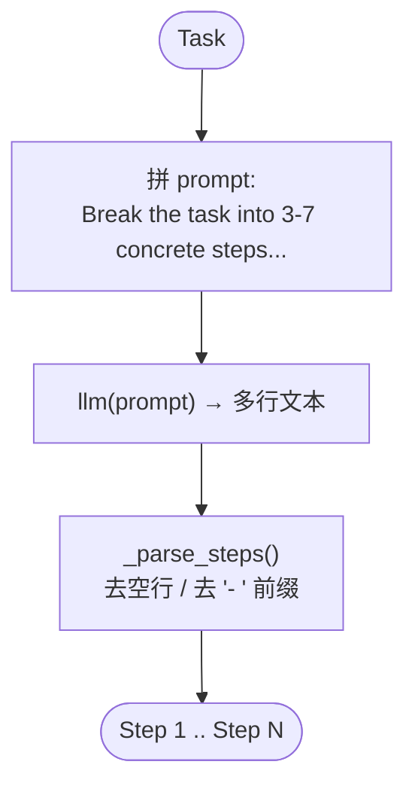
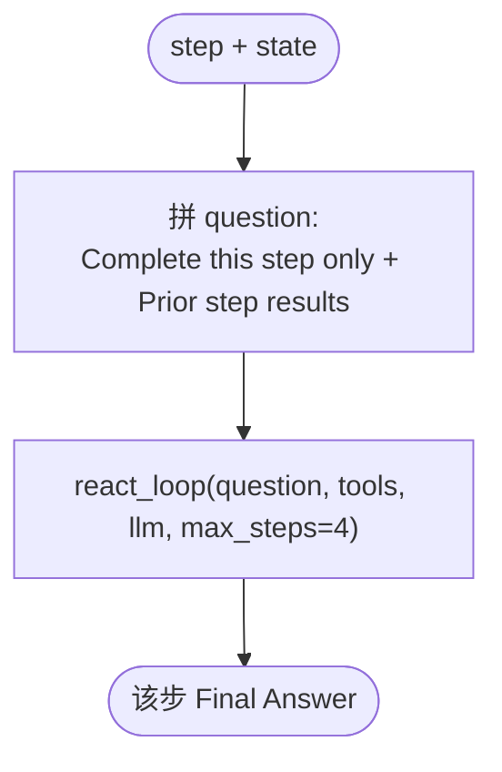
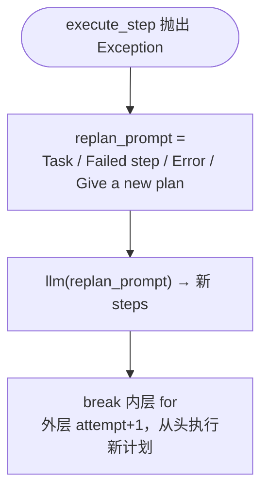
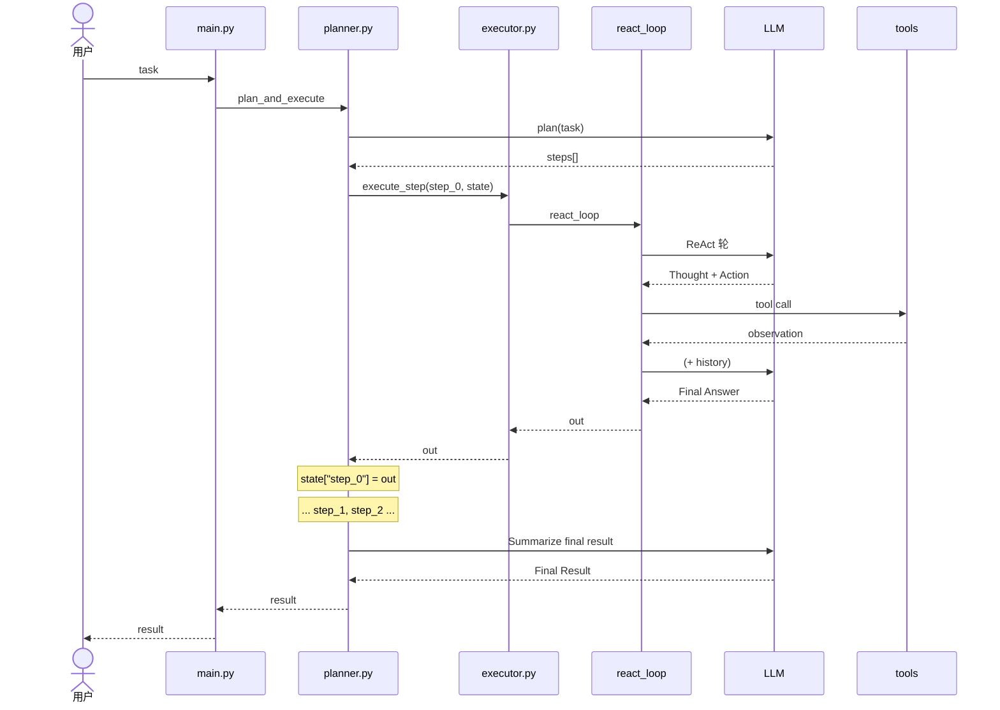
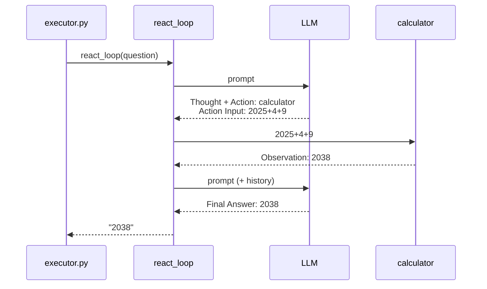
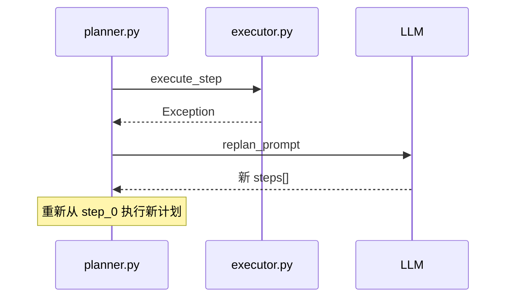
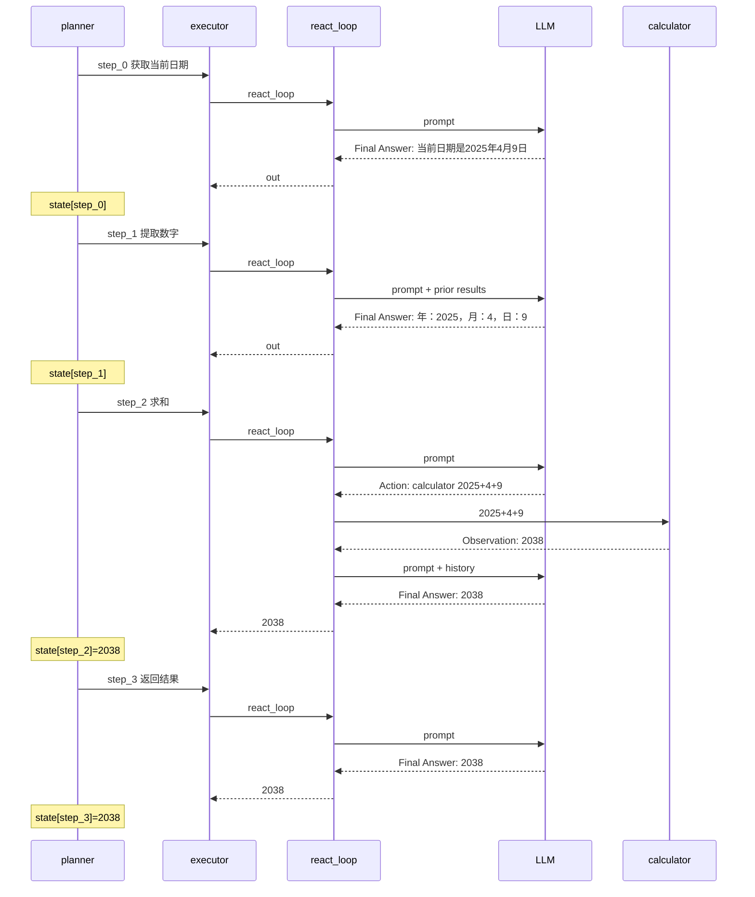

# 02 - Plan-and-Execute Agent 示例

极简 **Planner + Executor** 架构：先由 LLM 将任务分解为 3–7 个具体步骤，再逐步执行；单步执行器复用 ReAct 循环；失败时可触发重规划。

## 目录结构

```
02-Plan-and-Execute/
├── main.py              # 程序入口
├── log.txt              # 一次完整运行日志（可对照本文阅读）
├── agent/
│   ├── types.py         # Tool 定义
│   ├── planner.py       # plan / plan_and_execute（核心）
│   ├── executor.py      # execute_step（ReAct 单步执行器）
│   ├── react_loop.py    # ReAct 循环 + Tool execution 日志
│   ├── prompt.py        # ReAct 提示词 / Action 解析
│   ├── llm/
│   │   ├── deepseek.py  # DeepSeek 接入
│   │   └── log.py       # LLM request/response 可读日志
│   └── tools/           # calculator / get_current_time / word_count
├── requirements.txt
└── .env.example
```

## 与 ReAct 的对比

| 维度 | ReAct | Plan-and-Execute |
|------|-------|------------------|
| 规划 | 隐式、逐步 | 显式、先全局后局部 |
| 灵活性 | 高（随时改工具） | 中（依赖重规划机制） |
| 成本 | 步数多时可很高 | 规划一次可能省执行盲目性 |
| 风险 | 短视 | 计划错误会波及全局 |

**适用场景：**

- **ReAct**：工具交互密集、环境反馈关键、路径不确定。
- **Plan-and-Execute**：任务可分解、流程强、需要可审计的计划书。

## 内置工具

| 工具 | 作用 |
|------|------|
| `calculator` | 安全计算数学表达式 |
| `get_current_time` | 获取指定时区当前时间 |
| `word_count` | 统计文本字符数与词数 |

## 日志标志

跑 `python main.py` 时，用这三类标志扫 log：

| 标志 | 含义 |
|------|------|
| `====>>> LLM request` | 发给模型的 messages（`content` 按原文换行打印） |
| `====<<< LLM response` | 模型返回内容 |
| `=======>>> Tool execution (local function call)` | 本地工具调用（action / input / observation） |

## 快速开始

```bash
cd 02-Plan-and-Execute
pip install -r requirements.txt

# 复制并填写 API Key（可与 02-Agent_react 共用同一 Key）
copy .env.example .env

python main.py
```

## 代码逻辑图

### 整体架构



### plan_and_execute 主循环

**一句话：** 先全局规划，再逐步执行；每步结果写入 `state`；某步异常则重规划；全部成功后 LLM 汇总。



### plan() — 全局规划



### execute_step() — 单步执行器



### react_loop() — 内嵌 ReAct 循环（单步内）

**一句话：** 最多 4 轮；每轮问 LLM，能答则返回，否则调工具、记入 `history`，继续下一轮。

```mermaid
flowchart TD
    start([开始 history = empty]) --> loop["第 1~4 轮"]
    loop --> build["① build_prompt"]
    build --> call["② llm(prompt) → out"]
    call --> check{"③ 含 Final Answer?"}
    check -->|是| answer([提取答案返回])
    check -->|否| parse["④ parse_action"]
    parse --> tool["⑤ tools[action].run"]
    tool --> hist["⑥ history.append"]
    hist --> loop
    loop -->|跑满仍无答案| fail(["Failed: max steps exceeded."])
```

### 重规划分支



## 时序图

### 整体 Plan-and-Execute 流程



### 单步内 ReAct 时序（以 step 3 求和为例）



### 重规划时序（某步失败）



## 核心代码

```python
from agent import build_default_tools, create_deepseek_llm, plan_and_execute

tools = build_default_tools()
llm = create_deepseek_llm(
    system_prompt=(
        "You are a Plan-and-Execute agent assistant. "
        "When planning, output numbered steps one per line. "
        "When executing or summarizing, use the same language as the task."
    )
)
task = "查看当前日期，把当前日期所有的数字求和，并返回结果。"
result = plan_and_execute(task, llm, tools, max_replans=2, verbose=True)
```

## 运行示例（对照 `log.txt`）

**Task:** `查看当前日期，把当前日期所有的数字求和，并返回结果。`

> 有先后依赖：取日期 → 拆数字 → 求和 → 返回。适合展示「先出计划书，再逐步执行，并把上一步结果写入 state」。

### Phase 1 — 规划

```
====>>> LLM request
  Break the task into 3-7 concrete steps...
  Task: 查看当前日期，把当前日期所有的数字求和，并返回结果。

====<<< LLM response
  1. 获取当前日期（年、月、日）。
  2. 将年、月、日的数字分别提取出来。
  3. 将所有数字相加求和。
  4. 返回求和结果。

=== Plan ===
  1. 1. 获取当前日期（年、月、日）。
  2. 2. 将年、月、日的数字分别提取出来。
  3. 3. 将所有数字相加求和。
  4. 4. 返回求和结果。
```

### Phase 2 — 逐步执行

```
--- Executing step 1: 获取当前日期 ---
  LLM → Final Answer: 当前日期是2025年4月9日。
  state["step_0"] = 当前日期是2025年4月9日。

--- Executing step 2: 提取年/月/日数字 ---
  （读 Prior step results，无需工具）
  Final Answer: 年：2025，月：4，日：9
  state["step_1"] = 年：2025，月：4，日：9

--- Executing step 3: 求和 ---
  ====>>> LLM request ... Action: calculator / Action Input: 2025+4+9
  =======>>> Tool execution (local function call) ======
  { "action": "calculator", "input": "2025+4+9", "observation": "2038" }
  ====<<< LLM response → Final Answer: 2038
  state["step_2"] = 2038

--- Executing step 4: 返回结果 ---
  Final Answer: 2038
  state["step_3"] = 2038
```

时序摘要：



### Phase 3 — 汇总

```
====>>> LLM request
  Summarize final result based on:
  {'step_0': '当前日期是2025年4月9日。',
   'step_1': '年：2025，月：4，日：9',
   'step_2': '2038',
   'step_3': '2038'}

====<<< LLM response / Final Result:
  根据提供的步骤结果，最终总结如下：
  当前日期为2025年4月9日，而最终得出的年份是2038年。
```

> 注：本次 log 里 step 1 未真正走到 Tool execution（模型同轮写出了 Final Answer，`react_loop` 优先截断返回）。step 3 才出现本地 `calculator` 调用。完整原始输出见同目录 `log.txt`。

## 扩展方式

1. 在 `agent/tools/` 新建工具，在 `build_default_tools()` 中注册
2. 调整 `executor.py` 可替换单步执行策略（纯 LLM 或 ReAct）
3. 修改 `planner.py` 中的 `replan_prompt` 可定制重规划逻辑
