# GPT 训练流程

## 训练流程图

```mermaid
flowchart TD
    Start([开始]) --> ParseArgs[解析命令行参数]
    ParseArgs --> PrintConfig[打印训练配置信息]
    PrintConfig --> DeviceSetup[设置计算设备<br/>CPU/GPU]
    DeviceSetup --> InitTokenizer[初始化分词器<br/>ByteTokenizer]
    InitTokenizer --> InitDataset[初始化数据集<br/>ByteDataset]
    InitDataset --> InitModel[创建 GPT 模型<br/>并移动到设备]
    InitModel --> CheckCompile{是否启用<br/>torch.compile?}
    CheckCompile -->|是| CompileModel[编译模型加速]
    CheckCompile -->|否| InitOptimizer[初始化优化器<br/>AdamW + 混合精度]
    CompileModel --> InitOptimizer
    InitOptimizer --> TrainLoop[训练循环开始<br/>step = 1 to steps]
    
    TrainLoop --> GetBatch[获取训练批次<br/>xb, yb]
    GetBatch --> Forward[前向传播<br/>计算损失]
    Forward --> Backward[反向传播<br/>计算梯度]
    Backward --> CheckGradClip{梯度裁剪<br/>grad_clip > 0?}
    CheckGradClip -->|是| ClipGrad[裁剪梯度]
    CheckGradClip -->|否| UpdateParams[更新模型参数]
    ClipGrad --> UpdateParams
    
    UpdateParams --> CheckPrint{step % 50 == 0?}
    CheckPrint -->|是| PrintProgress[打印训练进度<br/>损失、时间、ETA]
    CheckPrint -->|否| CheckEval{step % eval_interval == 0?}
    PrintProgress --> CheckEval
    
    CheckEval -->|是| EvalModel[评估模型<br/>estimate_loss]
    CheckEval -->|否| CheckSample{step % sample_every == 0?}
    
    EvalModel --> CheckBestVal{验证损失<br/>是否更好?}
    CheckBestVal -->|是| SaveBest[保存最佳模型检查点<br/>model_best.pt]
    CheckBestVal -->|否| CheckSample
    SaveBest --> CheckSample
    
    CheckSample -->|是| GenerateSample[生成文本样本<br/>并打印]
    CheckSample -->|否| CheckStepEnd{step < steps?}
    GenerateSample --> CheckStepEnd
    
    CheckStepEnd -->|是| TrainLoop
    CheckStepEnd -->|否| SaveFinal[保存最终模型<br/>model_final.pt]
    SaveFinal --> PrintSummary[打印训练总结<br/>总时间、最佳损失]
    PrintSummary --> End([结束])
    
    style Start fill:#90EE90
    style End fill:#FFB6C1
    style TrainLoop fill:#87CEEB
    style EvalModel fill:#FFD700
    style SaveBest fill:#FFA500
    style SaveFinal fill:#FFA500
```

## 详细说明

### 1. 初始化阶段
- **解析参数**: 读取命令行参数（数据路径、模型配置、训练超参数等）
- **设备设置**: 自动检测并使用 GPU（如果可用）
- **初始化组件**: 
  - 分词器（ByteTokenizer）
  - 数据集（ByteDataset）
  - GPT 模型

### 2. 训练循环（核心部分）
每个训练步骤包含：
1. **获取批次**: 从数据集中采样一个批次
2. **前向传播**: 模型计算预测和损失
3. **反向传播**: 计算梯度
4. **梯度裁剪**: 防止梯度爆炸（可选）
5. **更新参数**: 优化器更新模型权重

### 3. 定期操作
- **每 50 步**: 打印训练进度（损失、时间、剩余时间）
- **每 eval_interval 步**: 
  - 评估模型在训练集和验证集上的损失
  - 如果验证损失更好，保存最佳模型检查点
- **每 sample_every 步**: 生成文本样本，监控模型生成质量

### 4. 结束阶段
- 保存最终模型
- 打印训练总结（总时间、最佳验证损失）

## 关键函数

### `estimate_loss(model, ds, args)`
评估函数，在训练集和验证集上计算平均损失：
- 设置模型为评估模式
- 禁用梯度计算
- 多次采样取平均
- 返回训练损失和验证损失

