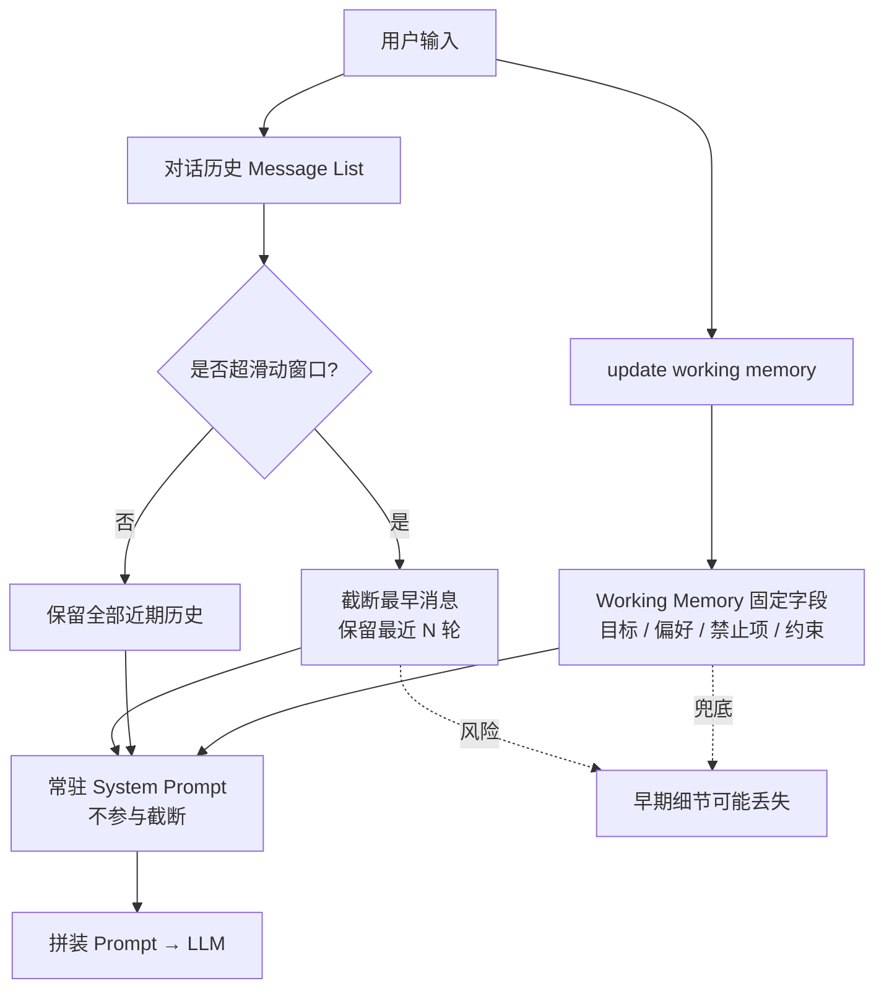
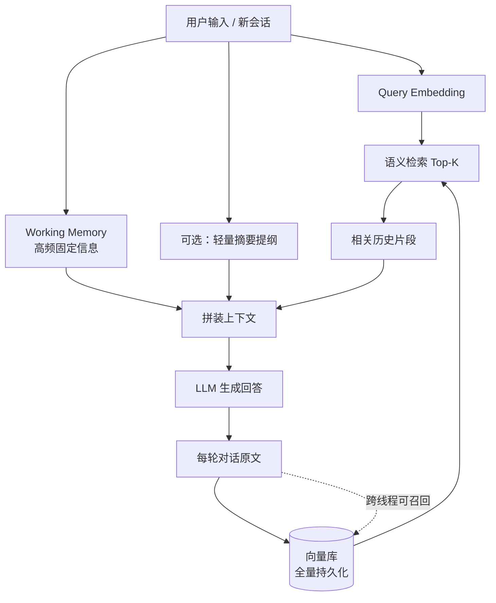
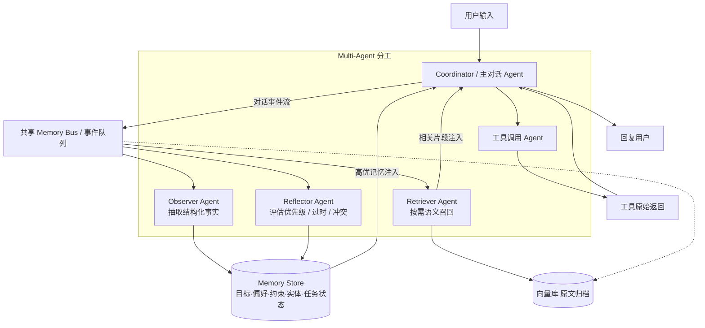

# 面试完整回答：长对话摘要丢失关键信息怎么解决
结合文档里的 Working Memory、Semantic Recall、Observational Memory 三层方案分层作答，由浅到深，工程落地可执行，分兜底方案、优化方案、终极架构方案。

## 一、先说明问题根源
单纯一次性全局 Summary 丢失信息的核心原因：
1. 摘要统一压缩所有内容，平等对待无关细节和核心需求、用户硬性约束；
2. 时序丢失，分不清早期核心目标和后期临时闲聊；
3. 没有分层存储，重要静态偏好和临时对话混在一起压缩；
4. 粗粒度摘要会丢弃细粒度约束、工具参数、否定类要求（比如“不要出错、输出简洁”）。

## 二、分层解决方案（面试按从轻到重讲）
### 方案1：前置隔离固定关键信息 — Working Memory（低成本兜底，必做）
把**绝对不能丢**的信息提前抽离出来，不参与摘要压缩流程，永久常驻系统提示词：
1. 提前定义固定字段：用户核心目标、硬性偏好、禁止项、身份信息、业务约束；
2. 靠工具 `update working memory` 在对话过程中实时更新，独立存放；
3. 做摘要时只压缩普通聊天内容，Working Memory 字段全程保留，不受摘要删减影响；
优势：成本最低，能守住所有高优先级硬性要求，避免摘要把用户底层诉求吞掉；
局限：只能存预设类信息，无法覆盖零散历史上下文细节。

### 方案2：摘要分层 + 分段增量摘要，拒绝一次性全局总结
不等到对话上万token再统一总结，采用滚动分段压缩：
1. 设置分段阈值（比如2k token），只压缩**当前区间**历史，保留多段分段摘要，不合并成一段；
2. 给每一段摘要打上时间戳、优先级标记：用户目标、约束条件标高权重，闲聊低权重；
3. 检索时优先加载高优先级分段摘要，低权重内容按需取舍；
对比一次性总摘要：分段能保留时序逻辑，不会抹平早期关键需求，大幅降低重要信息丢失概率。

### 方案3：搭配语义检索RAG Memory，摘要做轻量化上下文，细节靠向量库兜底
摘要只做“概要提纲”，原始完整对话片段持久化向量存储：
1. 每次对话全量向量化存入向量库，不删除原始记录；
2. 送入LLM的是精简摘要，当模型发现摘要信息不足时，通过语义检索召回完整原始上下文；
3. 优化召回策略：调高关键实体Top-K、增加元数据过滤（用户需求、约束关键词）；
解决痛点：摘要丢了细节也没关系，向量库存有完整原文，可实时补全遗漏信息。

### 方案4：终极方案 — Multi-Agent Memory（高分亮点）
超长会话不再靠「压缩全文」，而是拆成多个专职 Agent 协作维护记忆：
1. **Coordinator 主对话 Agent**：只拿近期上下文 + Memory Store 注入的高优事实，负责实时回复，不背全量历史。
2. **Observer Agent**：订阅对话/工具事件流，异步抽取结构化事实（目标、偏好、约束、实体、任务状态），写入 Memory Store。
3. **Reflector Agent**：对 Memory Store 做优先级评估、冲突消解、过时标记，保证主 Agent 只看到有效记忆。
4. **Retriever Agent**：原文归档向量库，主 Agent 缺细节时按需召回，不把海量工具返回塞进主上下文。
核心：用 Multi-Agent 职责拆分解决上下文膨胀，而不是对整段对话做摘要压缩。

## 三、补充工程优化细节（加分项）
1. 区分「不可压缩信息」和「可压缩信息」
   用户硬性要求、业务指标、否定指令单独隔离，禁止参与摘要裁剪；
2. 摘要校验机制
   压缩完成后增加校验prompt，让模型自查是否丢失核心目标、偏好，缺失则补充回观测记录；
3. 时序权重策略
   早期对话（初始需求）给予更高权重，后期临时闲聊权重降低，压缩时优先保留开头核心诉求。

## 四、完整口述总结（直接背）
单纯全局摘要很容易丢失用户早期核心需求、硬性偏好这类关键信息，我会四层机制组合规避：
第一，先用工作内存把用户固定目标、输出约束单独隔离常驻提示词，完全不参与摘要压缩，守住底线；
第二，不做一次性全局总结，采用分段增量摘要，给每段内容打上优先级与时序标签，避免抹平早期关键信息；
第三，底层搭配RAG语义检索向量库，摘要只做提纲，完整原始对话永久存储，遗漏细节可随时召回原文；
第四，针对超长会话、大量工具返回的复杂场景，上 Multi-Agent Memory：主对话 Agent 只负责交互，Observer / Reflector / Retriever 专职写记忆、评优先级、按需召回，用分工替代全文压缩，从架构上避免关键信息丢失与上下文膨胀。

## 五、三种场景 Memory 逻辑图

### 场景1：轻量长对话（几十轮、少量工具）— 滑动窗口 + Working Memory

### 场景2：中长周期 / 多会话 — RAG Semantic Recall

### 场景3：超长期 / 高频工具 / 海量返回 — Multi-Agent Memory

主对话 Agent 只负责实时交互；记忆由专职 Agent 异步维护，用分工替代全文压缩。

