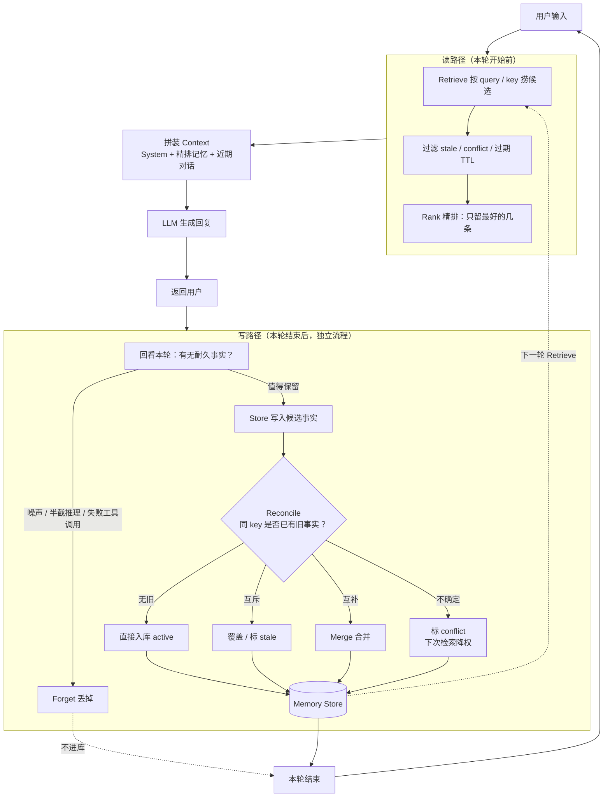

# Agent Memory 建议整理

> 来源：视频文稿（模型无状态、Context Rot、记忆闭环、工程落地）

---

## 一、核心结论（先记住这句）

**好的 Memory 不靠“记得更多”，而靠“故意忘掉什么”。**  
控制器（决定保留/丢弃/覆盖）比底层数据库更重要。对大多数 Agent，Memory = Markdown 文件 + 好习惯；能证明需要再上重型方案。

---

## 二、先分清三件事（别混谈）

| 概念 | 本质 | 类比 |
|------|------|------|
| **Context Window** | 单次回答能看见的文本，用完即清 | RAM：快、小、易满 |
| **RAG / Retrieval** | **读**：从已有文档里捞相关片段塞进窗口 | 图书馆检索 |
| **Memory** | **写**：观察交互 → 判断是否值得存 → 供未来会话用 | 决定上架什么、下架什么 |

- RAG：架子上的书别人已经放好了，你只负责找。
- Memory：你自己决定什么该上架、什么该撤下、冲突时以谁为准。

---

## 三、为什么模型会“忘”

1. **模型本身无状态**：一次请求进、一次回答出，结束后什么都不留。
2. **“连续对话”是工具在作弊**：每轮把历史对话重新贴回 Prompt，模型才像记得。
3. **无状态是特性不是 Bug**：同一模型服务千万人，会话互不串扰。

---

## 四、真正的 Memory 是一个闭环（不是“套了马甲的数据库”）

```
Write → Store → Reconcile → Retrieve → Rank → Forget
```

### Write（记住）
- 每轮结束后，**独立流程**回看刚发生的事，问：有没有值得长期保留的？
- 多数是噪声：模型废话、半截推理、失败的工具调用 → **丢掉**。
- 只留耐久事实：换了 TypeScript、部署卡在 auth、用户讨厌早班机。

### Reconcile（调和 / 对齐）

**是什么**：新记忆写进来时，**处理它和旧记忆的冲突**，而不是两边都留着。  
一句话：Reconcile = **让记忆自洽**——冲突时更新/覆盖，而不是并排堆两份互相打架的“事实”。

**典型例子**：昨天偏好 Python，今天改 TypeScript。天真做法两条都存、检索时两条都捞 → Agent 不知听谁的；Reconcile 用新事实**覆盖**旧事实（或明确标记旧的已失效）。

#### 1. 先对齐：同一条“事实槽位”

不要拿整段文本比相似度，而是落到**可键控的事实**：

| 键（slot） | 旧值 | 新值 |
|-----------|------|------|
| `user.lang_pref` | Python | TypeScript |
| `deploy.blocker` | auth | （已解决则删/标过期） |

有稳定 key → 冲突可判定；只有向量相似 → 容易误伤或漏覆盖。

#### 2. 常见处理策略（按场景选）

| 策略 | 做法 | 适合 |
|------|------|------|
| **A. Last-Write-Wins** | 同 key 直接用新值覆盖旧值 | 偏好、当前目标、当前阻塞点（默认首选） |
| **B. 版本化 + 失效标记** | 不物理删；旧记录 `status=stale` / `superseded_by=新 id`；检索只取 active | 要审计、要回放“为什么改过” |
| **C. Merge 合并** | 同主题互补、非互斥 → 合成一条（如约束列表） | 多条可并存的偏好/禁止项 |
| **D. 冲突升级** | 两边都像真又互斥 → 问用户，或交给 Reflector 按更新时间/置信度裁决 | 高风险事实（权限、账号、业务规则） |
| **E. 时间窗 / TTL** | 临时状态设过期，到期自动 Forget | “这周在赶 auth”类短期事实，避免抢长期偏好的召回 |

#### 3. 工程落地最小流程

```
新事实写入
  → 按 key / 实体+属性 查旧事实
  → 无旧：直接 Store
  → 有旧且互斥：覆盖或标 stale（Reconcile）
  → 有旧且互补：Merge
  → 不确定：标 conflict，检索时降权或不注入
```

对应 Multi-Agent 里的 **Reflector Agent**：专职做优先级、过时标记、冲突消解，主对话 Agent 只看有效记忆。

#### 4. 怎么验（测的就是 Reconcile）

1. 稳定偏好 → 应记住；  
2. **已变更事实 → 应覆盖旧值**；  
3. 从未告知 → 应拒绝瞎编。  

测不过，说明只是在堆记忆，没有真正调和。

### Read（回忆）
- 新一轮开始前：挑相关记忆 → 排序 → **只贴最好的几条**进窗口。
- 不是整库倒进 Context。

### 会话流程中的 Memory 处理（流程图）

一轮对话里，Memory 分两条路：**开场先读**，**收尾再写**；中间 LLM 只看见精排后的少量事实 + 近期上下文。



**读时要点**：只贴 Rank 后的几条，对抗 Context Rot。  
**写时要点**：先过滤再 Reconcile，控制器做 keep / toss / 覆盖，而不是整段 transcript 入库。

### 关键点
换向量库 / 图数据库 / 纯文本文件，**闭环形态不变**。  
锐利或无用，取决于控制器的 **keep / toss** 决策，这卖不了“开箱即用的黑盒”。

---

## 五、为什么“更多 Memory”会让 Agent 更差

### Context Rot（上下文腐烂）
- 窗口再大，模型也**不会均匀读完**整段输入。
- Chroma 等研究：输入越长，即使简单查找，可靠性也下降。
- 体感：会话早期指令几乎总被遵守；埋在几千 token 历史下后，遵从率可掉到约 **1/3**。

### 因此任务翻转
Memory 系统的价值 = **扔掉了多少**，而不是存了多少。  
保持活跃上下文 **小、尖、尽量空**，模型才清醒。  
**有意遗忘**是控制器最难、也最值钱的工作。

---

## 六、Memory 的硬问题（面试/选型常踩坑）

1. **不知道该留什么**  
   留太多 → Context Rot；留太少 → 三天后才发现关键细节被扔了。模型与简单启发式都不可靠。

2. **事实会变（Staleness / Conflict）**  
   昨天偏好 Python，今天改 TypeScript。天真系统两边都存、两边都召回 → Agent 拿着矛盾事实不知以谁为准。  
   处理见上文 **Reconcile**：键控槽位 + Last-Write-Wins / 标 stale / Merge / 冲突升级；**完美自动覆盖**仍是开放问题，但工程上必须有明确策略。

3. **检索精度**  
   相似 ≠ 正确。问当前任务，可能捞出三天前措辞相近的旧日志。

4. **静默失败**  
   Memory 坏了不报错，Agent 只是慢慢变差；你往往要到它自信地忘掉不该忘的事才发现。  
   LongMemEval 等基准：强方案在长多会话上仍可能掉约 **30%** 准确率。厂商自测分数当营销看。

5. **安全：持久记忆 = 持久攻击面**  
   - 普通 Prompt Injection：一回合作恶，会话结束即消失。  
   - Memory 投毒：读到毒 README/邮件 → 当成有用事实写入长期记忆 → 数天后在另一会话（甚至高权限）被召回执行。  
   - 研究显示用普通消息植入成功率可 > **90%**。  
   **持久 Memory 把一次性漏洞变成“潜伏 Agent”。**

---

## 七、工程落地建议（本周就能用）

### 默认方案：别上重型 Memory 产品

多数在干活的开发者**根本不跑 Memory 系统**，而是：

| 做法 | 作用 |
|------|------|
| `CLAUDE.md` / `AGENTS.md` | 项目级站立事实（standing facts） |
| Notes 文件，Agent 追加写入 | 轻量可写记忆 |
| Git History | 已有“做了什么、为什么”的干净记录 |
| 对话变长 → **摘要旧轮次，丢掉原文 transcript** | 控窗口、抗 Context Rot |
| **每用户一张小表：耐久事实，精确查找（非相似度）** | 解决“忘了我的偏好”头号抱怨，无需向量库 |

### 何时才值得上 Mem0 / Letta 等重型层

能**证明**你撞到墙再上，例如：

- 真实的跨会话个性化；
- 代码库大到无法靠摘要扛住；
- 多 Agent 必须共享状态。

否则 fancy Memory 层多半只买到：**更多 token、更多延迟、更多失败方式**。

### 先写测试，再上系统

用自己的数据准备至少 5 个问题，例如：

1. 稳定偏好（应记住）；
2. 已变更的事实（应覆盖旧值）；
3. 从未告知的事（应拒绝/承认不知道）。

**测不出 Memory 是否有用，就分不清“真有效”和“感觉有效”。**

---

## 八、行业收敛形态

- **数据库没人赢**：向量 / 图 / 文件都有信徒。
- **大家收敛的是闭环**：Write → Store → Reconcile → Retrieve → Rank → Forget，且始终卡在模型真正能消化的预算内。
- Agent“不该忘却忘了”时：问题几乎不在存储，而在 **该存什么、该扔什么** 的决策。

> 决策对了，Markdown 就够用很久；决策错了，再贵的 Memory 栈只会帮 Agent **忘得更快**。

---

## 九、一句话行动清单

1. 分清 Context / RAG / Memory（读 vs 写）。  
2. 实现闭环，重点做 **过滤、覆盖、精排、遗忘**。  
3. 主动对抗 Context Rot：上下文保持小而准。  
4. 默认用 Markdown + 摘要 + 精确事实表。  
5. 有证据再上向量/图/商业 Memory。  
6. 用自有评测题验证；警惕持久记忆投毒。  
7. **对大多数 Agent：Memory = 一个 Markdown 文件 + 一种习惯。**
