# Hermes Agent 架构详解

https://www.youtube.com/watch?v=n32qq7Kwzh0&t=488s

本文从鸟瞰全貌出发，依次讲清：Agent Loop、Context（Session 冻结 vs Turn 组装）、Compression、Gateway、Memory、Cron。目标是既理解如何使用 Hermes，也能照着思路自己搭一套类似系统。贯穿主线：**Session 管稳定前缀与历史容器，Turn 管每一轮 Build Context / 压缩检查 / 写盘。**

**本文默认对照的一种真实用法（Windows Desktop 直聊）**：用 Hermes Windows App 当「面试教练 / 个人助手」，主要依赖 `%LOCALAPPDATA%\hermes` 下的 `SOUL.md` + `memories/USER.md` + `MEMORY.md`；**不**在 Hermes 家目录里找 `.hermes.md` / `AGENTS.md`（那些属于项目仓库，见 §3.0）。

---

## 1. 鸟瞰：整体架构（Bird's-eye View）

Hermes 组件并不复杂，核心是 **AI Agent Core（Agentic Loop）**，外围有多种接入方式，以及一套开箱即用的 Tools / Skills / Memory。

### 1.1 接入层 → Agent Core → 附属能力

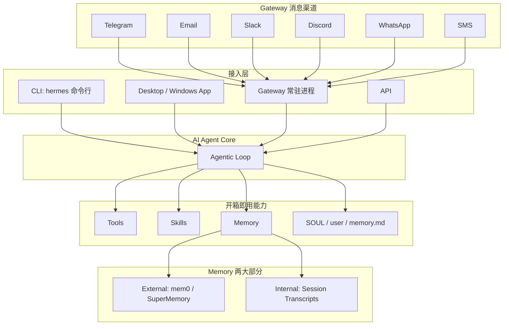

### 1.2 要点

| 组件 | 作用 |
|------|------|
| **CLI** | 本机命令行直接对话（`hermes`） |
| **Desktop / Windows App** | GUI 直聊；与 CLI **共用** `%LOCALAPPDATA%\hermes`（`SOUL` / memories / `state.db`）。打开 App ≠ 一个 Session，侧边栏每条对话 / New Chat 才是 |
| **Gateway** | 常驻运行，把 Telegram / Email / Slack 等消息桥接到 Agent |
| **API** | 程序化调用同一套 Agent Core |
| **Tools / Skills** | 安装即带；Agent 可在 Loop 里调用 |
| **Internal Memory** | 每次对话以 **session transcript** 形式落盘 |
| **External Memory** | 可选；对接 mem0、SuperMemory 等外部记忆服务 |
| **SOUL.md / user.md** | 人格与用户画像；Agent 可读写，直接影响行为 |

鸟瞰记住一句：**多种入口汇入同一个 Agentic Loop；Loop 再挂 Tools、Skills、双层 Memory 与人格文件。**

---

## 2. Agent Loop（智能体主循环）

Hermes 的 Loop 偏极简，风格接近 Pi Agent、OpenCode 一类 minimalist agent：**用户每发一条消息，就跑一轮完整循环。**

### 2.1 循环步骤

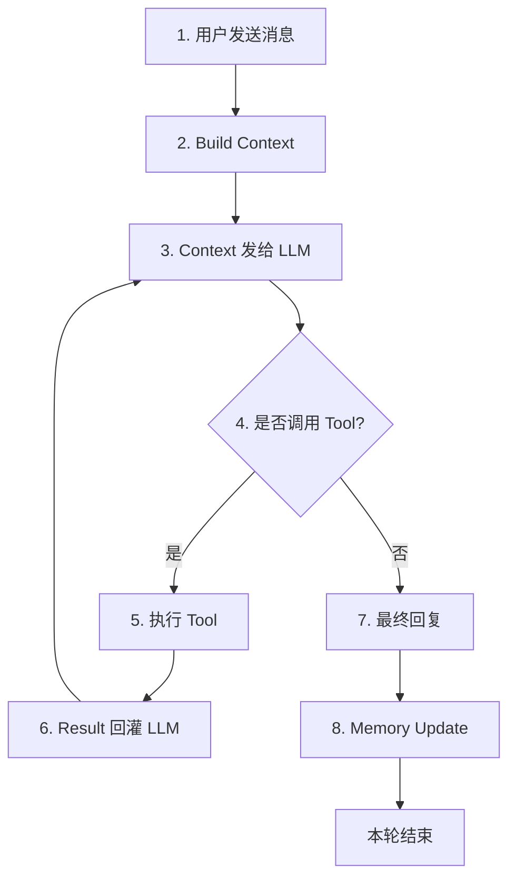

### 2.2 细节说明

1. **Build Context**  
   组装本轮发给 LLM 的内容：缓存的 System Prompt（Session 启动时冻结）+ 消息历史 + 本轮新消息等（详见 §3）。

2. **Tool 调用是内循环**  
   LLM 可连续多次调工具（搜索、读写文件等），直到认为不必再调，才出最终回复。

3. **Memory Update（闭环学习）**  
   **时机：本轮最终回复已经给出之后**（不是 Build Context 时，也不是 Tool 调用中间）。  
   Agent 审视本轮对话，判断有没有值得记住的内容，再决定是否写入 `user.md` / `memory.md`（详见 §6.4）。

---

## 3. Context 构建（发给 LLM 的内容）

Hermes 把 Context 拆成两层时间尺度，搞混就会以为「写了 memory 立刻进 system prompt」或「每条消息都重新读盘」：

| 词 | 含义 | 对 Context 的影响 |
|----|------|-------------------|
| **Turn（单轮）** | 用户发 **1 条** 消息 → 跑完一整次 Loop（可含多次 Tool）→ 最终回复 | **每轮** Build Context：复用已缓存的 SP + 追加消息历史；可压缩；可挂 tool result 旁路 |
| **Session（会话）** | 一次连续对话容器（Desktop 侧边栏一条对话 / CLI 一次聊天 / Gateway 同一个 `session_id`） | **启动时**组装并 **冻结** System Prompt；整段 transcript 挂同一 session |

> 官方：[Context Files](https://hermes-agent.nousresearch.com/docs/user-guide/features/context-files) · [Prompt Assembly](https://hermes-agent.nousresearch.com/docs/developer-guide/prompt-assembly) · [Sessions](https://hermes-agent.nousresearch.com/docs/user-guide/sessions)

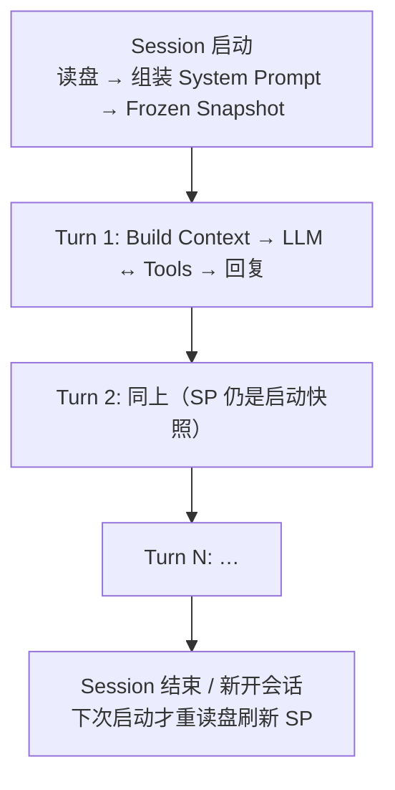

### 3.1 发给 LLM 的两块：缓存 SP + 本轮消息

每次调模型，实际送出去的是：

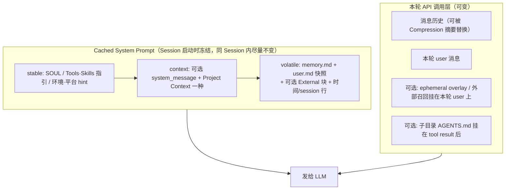

设计意图一句话：**稳定前缀尽量不动 → 保 prompt cache；会变的东西放消息侧或 tool result。**

| Markdown / 块 | 位置 | 谁维护 | 进 Context 的时机 |
|---------------|------|--------|-------------------|
| **SOUL.md** | 仅 `$HERMES_HOME/SOUL.md` | 人手；缺失可自动 seed | **Session 启动**进 SP（identity）；空文件 = 不注入 |
| **Project Context** | 工作区（见 §3.4） | 项目作者 | **Session 启动**选一种进 SP；子目录可在 **Turn 中途**挂 tool result |
| **user.md** | `~/.hermes/memories/` | Agent / 人手 | **Session 启动**冻结进 SP；中途写盘 **不改** 当前 SP |
| **memory.md** | 同上 | Agent / 人手 | 同上 |
| **Skills / Tools 描述** | 内置 + 安装包 | 系统 | Session 启动进 SP（stable） |
| **消息历史** | 本 session transcript | 每轮 append | **每 Turn** 带上；过长走 §4 Compression |
| **External 摘要** | Provider 插件 | 可选 | 未配置则无；常在 turn 侧 prefetch，而非每轮重写 SP |

---

### 3.2 Session 级：启动时冻结 System Prompt

Session 开始时（Desktop New Chat、CLI 开聊、Gateway 绑定一个 `session_id`）做一次 **Prompt Assembly**，结果作为 **cached system prompt**：

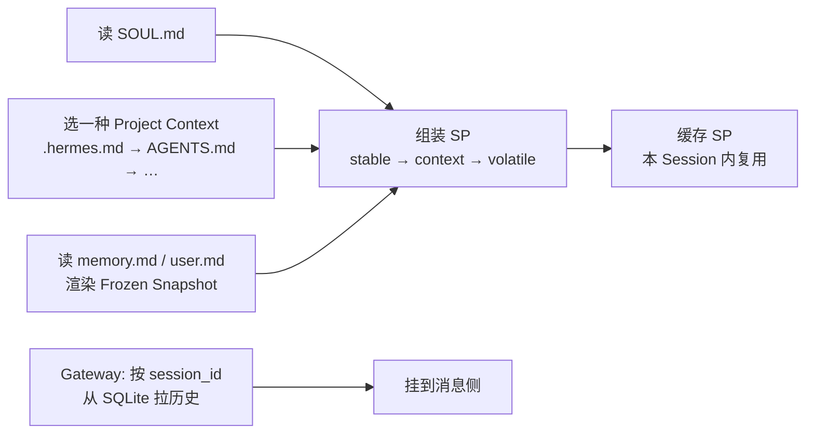

要点：

1. **只 freeze 一次**：`memory.md` / `user.md` 是启动时的快照；本 session 里 Agent 用 memory tool 改了磁盘，**当前 SP 仍是旧快照**（tool 返回里能看到活数据）。  
2. **为何冻结**：保住 provider 侧 **prompt prefix cache**，也避免每轮重读盘抖动前缀。  
3. **刷新时机**：新 Session 启动；或压缩等触发的 **explicit rebuild**（少数路径会重建 SP，见官方 Prompt Assembly）。  
4. **Gateway 更重**：除 freeze SP 外，还要用 `渠道:provider_session_id:…` 从 SQLite **拉齐历史**再进 Loop（详见 §5）。  
5. **Project Context 可选**：直聊场景没有 `.hermes.md` / `AGENTS.md` 时，context 层这一块为空，**完全正常**。有项目文件时，每个 Session **只选一种**（先匹配先得）；`SOUL.md` **独立占位**，不跟项目文件抢槽。

```text
项目上下文优先级（每个 session 一种）:
.hermes.md / HERMES.md  →  AGENTS.md  →  CLAUDE.md  →  .cursorrules
```

---

### 3.3 Turn 级：每一轮 Build Context 做什么

用户每发一条消息，Loop 在调 LLM **之前**走 Build Context。同 Session 内 **不重装** 整份 SP，而是：

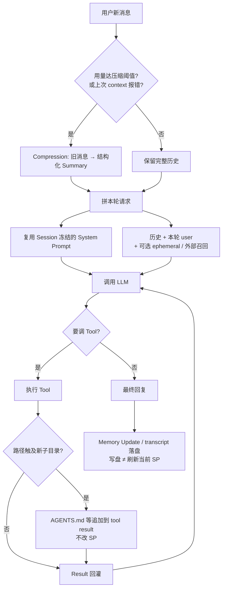

| 步骤 | Turn 内行为 | 会不会改冻结的 SP |
|------|-------------|-------------------|
| 压缩检查 | 每 turn 前；context 报错时再强制（§4） | 一般只改 **消息历史**；少数 rebuild 路径除外 |
| 拼请求 | SP（缓存）+ 历史 + 本轮消息 | 否 |
| Tool 内循环 | 可多次；子目录 Context Files **渐进发现** | 否（挂 tool result） |
| 最终回复后 | transcript 写入 `state.db`；可写 `user.md` / `memory.md` | **否**（下个 Session 才进 SP） |

和 Session 对照记：

| 维度 | Session | Turn |
|------|---------|------|
| System Prompt | 启动组装并冻结 | 复用 |
| 消息历史 | 同一 session id 下累积 | 每轮带「到目前为止」的历史 |
| Context Files（根） | 启动注入 SP | 每轮随 SP 带着 |
| Context Files（子目录） | 每目录最多发现一次 | 某轮 tool 摸到路径时注入 |
| Compression | 配置按实例/session | **检查动作按 turn** |
| Memory 写盘 | 跨 session 持久 | 可在某轮发生，**不影响本 session SP** |

---

## 4. Context Compression（上下文压缩）

源码：`agent/context_compressor.py`。压的是 **消息列表**（不是重读项目说明书）。

**何时压**：用量 ≥ 主模型窗口 × 阈值（默认 **50%**）。Gateway 进 Agent 前另有一道约 **85%** 的安全网；模型因 context 报错也会强制压。token 优先用 API 返回的 usage，没有则粗估。

```yaml
# config.yaml
compression:
  threshold: 0.50       # 触发比例
  target_ratio: 0.20    # 近期消息保留预算 = 触发阈值 token × 此值
  protect_last_n: 20    # 尾部至少保留多少条（预算优先，这条是下限）
```

例（200K 窗口、默认配置）：触发线 100K token；尾部预算约 20K；摘要上限约 10K。

### 4.1 压缩算法

把消息切成三段：

```text
head   开头保留（默认约 system + 首轮交换；多次压缩后开头保护会减弱）
middle 中间旧轮次 → 压成一份结构化摘要
tail   最近对话原样保留（按 token 预算从后往前留，不够则至少留 N 条）
```

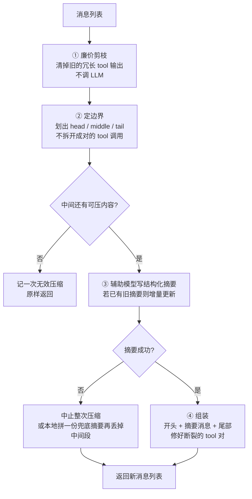

| 步骤 | 做什么 |
|------|--------|
| **① 剪枝** | 尾部保护区之外：把很长的 tool 结果收成一行（工具名 / 命令 / 结果）；重复结果去重；过大的调用参数截断 |
| **② 定边界** | 算出 head、middle、tail；保证 tool 调用和 tool 结果不被拆到不同段 |
| **③ 摘要** | 用辅助模型按固定模板总结 middle；本 session 已有上一份摘要时做**增量更新**；`/compress 某主题` 可指定保留重点 |
| **④ 组装** | 开头 +「上下文压缩」摘要消息 + 尾部；清掉没有配对的 tool 消息；摘要带内部标记（发给 API 前会剥掉） |

摘要目标长度大约是被压内容的 **20%**，并夹在约 2K～10K token 之间。

消息太少或中间没有可压窗口：不压，记无效次数；连续两次无效就暂时不再自动触发，避免死循环。

### 4.2 摘要长什么样

摘要开头会声明：**仅作背景参考**——模型应只响应摘要**之后**的最新用户消息；`MEMORY.md` / `USER.md` 仍然有效。带 Historical 的标题是故意的，防止把旧待办当成还要继续做。

| 区块 | 作用 |
|------|------|
| Historical Task Snapshot | 用户最近未完成的输入（尽量原文） |
| Goal / Constraints & Preferences | 总目标、约束与偏好 |
| Completed Actions | 编号：做了什么、路径/命令、结果、用了哪个工具 |
| Active State | 工作目录、分支、改动文件、测试状态等 |
| Historical In-Progress / Blocked | 压缩当时进行中的事、阻塞与报错 |
| Key Decisions / Resolved Questions | 关键决策、已回答过的问题 |
| Historical Pending Asks / Remaining Work | **陈旧**待办——默认不要自动接着做 |
| Relevant Files / Critical Context | 相关文件与关键值（密钥写成 `[REDACTED]`） |

额外规则：已完成的事写成带日期的过去式；再次压缩时更新上一份摘要，而不是从头重写。

### 4.3 失败时怎么办

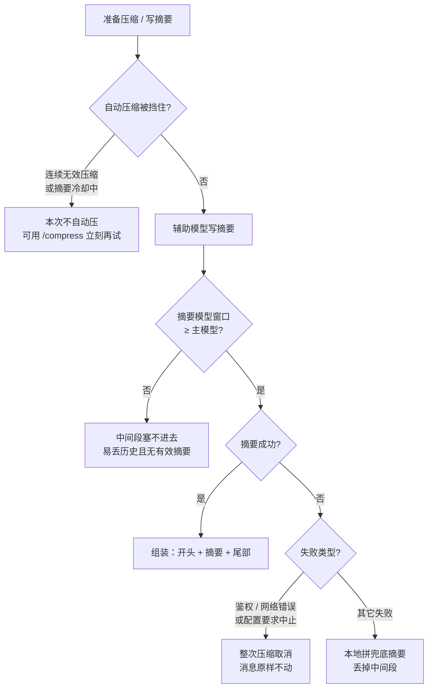

---

## 5. Gateway（消息网关）

Gateway 把 Agent 挂到 Telegram、WhatsApp、Email、Slack、Discord、SMS 等渠道：**常驻在线 + 多端同一套 Core**。相对 CLI，它多了两件 Context 相关的硬活：**按 Session 拼历史**，以及 **并发 Turn 的排队/打断**。

### 5.1 一条入站消息怎么变成一个 Turn

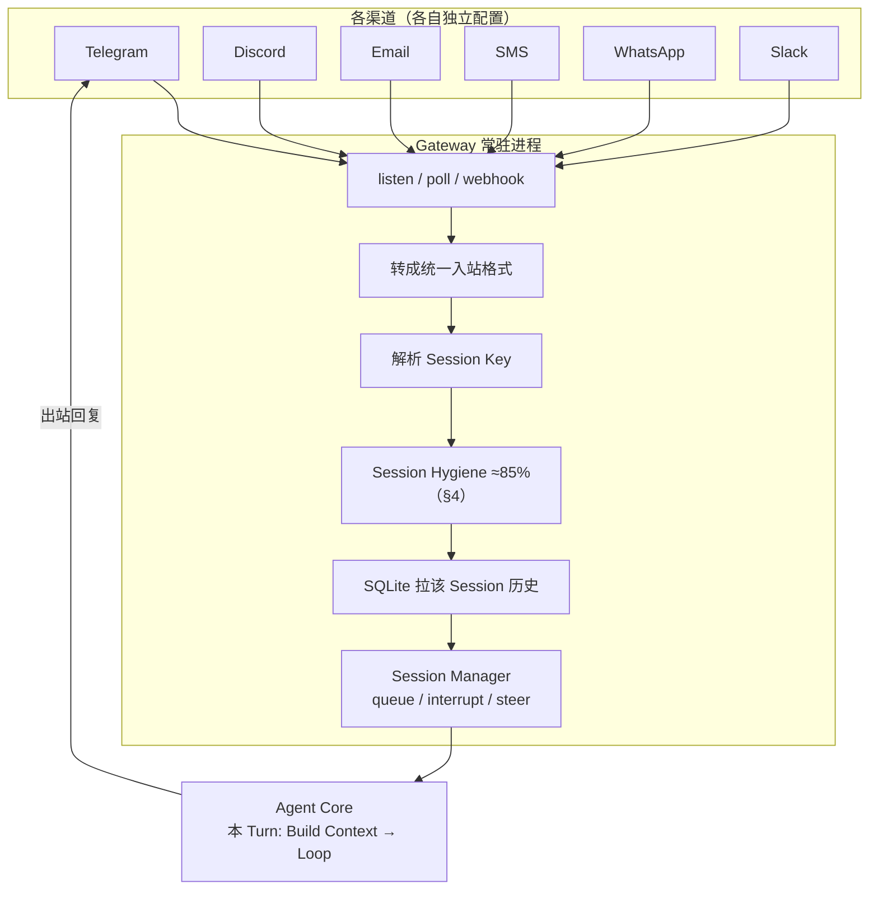

| 步骤 | Session 还是 Turn | 做什么 |
|------|-------------------|--------|
| 解析 Session Key | Session | `telegram:<provider_session_id>:…` 定位同一条对话线程 |
| Hygiene | Session 用量，**在本 Turn 进 Agent 前** | 超长历史先压一刀（§4） |
| 拉 SQLite 历史 | Session 累积 → 交给本 Turn | CLI 内存里本来就有；Gateway **每次只收到一条新消息** |
| Session Manager | 多 Turn 并发 | 上一条还在跑时，新消息 queue / interrupt / steer |
| Agent Loop | **一个 Turn** | 复用/组装 Context → LLM↔Tools → 回复 → Memory Update |

### 5.2 为何 Gateway 的「拼 Context」更重

- CLI：进程内 Session 连续，历史 naturally 在内存。  
- Gateway：进程常驻，但 **入站往往只有最新一条**；必须：  
  1. 用 Session Key 从 SQLite **拉齐历史**（消息侧）；  
  2. 再走与 CLI 相同的 Build Context / 冻结 SP 逻辑（§3）。  

没有这一步，Agent 会把每条 Telegram 消息当成「失忆的新会话」。

### 5.3 Session 标识与 SQLite

```text
{gateway_name}:{provider_session_id}:{其他 ID…}
例：telegram:<telegram_session_id>:…
```

- 全渠道消息落 **本地 SQLite**（Internal Memory / transcript，详见 §6）。  
- 新消息 → 查 Session → append →（必要时 hygiene）→ 开本 Turn 的 Agent。

### 5.4 Session Manager：上一 Turn 未结束又来新消息

| 用户动作（例：Telegram） | 行为 |
|--------------------------|------|
| 普通再发一条 | **Queue**（排队，等当前 Turn 结束） |
| `/interrupt` | **Interrupt**（打断当前 Turn） |
| `/steer` | **Steer**（纠偏/引导当前任务） |

### 5.5 集成现实

- **不是**一个万能适配器通吃所有渠道；每个集成单独配置（`hermes setup gateway`）。  
- 拉取方式因平台而异：webhook、轮询、WebSocket 等。

---

## 6. Memory（三种形态）

Memory 贯穿 Loop、Compression、Gateway。细拆四层体系见 [`02-memory.md`](./02-memory.md)；这里只钉 **和 Context 的交接**：谁在 Session 启动进 SP，谁在 Turn 末尾写盘。

Hermes 记忆分 **三路**：

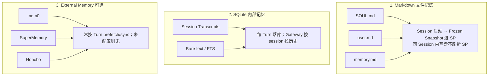

### 6.1 Markdown 三件套（复习）

- `SOUL.md`：人格（常需自建；仅 `HERMES_HOME`）。  
- `user.md`：用户事实（Agent 可更新）。  
- `memory.md`：任意有用知识（结合目标判断是否写入）。

### 6.2 SQLite

- 本质是 **各 session 的完整 transcript**（可 FTS 搜「上周那次」）。  
- Gateway 用「渠道前缀 + session id」定位。  
- **Bare text** 便于相似度 / 全文检索。

### 6.3 External Memory（强烈建议开启）

| 点 | 说明 |
|----|------|
| 默认 | **未启用**；需自行配置 |
| 例子 | mem0、Honcho、SuperMemory 等 |
| 何时查询 | 典型 **不是** Session 首条消息之前；而是 **首轮回复之后** 再查，服务后续 Turn（口播常见说法；具体 provider 略有差异） |
| 使用技巧 | 首轮没想起：先描述「想回忆什么」，再 follow-up |

### 6.4 何时更新 Memory（按类型拆开）

先分清：**写入（Write）** vs **读进 Context（Read）**。Read 规则见 §3（Session 冻结）；下表专讲 **何时改磁盘**。

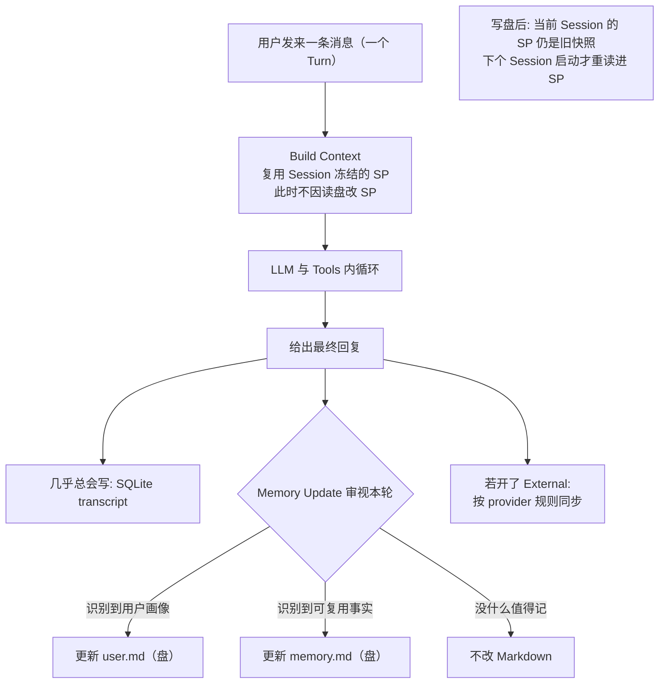

#### 对照表：谁、何时、写什么

| 记忆载体 | 何时写入 | 触发条件 | 谁决定写 | 默认是否发生 |
|----------|----------|----------|----------|--------------|
| **SQLite transcript** | **每个 Turn 之后** | 有对话就落库 | 系统自动 | **是** |
| **Bare text / FTS** | 随 transcript | 便于检索 | 系统自动 | **是** |
| **user.md** | Turn 末尾 Memory Update；或中途 memory tool | 出现用户画像信息 | Agent | 有料才写 |
| **memory.md** | ① Turn 末尾 ② 踩坑自改进 ③ 用户显式「记住」 | 可复用事实 | Agent / 用户 | **否**（有内容才写） |
| **SOUL.md** | **不走**每轮自动 Update | 人手或显式让 Hermes 写 | 用户主导 | **否** |
| **External** | 视 provider（常 Turn 结束后） | 已配置 | Provider + 适配层 | 仅配置后 |

#### 时间轴（单个 Turn）

| 步骤 | 读 Memory？ | 写 Memory？ |
|------|-------------|-------------|
| 1. 用户发消息 | — | — |
| 2. Build Context | **复用** Session 启动时冻进 SP 的 `SOUL` / `user` / `memory`；消息侧带历史；可选 ephemeral / External 召回 | **不写** |
| 3. LLM ↔ Tools | 可通过 memory tool 读/写磁盘 | 可能中途写盘（**仍不刷新当前 SP**） |
| 4. 最终回复 | — | — |
| 5. 落库 transcript | — | **写 SQLite** |
| 6. Memory Update | 再看本轮 | **可能**写 `user.md` / `memory.md` |
| 7. External（若开启） | — | 按 provider 同步 |
| 8. 下一 Turn | SP 仍是本 Session 快照 | — |
| 9. 下一 Session | **重读盘**刷新 SP 快照 | — |

#### 容易混的三点

1. **「每轮都 Memory Update」≠「每轮都改 user.md / memory.md」**  
   审视每轮可跑；只有「值得记」才落盘。Transcript 才是每轮必写。

2. **写盘 ≠ 当前 Turn/Session 的 SP 已更新**  
   Frozen snapshot 是为 prompt cache；活数据在 tool result / 下个 Session。

3. **三种写入入口**  
   - 隐式：Loop 末尾审视 / 自改进 / External  
   - 显式：用户说「记住：…」  
   - 人手改 Markdown（尤其 `SOUL.md`）

---

## 7. Cron Jobs（定时任务）

Cron 让你说：「每天早上把最新 AI 新闻发我邮箱」「每周五给老板发进度」——在指定时刻自动跑 Agent 任务。

### 7.1 运行机制

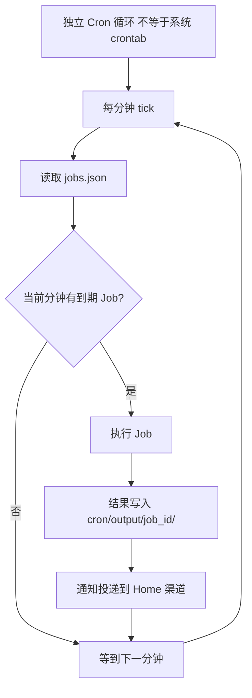

说明：文档常写 cron 在 SQLite，实盘多半是 **`~/.hermes/cron/jobs.json`**；通知走 Home，不是 Agent 调 `send_message`。

### 7.2 存储细节（与文档易不一致）

| 项 | 实际行为 |
|----|----------|
| Job 列表 | **`~/.hermes/cron/jobs.json`**（plain JSON：prompt、调度等） |
| 文档说法 | 有的文档写存在 SQLite；走读代码/实盘时常 **看不到 cron 表**，tick 也是读 JSON |
| 运行产物 | `cron/output/<job_id>/` 下各次 run 的 markdown |

### 7.3 通知投递：Home Channel

- Cron **不会**靠 Agent 的「发消息」Tool 去推 Telegram。  
- 配置 Gateway 时会问：某个 User ID 是否设为该渠道的 **Home**。  
- Job 跑完后，系统把通知发到 **Home 集成**（你的主消息入口）。

### 7.4 典型用途

- 每日 AI 新闻邮件  
- 每日社区 Slack 动态  
- 每周五老板汇报邮件  
- 任意「按分钟/小时/天/周/月」重复的 Agent 任务

---

## 8. 端到端：一次 Telegram 消息怎么走完

把前面模块串成一条路径：

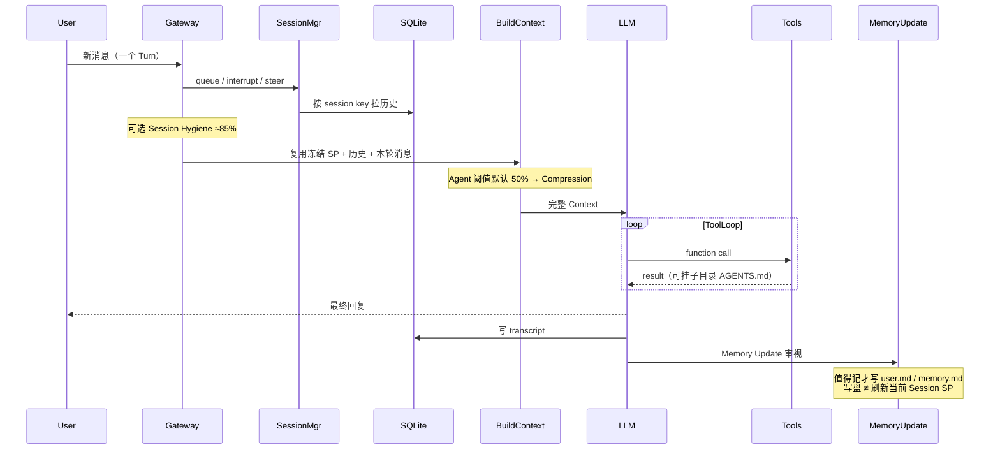

---

## 9. 模块对照速查

| 模块 | 一句话 | 关键实现细节 |
|------|--------|----------------|
| **Entry** | CLI / Desktop / Gateway / API 同 Core | Desktop 与 CLI 共用 `%LOCALAPPDATA%\hermes`；打开 App ≠ Session |
| **Agent Loop** | 消息 → Context → LLM ↔ Tools → 回复 → Memory Update | Memory Update 在**最终回复之后**；审视≠必写 |
| **Context** | Session 冻结 SP + Turn 拼历史/本轮消息 | 直聊：`SOUL`+memory 即可；Project Context 可选 |
| **Context Files** | `.hermes.md` → `AGENTS.md` → … | **放项目根**，不放 Hermes 家目录；无文件则跳过 |
| **Compression** | 消息列表：剪枝 → 定边界 → 结构化摘要 → 组装 | 默认 50% 触发；保留头尾、压中间；摘要可增量更新 |


| **Gateway** | 入站一条 → 还原 Session → 跑一个 Turn | Session key 拉 SQLite；Manager：queue/interrupt/steer |
| **Memory** | Markdown 快照 + transcript + 可选 External | **写**：transcript 每 Turn；user/memory 有料才写。**读进 SP**：Session 启动冻结 |
| **Cron** | 每分钟 tick 读 JSON 跑任务 | `jobs.json` + `output/<job_id>/`；通知走 Home，不走 send tool |

---

## 10. 小结

Hermes = **本地 Agent Core（极简 Loop）** + **多入口（CLI / Desktop / Gateway）** + **文件化人格/记忆** + **SQLite 全文会话** + **可选外部记忆** + **自建分钟级 Cron**。

对 **Windows App 直聊** 这类用法，先记住：

1. 打开 App ≠ Session；New Chat / 一条对话 = Session；每条消息 = Turn  
2. Context 主料是 `SOUL` + `USER`/`MEMORY` + 消息历史；**不必**强行加 `AGENTS.md`  
3. 写了 memory 要进当前 system prompt → 需要 **新 Session**（冻结快照只在启动时读）  
4. 进仓库改代码时，再在**项目根**加 Project Context

架构上并不炫技，但每一块都落到可配置、可落盘、可多端常驻——这也是它适合当「自托管个人助手 / 自建 Claw 类 Agent」参考实现的原因。若要自己做同类系统，优先复用这几件事：

1. 固定 Loop + Memory Update 闭环  
2. Markdown 人格与用户记忆注入 Context（Project Context 做成可选层）  
3. 可配置的压缩阈值与结构化 summarizer  
4. Gateway / Desktop 侧按 session 重建历史 + 并发策略  
5. Cron 与 Home 通知解耦于 Tool 调用
