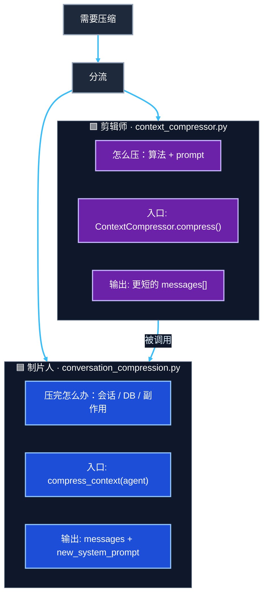
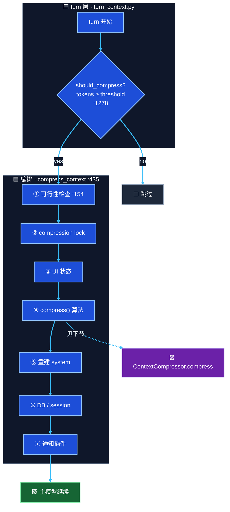
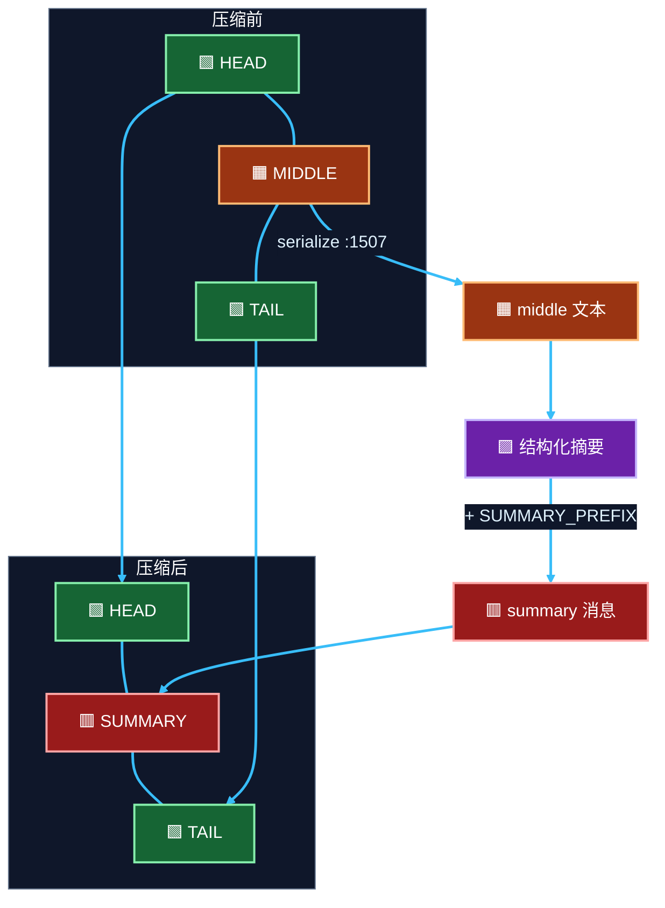
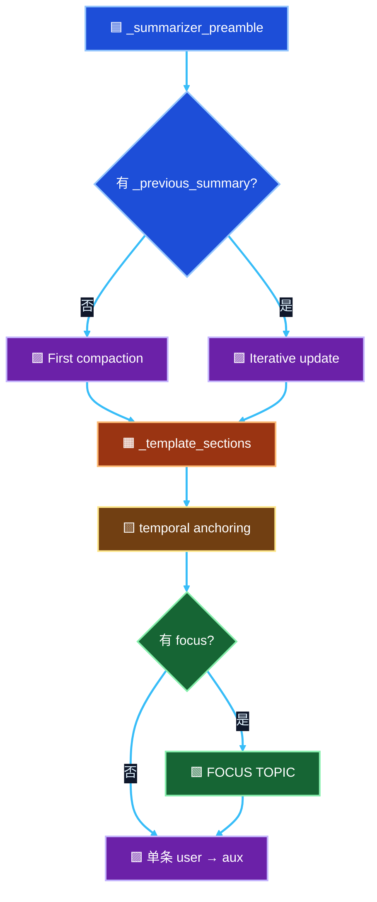
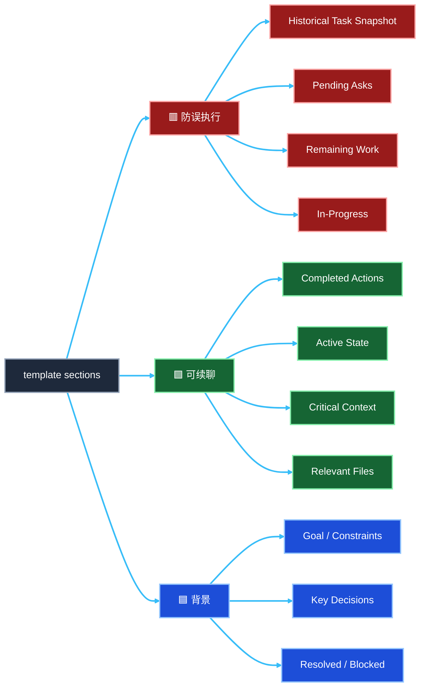
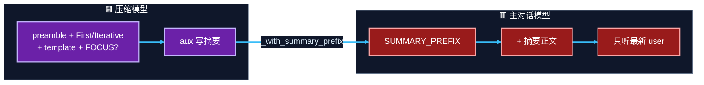
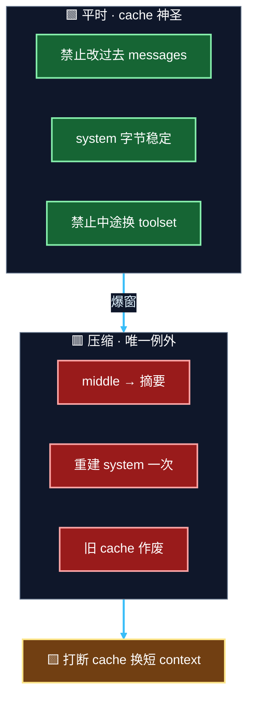

# Compress 讲稿（按讲解顺序）

> 对着 `hermes_src` 讲「上下文压缩」。约 20–25 min。  
> Demo：`4_context_compression.ipynb` · `exports/context_compression/`  
> 下一章：`6.prompt_caching.md`（压缩是改历史的**唯一合法例外**）  
> 图：黑底 · 箭头亮青 · **节点一律深底白字** · 🟦编排 🟩保头/尾 🟧middle 🟪Prompt/LLM 🟥主模型约束 ⬜无 LLM  
> 每节 mermaid 旁附 **Text Call Flow**（口播 / 无渲染时对着念）

源码路径（相对本 notebook）：

```text
../hermes_src/agent/turn_context.py
../hermes_src/agent/conversation_compression.py
../hermes_src/agent/context_compressor.py
```

---

## 1. 开场（0–3 min）

**口播**：对话太长会撞 context 窗口 → 不能整段硬删 → 用辅助模型把中间轮次压成结构化 checkpoint → **保头保尾** → 主模型继续聊。

| 概念 | 一句话 |
|------|--------|
| `messages` | 越聊越厚的笔记本 |
| HEAD | system + 首轮，不撕 |
| MIDDLE | 中间压成「前情提要」 |
| TAIL | 最近几轮，不撕 |
| `SUMMARY_PREFIX` | 大红字：这是参考，不是当前任务 |

---

## 2. 两文件分工（3–6 min）· 图 F

| | `context_compressor.py` | `conversation_compression.py` |
|--|-------------------------|-------------------------------|
| 角色 | **怎么压**（算法 + prompt） | **压完怎么办**（会话 / DB / 副作用） |
| 入口 | `ContextCompressor.compress()` `:2845` | `compress_context(agent)` `:435` |
| 输出 | 更短的 `messages[]` | `(messages, new_system_prompt)` |
| 类比 | 剪辑师 | 制片人 |

**Text Call Flow（图 F）**：

```text
需要压缩
        │
        ├──────────────────────────────┐
        ▼                              ▼
🟪 剪辑师                              🟦 制片人
context_compressor.py                  conversation_compression.py
  · 怎么压：算法 + prompt                · 压完怎么办：会话 / DB / 副作用
  · 入口: ContextCompressor.compress() · 入口: compress_context(agent)
  · 输出: 更短的 messages[]             · 输出: (messages, new_system_prompt)
        │                              ▲
        └──── compress() 被编排层调用 ──┘
```



---

## 3. 端到端调用链（6–8 min）· 图 A

打开：`turn_context.py` → `should_compress` `:1278` → `_compress_context` → `compress_context` `:435`

**口播**：触发在 turn 层；干活分编排 + 算法两层。`COMPACTION_STATUS` 是 UI，不是 LLM prompt。

**Text Call Flow（图 A · 端到端）**：

```text
用户发来一句
        │
        ▼
run_conversation(...)
        │
        ▼
build_turn_context(...)                         ← turn_context.py
        │
        ├─ cheap gate: _should_run_preflight_estimate?
        │       │ no  → 跳过估算
        │       ▼ yes
        │  estimate_request_tokens_rough(...)
        │       │
        │       ├─ defer?        → 跳过（粗估虚高）
        │       ├─ cooldown?     → 跳过（摘要刚失败）
        │       ├─ codex native? → 跳过（交给 codex）
        │       └─ should_compress?(tokens ≥ threshold) :1278
        │               │ no  → ⬜ 跳过
        │               ▼ yes
        │         最多 3 遍 agent._compress_context(...)
        │               │ 每遍看 _compression_made_progress
        │               ▼
        └─ 继续 prologue（plugin / memory）→ 进入 tool loop
```

编排层展开（`compress_context` `:435`）：

```text
agent._compress_context / compress_context(agent, messages, ...)
        │
        ├─ ① check_compression_model_feasibility :154
        ├─ ② compression lock（同 session 防双压）
        ├─ ③ UI：COMPACTION_STATUS（不是 LLM prompt）
        ├─ ④ ContextCompressor.compress()          ← 🟪 见 §4
        ├─ ⑤ 重建 system（_invalidate → _build）
        ├─ ⑥ DB / session（默认轮转 child；in_place 则同 id）
        └─ ⑦ 通知插件
                │
                ▼
        返回 (messages, new_system_prompt) → 🟩 主模型继续
```



---

## 4. 算法五步 + 切开拼回（8–14 min）· 图 B / C

打开：`compress()` `:2845` · 现场对照 `exports/01_切开/` · `03_拼接/`

| Phase | 方法 | 做什么 |
|-------|------|--------|
| 1 | `_prune_old_tool_results` `:1321` | 先砍大 tool，少打 LLM |
| 2 | `_protect_head_size` `:2448` + `_find_tail_cut_by_tokens` `:2722` | 定 head / middle / tail |
| 3 | `_generate_summary` `:1799` | 结构化 prompt → aux |
| 4 | 组装 + `_with_summary_prefix` `:2253` | middle 原文丢掉 |
| 5 | `_sanitize_tool_pairs` | 清 orphan tool 对 |

**Text Call Flow（图 B · 算法五步）**：

```text
ContextCompressor.compress(messages, current_tokens, focus_topic?, force?)
        │
        ├─ 1. _prune_old_tool_results :1321     ⬜ 先砍大 tool，少打 LLM
        │
        ├─ 2. 切开
        │       _protect_head_size :2448         → head 终点
        │       _find_tail_cut_by_tokens :2722    → tail 起点
        │       → HEAD | MIDDLE | TAIL
        │
        ├─ 3. _generate_summary(middle, ...) :1799  🟪 aux 写结构化摘要
        │
        ├─ 4. 组装
        │       HEAD + _with_summary_prefix(摘要) + TAIL
        │       （middle 原文丢掉）
        │
        └─ 5. _sanitize_tool_pairs                  ⬜ 清 orphan tool 对
                │
                ▼
           更短的 messages[]
```

**Text Call Flow（图 C · 切开拼回）**：

```text
压缩前:
  [🟩 HEAD] ── [🟧 MIDDLE] ── [🟩 TAIL]

MIDDLE
        │ serialize :1507
        ▼
  🟧 middle 文本
        │ _generate_summary
        ▼
  🟪 结构化摘要
        │ _with_summary_prefix :2253
        ▼
  🟥 summary 消息（带 SUMMARY_PREFIX）

压缩后:
  [🟩 HEAD] ── [🟥 SUMMARY] ── [🟩 TAIL]
       ▲              ▲              ▲
       └──── 保留 ────┴── 替换 middle ──┴──── 保留 ────┘
```




---

## 5. Prompt 怎么拼（14–18 min）· 图 D / G

打开：`_generate_summary` `:1799` · `exports/02_middle摘要/压缩prompt.md`

发给 aux：**单条** `role=user`（无 system、无 tools）。

```text
_summarizer_preamble
  + First compaction | Iterative update
  + _template_sections（含 temporal anchoring）
  + 可选 FOCUS TOPIC
```

| 块 | 行号 | 讲什么 |
|----|------|--------|
| `_summarizer_preamble` | 1848 | 摘要员；同语言；密钥 → `[REDACTED]` |
| First compaction | 1972 | 无旧摘要：从零压 `TURNS TO SUMMARIZE` |
| Iterative update | 1956 | 有 `_previous_summary`：增量合并，防丢早期事实 |
| `_template_sections` | 1881 | 固定骨架（见下） |
| `_temporal_anchoring_rule` | 1868 | 已完成 → 带日期过去式 |
| `FOCUS TOPIC` | 1986 | `/compress <focus>` → 相关占 60–70% budget |

**口播只展开 3 个 section**，其余扫一眼：

| Section | 用途 |
|---------|------|
| `## Historical Task Snapshot` | ★ 用户最近未完成诉求原文；stop/undo 覆盖旧任务 |
| `## Completed Actions` | 工具/路径/结果，防重复劳动 |
| `## Active State` | cwd / 分支 / 文件 / 测试 / 进程 |
| `## Historical Pending / Remaining` | **STALE**：勿当当前指令（故不叫 Next Steps） |
| `## Critical Context` | 必须留下的具体值；密钥 redact |

**Text Call Flow（图 D · Prompt 怎么拼）**：

```text
_generate_summary(...) :1799
        │
        ├─ _summarizer_preamble :1848          # 摘要员；同语言；密钥 redact
        │
        ├─ 有 _previous_summary?
        │       │ 否 → First compaction :1972   # 从零压 TURNS TO SUMMARIZE
        │       │ 是 → Iterative update :1956   # 增量合并，防丢早期事实
        │       ▼
        ├─ _template_sections :1881            # 固定骨架（含 temporal）
        │       └─ _temporal_anchoring_rule :1868
        │
        ├─ 有 focus_topic? (/compress <focus>)
        │       │ 是 → FOCUS TOPIC :1986       # 相关占 60–70% budget
        │       ▼
        └─ 拼成【单条】role=user → aux LLM
              （无 system、无 tools）
```

**Text Call Flow（图 G · template 三段用途）**：

```text
_template_sections
        │
        ├─ 🟥 防误执行
        │     Historical Task Snapshot / Pending Asks
        │     Remaining Work / In-Progress
        │
        ├─ 🟩 可续聊
        │     Completed Actions / Active State
        │     Critical Context / Relevant Files
        │
        └─ 🟦 背景
              Goal·Constraints / Key Decisions / Resolved·Blocked
```





---

## 6. 两套文字别混（必讲）· 图 E

打开：文件顶部 `SUMMARY_PREFIX` `:44` · `_with_summary_prefix` `:2253`

| 文本 | 给谁 | 作用 |
|------|------|------|
| summarizer prompt | **压缩模型** | 写出好摘要 |
| `SUMMARY_PREFIX` | **主对话模型** | 摘要是背景；只听摘要之后的最新 user |

`SUMMARY_PREFIX` 要点：REFERENCE ONLY · 勿答旧题 · 最新 user 赢 · stop/undo 作废在途任务 · MEMORY 仍权威。

**Text Call Flow（图 E · 两套文字）**：

```text
🟧 middle 文本
        │
        ▼
🟪 压缩模型（aux）
  summarizer prompt =
    preamble + First/Iterative + template + FOCUS?
        │
        │  写出好摘要
        ▼
  摘要正文
        │ _with_summary_prefix :2253
        ▼
🟥 主对话模型看到的消息
  SUMMARY_PREFIX          ← 「这是参考，不是当前任务」
    + 摘要正文
        │
        ▼
  只听摘要之后的最新 user
```



---

## 7. 编排层补全（18–22 min）

打开：`conversation_compression.py`（图 A 的 ①–⑦ 已讲过，这里只补产品细节）

| 符号 | 行号 | 讲什么 |
|------|------|--------|
| `check_compression_model_feasibility` | 154 | aux 窗口不够 → 警告或下调 threshold |
| compression lock | ~518 | 同 session 防并发双压 → 孤儿 session |
| `compression.in_place` | ~500 | 默认轮转 child session；`true` 则同 id 改消息 |
| `_ensure_compressed_has_user_turn` | 394 | 压缩后必须有 user turn |
| system 重建 | — | `_invalidate` → `_build`；中途仍不能乱换 toolset |

失败（一句带过）：

| 情况 | 行为 |
|------|------|
| 摘要失败 + abort | 原 messages 返回，不轮转 |
| 摘要失败 + fallback | `_build_static_fallback_summary` `:1578` |
| 手动 `/compress` | `force=True`，跳过 cooldown |

**Text Call Flow（失败 / 手动路径）**：

```text
compress_context(...)
        │
        ├─ 摘要成功 → 写回 messages + 轮转/in_place + 重建 system
        │
        ├─ 摘要失败 + abort
        │       → 原 messages 原样返回，不轮转
        │
        ├─ 摘要失败 + fallback
        │       → _build_static_fallback_summary :1578
        │
        └─ 手动 /compress
                → force=True，跳过 cooldown，仍走同一条编排链
```

---

## 8. Caching 收束（22–25 min）· 图 H

| | 平时 | 压缩时 |
|--|------|--------|
| 过去 messages | **禁止改** | **唯一例外**：middle → 摘要 |
| system | 会话内字节稳定 | 允许重建一次 |
| 代价 | — | 打断旧 cache；爆窗更糟，值得 |

**Text Call Flow（图 H · 与 Prompt Cache）**：

```text
平时（cache 神圣）:
  禁止改过去 messages
  system 字节稳定
  禁止中途换 toolset
        │
        │ 爆窗 / tokens ≥ threshold
        ▼
压缩（唯一合法例外）:
  middle → 摘要
  重建 system 一次
  旧 prompt cache 作废
        │
        ▼
权衡: 打断 cache 换短 context（爆窗更糟，值得）
        │
        ▼
下一轮 apply_anthropic_cache_control → 重新写 cache
  （见 6.prompt_caching.md）
```



---

## 9. 三陷阱 + 自检

1. **摘要被当成待办** → `Historical*` + `SUMMARY_PREFIX`
2. **多轮压缩丢信息** → Iterative update（带 `_previous_summary`）
3. **算法对了 session 乱了** → 编排层 lock / rotate

**板书一句**：`Compress = 算法(可续聊 + 勿误执行) + 编排(锁/session) · Caching 唯一合法改历史`

**板书 Call Flow 一页**：

```text
Turn prologue
  → should_compress?
  → compress_context（锁 / UI / session）
       → compress()：prune → 切开 → summary → 拼回 → sanitize
       → 重建 system
  → 主模型继续（SUMMARY_PREFIX + 最新 user）
代价：打断 prompt cache（故意权衡）
```

问听众：

1. 为什么不用「Next Steps」？
2. 第一次 vs 第二次压缩，prompt 差在哪？
3. `SUMMARY_PREFIX` 给压缩模型还是主模型？
4. 编排层不调 LLM 摘要，还干什么？
5. 压缩后 cache 怎样？为什么仍要压？
