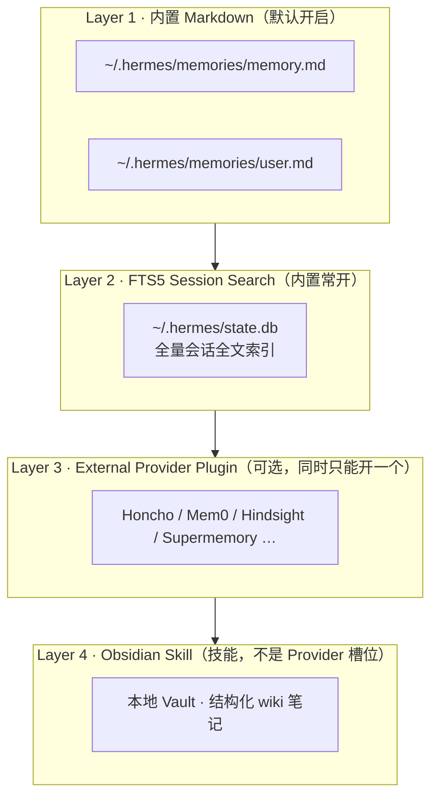
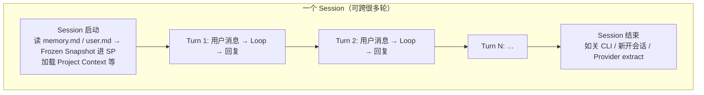
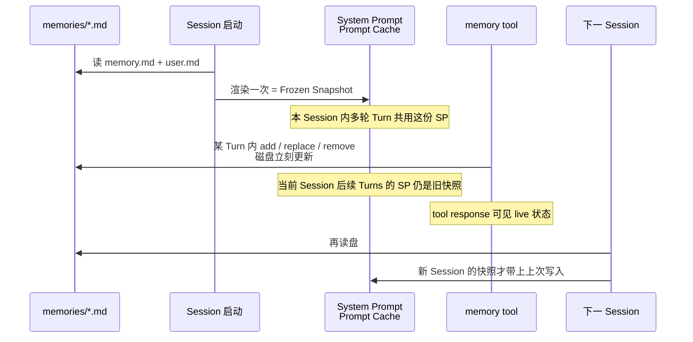
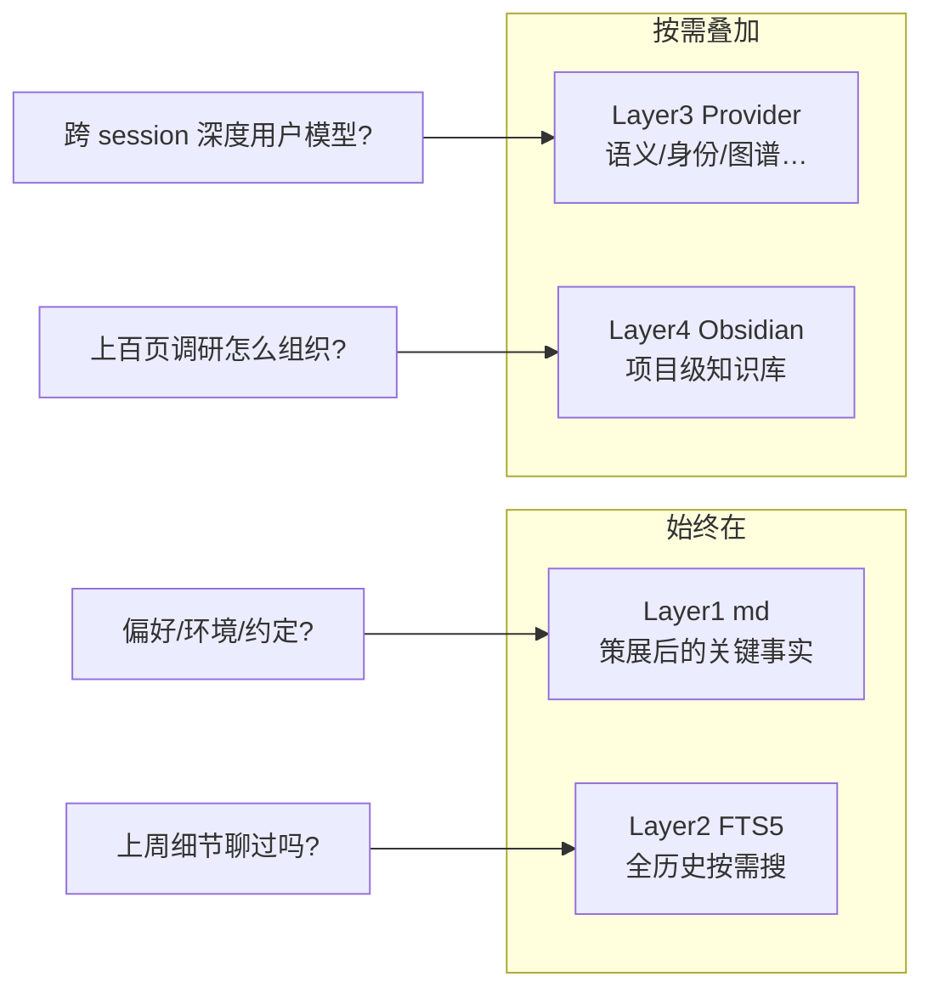

# Hermes Agent Memory 四层体系

https://www.youtube.com/watch?v=ZKZLko9kLm4&list=PLmpUb_PWAkDx-VWjh00tVCji794xAa_IX&index=4

多数人不知道：从第一次开机对话起，**内置 Memory 一直在静默读写**。本篇拆开 Layer 1 的机制，再讲可叠加的三层扩展。

---

## 0. 总览：四层可叠加，不是四选一



| 层 | 是什么 | 解决什么 | 是否默认 |
|----|--------|----------|----------|
| **1** | `memory.md` + `user.md` | 关键事实 / 用户画像常驻 system prompt | **是**，开机即用 |
| **2** | `state.db` + `session_search` | 「上周聊过 X 吗？」类细节全文召回 | **是**，常开 |
| **3** | Provider 插件（Honcho、Mem0…） | 语义召回、身份建模等 | 否；`hermes memory setup` |
| **4** | Obsidian **Skill** | 大项目 / 领域知识的结构化长期库 | 否；配 vault path |

**关键原则：四层是 additive（叠加），不是 alternatives（互斥）。**  
Layer 1 在配置了 Provider 后也 **不会关掉**；Provider 是增强。  
演示目标：四层可同时跑。

口播定位：

> Memory = Hermes **知道什么**；下一模块 Skills = Hermes **能做什么**。

---

## 0.5 术语：Session vs 单轮对话（Turn）

读后面「frozen snapshot / 每 turn prefetch / session end extract」之前，先把这两个词钉死。混用会导致以为「写了 memory 马上进 system prompt」或「每条消息都会重新 seed 记忆文件」。

### 一句话

| 词 | 是什么 | 类比 |
|----|--------|------|
| **Turn（单轮 / 一轮）** | 用户 **发一条消息** → Agent 跑完 **一整次 Loop**（可含多次 Tool）→ 给出最终回复 →（可选）Memory Update | 一次「你问、它答」 |
| **Session（会话）** | 一次 **连续对话容器**：包含 **多轮** Turn，共享同一份启动时冻结的 system prompt 快照与同一条 session 历史 | 一次打开的 CLI 聊天 / 同一个 Telegram 会话线程 |



### 对照表（按「发生频率」）

| 维度 | Turn（单轮） | Session（会话） |
|------|--------------|-----------------|
| **触发** | 用户每发 **1 条** 消息 | 打开/绑定一条对话通道（CLI 一次运行、Gateway 的 `telegram:session_id:…` 等） |
| **包含关系** | Session ⊃ 多个 Turn | 一个 Session = Turn₁ + Turn₂ + … |
| **Agent Loop** | **每轮跑一遍**（Build Context → LLM↔Tools → 回复 → Memory Update） | Loop 本身不是「按 session 跑一次」，而是 session 里 **每轮都跑** |
| **消息历史** | 本轮把「到目前为止的历史 + 本轮新消息」送进 LLM | 整段 transcript 落在 **同一 session id** 下（`state.db`） |
| **`memory.md` / `user.md` 读进 SP** | 否（不每轮重载） | **仅 Session 启动时读一次** = frozen snapshot |
| **memory tool 写盘** | 可在某一轮中途发生（磁盘立刻变） | 写完后 **同 session 内 SP 仍是旧快照**；要 **下一个 Session** 才进 SP |
| **Compression 检查** | **每轮之前**（以及 context 报错时） | 阈值等配置按 session/实例，检查动作按 turn |
| **External Provider** | 常见：每 turn 前 prefetch；每 turn 后 sync | session end 再 extract；有的还做 session graph ingest |
| **Context Files 子目录发现** | 某轮 tool 摸到路径时注入 | **每个子目录每 session 最多查一次** |
| **Session Search** | 某一轮里 Agent 决定要不要搜 | 索引单位是 **整段 session 历史**（可搜「上周那次会话」） |

### 时间轴叠在一起看

```text
Session 开始
  │  ← 读盘渲染 SP（Layer1 快照）/ 选一种 Project Context
  │
  ├─ Turn 1  用户：「我是做 HVAC 的」
  │     Loop… → 回复
  │     可能：memory tool 写入 user.md（盘已更新）
  │     但：本 session 的 SP 里 user.md **仍是启动时那份**
  │     transcript 写入 state.db
  │
  ├─ Turn 2  用户：「上周那个包的名字有哪些？」
  │     Loop… → 可能调 session_search（搜的是历史 session/本 session 全文）
  │     SP 里的 Layer1 **仍未变**
  │
  └─ Session 结束（关窗口 / 新开对话 / 策略上的 session end）
        ← Provider extract；下次 Session 启动才带上新的 user.md 快照
```

### 三个最容易混的点

1. **「单轮写了 memory」≠「当前 session 的 system prompt 已更新」**  
   写的是盘；读进 SP 要等 **下一次 Session 启动**（frozen snapshot）。同轮 / 同 session 里若要看见新记忆，靠的是 **tool 返回的 live 状态**，不是刷新后的 SP。

2. **「Session 里有很多轮」≠「每轮都重新 Build 整份人格记忆文件」**  
   每轮都会 Build Context（带上消息历史、可能压缩、可能 prefetch），但 **`memory.md`/`user.md` 进 SP 的那份是 session 级冻结的**。

3. **Gateway 的「一条 Telegram 消息」= 一个 Turn，不是新 Session**  
   同一 `telegram:session_id:…` 下连续发消息 = **同一 Session 的多个 Turn**；Session Manager 的 queue/interrupt/steer 也是在 **当前 session 的当前/排队 turns** 上操作。

### 和口播用词对齐

| 口播 / 文档说法 | 指的是 |
|-----------------|--------|
| *at the start of every session* | Session 启动，不是每一轮 |
| *memory writes don't show up in the same session* | 同 Session 内后续 Turns 的 SP 仍是旧快照 |
| *prefetch before each turn* / *sync after each response* | 按 **Turn** |
| *extract on session end* | 按 **Session** |
| `01-arch` 里「用户每发一条消息就跑一轮 Loop」 | **Turn** |
| `01-arch` 里 session transcript / Session Manager | **Session** |

---

## 1. Layer 1：内置 Markdown Memory

路径：`~/.hermes/memories/`（口播写作 `{dot}hermes/memories`）。

Agent **每个 session 启动时读**，使用过程中 **用 memory tool 写**。多数人从未打开过这两个文件，但它一直在工作。

### 1.1 两个文件与预算

| 文件 | 存什么 | 默认体积预算（口播数字） | 大约 token |
|------|--------|--------------------------|------------|
| **`memory.md`** | Agent 关于项目、环境、决策、经验教训的笔记 | **约 2,200 字符** | ~800 tokens |
| **`user.md`** | Agent 对「你是谁」的模型：角色、偏好、沟通风格 | 口播一处说 **约 375 字符 / ~500 tokens**；后文 seeding 处又强调默认 **cap ≈ 1,375 字符**——以 **config 里的 `user` character limit 为准**，口播两处数字不一致，实机以配置为准 | 两文件合计常按 **~1,300 tokens** 计 system prompt 预算 |

可在 config 的 `memory` 段设置：

- `memory` character limit  
- `user` character limit  

默认对多数人够用。调太大 → 每开新 session 都把记忆灌进 context，真正干活的 token 被挤占。

**设计意图：有界（bounded）。硬字符上限逼 Agent 策展（curate），而不是无限堆积。**

### 1.2 真实样例长什么样

口播里打开的实机 `memory.md`（约 24 行纯 Markdown）：

- 用 **分节符 `§`（section sign）** 分隔条目  
- 内容来自对话自动沉淀，例如：  
  - 在做的不同项目  
  - 论文摘要任务的优先级列表  
  - 工作环境、workflow 偏好、关注的 evaluation metrics  
  - 具体项目（如 Solana 上 DLM / pools 的可视化工具）

`user.md` 样例（关于用户 Tom B，从 Agent 视角）：

- Core persona：technical researcher，重视 detailed、reproducible memory，Windows-aware paper walkthroughs  
- `User prefers blank, minimal project starts over pre-built templates or branded defaults`  
- `User expects thorough, proper implementations with no shortcuts or hacks`  

**没有人专门命令「写进 memories」**——是对话过程中 Agent 自己记下的。

两文件在 **每个 session 开始时加载进 system prompt**。「魔法」就是纯 Markdown：可手改、可审计、可查矛盾、可在不同 Agent 间迁移。

### 1.3 Frozen Snapshot Pattern（冻结快照）——必懂机制

> 先分清 [§0.5 Session vs Turn](#05-术语session-vs-单轮对话turn)：快照按 **Session** 冻结；**Turn** 里写盘不刷新本 Session 的 SP。



| 点 | 行为 |
|----|------|
| **Session** 开始 | 从磁盘加载 → **只渲染进 system prompt 一次** = frozen snapshot |
| **某 Turn** 中途 | Agent 调 **memory tool** → **磁盘立刻更新** |
| System prompt | **本 Session 内所有 Turn 都不因 memory 写入而刷新**；要等 **下一个 Session** |
| 为何如此 | System prompt 走 **prompt caching**；中途改 SP → 每次 memory 写入都 **废掉 cache**；长会话成本会炸 |
| Hermes 取舍 | **用新鲜度换速度/成本**：写入同 Session 不进 SP，下 Session 才进 |

口播金句：

> Tool responses show **live state**；system prompt 是 **boot snapshot**。  
> Memory writes **don't show up in the same session, only in the next one.**  
> （same **session**，不是 same **turn**——同 Session 里后面好多轮也看不到进 SP 的更新。）

### 1.4 Memory Tool：三种动作

| Action | 作用 | 说明 |
|--------|------|------|
| **add** | 追加条目 | 条目之间用 `§` 分隔 |
| **replace** | 替换 | 用 `old_text` **子串匹配**；不必整段原文，**短且唯一** 的 substring 即可 |
| **remove** | 删除 | 同样靠 substring |
| ~~read~~ | **没有** | 内容在 session 启动时已自动注入 SP，无需 read |

匹配规则细节：

- substring 命中 **多条** → **报错**，Agent 必须写得更具体  
- **Duplicate detection**：再 add **完全相同** 内容 → 返回 **success**，但 **不插入重复**（静默 no-op）

写入前扫描：

- Prompt injection 模式  
- Credential exfiltration（如把 SSH key 写进「事实」）  
- 等安全模式  

→ 防止 Agent 被骗写入恶意记忆，污染 **每一个未来 session** 的 system prompt。

#### 实机例子（Agent「Scampi」）

长聊一篇 multi-agent 论文后，用户：*「save this paper for when I get back」*

1. Agent 调 `memory` **add**：用户要追踪该论文…  
2. 因有 **字符 cap**，必须腾地方 → **remove** 一条重复的「Open Writer video studio」相关记忆  
3. 一边维护一边写入：cap 逼出策展，而不是 junk drawer

### 1.5 四个「看不见」的安全/设计特性

口播强调：纸面上「两个 md + 2200 字符 + 无向量库」不该好用；能用是因为每个约束都有理由。

#### （1）Cap as a Feature（上限本身就是功能）

- 每个 system prompt header 会显示 **当前用量百分比**  
- 试图超过 cap → tool **报错**  
- Agent 必须主动决定 **consolidate / 删什么 / 留什么**  
- **拿掉 cap，系统塌成噪音 junk drawer**

#### （2）Train / Save / Skip Policy（内置存什么、跳过什么）

Agent **不是从零猜** 什么值得记；出厂带清晰策略：

| Save | Skip |
|------|------|
| Preferences | Trivial questions |
| Environment | Web-searchable facts |
| Facts | Raw data dumps |
| Corrections | Session-specific randomness |
| Conventions | |
| Completed work | |
| Explicit user requests | |

→ **不需要单独的 memory manager agent**；主 Agent 已知道。

#### （3）Duplicate = Success No-op（不是 Error）

- LLM 爱 **retry**  
- 若重复 add 报错或允许略改复写 → `memory.md` 会被同一事实的四种措辞填满  
- 静默去重保持干净

#### （4）Injection Scanning Before Write

- Memory 条目会进入 **每个未来 session** 的 system prompt  
- 攻击者若骗 Agent 写入恶意记忆 → **跨 session 持久 payload**  
- Hermes 在 accept 前扫描：prompt injection、credential exfiltration、invisible Unicode 等 → **关掉这条攻击面**

### 1.6 建议主动 Seed `user.md`

Agent 会随对话自动填 `user.md`，但仍建议人手种一点：

- 关于自己的几条主事实  
- 短期目标  
- 正在做的项目 / 为何一起工作  

注意：**`user.md` 默认有硬 cap（口播强调约 1,375 字符）**——塞不进整本人生史。

---

## 2. Layer 2：FTS5 Session Search

### 2.1 机制

| 项 | 说明 |
|----|------|
| 存储 | 每个 CLI / Gateway session 索引进 **`~/.hermes/state.db`** |
| 覆盖 | Telegram、Discord 等 **每一条** 往来 |
| 工具 | Agent 有 **`session_search`**，可对自身对话史做 **全文检索** |
| 返回 | 结果上再加一层 **Gemini Flash summarization** → Agent **不必重读原始 transcript** |
| 触发 | Agent **自主**调用：当它认为「以前可能聊过相关的」——**不必用户显式 prompt** |

### 2.2 运维：Auto prune + Vacuum

新版 Hermes：启动时对 `state.db` **自动 prune + vacuum**。

- 过去：重度用户库会 **无限膨胀**  
- 现在：自维护  
- 若你曾计划用 cron 清 session：**可以不做了**

### 2.3 实机演示

问 Scampi：*「奢侈箱包手表 App 头脑风暴时，我们讨论过的 top 10 名字建议是什么？」*

- 这类细节 **不该**、也通常 **不会** 进 `memory.md`（太碎、头脑风暴很多）  
- Agent 调 `session_search`：`luxury bag watch app name` / watch|watches|bag …  
- 从 `state.db` 找回 top 10 建议；界面上还可能伴随 memories updated 提示

### 2.4 Layer 1 vs Layer 2 对照

| 维度 | Persistent Memory（两 md） | Session Search（state.db） |
|------|----------------------------|----------------------------|
| 容量 | ~1,300 tokens 总量级，有硬 cap | **实质无限**：全 session 都存 |
| 速度 | **瞬时**：已在 context | 搜索 + 摘要，稍慢 |
| 用例 | 关键事实 **永远在场** | 「上周讨论过 X 吗？」 |
| 管理 | Agent 策展写入 | **自动**：每 session 入库 |
| Token 成本 | **固定**（文件大小固定） | **按需**：搜索时才花；具体搜索可能更贵 |

口播结论：多数人 **不必急着上插件**；两套内置已经很强。

---

## 3. Layer 3：External Memory Provider Plugins

记忆是 Agent 是否「像 Agent」的关键痛点，所以社区 Provider / 插件很多。

### 3.1 插件架构规则

| 规则 | 细节 |
|------|------|
| 引入版本 | 约在 Hermes **v7**：pluggable memory provider **ABC** |
| 接入 | 第三方实现简单接口，经 Hermes **plugin loader** 注册 |
| **同时只能开一个 Provider** | 不能 Honcho + Mem0 并行；选一个，以后可换 |
| **切换不迁移数据** | Honcho 用了 3 个月再切 Mem0 → Honcho 里的记忆 **不会自动跟过来**；容易踩坑，要提前规划 |
| Layer 1 | **始终开启**；Provider **增强**，不替换 |

### 3.2 Provider 激活后 Hermes 自动做的 5 件事

1. **Inject** provider context → system prompt  
2. **Prefetch** 相关记忆 → **每个 turn 之前**  
3. **Sync** 对话 turn → provider（**每次 response 之后**）  
4. **Extract** memories → **session end**  
5. **Add** provider-specific tools  

CLI：

```text
hermes memory setup
hermes memory status
hermes memory off
```

### 3.3 Provider 生态速览（口播调研卡）

| Provider | 独特点（口播） |
|----------|----------------|
| **Mem0** | 最出名（stars 多）；**server-side LLM extraction** |
| **Supermemory** | **Multi-container partitioning** |
| **Hindsight** | **Knowledge graph + reflect synthesis** |
| **Honcho** | Hermes 社区很火；研究向、**一等公民集成**；有独立 **Hermes Honcho CLI**；**dialectic user modeling** |

（口播称当时大约 **8 个选项**，还在增加；下列深入讲四个代表。）

### 3.4 Mem0：服务端 LLM 抽取事实

流程：

1. Ingest 对话 → **LLM 抽出离散 facts**  
2. **对每个 fact 再过一轮 LLM** 决策：  
   - 新 → insert  
   - 可更新 → modify existing  
   - 矛盾 → delete  
   - 已有 → no-op  
3. Dedup 自动  

独特：其它后端常 **embed 原始文本**；Mem0 **embed 抽出来的 facts** → 召回噪声更少，但 **每次写多一轮 LM 成本**。

### 3.5 Hindsight：知识图 + 多策略检索

- 结构最密的一档：存 turn + metadata、建实体关系、**三种 retrieval strategies**  
- **自动保留完整 conversation turns（含 tool calls）**  
- Session 级 document tracking  
- **`Reflect` tool**：跨记忆综合，生态里少见  

适合：需要 **显式实体关系知识图** 时。

### 3.6 Supermemory：多 Container 分区

- Container 一等公民：各自 retention、search mode、identity  
- 适合：按 client / project / team 要 **多个 memory namespace**  

两个特色：

1. **Context fencing**：从 capture 的 turn 里剥掉「已经召回过的记忆」，防 **recursive memory pollution**  
2. **Session graph ingest**：session 结束时把对话 ingest 成 **graph**，利后续检索

### 3.7 Honcho 深潜（本模块实机演示对象）

#### 理念

- **Dialectic reasoning**：Agent 推导关于你的 **conclusions / insights**，会累积  
- 不是只记你陈述的事实，而是建 **偏好、沟通模式、目标** 的 running model  
- 「建模的是 **你**，不只是关于你的 facts」；更接近人怎么建立对他人的心智模型

#### 对象层级

```text
Workspace
  └── Peers（每个 Hermes profile 一个 AI peer，共享 workspace）
        └── Sessions
              └── Messages
```

例：coder profile 与 writer profile **共享同一用户表示**，但各自建 **自己的 agent identity**。

#### 四个主工具

| Tool | 作用 |
|------|------|
| **honcho_conclude** | 触发服务端 dialectic reasoning |
| **honcho_context**（口播 contacts） | 取当前对话相关 context |
| **honcho_profile** | 查看 / 更新 user profile |
| **honcho_search** | 在 conclusions / observations 上语义搜索 |

#### 配置

- 文件：`$HERMES_HOME/honcho.json`（口播 `Hermes_home hancho.json`）  
- 关键选项：  
  - **recall mode**：是否 / 如何 auto-inject context  
  - **write frequency**：何时算 conclusions — async / per turn / per session / per end turns 等  
  - **dialectic reasoning level**：minimal → max 的深度旋钮  

#### v0.11.0 大改（口播）

- Context injection 每 turn 自动处理  
- **Cost safety**（防 runaway think）  
- Session isolation  

托管：云 [app.honcho.dev](https://app.honcho.dev) 或 **免费自托管**。

#### 安装演示步骤（口播实录要点）

1. 打开 app.honcho.dev → 建组织；绑卡可拿 **100 credits**（促销是否长期不确定）  
2. 拿 API key  
3. `hermes memory setup` → 选 **Honcho** → Cloud → 贴 key  
4. 交互配置示例：  
   - Username: Tom B  
   - AI peer name: Hermes  
   - Workspace ID: Hermes  
   - Observational mode：**directional**（默认；各 AI peer 自建视图）vs unified shared pool  
   - Write frequency：async（无每步 token 成本压力的选项之一）  
   - Recall mode：hybrid（默认）  
   - Dialectic cadence：推荐 **每 2 turn** 重建一次 user model（one every turn / every other turn）  
   - Reasoning level：medium 等  
   - Session strategy：per session / per directory / per repo（演示选 per session）  
5. 聊完可查：`hermes honcho status`、`hermes honcho peer`（user / AI peer identity）  
6. 其它 CLI：`hermes honcho mode`、recall/observation 切换、更新 peer names、`hermes honcho map`（目录映射 session 名）等  

#### 双写现象（重要）

问名字时 Agent 先说还不知道 → 调 **Honcho conclude** 尝试回忆；用户说名字是 Tom B 后：

- **Built-in** 可能写入 `user.md`（「I'll remember that」）  
- **Honcho** 同时在学习用户身份  

→ Layer 1 + Layer 3 **同时工作** 的典型画面。

---

## 4. Layer 4：Obsidian Skill（不是 Memory Provider）

### 4.1 定位差异

| | Provider（Honcho / Mem0…） | Obsidian |
|--|---------------------------|----------|
| 槽位 | `hermes memory setup` 的 **唯一 active provider** | **不在** Provider 列表里 |
| 形态 | Plugin | **Bundled skill**：`skills/note-taking/obsidian` |
| 实现 | 各家 API / 图 / 容器 | **文件系统**操作 vault；**不需要 MCP**；不需要 Obsidian GUI（可 headless Linux） |

注意：config 里若还有旧的「Obsidian vault」选项，口播称 **已不再使用**——以 **环境变量 `OBSIDIAN_VAULT_PATH`（或同类 vault path env）** 为准。

### 4.2 本地准备

1. 安装 Obsidian 桌面端（若要在本机可视化编辑）  
2. Open folder as vault  
3. 环境变量里的 vault path **必须与真实文件夹一致**

### 4.3 何时用：大项目结构化长期记忆

口播场景：HVAC contractor AI 报价业务——

1. 前几集已做竞品与商业计划  
2. 本集再查旧金山区域 HVAC providers、主打设备/品牌  
3. Prompt：用 **Obsidian skill** 存 providers + HVAC model companies  

Agent 行为：

- 调用 Obsidian skill  
- 甚至顺手 **创建 skill**（如 local provider research）——与后续 Skills 模块衔接  
- Vault 被填满：各公司一页、汇总页带链接、wiki **交叉链接**  
- 网站上找不到具体机型时会老实写「只有系统类型、还要再挖」

调用方式：

- 自然语言：*use Obsidian skill*  
- 或 **Obsidian slash command**：read / search / create notes  

定位：比 `memory.md` **细得多、长得多** 的 topic / project / domain 知识库；LLM 读结构化 Markdown + wiki link 更轻松。

> 不是 memory plugin per se，但提供 **长期详细记忆 / 知识库** 功能；社区很常用。

---

## 5. 四层怎么一起理解



| 你想要的 | 优先用 |
|----------|--------|
| 每轮都在场的短画像与关键事实 | Layer 1（注意 frozen snapshot + cap） |
| 找回头脑风暴里的小细节 | Layer 2 session_search |
| Dialectic 用户模型 / 语义事实抽取 / 知识图 / 多租户容器 | Layer 3 选一个 Provider |
| 可人工策展的大型项目 wiki | Layer 4 Obsidian skill |

---

## 6. 与架构篇 §6 的对齐补丁

口播本模块把架构里的 Memory 讲细了，对齐关系：

| `01-arch.md` 说法 | 本模块精确化 |
|-------------------|--------------|
| Markdown + SQLite + External | = Layer1 + Layer2 + Layer3；另加 Layer4 Skill |
| Memory Update 后可能写 user/memory | Layer1 经 **memory tool** 写盘；**同 session SP 不刷新**（frozen snapshot） |
| External 首轮后查询等 | Provider 激活后固定五件套：inject / prefetch / sync / extract / tools |
| Bare text / 相似度 | Layer2 是 **SQLite FTS5 全文** + Flash 摘要；Provider 才各自语义/图谱 |

---

## 7. 小结与下一模块

本 Module 覆盖：

1. **Built-in**：`user.md` + `memory.md`、cap、frozen snapshot、memory tool、四条隐形安全设计、手动 seed  
2. **Session search**：`state.db` FTS5、自主召回、启动 prune/vacuum  
3. **Provider 生态** + **Honcho** 实装（唯一 active、不迁移、与 Layer1 双写）  
4. **Obsidian skill**：文件系统 vault，项目级长期知识  

下一 Module：**Skills**（Memory = 知道什么；Skills = 能做什么），会继续 HVAC 项目，并看到自定义 skills 如何让 Agent 与你一起演进；Honcho / Obsidian / 内置记忆会继续交叉出现。
