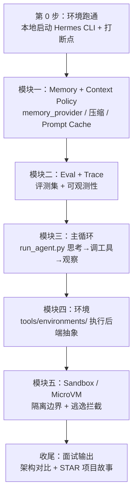

# Agent Runtime 岗位 · 学习大纲（最短路径 2~3 周）

---

## JD

1. 下一代多模态 Agent Runtime
2. Eval、Sandbox、Memory 等核心 Infra
3. 云端 Agent 服务与端云协同能力
4. 内部 Harness：Agentify the whole company
5. 熟悉 TypeScript 与 Node.js 生态
6. 啃过 CC / Codex / Pi / OpenCode / Hermes 源码
7. 熟悉 Context Policy、Sandbox、Trace Analysis、Eval 等
8. 对 Agentic Engineering 有深入 insight
9. 做过 Agent Runtime / Sandbox / MicroVM
10. 做过 Evaluation / Benchmark / Observability
11. 有多模态 Agent / 算法相关经验

---

## 一、开源项目按什么顺序读

1. **Hermes**（最优先，本地就有 `hermes-agent/`）——JD 点名，主战场。
2. **OpenCode**（开源、代码清晰）——对照 Hermes 看另一种 runtime 架构。
3. **Claude Code (CC)**——看 Context 管理、工具设计、权限模型（官方文档 + 用它时观察行为）。
4. **Codex / Pi**——公开资料了解范式即可，不用啃到底。

> 原则：**精读 1 个（Hermes），泛读 1 个（OpenCode），了解其余**。别平均用力。

---

## 二、Hermes 学习路线总览

一张图看懂 2~3 周怎么走：**先跑起来 → Memory → Eval → 主循环 → 环境 → Sandbox → 收尾产出面试材料**。



**时间与主线（最短 2~3 周）**

| 阶段 | 模块 | 时长 | 核心产出（demo / 笔记） | 命中 JD |
|------|------|------|------------------------|---------|
| 起步 | 第 0 步：跑通 CLI | 0.5~1 天 | 本地能打断点看一轮对话 | 啃源码 |
| 模块一 | Memory + Context Policy | 3~4 天 | Context 溢出策略笔记 + 缓存命中对比图 | Memory、Context Policy |
| 模块二 | Eval + Trace | 3~4 天 | 20~50 条评测集 + 一条完整 Trace 根因分析 | Eval、Benchmark、Observability |
| 模块三 | 主循环 | 3~4 天 | 主循环时序图 + 一轮 tool call 消息序列 | Agent Runtime、啃源码 |
| 模块四 | 环境 | 2~3 天 | 各执行后端对比笔记（local/docker/ssh/云） | Agent Runtime、端云协同 |
| 模块五 | Sandbox / MicroVM | 3~4 天 | Docker+seccomp 最小沙箱 + 逃逸拦截实验 | Sandbox、MicroVM |
| 收尾 | 面试输出 | 缓冲 | 架构对比笔记 + demo 串成 STAR 故事 | Agentic Engineering |

**学习原则**
- **先能跑再精读**：断点比读代码快十倍，第 0 步一定是把 CLI 跑起来。
- **按 JD Infra 优先级推进**：Memory → Eval → 主循环 → 环境 → Sandbox；主循环是 Runtime 地基，但 Memory/Eval 先建立 Context 与评测视角，再回看循环更清晰。
- **每模块留一个可展示物**：一句话能说清「读了哪段码 + 做了什么 demo + 拿到什么结论」，否则不算学完。
- **对齐 JD 不平均用力**：Sandbox 和 Eval 是 JD 高频词，优先保证这两个 demo 拿得出手。

---

## 模块一：Memory + Context Policy（3~4 天）

**学习目标**：截断 / 压缩 / 长期记忆检索；Prompt Cache 为什么不能中途改上下文。

**教材目录**：[`04.1-memory/`](./04.1-memory/)——notebook 里 **直接拷贝可执行源码副本**（边 Run 边讲实现）；`hermes_src/` 对照真文件行号。概念长文：[`02-memory.md`](./02-memory.md)。

**源码精读清单**
- `agent/memory_provider.py`：`MemoryProvider` ABC（`sync_turn` / `prefetch` / `shutdown`）。
- `agent/memory_manager.py`：多 provider 编排。
- 压缩模块（context compression）：唯一允许改上下文的场景。
- 根 `AGENTS.md`「Prompt Caching Must Not Break」小节。

**代码目录结构**（本步骤要读的文件）

```text
04.1-memory/
├── README.md
├── hermes_src/                 # 真源码剪枝（对照）
└── notebooks/                  # 每章大 code cell = 可执行源码副本 + 演示
    ├── 1_memory_layers.ipynb   # MemoryStore 双态
    ├── 2_memory_provider.ipynb
    ├── 3_memory_manager.ipynb
    ├── 4_context_compression.ipynb  # + DeepSeek
    ├── 5_prompt_caching.ipynb
    └── 6_end_to_end.ipynb           # + DeepSeek
```

**动手**
- 按 `04.1-memory/README.md` 打开 notebooks，先 Run「源码副本」cell，再跑演示 cell 讲解。
- 写一份「Context 溢出处理」策略笔记；画「缓存命中 vs 中途失效」对比图。

**面试会讲**
- Per-conversation prompt caching is sacred：任何中途 mutate 上下文 / 换 toolset / 重建 system prompt 都会击穿缓存、放大成本，只有压缩是例外。
- 记忆 = 短期(近轮) + 摘要 + 长期检索三层。

---

## 模块二：Eval + Trace（3~4 天）

**学习目标**：评测维度设计 + 可观测性；行为契约测试 vs 变更检测测试。

**代码目录结构**（本步骤要读/要跑的文件）

```text
hermes-agent/
├── scripts/
│   └── run_tests.sh    # CI 对齐的唯一测试入口（勿直接调 pytest）
├── tests/              # 评测 / 单测集
│   └── agent/          # 主循环 / 记忆 / 压缩相关测试范例（不变量断言参考）
├── hermes_logging.py   # 结构化日志：agent.log / errors.log / gateway.log
└── AGENTS.md           # 「Don't write change-detector tests」小节
```

（Trace 侧无独立源码目录，通过 `hermes logs` 命令 + 外接 LangFuse 观察。）

### 2.1 Eval / Benchmark
- 维度：完成率 / 步数 / 成本 / 工具选对率 / 忠实度。
- 源码：`scripts/run_tests.sh`、`tests/`；根 `AGENTS.md`「Don't write change-detector tests」。
- **动手**：给一个任务建 20~50 条评测集 + 自动跑分脚本；至少写 1 条「不变量断言」而非「快照断言」。

### 2.2 Observability / Trace
- 概念：trace_id / span；每个 Tool/LLM/检索记什么；Trace 查因果、Metrics 看 SLO、Log 查细节。
- 源码：`hermes_logging.py`、`hermes logs` 命令。
- **动手**：接入 LangFuse（或自建 span），录一条完整 Trace 做一次根因分析。

**面试会讲**
- 好测试断言「数据之间的关系（不变量）」，不冻结当前值（模型列表 / 配置版本号 / 枚举数量都会变，快照测试是反模式）。
- 一条 Trace 如何定位「工具选错 / 上下文溢出 / 预算耗尽」的根因。

---

## 模块三：Hermes Agent Runtime 主循环（3~4 天）

**学习目标**：一次请求怎么走完「思考 → 调工具 → 观察 → 再思考」，怎么控预算 / 防死循环。

**源码精读清单**
- `run_agent.py` → `AIAgent.run_conversation()`：核心 while 循环、`max_iterations`、`iteration_budget`、`_interrupt_requested`、一次 grace call。
- `model_tools.py` → `discover_builtin_tools()`、`handle_function_call()`：工具发现与分发。
- `toolsets.py` → `_HERMES_CORE_TOOLS`、`TOOLSETS`：工具集如何按平台组装。
- `tools/registry.py`：`registry.register()` 自动发现机制。

**代码目录结构**（本步骤要读/要跑的文件）

```text
hermes-agent/
├── run_agent.py        # AIAgent 主循环入口：run_conversation() 的 while 循环
├── model_tools.py      # 工具发现 discover_builtin_tools() + 分发 handle_function_call()
├── toolsets.py         # _HERMES_CORE_TOOLS / TOOLSETS：按平台组装工具集
├── cli.py              # HermesCLI 交互入口（本地跑通、打断点用这个）
├── hermes_state.py     # SessionDB 会话存储（观察一轮完整消息序列）
└── tools/
    ├── registry.py     # registry.register() 自动发现机制
    └── todo_tool.py    # agent 级工具拦截范例（被主循环提前接管）
```

**动手**
- 画一张主循环时序图（消息 role 交替：system/user/assistant/tool）。
- 在本地跑通 Hermes CLI，打断点观察一轮 tool call 的完整消息序列。

**面试会讲**
- Runtime = 主循环 + 工具调度 + 状态 + 预算/中断。
- 为什么工具 schema 每次都全量下发 → 「narrow waist」设计，加核心工具门槛高（Footprint Ladder）。

---

## 模块四：环境（2~3 天）

**学习目标**：Agent 的「执行环境」如何抽象；本地 / 容器 / SSH / 云后端的统一接口与取舍。

**源码精读清单**
- `tools/environments/`：`local` / `docker` / `ssh` / `modal` / `daytona` / `singularity` 各后端如何抽象「执行环境」。
- `base.py`：统一接口（先读，再对照各后端实现）。

**代码目录结构**（本步骤要读/要跑的文件）

```text
hermes-agent/
└── tools/environments/       # 执行环境后端抽象层
    ├── base.py               # 环境抽象基类 —— 先读这个，理解统一接口
    ├── local.py              # 本地进程执行（无隔离，对照基线）
    ├── docker.py             # Docker 容器隔离
    ├── ssh.py                # 远程 SSH 执行
    ├── modal.py              # Modal 云沙箱
    ├── managed_modal.py      # 托管 Modal 变体
    ├── daytona.py            # Daytona 云开发环境
    ├── singularity.py        # HPC / Singularity 容器
    └── file_sync.py          # 环境间文件同步
```

**动手**
- 画一张「执行环境后端对比表」：隔离强度 / 启动延迟 / 适用场景 / Hermes 接入方式。
- 本地分别跑通 `local` 与 `docker` 后端，对比同一条 terminal 命令的行为差异。

**面试会讲**
- 环境抽象 = Runtime 与具体执行后端解耦；端云协同靠同一套接口切 local / 云沙箱。
- 选后端看场景：开发调试用 local，不可信代码用 docker/云，远程机器用 ssh。

---

## 模块五：Sandbox / MicroVM（3~4 天）

**学习目标**：进程隔离 → 容器 → 轻量 VM 的取舍与安全边界。

**知识点阶梯**
- 进程级：seccomp / namespace / cgroup。
- 容器级：Docker 隔离与逃逸面。
- 轻量 VM：**Firecracker** / gVisor 的定位与 trade-off（启动速度 vs 隔离强度）。

**源码精读清单**
- 在模块四环境抽象之上，精读 `docker.py` 的隔离配置与挂载策略。
- 对照：无隔离的 `local.py` vs 容器隔离的 `docker.py`，哪些能力属于「环境」、哪些属于「沙箱加固」。

**动手（核心 demo）**
- 用 Docker + seccomp（或 gVisor）跑一个「执行任意代码」的最小沙箱：限制系统调用、只读挂载、网络关闭、资源上限。
- 记录一次「尝试逃逸被拦截」的实验结果。

**面试会讲**
- 为什么 Agent 执行代码必须隔离；不同隔离级别的成本/安全权衡；MicroVM 适合什么场景。
- 环境抽象解决「跑在哪」；Sandbox 解决「跑得安不安全」。

---

## 收尾：面试输出（第 3 周缓冲）

- **架构对比笔记**：Hermes vs OpenCode/CC 在 Context / 工具 / Sandbox 上的方案差异。
- **项目故事（STAR）**：把各模块 demo/PR 串成一条线，对应 JD 关键词逐一能讲。
- **一句话定位**：每模块能用一句话说清「读了哪段码 + 做了什么 demo + 拿到什么结论」。

---

## 硬核对齐 JD

| 模块 | 命中 JD 关键词 |
|------|----------------|
| 一 Memory | Memory、Context Policy、核心 Infra |
| 二 Eval+Trace | Eval、Benchmark、Observability、Trace Analysis |
| 三 主循环 | Agent Runtime、Agentic Engineering、啃源码 |
| 四 环境 | Agent Runtime、端云协同、核心 Infra |
| 五 Sandbox | Sandbox、MicroVM |
