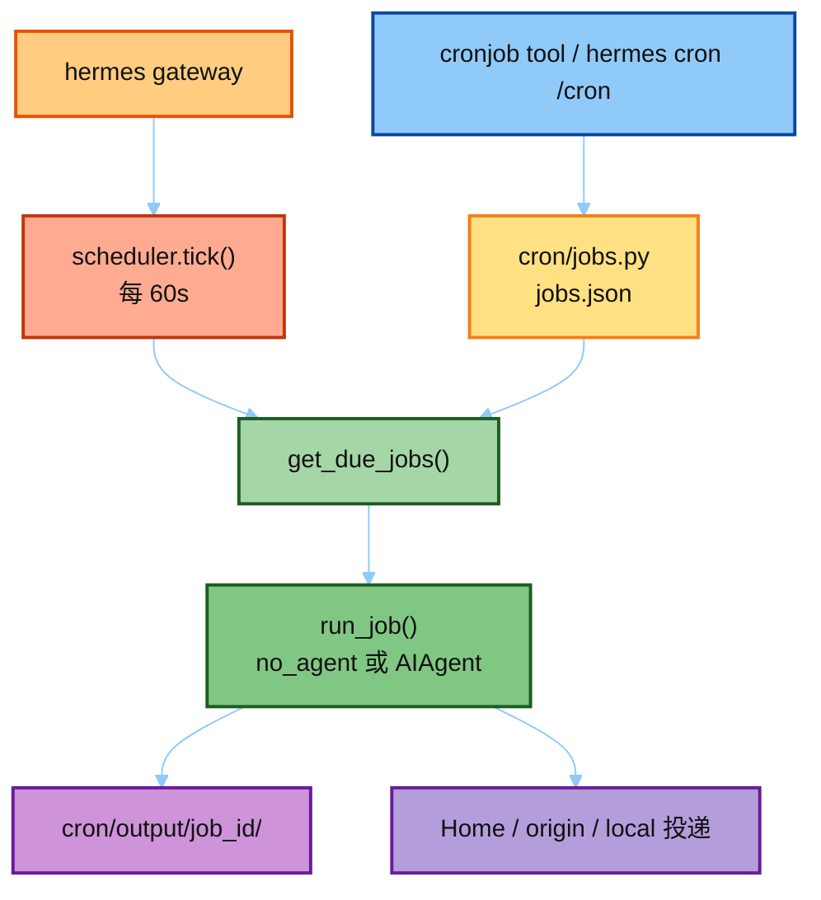

# Hermes Cron（定时任务）

目标：精读 Hermes **真源码**里定时任务怎么存、怎么 tick、怎么跑——`cron/` + `tools/cronjob_tools.py`。

对照大纲：[`../03-hermes Agent  学习大纲.md`](../03-hermes%20Agent%20%20学习大纲.md)（主循环/环境之后的 **异步调度** 能力；亦见 [`../01-arch.md`](../01-arch.md) §7）。  
Gateway 进程如何挂上 cron / Delivery：[`../08-gateway/`](../08-gateway/) notes/4 + catalog/07。

学法（对齐 [`../05-env/`](../05-env/)）：

1. 读 [`notes/`](./notes/README.md)（01→04）建立心智模型  
2. 打开 [`hermes_src/`](./hermes_src/README.md) **真文件**对照（不是玩具封装）  
3. 完整仓库对照：上游 `hermes-agent/cron/`  
4. 动手：跑 [`demo/run_cron_jobs.py`](./demo/run_cron_jobs.py)（**真** `cron.jobs`，临时 `HERMES_HOME`）；或真 gateway 上 `hermes cron` / 打断点  

> `hermes_src/` 是只读剪枝：**缺大量依赖，不要指望直接 import 跑通**。  
> 可跑 demo 走完整 `hermes-agent` 仓库（见 `demo/README.md`）。  
> 本模块**不以假 crontab / 自写调度器代替真源码**。

---

## 在 Runtime 里的位置



一句话：**主循环决定当前对话怎么想；cron 决定无人时何时再开一轮 Agent（或纯脚本）。**

---

## 目录

```text
06-cron/
├── README.md                          # 本文件
├── notes/                             # ★ 讲稿（真源码对照）
│   ├── README.md
│   ├── 01_job_store.md
│   ├── 02_tick_and_run.md
│   ├── 03_cronjob_tool.md
│   └── 04_hardening_and_delivery.md
├── demo/                              # ★ 可跑：真 jobs.py（临时 HERMES_HOME）
│   ├── README.md
│   ├── run_cron_jobs.py
│   └── exports/cron_jobs/
└── hermes_src/                        # ★ 真源码剪枝（只读对照）
    ├── README.md
    ├── cron/
    │   ├── jobs.py
    │   ├── scheduler.py               # 全文件
    │   ├── scheduler.TICK_RUN.py      # 教学摘录
    │   ├── scheduler_provider.py
    │   └── lifecycle_guard.py
    └── tools/
        └── cronjob_tools.py
```

关联：

- 架构鸟瞰：[`../01-arch.md`](../01-arch.md) §7 Cron Jobs  
- 上一模块（环境）：[`../05-env/`](../05-env/) —— 「跑在哪」  
- 主循环：[`../02-run-agent/`](../02-run-agent/) —— cron 内部仍是 `AIAgent` + tool loop  
- Prompt 宏：`04-prompt` 里 `cron` / CLI 对投递的说明  

---

## 建议阅读顺序

| 顺序 | 材料 | 打开的真文件 |
|------|------|----------------|
| 1 | `notes/01` | `hermes_src/cron/jobs.py`（`parse_schedule` / `create_job`） |
| 2 | `notes/02` | `scheduler.TICK_RUN.py` + 全文件 `tick` / `run_job` |
| 3 | `notes/03` | `tools/cronjob_tools.py` |
| 4 | `notes/04` | disabled toolsets、`skip_memory`、delivery |
| 5 | 真仓打断点 | `tick`、`run_job`、`get_due_jobs` |

---

## 动手（对齐模块产出）

1. 跑 `demo/run_cron_jobs.py`，确认 temp `HERMES_HOME/cron/jobs.json` 被写入。  
2. 画一张「create → tick → run_job → deliver」时序（notes 已给骨架）。  
3. 面试三句：JSON store；gateway 分钟 tick；无人会话 → skip_memory + 禁交互工具 + Home 投递。
