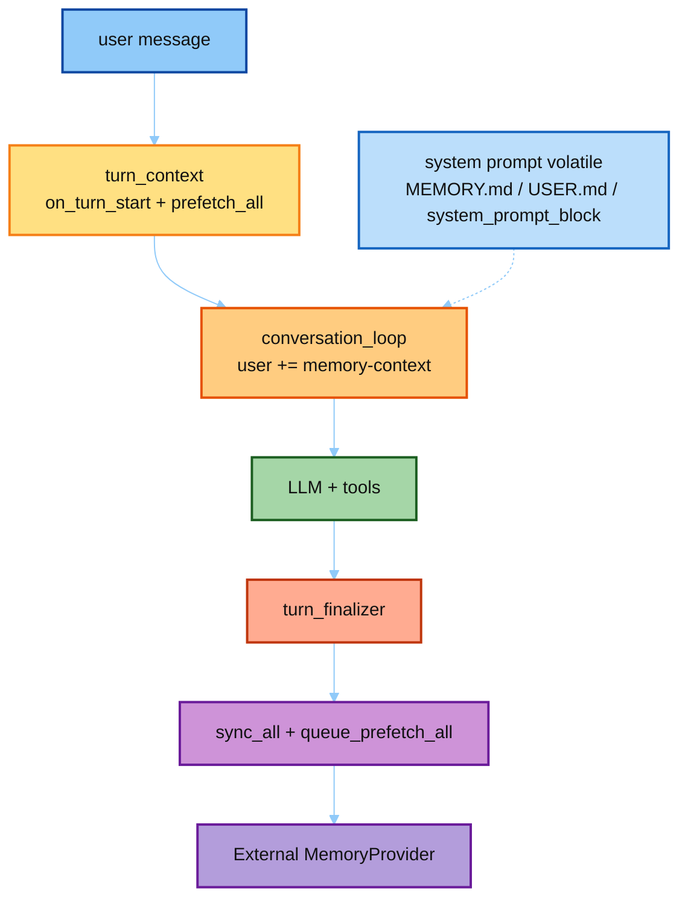

# Hermes Memory Provider（存 / 取 / Prompt）

目标：精读 Hermes **真源码**里外部记忆与内置记忆如何接入 Runtime——  
**一个 turn 结束怎么存**、**对话取上下文怎么 fetch**、**有哪些相关 prompt**。

对照大纲：[`../03-hermes Agent  学习大纲.md`](../03-hermes%20Agent%20%20学习大纲.md) **模块一**；广谱 notebook 见 [`../01-memory/`](../01-memory/)。  
本目录结构对齐 [`../05-env/`](../05-env/)：`notes/` + `hermes_src/` + `demo/`，聚焦 **Provider 接线**。

学法：

1. 读 [`notes/`](./notes/README.md)（01→04）  
2. 打开 [`hermes_src/`](./hermes_src/README.md) 真文件 / excerpts  
3. 跑 [`demo/run_mem_provider.py`](./demo/run_mem_provider.py)  
4. Prompt 全文可到 [`../04-prompt/`](../04-prompt/) 对照  

> `hermes_src/` 只读剪枝，勿直接 import 跑。Demo 走完整 `hermes-agent`。

---

## 在 Runtime 里的位置



一句话：**取** = SP 静态 snapshot + user 上动态 prefetch；**存** = memory 工具 / `sync_turn` / 后台 MEMORY_REVIEW。

---

## 目录

```text
07-mem-provider/
├── README.md
├── notes/
│   ├── 01_provider_abc.md          # ABC + Manager
│   ├── 02_prefetch_and_inject.md   # ★ fetch
│   ├── 03_sync_turn_store.md       # ★ store
│   └── 04_memory_prompts.md        # ★ prompts
├── demo/
│   ├── run_mem_provider.py
│   └── exports/mem_provider/
└── hermes_src/
    ├── agent/memory_provider.py
    ├── agent/memory_manager.py
    ├── tools/memory_tool.py
    └── excerpts/                   # turn / inject / sync / prompts
```

关联：

- 广谱 Memory：[`../01-memory/`](../01-memory/)  
- Prompt 宏：[`../04-prompt/catalog/01_prompt_builder_macros.md`](../04-prompt/catalog/01_prompt_builder_macros.md)  
- 后台 review：[`../04-prompt/catalog/07_background_review.md`](../04-prompt/catalog/07_background_review.md)  
- Cron 为何 `skip_memory`：[`../06-cron/`](../06-cron/)  

---

## 建议阅读顺序

| 顺序 | 材料 | 打开的真文件 |
|------|------|----------------|
| 1 | `notes/02` | `turn_context` prefetch + `conversation_loop` inject |
| 2 | `notes/03` | `_sync_external_memory_for_turn` + `sync_all` |
| 3 | `notes/04` | `MEMORY_GUIDANCE` / fence / `_MEMORY_REVIEW_PROMPT` |
| 4 | `notes/01` | ABC 全生命周期 |
| 5 | demo | FakeProvider 走一遍 |

---

## 动手

1. 跑 demo，对照报告里的 fenced user 与 `synced`。  
2. 真 Hermes：对 `prefetch_all`、`build_memory_context_block`、`_sync_external_memory_for_turn` 打断点。  
3. 面试三句：prefetch→user 保 cache；sync 异步且跳过 interrupt；写受 `MEMORY_GUIDANCE` 约束。
