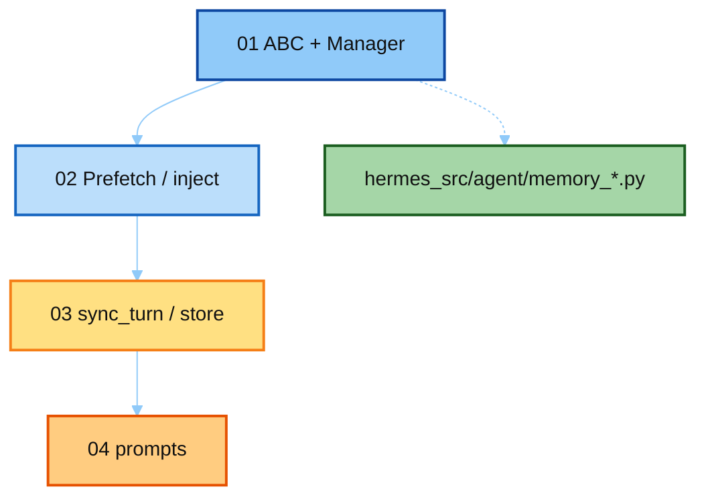

# 07-mem-provider · notes 讲解顺序

本目录讲 **Hermes 真源码** Memory Provider：**turn 结束怎么存**、**对话取上下文怎么 fetch**、**相关 prompt**。按编号读。

| 顺序 | 文件 | 真源码 | 读完应能回答 |
|------|------|--------|--------------|
| **01** | [`01_provider_abc.md`](./01_provider_abc.md) | `memory_provider.py` / `memory_manager.py` | 内置 vs 外部？为何只允许一个外部？ |
| **02** | [`02_prefetch_and_inject.md`](./02_prefetch_and_inject.md) | turn_context + conversation_loop | fetch 结果塞进 SP 还是 user？ |
| **03** | [`03_sync_turn_store.md`](./03_sync_turn_store.md) | turn_finalizer + sync_all | turn 结束写什么？interrupted 呢？ |
| **04** | [`04_memory_prompts.md`](./04_memory_prompts.md) | MEMORY_GUIDANCE / fence / review | 有哪些相关 prompt？各自何时出现？ |

最短路径：`02` → `03` → `04`（直接回答「存 / 取 / prompt」）；`01` 补接口全景。

上级：[`../README.md`](../README.md)
