# Pi 架构全解析

Pi 是一套极简、模块化的智能体系统。本文按源码结构拆解其两层设计，说明每次对话实际执行的步骤，以及如何自行扩展或复刻。

系统分为两层：

1. **Agent Core（智能体核心）**：幕后运行的智能体循环（agentic loop）。可通过 **RPC** 或 **SDK** 以编程方式调用。
2. **Pi Interactive**：独立包。在 Core 之上提供 CLI / TUI，以及技能、斜杠命令等编码智能体能力。

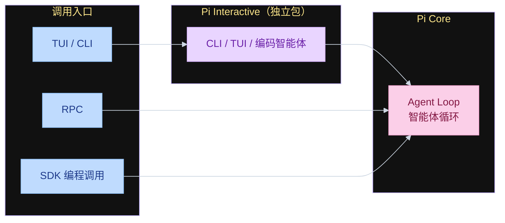

---

## 目录

- [Pi 架构全解析](#pi-架构全解析)
- [一、Pi Core：智能体循环（Agent Loop）](#一pi-core智能体循环agent-loop)
  - [1. 初始化上下文（Initialize Context）](#1-初始化上下文initialize-context)
  - [2. 变换上下文（Transformation）](#2-变换上下文transformation)
  - [3. 调用大语言模型（LLM Call）](#3-调用大语言模型llm-call)
- [二、Session 与 Memory（会话与记忆）](#二session-与-memory会话与记忆)
  - [存储位置](#存储位置)
  - [为何使用 JSONL 而非 JSON](#为何使用-jsonl-而非-json)
  - [Session 是树，不是列表](#session-是树不是列表)
  - [`/tree` 导航与分叉](#tree-导航与分叉)
  - [磁盘路径与消息字段](#磁盘路径与消息字段)
- [三、Tools（工具）](#三tools工具)
- [四、Extensions（扩展）](#四extensions扩展)
- [五、Skills 与 System Prompt（技能与系统提示）](#五skills-与-system-prompt技能与系统提示)
- [六、Pi Core 与 Interactive / 其他 UI 的关系](#六pi-core-与-interactive--其他-ui-的关系)
- [七、CLI 入口（CLI Entry Point）](#七cli-入口cli-entry-point)
- [八、Terminal User Interface（终端用户界面）](#八terminal-user-interface终端用户界面)
- [九、Compaction（上下文压缩）](#九compaction上下文压缩)
  - [触发时机与 token 计量](#触发时机与-token-计量)
  - [摘要 prompt 结构](#摘要-prompt-结构)
- [十、Skills 与 Custom Prompts 的处理差异](#十skills-与-custom-prompts-的处理差异)
  - [Skills](#skills)
  - [Custom prompts](#custom-prompts)
  - [Skills 工作流](#skills-工作流)
- [小结](#小结)

---

## 一、Pi Core：智能体循环（Agent Loop）

Pi 的设计核心是 **agent core**，即 **agent loop（智能体循环）**：每次与 Pi 开始对话时按固定步骤执行。

打开 Pi 并发送第一条消息后，流程如下。

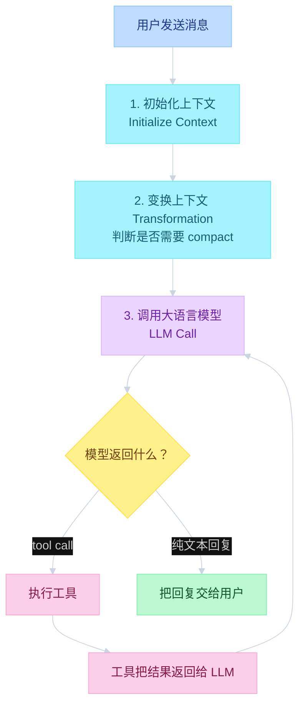

工具调用可循环多次：复杂任务可达上百次；仅搜索网页时通常几次。模型决定不再调用工具时，直接给出文本回复。以上即每次向 Pi 发送消息时的全部过程。

步骤看起来简单，实现并不简单。Pi 的循环是 **从零手写**，没有依赖现成 agent 库。对比：

- OpenAI Agents SDK
- Vercel AI SDK
- 其他预装 agentic loop 的库（import 即可使用）

Pi 这一套完全自研。

---

### 1. 初始化上下文（Initialize Context）

发送第一条消息后，第一步是 **初始化上下文**：按固定顺序拼接下列内容。

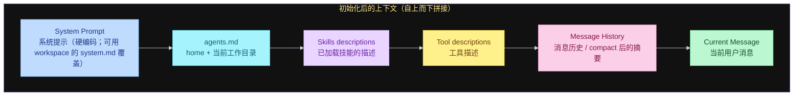

拼装顺序：

**（1）系统提示（system prompt）**

硬编码在 Pi 中。可在 workspace 创建 `system.md` 覆盖。默认加载预置系统提示：极简，仅数行指令。

**（2）追加全部 `agents.md`**

来源包括 **home** 与 **当前工作目录**。文件名是 `agents.md`，不是 `.agents.md`。文件过多会膨胀系统提示，应控制数量。

**（3）追加技能描述（skills descriptions）**

所有已加载技能的 **description** 进入上下文。

**（4）追加工具描述**

全部工具描述进入初始化上下文。

**（5）追加消息历史 + 当前消息**

- **新对话**：无消息历史。
- **进行中的对话**：包含消息历史。
- **已被 compact 的对话**：消息历史可被 **上一轮历史的摘要（summary）** 替换。

---

### 2. 变换上下文（Transformation）

第二步每次都会执行：**transformation（变换）**。

系统检查刚拼好的上下文是否需要 **compact**。若需要，则执行 compact，并用结果 **替换消息历史**。

Compact 的含义：把历史中的全部消息交给 LLM **做摘要**。

---

### 3. 调用大语言模型（LLM Call）

调用当前配置的提供商上的模型，例如 OpenAI GPT-5、Anthropic、Kimi、MiniMax。

模型可能返回 **tool call**（更新文件、读文件、搜索互联网等）。工具把结果返回给 LLM；LLM 可再次发起 tool call，循环直到不再需要工具，再给出文本回复。

- 复杂任务：可达 **上百次** tool call。
- 仅搜索网页：通常几次。

---

## 二、Session 与 Memory（会话与记忆）

Session 的导出、导航、回退到某一步、fork（分叉）设计简单、一致。

### 存储位置

Session 位于 **home 目录** 下，路径为：

`home` → 相关目录 → `agent` → `sessions`

`sessions` 下的子目录 **一一映射到工作目录**。例如：

- 在 `dashboard` 应用中工作 → `dashboard/` 目录
- 在 `weather app` 应用中工作 → `weather-app/` 目录

每个工作目录下存放带 ID 的 session 文件，格式为 **JSONL**。

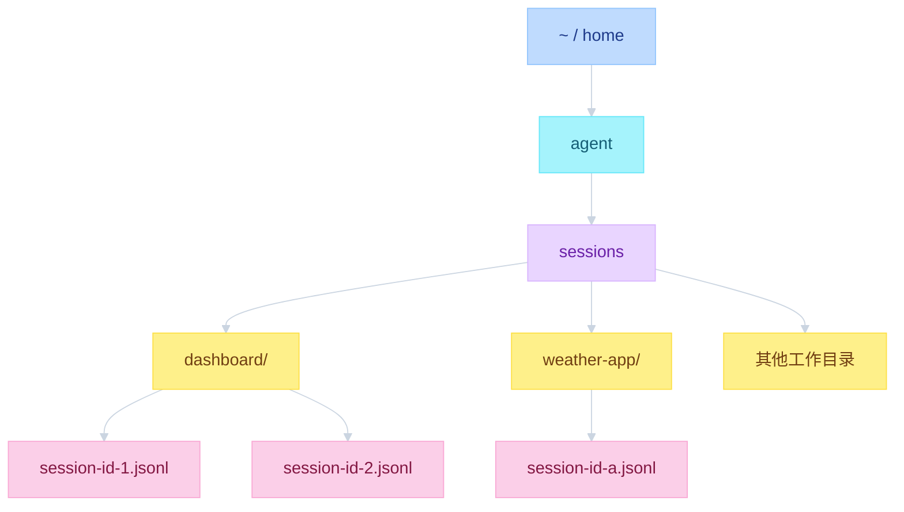

### 为何使用 JSONL 而非 JSON

JSONL 不是单个 JSON 对象，而是 **每行一个 JSON 对象** 的文本文件。

新消息只需 **在文件末尾 append 一行**。每行对象包含 `role`、`message` 等字段。

Session 按 **启动时的工作目录** 归类；每条消息是独立 JSON 对象。若使用单个 JSON 数组，更新时需要改写整份文件中的某一段。JSONL 的追加成本更低。

### Session 是树，不是列表

Session **不是线性 list**，而是 **session tree（会话树）**。

在 Pi 中导航到更早的命令或 prompt，使用 **`/tree`**。每条消息除 `role`、`message` 外还有：

- `parent`：父消息 ID
- `id`：本条消息 ID

`parent` 表示该消息可能从更早的消息 **分叉（bifurcate）**。例如：一条消息的 `parent` 为 `111`，另一条的 `id` 为 `111`，则后者在前者之前。

从同一条消息再分出另一条，即 **fork 对话**。两条消息可以共享 `parent: 111`。树结构由单文件中的 `id` / `parent` 关系构成：同一父消息可引出两段独立对话。

该设计正在被更多 AI agent 采用，替代「一条接一条」的线性列表。

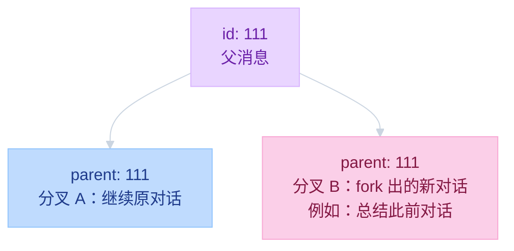

JSONL 中 **所有分叉消息仍在同一文件、同一目录**。树是逻辑结构，不是物理拆文件。

### `/tree` 导航与分叉

执行 **`/tree`** 后，沿 JSONL **纵向** 浏览消息。消息类型包括 **tool call**、user message、assistant message 等。

若回到某条消息并要求 **总结对话前半部分**：系统在 JSONL 中 **新建一条消息**，将其挂到分叉点之前那条消息的 **parent / child** 关系上。其余消息仍在同一目录、同一 JSONL 中。

再次打开 `/tree` 可见分叉：一侧是 summary，一侧是原对话，可从任一侧继续。

### 磁盘路径与消息字段

路径形态：`Pi` → `Agent` → `Sessions`。其下按曾运行 Pi 的工作目录存放 session。目录名是路径的标准化形式，不是原始显示名。例如：

`Users / Alejandro / Agent Skills / Video Tool`

某一工作目录下可有多个 session 文件。每个文件是 JSONL：每行一对花括号 `{ ... }`，记录一条事件。

用编辑器打开可见：

- **每一行 = 一条消息**
- 字段包括：消息类型（可为 message）、**id**、**parent id**（建树）、**timestamp**、消息正文

---

## 三、Tools（工具）

Pi 默认工具集同样极简，开箱仅 **四个**：

1. **read**
2. **bash**
3. **edit**
4. **write**

可自行增加工具：让 Pi 创建新工具，或通过安装包注册。默认只有上述四个。常见加装项是 **web search**。

另有两个额外工具：**grep** 与 **find**。二者能力可用 bash 复现，**默认禁用**，仅在 **只读模式（read-only mode）** 下启用。

只读场景通常不授予 bash。启动示例：

```text
pi --tools read,grep,find
```

参数为 **`--tools`**，后接工具列表。结果是只读 Pi（例如仅 read、grep、find）。适用于 **编程调用**（如 **RPC**）与自动化工作流：不需要写文件时，不应暴露 edit / write / bash。

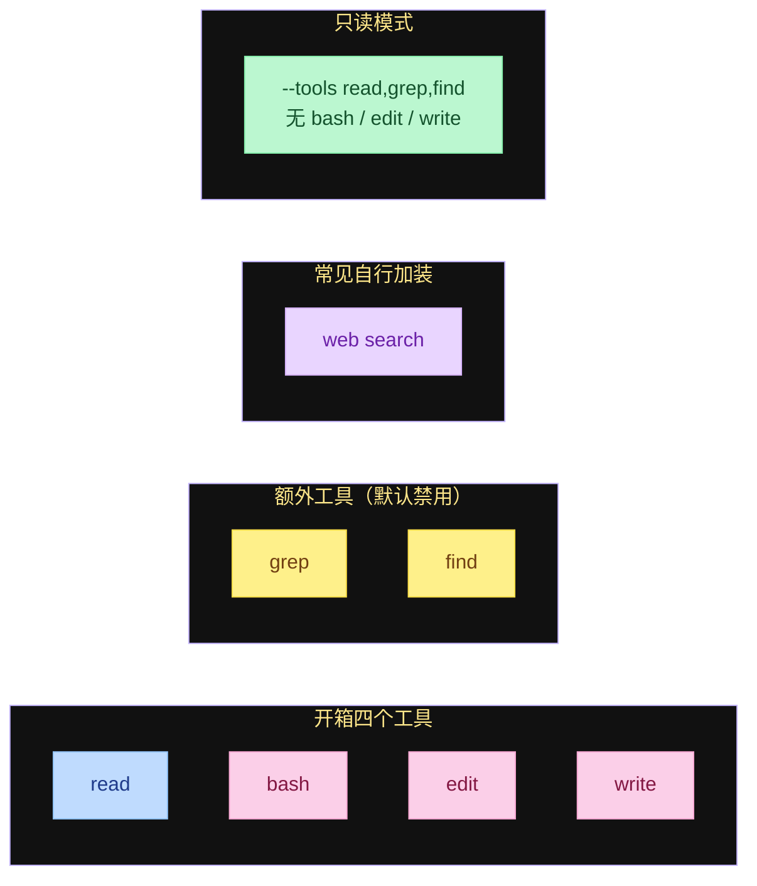

---

## 四、Extensions（扩展）

扩展是可安装的包，用于 **修改 Pi 的行为**。默认极简：四个工具，**不内置 MCP**，**不内置 web search**。安装扩展后即可获得这些能力。

扩展能力包括：

- **Register new tools**：注册新工具
- **Subscribe to events**：订阅事件
- **Register commands**：注册命令
- **Add keyboard shortcuts**：添加键盘快捷键
- **Add CLI flags**：添加 CLI 参数
- **Update the system prompt**：更新系统提示
- **Render custom messages**：渲染自定义消息

对话工作流的 **每个环节都会触发事件**，例如 tool call、agent response、user message。扩展可订阅这些事件，在循环的 **特定时刻** 执行动作。

扩展用 **TypeScript** 编写。Pi 模块化：接入扩展即可改变行为。官方网站的 **packages** 列出可用扩展。

扩展会在本机 **加载并执行代码**。不要安装不可信的第三方来源；使用前应用 Pi 阅读该包源码并确认安全。

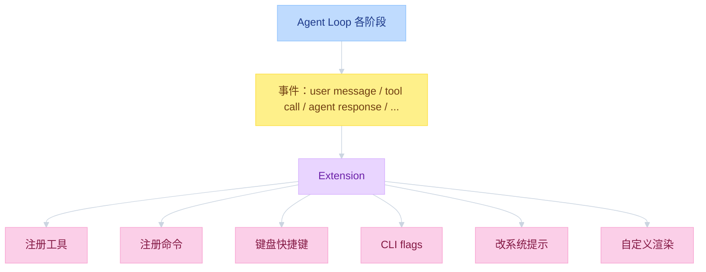

---

## 五、Skills 与 System Prompt（技能与系统提示）

默认系统提示约 **20 行**，结构如下：

- 角色说明：helpful assistant，身份为 Pi
- **appended sections（追加段）**
- 自定义追加：在 **`.pi` 目录** 创建 **`append-system.md`**，追加到 “you are Pi” 段 **之后**
- Skills 列表：使用 **markup** 包裹每个技能的 name、description、用途等

技能使用 markup 的原因：后续 **TUI 会解析** 这些标签。

其后包含 **当前日期** 与 **当前工作目录**。

覆盖系统提示的两种方式：

1. 在 `.pi` 中创建 **`system.md`**
2. 启动时使用 **`--system-prompt`** 传入完整提示

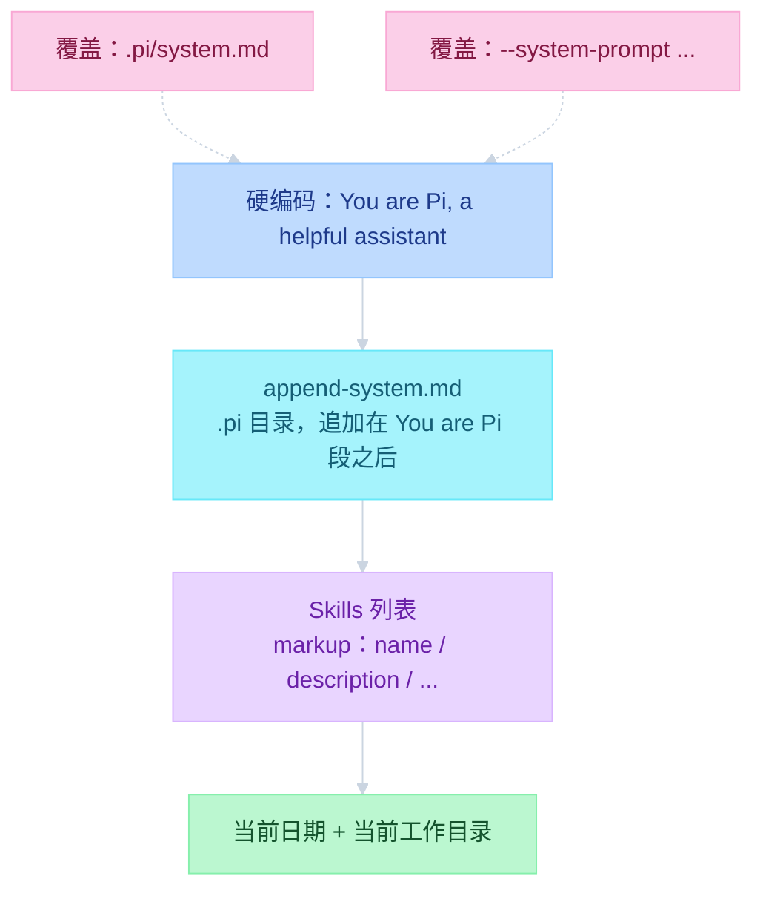

以上为 Pi Core 的默认系统提示组装方式。掌握这些即可理解并复刻 Core 层。

---

## 六、Pi Core 与 Interactive / 其他 UI 的关系

Pi Interactive 是 **独立包**，不在 pi-core 中。分工：

- **Pi Core**：智能体本身（循环、会话、工具、提示）
- **Pi Interactive**：编码智能体（CLI 入口、TUI、Skills / Slash 处理）

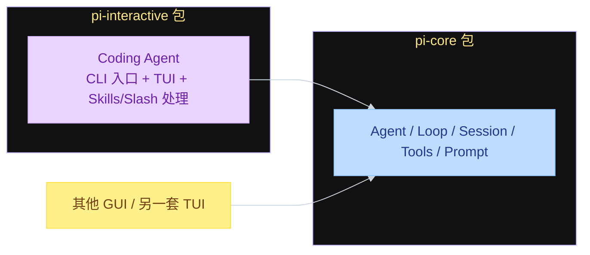

开箱 TUI 为 Pi 定制实现。可以在 Core 之上接入自定义 GUI 或另一套 TUI。

---

## 七、CLI 入口（CLI Entry Point）

新建 session、进入 CLI 时，逻辑分布在两个文件：

1. **`client.ts`**
2. **`main.ts`**

**`client.ts`**：接收 `pi` 命令，设置 process title 等，然后 **调用 `main`**。

**`main.ts`**：

- 解析参数（arguments）
- 解析配置（configuration）：自定义工作目录等
- **加载扩展**（extensions）
- **创建 agent session**：至此才初始化 Pi Core
- 按所选模式运行：
  - **interactive**
  - **RPC**
  - **print to STDIO**：命令行 `pi` 后直接跟 prompt

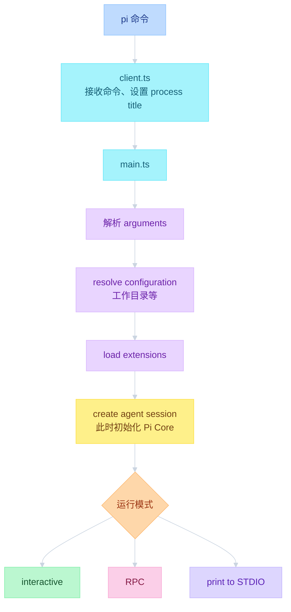

---

## 八、Terminal User Interface（终端用户界面）

TUI 模块化布局：

- 下方：**input（输入）**
- 上方：**messages（消息）**
- 底部状态栏：会话与运行信息

特点：极简、**不闪烁（does not flicker）**。

实现要点：

1. **完全自研**，不使用 Textual 等库。
2. **Component-based（基于组件）**：每个组件负责自身 **rendering（渲染）**、**inputs（输入）**，并可 **动态更新**。
3. 可订阅 agent core 发出的事件。

---

## 九、Compaction（上下文压缩）

各 agent 的 compaction 策略不同。Pi 的策略是：不估算，只使用 LLM 响应中的用量信息。

部分实现用 **上下文总字符数 ÷ 4** 估算 token，尤其在尚未收到 LLM 响应时。Pi **不采用该估算**。它依赖响应中的 usage，并假定首条用户消息通常不会超长。

### 触发时机与 token 计量

Pi 调用 **`check compaction`**，时机有两处：

1. **When an agent ends**：一轮 turn 结束，给出回复（含 tool call 结果之后）
2. **Before the prompt**：真正发送消息之前

目的：避免回复时或启动时撑满 context window。

智能体响应后计量 token。部分提供商在响应中直接返回 **context tokens**，有则直接使用；无则按下式加总：

- **`usage.input`**：输入 token
- **`usage.output`**：生成 token
- **`cache.read`**
- **`cache.write`**

在每轮结束或用户发 prompt 之前，用上述结果判断是否 compact。

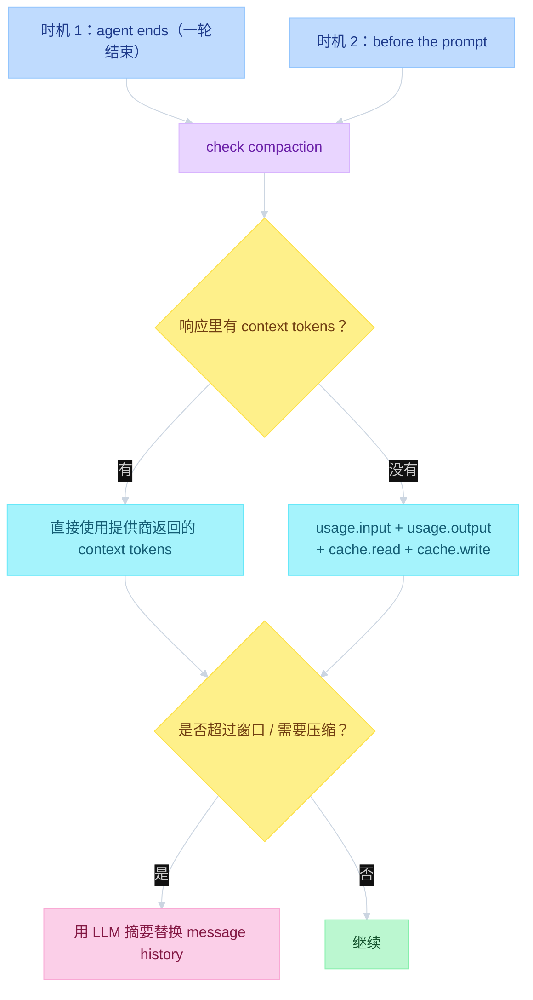

### 摘要 prompt 结构

代码路径：

`packages/agent/source/harness/compaction/compactions.ts`

其中的 **summarization system prompt** 大意：

> You are a context summarization assistant. Your task is to read a conversation between a user and an AI assistant, ...
>
> The messages above are a conversation to summarize. Create a structured context checkpoint summary that another LLM will use to continue the work.

要求的结构：

- **Goal（目标）**
- **Constraints and preferences（约束与偏好）**
- **Progress**：what is done / what is in progress / what is blocked（已完成 / 进行中 / 被阻塞）
- **Key decisions（关键决策）**
- **Next steps（下一步）**
- **Critical context（关键上下文）**

各段保持简洁；**保留精确的文件路径、函数名和错误信息**。

更新已有摘要时（**update existing summary**），使用另一套略有差异的 prompt。

在仓库中 resume session 并执行 compact 后，用 **Ctrl-O** 展开，可见与上述结构一致的输出：goal、constraints and preferences、progress（done / in progress / blocked）、key decisions、next steps、critical context、original request、early progress 等。

---

## 十、Skills 与 Custom Prompts 的处理差异

Skills 与 **custom prompts（自定义斜杠命令）** 是两套机制，处理位置相近但语义不同。

### Skills

Skills 是 **Markdown（`.md`）文件**，正文为详细指令。文件头（header）含 **name** 与 **description**；description 进入系统提示。

### Custom prompts

Custom prompts 即 **自定义 slash 命令**。输入 `/命令名` 后，在 **Pi Interactive 层**替换为已存储的完整 prompt。**该原始斜杠命令不会到达 Pi Core。**

CLI 读取 slash 命令，展开为 custom prompts 中保存的文本，再交给 Core。

### Skills 工作流

系统提示中有一节 **可用 skills 列表**。LLM 因此 **知道存在 skills**。

LLM **不知道** custom slash commands 的存在：它们到达 Core 时已是 **渲染完成的 prompt**。Skills **不会**在到达 Core 前被展开为全文。

用户发送：

```text
/skill: 自定义工作流名
```

该命令由 **interactive 层拦截**。**Agent core 看不到** `/skill:` 这一原始形式。其他 CLI / TUI 可用不同前缀（例如 Codex 的 `$`，或 Claude Code 的 slash）。

Interactive 层将其替换为带 **markup 标签** 的 skill 块，包含：

- **name**
- **description**
- **location（路径，关键字段）**

location 示例：

- `pi/agent/skills`
- `.agents/skills`

路径可在 **当前工作目录** 或 **home 目录**。上述字段进入 **发给模型的 message**，LLM 可见。

系统提示中有一条指令：**若调用了 skill，使用 read 工具读取该文件。** 模型随后调用 **read**，读取 location，取得全文后再继续。

Pi **不会**在 interactive 层把 skill 全文粘贴进消息。部分其他 agent 会立刻内联全文。Pi Interactive 只发送 **name、description、location**，由模型通过 **一次 tool call** 自行打开。该逻辑在 Core 之外，可替换实现。

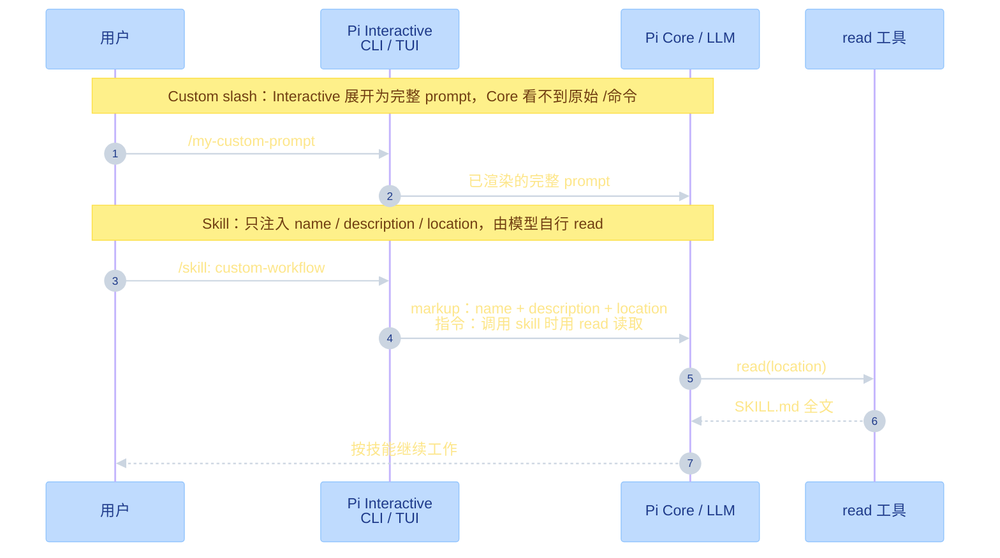

---

## 小结

| 层级 | 职责 |
|------|------|
| **Pi Core** | 上下文初始化、变换 / compact、LLM 循环、工具执行、JSONL 会话树 |
| **Pi Interactive** | CLI 入口、自研 TUI、扩展加载、slash / skill 拦截与展开 |

Core 可被 TUI、RPC、SDK 及其他 UI 复用。Interactive 负责人机界面与「命令到消息」的翻译，不把 skill 全文提前塞进 Core。
