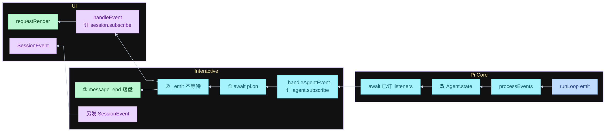
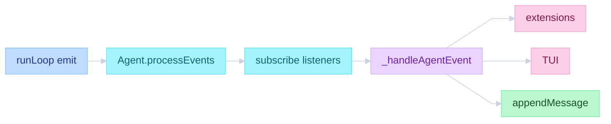
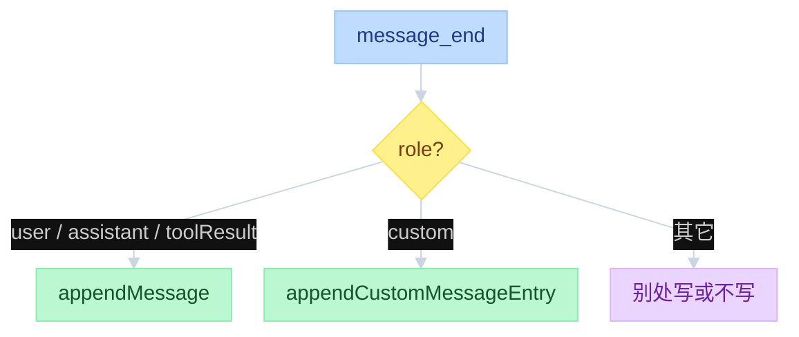

# Pi Events and Persistence


---

## 目录

- [一、总图：三层何时发送 / 何时处理](#一总图三层何时发送--何时处理)
- [二、事件](#二事件)
- [三、processEvents](#三processevents)
- [四、落盘](#四落盘)
- [五、agent_end 三处](#五agent_end-三处)
- [对照](#对照)

---

## 一、总图：三层何时发送 / 何时处理

事件总线没有名叫 `register` 的 API。订听众是 `subscribe` / `pi.on`，发生在**构造时**，不在 `emit` 路径上。`registerTool` / `registerCommand` 是能力，见 `07-Capability.md`。

```text
function flow（三层）
  订（构造时，写入名单）
    AgentSession 构造:
      agent.subscribe(_handleAgentEvent)     # 订到 Core
    扩展加载:
      pi.on("message_end", handler)          # 订到 Interactive
    InteractiveMode / RPC / print:
      session.subscribe(handleEvent)         # 订到 Interactive

  Pi Core  发送
    runLoop await emit(event)
      → Agent.processEvents
          先改 state
          再 await 已 subscribe 的 listeners

  Pi Interactive  处理
    AgentSession._handleAgentEvent
      ① await pi.on 订的扩展
      ② _emit → session.subscribe 名单  # 不 await
      ③ message_end → append JSONL

  UI  处理
    handleEvent（session.subscribe 订进去的）
      改 Component → TUI.requestRender
```

`await emit` 等的是 `processEvents` + `_handleAgentEvent`（含扩展和落盘）。TUI 的 `handleEvent` 被 `_emit` 踢出去，不挡循环。

图从左到右是 UI | Interactive | Core。事件从右往左：Core 发，Interactive 处理，UI 画。



订写在节点第二行：构造时挂上，不进 `emit` 箭头。

| 谁订 | 订到哪 | 调用 |
|------|--------|------|
| AgentSession | Core `Agent.listeners` | 构造时 `agent.subscribe(_handleAgentEvent)` |
| 扩展 | Interactive `handlers` | 加载时 `pi.on("agent_start", ...)` |
| TUI / RPC / print | Interactive `_eventListeners` | `session.subscribe(handleEvent)` |

何时发送：只在 Core。`continue()` 没有初始 prompt 那对 `message_start/end`。`turn_start` 之后可以再进下一 turn，不回到 `agent_start`。

```mermaid
%%{init: {"theme": "dark", "flowchart": {"curve": "linear", "rankSpacing": 28, "nodeSpacing": 24, "padding": 8}, "themeVariables": {"fontSize": "15px", "background": "#000000", "lineColor": "#CBD5E1", "edgeLabelBackground": "#111111"}}}%%
flowchart LR
    AS["agent_start"] --> TS["turn_start"]
    TS --> PR["prompt/steer start+end"]
    PR --> AM["assistant start → update* → end"]
    AM --> TX["tool start → update* → end"]
    TX --> TR["toolResult start+end"]
    TR --> TE["turn_end"]
    TE --> AE["agent_end"]

    classDef start fill:#BFDBFE,stroke:#93C5FD,color:#1E3A8A
    classDef step fill:#A5F3FC,stroke:#67E8F9,color:#155E75
    classDef core fill:#E9D5FF,stroke:#D8B4FE,color:#6B21A8
    classDef ok fill:#BBF7D0,stroke:#86EFAC,color:#14532D

    class AS start
    class TS,PR,AM,TX,TR step
    class TE core
    class AE ok
```



`agent_settled` 在 `_handlePostAgentRun` 不再 `continue()` 之后，是 Interactive 的结束，不是 Core 的 `agent_end`。

| 层 | 文件 | 函数 |
|----|------|------|
| 订到 Core | `packages/agent/src/agent.ts` | `subscribe` → `listeners.add` |
| 订到 Session | `packages/coding-agent/src/core/agent-session.ts` | `subscribe` → `_eventListeners` |
| 订扩展 | `packages/coding-agent/src/core/extensions/types.ts` | `pi.on(...)` |
| 发送 | `packages/agent/src/agent-loop.ts` | `runLoop` 的 `emit` |
| 处理 state | `packages/agent/src/agent.ts` | `processEvents` |
| 产品订阅 | `packages/coding-agent/src/core/agent-session.ts` | `_handleAgentEvent` |
| UI | `packages/coding-agent/src/modes/interactive/interactive-mode.ts` | `subscribeToAgent` → `handleEvent` |

---

## 二、事件

循环对外只发 `AgentEvent`。UI、扩展、JSONL 订同一条总线。类型在 `packages/agent/src/types.ts`。

```text
function flow（嵌套生命周期）
  agent_start
    turn_start
      message_start / message_end              # 初始 prompt（continue 没有）
      message_start → message_update* → message_end   # assistant 流
      tool_execution_start
        tool_execution_update*
      tool_execution_end
      message_start / message_end              # 每条 toolResult
    turn_end
  agent_end
```

`message_update` 只给正在流的 assistant。UI 边生成边画，靠这条，不是循环回头问人。

`runLoop` 里 `await emit(...)` 等的是 listener 做完，不是等模型。



| 层 | 文件 | 函数 |
|----|------|------|
| 发出 | `packages/agent/src/agent-loop.ts` | `runLoop` 的 `emit` |
| 分发 | `packages/agent/src/agent.ts` | `processEvents` / `subscribe` |
| 产品订阅 | `packages/coding-agent/src/core/agent-session.ts` | `_handleAgentEvent` |
| 扩展 | 同上 | `_emitExtensionEvent` |

---

## 三、processEvents

先改内部 state，再按订阅顺序 `await` 每个 listener。`waitForIdle` 等的是这些 listener 做完，不是 `agent_end` 刚发出。

```text
function flow（processEvents）
  Agent.processEvents(event):
    message_start / message_update → streamingMessage = event.message
    message_end → 清 streamingMessage；state.messages.push
    tool_execution_start → pendingToolCalls.add
    tool_execution_end → pendingToolCalls.delete
    turn_end → 若 assistant 带 errorMessage，记下
    agent_end → 清 streamingMessage

    for listener in subscribe() 顺序:
      await listener(event, signal)

  waitForIdle():
    return activeRun.promise     # agent_end 的 listener 也算进去
```

`AgentSession` 构造时 `agent.subscribe(this._handleAgentEvent)`。处理顺序：扩展 → TUI 监听者 → 落盘。

扩展在 `message_end` 可以替换消息（`emitMessageEnd`）。替换发生在 `appendMessage` 之前，所以盘上的是改过的版本。

---

## 四、落盘

落盘 = 把已经定稿的消息追加到 session JSONL。触发点是 `message_end`，不是整轮 `agent_end`。崩溃或关掉 TUI 后能接着聊：消息已经按事件写盘。

```text
function flow（落盘）
  _handleAgentEvent:
    if message_end:
      role == custom        → appendCustomMessageEntry
      role in (user, assistant, toolResult) → sessionManager.appendMessage
      bash / compactionSummary / branchSummary → 别处写

  appendMessage(msg):
    entry = { type: message, id, parentId: leafId, timestamp, message }
    appendFileSync 一行 JSON
    leafId = entry.id
```



`message_update` 不落盘。流式过程只改 `streamingMessage`；定稿才追加一行。文件只 append，不改已有行。路径与树结构见 `04-sessions.md`。

| 层 | 文件 | 函数 |
|----|------|------|
| 何时写 | `packages/coding-agent/src/core/agent-session.ts` | `_handleAgentEvent` 的 `message_end` 分支 |
| 写哪一行 | `packages/coding-agent/src/core/session-manager.ts` | `appendMessage` / `_appendEntry` |

---

## 五、agent_end 三处

`agent_end` 是这次 `runLoop` 的**结束通知**，不是在问要不要停。payload 的 `messages` 是这次 run **新产生**的消息，不含进循环前已有的 transcript。后面 Interactive 若 `continue()`，那是新的一次 `runLoop`，会再发 `agent_start`。

同一文件三处，对应停机第 1、3、4 道门（第 2 道 terminate 不发 `agent_end`）：


```text
function flow（agent_end）
  emit({ type: "agent_end", messages: newMessages })
  EventStream 以 agent_end 为结束标记
  processEvents → 清 streamingMessage → await listeners
  AgentSession 给扩展 / TUI 时附带 willRetry
```

`agent_end` 钩子里新入队的消息，本轮 loop 已经停了，由 `_handlePostAgentRun` 的 `hasQueuedMessages` 再 `continue()`。那是兜底，不是停机第 4 条。

---

