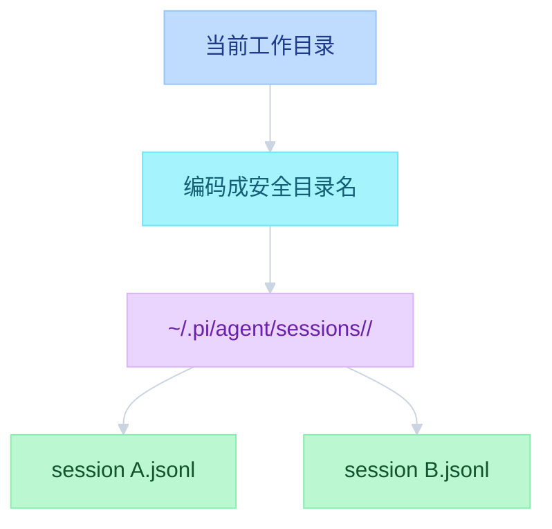
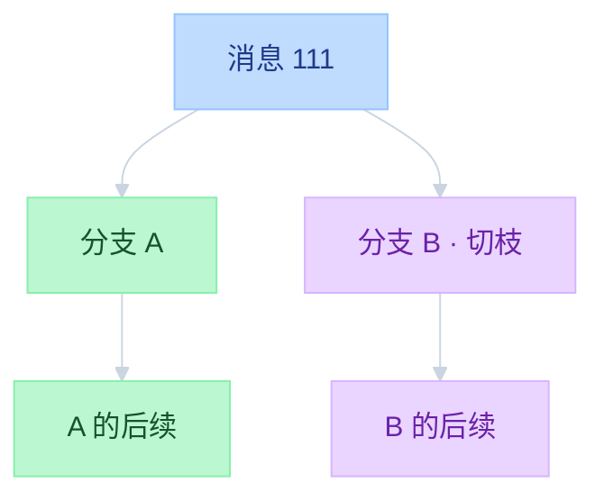
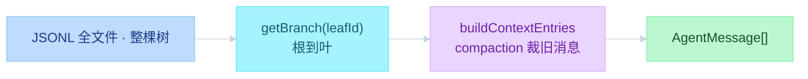
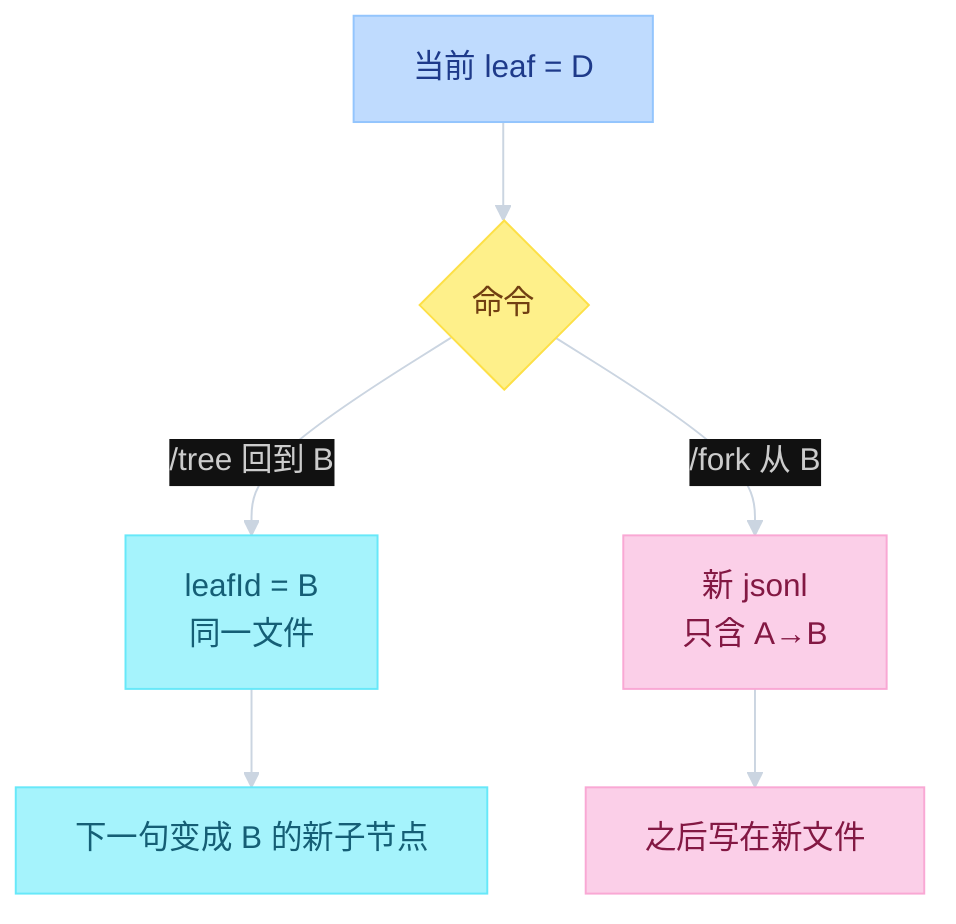

# Pi Sessions


---

## 目录

- [一、按工作目录落盘](#一按工作目录落盘)
- [二、JSONL 是树](#二jsonl-是树)
- [三、拼给 LLM 的不是全文件](#三拼给-llm-的不是全文件)
- [四、同文件切枝 vs 新开文件](#四同文件切枝-vs-新开文件)
- [五、入口](#五入口)
- [对照](#对照)

循环怎么把消息写进 JSONL，见 [`03-events.md`](03-events.md)。compact 条目怎么裁 context，见 [`05-compaction.md`](05-compaction.md)。

---

## 一、按工作目录落盘

Session 不是全局一条。cwd 被编码成目录名，同一项目的多次对话都在这个目录下。文件只 append，不改已有行。

```text
function flow（路径）
  ~/.pi/agent/sessions/
    --<把 cwd 的 / \ : 换成 - 的路径>--/
      <timestamp>_<session-id>.jsonl

  getDefaultSessionDir(cwd):
    safePath = "--" + cwd.stripLeadingSlash.replace(/[/\\:]/g, "-") + "--"
    mkdir ~/.pi/agent/sessions/<safePath>/
```



| 层 | 文件 | 函数 |
|----|------|------|
| Interactive 树 | `packages/coding-agent/src/core/session-manager.ts` | `appendMessage` / `branch` / `getTree` / `createBranchedSession` |
| 切枝 | `packages/coding-agent/src/core/agent-session.ts` | `navigateTree` |
| 新开文件 | `packages/coding-agent/src/core/agent-session-runtime.ts` | `fork` |
| Core 存储 | `packages/agent/src/harness/session/` | `Session` / JSONL repo / `parentId` |

第一行是 header：`type=session`、`id`、`cwd`、`parentSession`。之后每一行一个 entry。版本现在是 3。

为什么是 JSONL：新消息 `appendFileSync` 最后一行。若是一个大 JSON 数组，每次都要改整份文件。

---

## 二、JSONL 是树

文件在磁盘上是行列表，语义是树。每条 entry 有 `id` 和 `parentId`。当前对话位置是 `leafId`。下一句挂在 leaf 下面，然后 leaf 前进。

```text
function flow（树）
  header { type: session, id, cwd, parentSession }
  entry  { type, id, parentId, timestamp, ... }

  类型:
    message / thinking_level_change / model_change
    compaction / branch_summary
    custom / custom_message / label / session_info

  appendMessage(msg):
    entry.parentId = leafId
    persist 一行 JSON
    leafId = entry.id                    # 前进

  文件 append-only:
    不能改、不能删已有 entry
    切枝只移动 leafId
```



`getTree()` 用 `parentId` 把浅拷贝拼成树。断掉的 parent 当根。子节点按 timestamp 排。`/tree` 看到的就是这个结构。

循环里 `message_end` 时 `sessionManager.appendMessage`，不等整轮 `agent_end`。UI 和 JSONL 订同一条事件总线。何时写、写哪些 role，见 `03-events.md`。

---

## 三、拼给 LLM 的不是全文件

磁盘上整棵树都在。送给模型的是 **当前 leaf 回溯到根的那条 path**，再按最近一次 compaction 裁。

```text
function flow（拼 context）
  buildSessionPath(entries, leafId):
    从 leaf 沿 parentId 走到根，再 reverse

  buildContextEntries(path):
    若 path 上有 compaction:
      用最近一条
      输出 = [compaction] + firstKeptEntryId 起到 compaction 前的尾巴
            + compaction 之后的新消息
      被摘要掉的旧消息不进 LLM
    否则整条 path

  buildSessionContext:
    把 entry 转成 AgentMessage[]
    compaction → compactionSummary（稍后包进 <summary>）
    custom entry 不进 LLM
    custom_message 才进
```



旁支还在同一个文件里，只是当前 leaf 走不到。这就是「返回会创建分支、旧路还在」的原因。

---

## 四、同文件切枝 vs 新开文件

`/tree` 改当前文件的 leaf。`/fork` `/clone` 另写一份 session。正在 streaming 时不能切枝。

```text
function flow（切枝）
  /tree → navigateTree(targetId):
    同一 JSONL
    可对放弃的分支做 branch_summary
    sessionManager.branch(targetId)     # 只改 leafId
    下一条 append 挂在 target 下
    旧分支一条都不删

  /fork /clone → runtime.fork():
    createBranchedSession(leafId)
    新文件只含根到该 leaf 的 path
    header.parentSession = 旧文件路径
    换成新 SessionManager
```



| | `/tree` | `/fork` `/clone` |
|--|---------|------------------|
| API | `navigateTree` | `runtime.fork` → `createBranchedSession` |
| 文件 | 同一个 JSONL | 新 JSONL |
| 旧分支 | 仍在原文件 | 不复制到新文件 |
| 摘要 | 可选 `branch_summary` | 无（整条 path 拷走） |

`/clone` 复制当前分支为新 session；`/fork` 可从树上某条 prompt 开新文件。未写出第一轮 assistant 前，文件可能还不存在，fork 会失败。

---

## 五、入口

CLI 决定打开哪份文件，然后才创建 `AgentSession`。

```text
function flow（入口）
  pi            → 新 session（该 cwd 目录下）
  pi -c         → SessionManager.continueRecent(cwd)
  pi -r         → selectSession() 会话选择器
  /export       → 从 JSONL 导出

  continueRecent:
    找该 sessionDir 里最近一份
    没有则 new SessionManager
```

| 入口 | 作用 |
|------|------|
| `pi -c` | 继续该 cwd 最近一次会话 |
| `pi -r` | 打开会话选择器 |
| `/tree` | 同文件切枝 |
| `/fork` | 从某条 prompt 新建 session 文件 |
| `/clone` | 复制当前分支为新 session |

Core 侧 `packages/agent/src/harness/session/` 是同一套树：`parentId`、JSONL、`fork()`。Interactive 的 `SessionManager` 是产品层实现。另有 `session-backends/sqlite-node` 可换存储。

---
