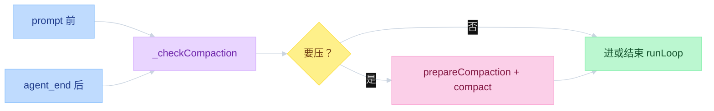
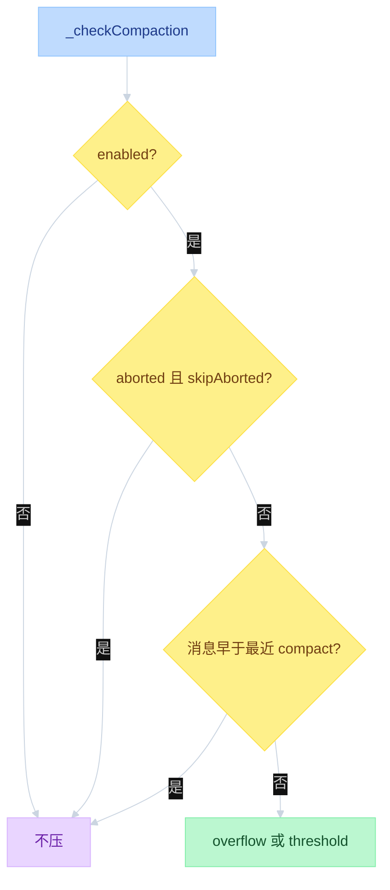
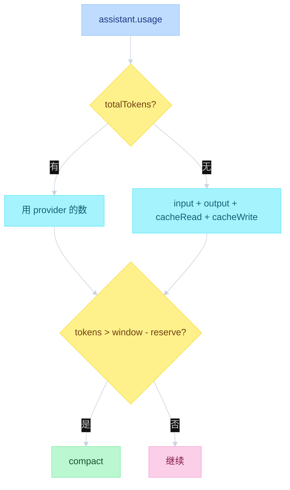
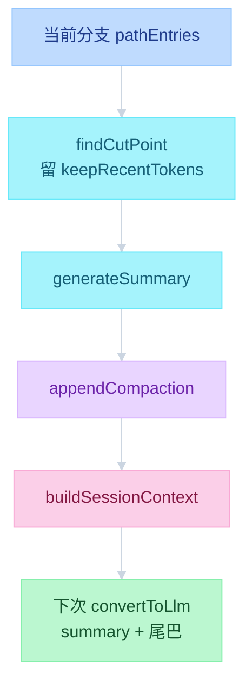
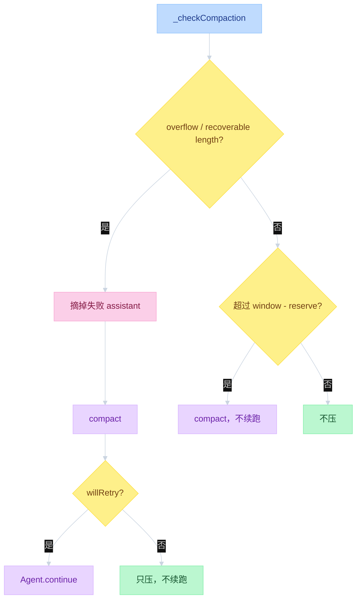

# Pi Compaction


---

## 目录

- [一、不在 runLoop 里](#一不在-runloop-里)
- [二、何时检查](#二何时检查)
- [三、怎么计量](#三怎么计量)
- [四、切点与摘要](#四切点与摘要)
- [五、overflow 与 threshold](#五overflow-与-threshold)
- [对照](#对照)

`agent_end` 之后才检查 compact，见 [`03-events.md`](03-events.md)。JSONL 树与 `appendCompaction` 见 [`04-sessions.md`](04-sessions.md)。

---

## 一、不在 runLoop 里

大纲把 compact 画成 loop 的第 2 步。源码里 `runLoop` 不调用 compact。检查发生在 Interactive 的 `AgentSession._checkCompaction()`：发新消息前，以及 `agent_end` 之后。Core 只消费已经压好的 transcript。

循环内每次打模型前走的是 `transformContext` → `convertToLlm`。`convertToLlm` 把 `compactionSummary` 包进 `<summary>`，那是格式转换，不是再压一次。

```text
function flow（调用栈）
  AgentSession.prompt()
    _checkCompaction(lastAssistant, skipAborted=false)   # 发消息前
    → Agent.prompt() → runLoop()                         # 循环内不 compact
    → while _handlePostAgentRun():
        _checkCompaction(lastAssistant)                  # agent_end 后
        maybe Agent.continue()                           # overflow 才续跑
```



| 层 | 文件 | 函数 |
|----|------|------|
| 产品层触发 | `packages/coding-agent/src/core/agent-session.ts` | `_checkCompaction` / `_runAutoCompaction` |
| 切点与摘要 | `packages/coding-agent/src/core/compaction/compaction.ts` | `shouldCompact` / `prepareCompaction` / `compact` |
| 落盘 | `packages/coding-agent/src/core/session-manager.ts` | `appendCompaction` / `buildContextEntries` |
| Core 副本 | `packages/agent/src/harness/compaction/compaction.ts` | 同一套算法，给 harness 用 |

扩展可在 `session_before_compact` 取消或自己交摘要。默认 `reserveTokens = 16384`，`keepRecentTokens = 20000`。

---

## 二、何时检查

两次调用同一函数，参数不同。正在跑时不会 compact。用户 abort 的回复默认跳过；发下一条之前会把 aborted 也算进去。

```text
function flow（时机）
  1. prompt() 发新消息前
     _checkCompaction(lastAssistant, skipAborted=false)
  2. _handlePostAgentRun，agent_end 后
     _checkCompaction(lastAssistant)          # skipAborted 默认 true

  直接跳过:
    settings.enabled == false
    skipAborted && stopReason == aborted
    assistant.timestamp 早于最近一条 compaction
    换过模型：旧模型的 overflow 不触发新模型 compact
```



TUI 也可手动 compact。那是同一套 `prepareCompaction` + `compact`，reason 记 `manual`。

---

## 三、怎么计量

不估「字符 / 4」当整窗。优先用上一条有效 assistant 的 usage。`totalTokens` 有就用；没有则 `input + output + cacheRead + cacheWrite`。

abort / error / 全 0 usage 不当有效。这时从 transcript 里找最近一条有效 usage，再把其后消息用 `estimateTokens` 补上。没有任何 usage 则 threshold 不触发。

```text
function flow（计量）
  calculateContextTokens(usage):
    usage.totalTokens
    || (input + output + cacheRead + cacheWrite)

  getAssistantUsage(msg):
    skip aborted / error / 全 0

  threshold 用的数:
    本条 usage 有效 → 直接用
    stopReason == error 或 usage 为 0
      → estimateContextTokens(messages)
      → 有效 usage + 其后消息的 estimateTokens
      → 没有有效 usage 则不压

  shouldCompact:
    tokens > contextWindow - reserveTokens
```



`estimateTokens` 只补 usage 之后的尾巴，不当整窗算法。启动时假定第一条消息不会直接撑爆窗口。

---

## 四、切点与摘要

先 `prepareCompaction` 算出切点，再 `compact` 调 LLM 写摘要。JSONL 里旧消息不删，只 append 一条 `compaction` 条目。下次拼 context 时，从这条摘要 + `firstKeptEntryId` 往后走。

从最新往回累加，留大约 `keepRecentTokens`。可切在 user 或 assistant，不切在 toolResult。切在 turn 中间则前半段另写一份 turn-prefix 摘要。已有摘要走 update prompt，不是从零再写。

```text
function flow（切点与摘要）
  prepareCompaction(pathEntries, settings):
    从最近 compaction 之后开始
    findCutPoint(..., keepRecentTokens)     # 从新往旧累加
    messagesToSummarize = 切点之前
    turnPrefixMessages = 若切在 turn 中间
    previousSummary = 上一次 compaction.summary

  compact(preparation):
    有 previousSummary → UPDATE_SUMMARIZATION_PROMPT
    否则 → SUMMARIZATION_PROMPT
    切在 turn 中间 → 再跑 TURN_PREFIX_SUMMARIZATION_PROMPT
    摘要 maxTokens = min(0.8 * reserveTokens, model.maxTokens)

  落盘:
    sessionManager.appendCompaction(...)
    agent.state.messages = buildSessionContext().messages

  下次拼 context:
    compaction 条目 → compactionSummary（包在 <summary> 里）
    + firstKeptEntryId 起的尾巴
    被摘要掉的旧消息仍在 JSONL，不进 LLM
```



摘要模板（给下一轮 LLM 当 checkpoint，不是给人读的长文）：

| 段落 | 内容 |
|------|------|
| Goal | 用户要完成什么 |
| Constraints & Preferences | 约束；没有就 `(none)` |
| Progress | Done / In Progress / Blocked |
| Key Decisions | 决策 + 理由 |
| Next Steps | 下一步 |
| Critical Context | 路径、函数名、错误原文 |

约束：每段保持短；路径、函数名、错误信息原样保留。

---

## 五、overflow 与 threshold

两种触发不要混。overflow 是这次回复已经失败或被截断，压完可能 `continue()` 重跑。threshold 是窗口快满了，只压，不从 assistant 续跑。`agent.continue()` 要求最后一条能变成 user 或 toolResult。

```text
function flow（两种触发）
  Case 1 overflow / recoverable length（同一模型）:
    stopReason != stop  → 摘掉失败的 assistant，compact，willRetry=true
    stopReason == stop  → 只 compact，不 continue
    同一 overflow 只允许恢复一次

  Case 2 threshold:
    tokens > contextWindow - reserveTokens
    compact，willRetry=false
    若 steering / follow-up 还在队列里，返回 true 让 continue 把队列送出去

  _runAutoCompaction(reason, willRetry):
    emit compaction_start
    session_before_compact → 可 cancel 或交自定义摘要
    compact(...) 或用扩展的结果
    appendCompaction
    emit session_compact / compaction_end
```



| | overflow | threshold |
|--|----------|-----------|
| 含义 | 这次调用已经撑爆或被截断 | 还没爆，但窗口不够 reserve |
| 失败 assistant | 从 agent state 摘掉 | 不动 |
| compact 后 continue | 仅 `stopReason != stop` | 否（队列非空除外） |

---

## 对照

大纲是教学抽象。读源码时按这张表对齐，避免把 compact 画进 `runLoop`。

| 大纲 | 源码 |
|------|------|
| 变换 = compact | 循环内是 `transformContext` + `convertToLlm`；compact 在 `_checkCompaction` |
| 字符 / 4 估 token | 优先 usage.`totalTokens`，否则四项相加 |
| compact 改写历史文件 | JSONL append-only；旧消息还在，拼 context 时跳过 |
| compact 后一定续跑 | 只有 overflow 且 `stopReason != stop` 才 `continue()` |

读：`compaction.ts` → `agent-session.ts` `_checkCompaction` → `session-manager.ts` `appendCompaction` / `buildContextEntries` → `messages.ts` `<summary>` → `test/compaction.test.ts`。
