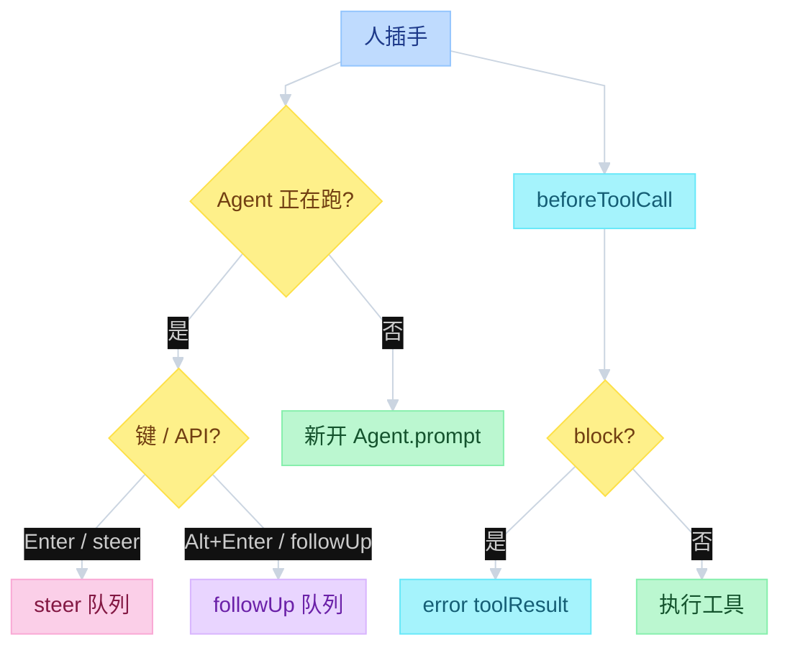

# Pi HITL


---

## 目录

- [一、不是事件](#一不是事件)
- [二、三条路](#二三条路)
- [三、工具前拦截](#三工具前拦截)
- [对照](#对照)

---

## 一、不是事件

人插手是 **人 → 循环**：插入消息，或挡住工具。事件总线是 **循环 → 外界**：UI 刷新、落盘。订 `AgentEvent` 不会变成 HITL。

Pi Core **不内置**权限弹窗。开箱的 HITL 只有队列纠偏，加上可选的 `beforeToolCall`。弹窗要自己写 extension。

循环怎么跑、队列何时 drain，见 `02-agent-loop.md` 第三节。事件总线见 `03-events.md`。

| | HITL | 事件 / 落盘 |
|--|------|-------------|
| 方向 | 人 → 循环 | 循环 → 外界 |
| 挡住 LLM / tool？ | 可以 | 否 |
| Core 开箱 | `steer` / `followUp` / `beforeToolCall` | 必有 |

---

## 二、三条路

```text
function flow（人怎么进循环）
  1. 跑着时再打字
       Enter     → steer()      # 这批 tool 跑完就改方向
       Alt+Enter → followUp()   # 做完再加一句
  2. 工具执行前
       beforeToolCall → { block: true }   # 这调用不执行
  3. 产品层弹窗（extension，不在 Core）
       ui.confirm / permission-gate
       同意或拒绝之后，再决定 block
```



`streamingBehavior` 由调用方定，不是 `runLoop`。TUI 把回车写死成 `"steer"`。RPC 客户端自己带，或直接调 `steer` / `follow_up`。正在跑且没带会抛错。

队列细节（何时 drain、当前工具不跳过）在 `02-agent-loop.md`，这里不重复。

---

## 三、工具前拦截

`beforeToolCall` 在预检之后、`tool.execute` 之前。返回 `{ block: true }` 则发一条 error toolResult，这调用不跑。`reason` 给模型看。`terminate: true` 只是提示；必须这批每个 result 都 terminate，循环才因这批停。

```text
function flow（beforeToolCall）
  prepareToolCall:
    find tool → prepareArguments → validate
    beforeToolCall(ctx, signal)
      { block: true } → error result（可带 terminate）
      否则 → execute

  Interactive:
    扩展 on("tool_call") 接到这里
    可 ui.confirm 再决定 block
```

扩展 `on("tool_call")` 对应 loop 的 `beforeToolCall`；`on("tool_result")` 对应 `afterToolCall`。官方例子：`packages/coding-agent/examples/extensions/permission-gate.ts`。

`pi -ne` 跳过扩展，弹窗这条路就没了。队列 `steer` / `followUp` 仍在。

---

## 对照

| 容易混 | 实际 |
|--------|------|
| 订事件 = HITL | 事件是观察；HITL 是队列和 `block` |
| Core 有权限弹窗 | 没有；要 extension `ui.confirm` |
| `block` 立刻 `agent_end` | 只失败这一调用；`terminate` 还要整批同意 |
| 空闲时的 `streamingBehavior` | 无用；空闲一律新开 `prompt` |

读：`02-agent-loop.md` 队列 → `types.ts` `BeforeToolCallResult` → `agent-loop.ts` `prepareToolCall` → `extensions/types.ts` `ui.confirm` → `examples/extensions/permission-gate.ts`。
