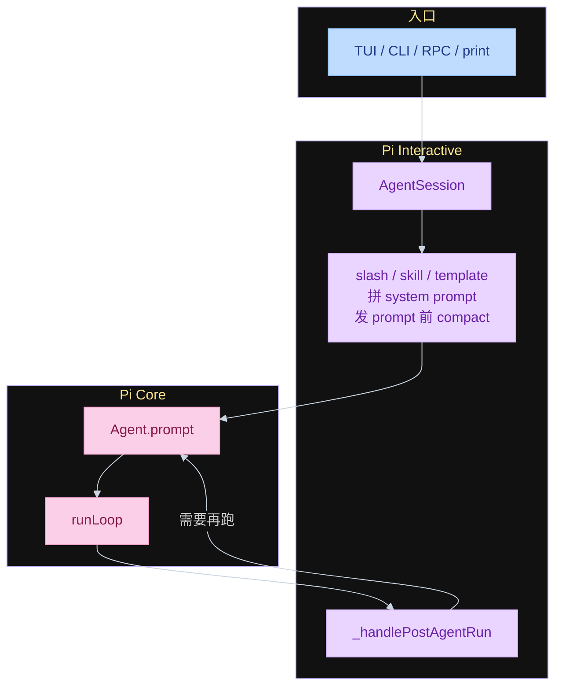
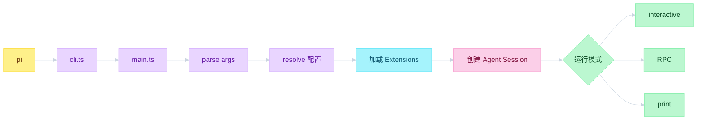
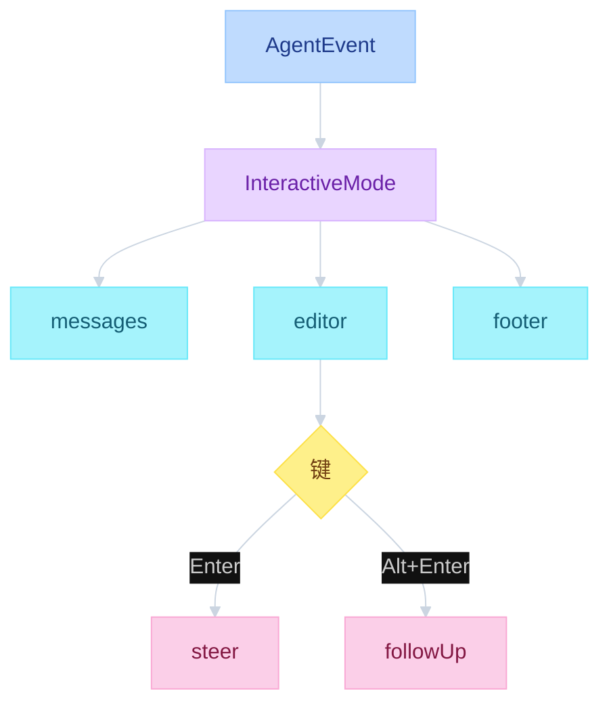
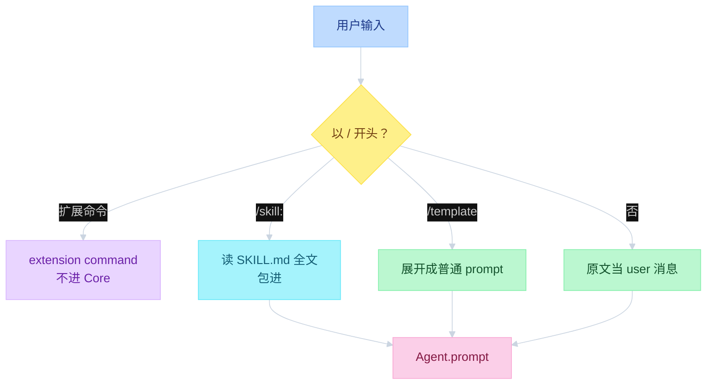

# Pi Interactive


---

## 目录

- [一、独立包，三种模式](#一独立包三种模式)
- [二、CLI 怎么接到 Core](#二cli-怎么接到-core)
- [三、TUI](#三tui)
- [四、进 Core 之前拦输入](#四进-core-之前拦输入)
- [对照](#对照)

---

## 一、独立包，三种模式

Pi Core 是 agent 本身。Pi Interactive 是另一个包：CLI + TUI + slash / skill 拦截。TUI、RPC、print 都从 `Agent.prompt` 进同一套 Core。`AgentSession` 不是第四套循环。

```text
function flow（三层）
  TUI / CLI / RPC / print
    → AgentSession                    # Interactive 产品层
        slash / skill / template
        _checkCompaction
        → Agent.prompt → runLoop      # Core
    → _handlePostAgentRun             # retry / compact / 队列
```



| 层 | 文件 | 函数 |
|----|------|------|
| CLI | `packages/coding-agent/src/cli.ts` · `main.ts` | 解析参数、加载扩展、建 session、选模式 |
| Session | `packages/coding-agent/src/core/agent-session.ts` | `prompt` / `_handlePostAgentRun` |
| 组装 | `packages/coding-agent/src/core/sdk.ts` | `createAgentSession` |
| TUI | `packages/tui/src/tui.ts` | 差分渲染、Component |
| 交互模式 | `packages/coding-agent/src/modes/interactive/interactive-mode.ts` | 快捷键、`/tree`、回车 = steer |

三种运行模式在 `main.ts` 的 `resolveAppMode`：

| 模式 | 何时 | 入口 |
|------|------|------|
| interactive | stdin/stdout 都是 TTY | `InteractiveMode.run()` |
| RPC | `--mode rpc` | `runRpcMode`，stdin/stdout JSONL |
| print | `pi -p` / 管道 / 非 TTY | `runPrintMode`，跑完退出 |

SDK 也可直接 `createAgentSession()`，不经过 CLI。

---

## 二、CLI 怎么接到 Core

`pi` 命令先进 `cli.ts`（设 process title），再进 `main.ts`。真正初始化 Core 是创建 Agent Session 那一步。扩展在这之前装好，所以能注册 flag、改工具、订事件。

```text
function flow（main）
  parseArgs
  resolve 配置 / cwd
  加载 extensions（可用 -ne 跳过）
  createAgentSessionServices
  createAgentSessionFromServices     # 这时才初始化 Pi Core
  createAgentSessionRuntime
  resolveAppMode → interactive | rpc | print
```



system prompt 在进循环前叠好，不在 `runLoop` 里拼：

```text
function flow（buildSystemPrompt）
  default | SYSTEM.md | --system-prompt
    + APPEND_SYSTEM.md
    + AGENTS.md / CLAUDE.md          # home + cwd
    + skills descriptions            # 有 read 才挂
    + cwd
  AgentContext = { systemPrompt, messages, tools }
```

`SYSTEM.md` 整段替换默认身份。`APPEND_SYSTEM.md` 追加。发现顺序：项目 `.pi/` 优先于 `~/.pi/agent/`。

---

## 三、TUI

TUI 是 Interactive 的一种壳，不是第二套 agent。自研，不用 Textual。差分渲染，所以不闪屏。每个 Component 自己 `render(width)`，可处理输入。

```text
function flow（TUI）
  InteractiveMode
    订阅 AgentEvent（与 JSONL 同一条总线）
    messages 区 / editor / footer
    回车     → streamingBehavior = "steer"
    Alt+Enter → "followUp"

  packages/tui:
    TUI 差分渲染
    Component.render(width) → 行数组
    主屏 / 备用屏
```



开箱这套 TUI 为 Pi 定制。扩展可以换 header / footer / widget，或另挂 GUI。RPC 客户端不经过这套 TUI，但仍用同一个 `AgentSession`。

---

## 四、进 Core 之前拦输入

用户回车后先在 Interactive 处理。命中扩展命令则不进 Core。Skills 和 Prompt Templates 都是斜杠，处理方式不同。

```text
function flow（prompt）
  AgentSession.prompt(text):
    if text starts with "/" and extension command:
      handler(args) → return                 # 不进 Core
    emitInput() → handled | transform
    expand /skill: and prompt template
    if agent.isStreaming:
      steer() or followUp() → return
    _checkCompaction(...)
    Agent.prompt(messages)
```



| | Skills | Prompt Templates | Extension command |
|--|--------|------------------|-------------------|
| 触发 | `/skill:name` | `/review` 这类 | 扩展 `registerCommand` |
| 进 Core 前 | 读文件，把 **全文** 包进 `<skill name location>` | `expandPromptTemplate`，`$1` / `$@` 替换 | 就地 handler，**不进 Core** |
| system prompt | 只挂 name / description / location，并指示用 `read` | 不出现 | 不出现 |
| 模型怎么用 | 斜杠已带全文；未斜杠时按 prompt 自己 `read` | 只看到展开后的句子 | 看不到 `/命令` |

```text
function flow（skill 两条路）
  拼 system prompt:
    formatSkillsForPrompt()
    <available_skills> name + description + location
    「匹配时用 read 加载 skill 文件」

  用户打 /skill:name:
    _expandSkillCommand()
    读 SKILL.md，strip frontmatter
    发给 Core 的是 <skill> 全文，不是再等模型去 read
```

大纲常说「Interactive 只塞 name/desc/location，Core 用 read」。那是 **system prompt 列表** 的行为。当前源码里 **显式 `/skill:` 会把全文内联**。自定义 template 则永远在 Interactive 展开，Core 看不到原始 `/命令`。

换一套 CLI 可以把 `/skill:` 改成 Codex 的 `$` 或 Claude Code 的 `/command`。这件事发生在 Core 之外。

---

## 对照

大纲把「怎么接 Core」「TUI」「Skills 拦截」拆成三章。源码里它们是同一个包的三面。

| 大纲 | 源码 |
|------|------|
| Interactive 是第四套循环 | 只是 `Agent.prompt` 外面的包装 |
| TUI 框架 | `packages/tui` 自研差分渲染 |
| `/skill` 只传 location | system prompt 如此；`/skill:` 命令会内联全文 |
| custom slash 到达 Core | `expandPromptTemplate` 之后 Core 只看到普通 user 文本 |
| 三种模式三套 agent | 同一 `AgentSession`，三种壳 |

读：`main.ts` → `sdk.ts` → `agent-session.ts` `prompt` → `interactive-mode.ts` → `tui.ts` → `skills.ts` / `prompt-templates.ts` / `slash-commands.ts`。
