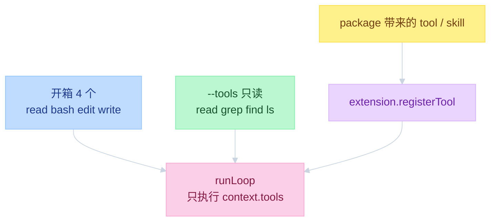
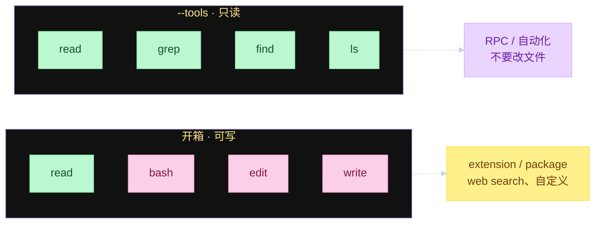
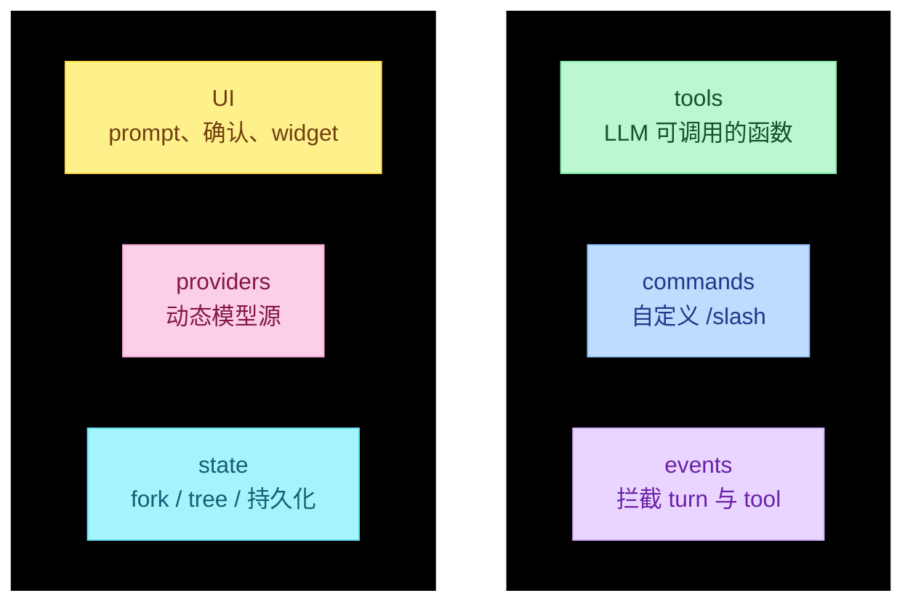

# Pi Capability at the Edges


---

## 目录

- [一、Core 很窄，能力在边上](#一core-很窄能力在边上)
- [二、Tools](#二tools)
- [三、Extensions](#三extensions)
- [四、故意不做的](#四故意不做的)
- [对照](#对照)

---

## 一、Core 很窄，能力在边上

`runLoop` 只认 `context.tools`。默认四个工具，没有 MCP、没有 web search。要加能力：开只读工具、写 skill、装 extension、装 package。扩展改行为，不改 Core。

```text
function flow（谁提供工具）
  createAgentSession / sdk
    defaultTools 或 [read, bash, edit, write]
    --tools 白名单可改成只读套装
    ExtensionAPI.registerTool() 再往上叠
    prepareNextTurn() 可在循环中途换工具集
```



| 层 | 文件 | 看什么 |
|----|------|--------|
| 内置工具 | `packages/coding-agent/src/core/tools/index.ts` | `ToolName`、`createCodingTools`、`createReadOnlyTools` |
| Core 实现 | `packages/agent/src/harness/tools/` | read / bash / edit / write 的执行 |
| 扩展契约 | `packages/coding-agent/src/core/extensions/types.ts` | `ExtensionAPI` |
| 加载 | `packages/coding-agent/src/core/extensions/loader.ts` | jiti 加载 `extensions/*.ts` |
| 事件 | `packages/coding-agent/src/core/extensions/runner.ts` | 把 API 接到当前 session |

工具 schema 走 `context.tools`，不写进 system prompt 正文。循环怎么跑工具见 `02-agent-loop.md` 第三节。

---

## 二、Tools

内置七个名字，开箱只用四个。另外三个默认关：bash 本来也能 grep / find / ls；只读模式才需要它们，因为那时不给 bash。

```text
function flow（工具集）
  allToolNames = read | bash | edit | write | grep | find | ls

  开箱:
    createCodingTools() = read, bash, edit, write

  只读:
    createReadOnlyTools() = read, grep, find, ls
    pi --tools read,grep,find,ls

  settings.defaultTools 可改初始集合
  --tools / -t 是白名单，扩展工具不受影响（除非另关 builtin）
```



| 工具 | 默认 | 作用 |
|------|------|------|
| `read` | 开 | 读文件 |
| `bash` | 开 | 跑命令 |
| `edit` | 开 | 改文件（patch） |
| `write` | 开 | 写 / 覆盖文件 |
| `grep` | 关 | 搜内容；只读模式用 |
| `find` | 关 | 找文件；只读模式用 |
| `ls` | 关 | 列目录；只读套装里有 |

大纲常说「4 + 2」。源码是 4 个可写 + `grep`/`find`/`ls` 三个只读。RPC 自动化不想改文件时走 `--tools`。

一条 assistant 可带多个 tool call。默认并行，预检串行；`length` 截断整批 fail；`terminate` 必须这批全同意。细节在 loop 文档。

---

## 三、Extensions

扩展是 TS 模块，加载后在你的机器上执行。不要装不信任的源。契约是一个 `ExtensionAPI`，不是六套子系统。

```text
function flow（加载）
  main / sdk
    发现 ~/.pi/agent/extensions、项目 .pi/extensions、package
    loader 用 jiti 执行 *.ts
    工厂函数拿到 pi: ExtensionAPI
    runner 把 pi 绑到当前 AgentSession

  扩展能做:
    registerTool / registerCommand / registerShortcut / registerFlag
    on(event) 订生命周期
    registerProvider
    ui.select / confirm / input / widget / footer
    session: newSession / fork / navigateTree / switchSession
```



事件挂在同一条总线上。用户输入以 `/` 开头且命中扩展命令则 **不进 Core**。`tool_call` / `tool_result` 对应 loop 里的 `beforeToolCall` / `afterToolCall`（HITL 见 `06-HITL.md`）。`session_before_compact` 可取消或自己交摘要。

| 钩子 | 典型用途 |
|------|----------|
| `registerTool` | web search、自定义函数 |
| `registerCommand` | `/plan`、`/todo` 这类斜杠流程 |
| `on("tool_call")` | 权限确认、拦截危险调用（`06-HITL.md`） |
| `on("agent_end")` | 记状态、改下一轮工具集 |
| `registerProvider` | 公司代理、本地模型 |
| `ui.confirm` | 权限弹窗（Core 不内置） |

`pi -ne` 跳过扩展。`newSession` / `fork` / `switchSession` / `reload` 之后旧的 `pi` 上下文作废，后续工作放到 `withSession` 回调里。

官方例子在 `packages/coding-agent/examples/extensions/`：`tools.ts`、`commands.ts`、`event-bus.ts`、`question.ts`、`session-name.ts`、`custom-provider-anthropic/`。

---

## 四、故意不做的

缺的不是疏漏。日常 workflow 做成 template / skill / extension / package，不把 Core 变重。

```text
function flow（决策，从上到下用最小的一层）
  改默认           → settings.json
  教项目规则       → AGENTS.md
  换身份           → SYSTEM.md
  重复同一条 prompt → prompt template
  加一项能力       → skill
  改运行时行为     → extension
  分享一整包       → package
```

开箱不做：MCP 客户端、子智能体、权限弹窗、plan mode、todos、后台 bash。对照 examples 里用 extension 补上的同一套：`subagent/`、`plan-mode/`、`todo.ts`、`permission-gate.ts`。MCP 没有官方 bundled example，需要时自己写或装 package。

---

## 对照

大纲把 Tools 和 Extensions 分成两章。源码里它们是同一条边：给 `runLoop` 提供可调用的东西，以及在调用前后改行为。

| 大纲 | 源码 |
|------|------|
| 开箱 4 个 + 只读 2 个 | 4 个可写；只读是 `read` + `grep`/`find`/`ls` |
| 扩展是另一套系统 | 一个 `ExtensionAPI`，六类钩子 |
| MCP / plan 在 Core | 不在 Core；用 extension / package |
| 工具写进 system prompt | schema 在 `context.tools` |

读：`tools/index.ts` → `sdk.ts` 默认工具 → `extensions/types.ts` → `loader.ts` / `runner.ts` → `docs/extensions.md` → 一个 example。
