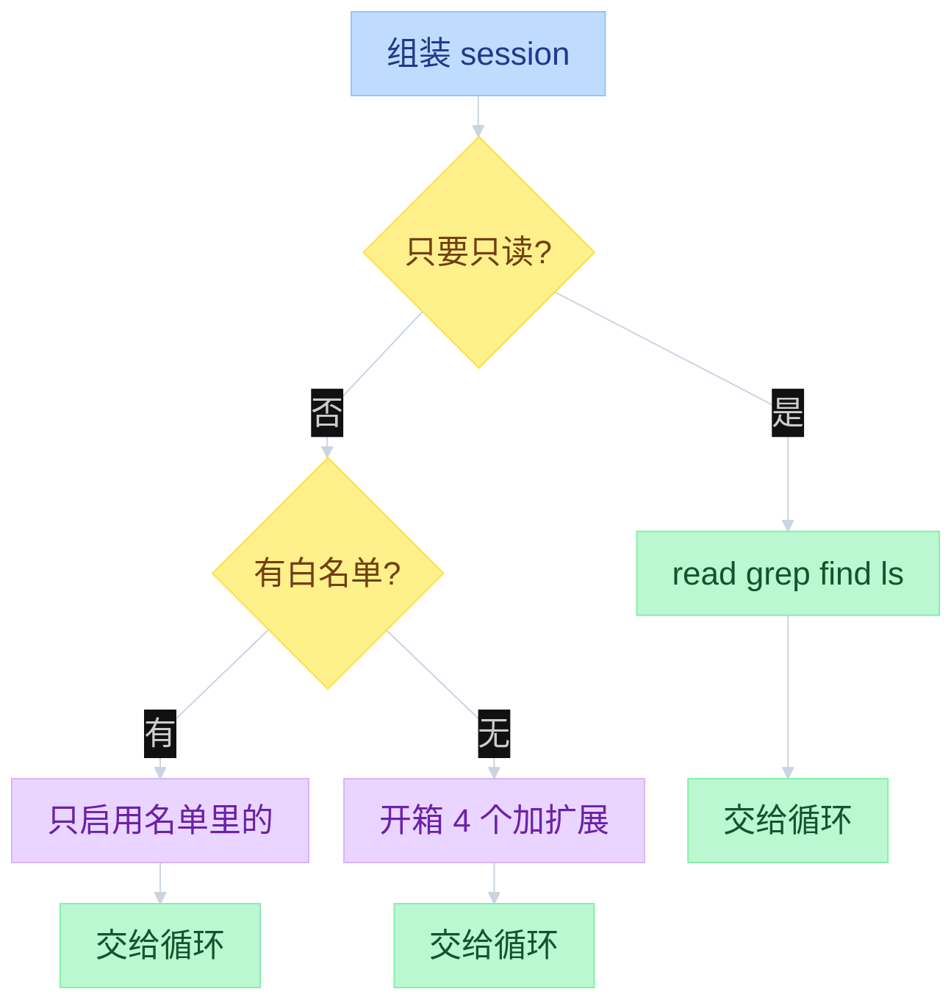
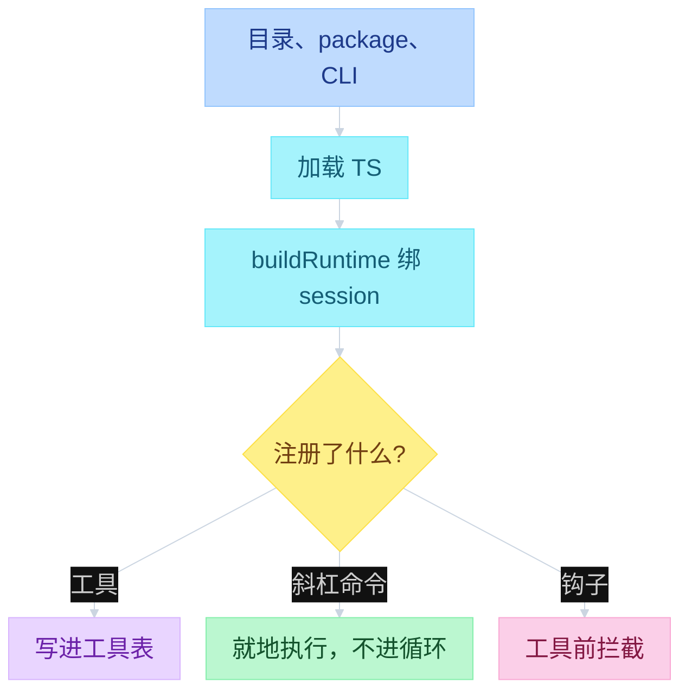

# Pi Capability at the Edges


---

## 目录

- [一、总图](#一总图)
- [二、工具怎么进循环](#二工具怎么进循环)
- [四、扩展怎么接上](#四扩展怎么接上)

循环只认眼前这份工具表。默认四个，没有联网搜索，没有 MCP。要加能力：改开哪些工具、写 skill、装扩展、装 package。扩展改行为，不改循环本身。循环怎么跑工具见 [`02-agent-loop.md`](02-agent-loop.md) 第三节。

缺的不是疏漏。日常流程做成模板 / skill / 扩展 / package，不把 Core 变重。开箱不做：MCP 客户端、子智能体、权限弹窗、plan mode、todos、后台 bash。对照 examples 里用扩展补上的同一套：`subagent/`、`plan-mode/`、`todo.ts`、`permission-gate.ts`。

---

## 一、总图

左 UI，中 Interactive，右 Core。名单在 Interactive 凑好再交给 Core；循环只复印眼前这份表。斜杠命令停在 Interactive，不进 Core。

路径默认 `packages/coding-agent/src/`。Core 在 `packages/agent/src/`。Interactive 用**名字名单**选工具，不调用 `createCodingTools`（那是 SDK 助手）。

```text
function flow（Capability 三层 · 文件 → 函数）

┌────────── UI ──────────┐  ┌──────── Interactive ────────┐  ┌──────── Pi Core ────────┐
│                        │  │                             │  │                         │
│  启动选工具             │  │  cli.ts → main.ts           │  │                         │
│  --tools / settings    │─>│    parseArgs                 │  │                         │
│  --no-tools / -ne      │  │    createAgentSessionServices│  │                         │
│                        │  │    createAgentSession        │  │  new Agent              │
│                        │  │      _buildRuntime           │  │                         │
│                        │  │      _refreshToolRegistry ───┼─>│  Agent.state.tools      │
│                        │  │                             │  │                         │
│  装扩展                 │  │  resource-loader.ts          │  │                         │
│  目录 / pi install / -e│─>│    reload → loadExtensions   │  │                         │
│                        │  │  loader.ts factory(pi)       │  │                         │
│                        │  │    registerTool ─────────────┼─>│  写进工具表              │
│                        │  │    registerCommand           │  │  Core 看不见命令         │
│  Editor /plan          │─>│  agent-session.ts prompt     │  │                         │
│                        │  │    _tryExecuteExtensionCmd   │  │                         │
│                        │  │  _installAgentToolHooks ─────┼─>│  beforeToolCall         │
│                        │  │                             │  │                         │
│                        │  │  _installAgentNextTurnRefresh│  │  agent-loop.ts runLoop  │
│                        │  │    prepareNextTurnWithContext┼─>│    context.tools=slice  │
│                        │  │                             │  │    executeToolCalls     │
└────────────────────────┘  └─────────────────────────────┘  └─────────────────────────┘

启动整条链:
  cli.ts:main
    → cli/args.ts:parseArgs                         # --tools / --no-tools / -e / -ne
    → main.ts:main
      buildSessionOptions                           # 把 CLI 工具旗标写进 session options
      createAgentSessionServices                    # agent-session-services.ts
        DefaultResourceLoader.reload                # resource-loader.ts；factory 在这里跑
      createAgentSessionFromServices                # → sdk.ts:createAgentSession
        算 initialActiveToolNames                   # --tools ?? settings.defaultTools ?? 开箱 4 个
        new Agent                                   # packages/agent/src/agent.ts
        new AgentSession                            # agent-session.ts 构造里 _buildRuntime
      createAgentSessionRuntime                     # agent-session-runtime.ts
      InteractiveMode.run                           # modes/interactive/interactive-mode.ts
        bindCurrentSessionExtensions
          AgentSession.bindExtensions               # emit session_start

每轮:
  packages/agent/src/agent-loop.ts:runLoop
    AgentSession._installAgentNextTurnRefresh
      prepareNextTurnWithContext
        context.tools = agent.state.tools.slice()
    executeToolCalls
      Agent.beforeToolCall → runner.emitToolCall    # agent-session.ts _installAgentToolHooks
```

---

## 二、工具怎么进循环

建 session 时先凑一份名单：开箱四个，或你用 `--tools` 点名，或设置里的默认。只读模式换成另一套。扩展注册的工具也并进来，再交给循环。每一轮开始，循环复印当前这份表，不在 system prompt 正文里抄工具说明。

`--tools` 是名字白名单：内置和扩展都要写进去才启用。没写 `--tools` 时：开箱四个，加上全部扩展工具。

```text
function flow（谁提供工具 · 文件 → 函数）
  cli/args.ts:parseArgs
    --tools / -t → parsed.tools
    --no-tools → parsed.noTools
    --no-builtin-tools → parsed.noBuiltinTools
    --exclude-tools → parsed.excludeTools
  main.ts:buildSessionOptions
    noTools="all" | "builtin"；tools / excludeTools 原样传下去

  sdk.ts:createAgentSession
    defaultActive = ["read","bash","edit","write"]   # 名字，不是 createCodingTools()
    initialActive = options.tools                    # --tools 白名单
                  ?? settings.defaultTools           # settings-manager.ts:getDefaultTools
                  ?? defaultActive
    filter excludeTools
    new AgentSession → 构造里 _buildRuntime          # agent-session.ts
      详见第四节 function flow（_buildRuntime）

  agent-session.ts:_refreshToolRegistry
    builtin = _baseToolDefinitions                   # tools/index.ts:createAllToolDefinitions（7 个都有定义）
    ext     = runner.getAllRegisteredTools()         # extensions/runner.ts；factory 里 registerTool 留下的
    custom  = options.customTools
    wrapRegisteredTools                              # extensions/wrapper.ts
    setActiveToolsByName → agent.state.tools         # 默认启用 4 个；无 --tools 时扩展全开

  agent-session.ts:_installAgentNextTurnRefresh
  packages/agent/src/agent-loop.ts:runLoop 每轮:
    prepareNextTurnWithContext:
      context.tools = agent.state.tools.slice()
      context.systemPrompt = _systemPromptOverride ?? _baseSystemPrompt
```



| 层 | 文件 | 函数 |
|----|------|------|
| CLI 旗标 | `packages/coding-agent/src/cli/args.ts` | `parseArgs` |
| 旗标 → session | `packages/coding-agent/src/main.ts` | `buildSessionOptions` / `main` |
| 先加载再组 session | `packages/coding-agent/src/core/agent-session-services.ts` | `createAgentSessionServices` / `createAgentSessionFromServices` |
| 算名单 + new Agent | `packages/coding-agent/src/core/sdk.ts` | `createAgentSession` |
| 内置工具定义 | `packages/coding-agent/src/core/tools/index.ts` | `createAllToolDefinitions`（Interactive 真路径）；`createCodingTools` / `createReadOnlyTools` 是 SDK 助手 |
| Core 执行 | `packages/agent/src/harness/tools/` | `read` / `bash` / `edit` / `write` |
| 扩展契约 | `packages/coding-agent/src/core/extensions/types.ts` | `ExtensionAPI`：`registerTool` / `registerCommand` / `on` |
| 凑路径 | `packages/coding-agent/src/core/resource-loader.ts` | `DefaultResourceLoader.reload`；`_buildRuntime` 只 `getExtensions()` |
| 目录 / package | `packages/coding-agent/src/core/package-manager.ts` | `resolve` / `resolveExtensionSources` |
| 加载 factory | `packages/coding-agent/src/core/extensions/loader.ts` | `loadExtensionsCached` → `createExtensionAPI`；`discoverAndLoadExtensions` 只给测试 / SDK |
| 绑到 session | `packages/coding-agent/src/core/agent-session.ts` | `_buildRuntime` → `_bindExtensionCore` → `_refreshToolRegistry` → `setActiveToolsByName` |
| 包一层钩子 | `packages/coding-agent/src/core/extensions/wrapper.ts` | `wrapRegisteredTools` |
| 事件 | `packages/coding-agent/src/core/extensions/runner.ts` | `bindCore` / `getAllRegisteredTools` / `emitToolCall` |
| 每轮复印表 | `packages/agent/src/agent-loop.ts` | `runLoop` → `executeToolCalls` |

---

---

## 四、扩展怎么接上

扩展是进程里跑的 TS 模块（`export default function (pi: ExtensionAPI)`）。package 是分发盒：可以带 extension、skill、prompt、theme。`pi install` 装的是 package，不会写进 `extensions/` 目录。不要装不信任的源。

Interactive 先凑齐文件路径，再 `jiti` 加载，最后绑到当前 session。用户输入以 `/` 开头且命中扩展命令则 **不进循环**。`tool_call` / `tool_result` 对应循环里工具前 / 工具后拦截（见 [`06-HITL.md`](06-HITL.md)）。压上下文时，扩展可以取消或自己交摘要。

| 渠道 | 落盘 | 怎么启用 |
|------|------|----------|
| 本地 TS | `.pi/extensions/`、`~/.pi/agent/extensions/` | 自动扫；项目目录要先信任 |
| package | `~/.pi/agent/npm/` 或 `.pi/npm/` | `pi install` 写入 `settings.packages`，再读包内 `pi.extensions` |
| CLI 试跑 | 临时目录或本地路径 | `pi -e ./foo.ts`；本次进程有效 |

```text
function flow（加载 · 文件 → 函数）
  agent-session-services.ts:createAgentSessionServices
    new DefaultResourceLoader
    await resourceLoader.reload()                # 先加载，再 createAgentSession
  sdk.ts:createAgentSession
    若调用方没传 loader：自己 new DefaultResourceLoader + reload
    new AgentSession(...) → 构造里 _buildRuntime  # agent-session.ts

  resource-loader.ts:DefaultResourceLoader.reload
    package-manager.ts:resolve:
      settings.packages                          # pi install；不进 extensions/ 目录
        读 package.json pi.extensions
      cwd/.pi/extensions                         # 项目 drop-in；信任后才加载
      ~/.pi/agent/extensions                     # 用户 drop-in
      settings.extensions                        # 显式本地路径
    package-manager.ts:resolveExtensionSources   # CLI -e / --extension；本次临时
    loadFinalExtensionSet
      extensions/loader.ts:loadExtensionsCached
        loadExtensionModule                      # jiti 执行 *.ts
        createExtensionAPI                       # factory(pi) 写进 Extension
          pi.registerTool / on / registerCommand
        runtime.refreshTools = () => {}          # 加载时还没有 session，刷新是空操作
        registerProvider 先排队 pending*

  extensions/loader.ts:discoverAndLoadExtensions # 测试 / SDK 助手，Interactive 不用
    只扫两个 drop-in 目录 + 显式路径
    不读 settings.packages
```

```text
function flow（_buildRuntime · 文件 → 函数）
  # 全在 agent-session.ts；不扫目录、不再跑 factory
  谁调用:
    构造: _buildRuntime({ activeToolNames: initialActive, includeAllExtensionTools: true })
    reload: emitSessionShutdownEvent             # extensions/runner.ts
            → resource-loader.ts:reload
            → _buildRuntime({ 当前名单, 旧 flagValues, includeAllExtensionTools: true })

  AgentSession._buildRuntime:
    1. tools/index.ts:createAllToolDefinitions(cwd)   # 7 个名字都有定义；默认启用另说
       或 _baseToolsOverride 从 SDK 工具生成定义
       → _baseToolDefinitions
    2. resource-loader.ts:getExtensions()
       可选：把 reload 前的 flagValues 写回 runtime
    3. new ExtensionRunner(...)                  # extensions/runner.ts
       extensionRunnerRef.current = runner       # Agent.onPayload / transformContext 用
    4. _bindExtensionCore(runner)
         runner.bindCore:                        # extensions/runner.ts:bindCore
           refreshTools    → _refreshToolRegistry
           setActiveTools  → setActiveToolsByName
           getActiveTools / getAllTools / getCommands
           sendMessage / sendUserMessage / appendEntry / setSessionName / ...
           compact / getSystemPrompt / abort / shutdown
           冲掉 pendingProviderRegistrations
             → model-runtime.ts:registerProvider
    5. _applyExtensionBindings(runner)
         runner.setUIContext / bindCommandContext / onError
         构造时 UI 往往还没有；后面 bindExtensions() 再绑一次
    6. _refreshToolRegistry({ activeToolNames, includeAllExtensionTools })
         builtin = _baseToolDefinitions
         ext     = runner.getAllRegisteredTools()
         custom  = options.customTools
         wrapRegisteredTools                     # extensions/wrapper.ts
         合并进 _toolRegistry                    # 扩展同名覆盖内置
         --tools 有白名单: 内置和扩展都要写进去才启用
         无 --tools: 默认 4 个 + 全部扩展工具
         setActiveToolsByName:
           agent.state.tools = 名单里能在表里找到的
           _rebuildSystemPrompt                  # agent-session.ts

  之后（不在 _buildRuntime 里）:
    interactive-mode.ts:bindCurrentSessionExtensions
      AgentSession.bindExtensions
        _applyExtensionBindings
        runner.emit(session_start)
        extendResourcesFromExtensions
    扩展后来 registerTool → runtime.refreshTools → 再走一遍 _refreshToolRegistry

  斜杠命令（不进循环）:
    agent-session.ts:prompt
      _tryExecuteExtensionCommand
        runner.getCommand → command.handler      # Core 看不见
```



| 钩子 | 典型用途 |
|------|----------|
| `registerTool` | 联网搜索、自定义函数 |
| `registerCommand` | `/plan`、`/todo` 这类斜杠流程 |
| `on("tool_call")` | 权限确认、拦截危险调用 |
| `on("agent_end")` | 记状态、改下一轮工具集 |
| `registerProvider` | 公司代理、本地模型 |
| `ui.confirm` | 权限弹窗（Core 不内置） |

`pi -ne` 跳过目录和 package，仍加载 `-e`。换 session / 重载之后，旧的 `pi` 上下文作废，后续工作放到 `withSession` 回调里。

官方例子在 `packages/coding-agent/examples/extensions/`：`tools.ts`、`commands.ts`、`event-bus.ts`、`question.ts`、`session-name.ts`、`custom-provider-anthropic/`。

读源码（文件 → 函数）：

```text
cli.ts:main
  → cli/args.ts:parseArgs
  → main.ts:main / buildSessionOptions
  → agent-session-services.ts:createAgentSessionServices
      resource-loader.ts:reload
        package-manager.ts:resolve
        extensions/loader.ts:loadExtensionsCached → createExtensionAPI
  → sdk.ts:createAgentSession
      tools/index.ts:createAllToolDefinitions     # 定义；启用名单在 sdk 里算
      new Agent                                   # packages/agent/src/agent.ts
      agent-session.ts 构造
        _installAgentToolHooks                    # beforeToolCall / afterToolCall
        _installAgentNextTurnRefresh
        _buildRuntime
          extensions/runner.ts:bindCore
          _refreshToolRegistry → setActiveToolsByName
  → interactive-mode.ts:bindCurrentSessionExtensions
      agent-session.ts:bindExtensions / prompt / _tryExecuteExtensionCommand
  → packages/agent/src/agent-loop.ts:runLoop / executeToolCalls
```

`docs/extensions.md` / `docs/packages.md` → `packages/coding-agent/examples/extensions/`。
