# Pi 最终复习

四块拼成一套系统：**LOOP** 是循环本身，**Runtime & memory** 是记什么、发给模型什么，**Extension** 在循环外加能力，**HITL** 是人怎么插进去（steer / follow-up、挡工具），不单开一节。

入口进 Pi Interactive（slash / compact / 落盘），循环在 Pi Core（LLM ↔ tool）。compact **不进** `runLoop`。落盘发生在 `message_end`，不是等整轮结束。

---

## 目录

- [系统全景](#系统全景)
- [Runtime 分层](#runtime-分层)
- [一、LOOP](#一loop)
- [二、Runtime & memory](#二runtime--memory)
  - [两份记忆](#两份记忆)
  - [事件](#事件)
  - [Session 树](#session-树)
  - [Compaction](#compaction)
  - [System prompt](#system-prompt)
- [三、Extension](#三extension)

---

## 系统全景

黄是入口，只做 I/O。窄腰上下两块：上面 **Pi Interactive**（`coding-agent`）做 slash、compact、兜底；下面 **Pi Core**（`agent`）做队列和 `runLoop`。绿是 JSONL 树；蓝是开箱工具和扩展 / skill。

`registerCommand` 停在 Interactive。`registerTool` 写进 Core 每轮复印的工具表。

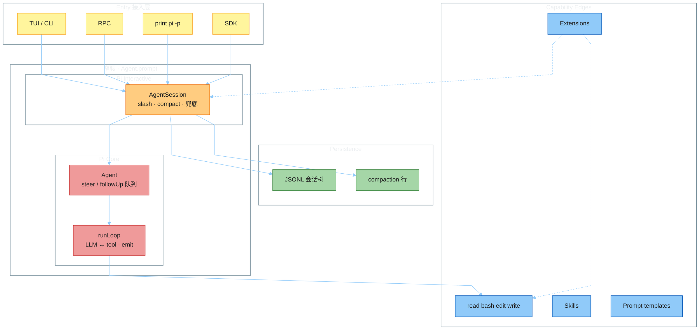

---

## Runtime 分层

源码主链：`cli.ts` → `AgentSession.prompt` → `Agent.prompt` → `runLoop`。

一条用户消息 = **1 次进循环前** + **N 次 LLM/Tool** + **1 次兜底**。compact 在 ① 和 ③，不进 ②。落盘在循环中的 `message_end`，不是 Finalize。兜底再 `continue()` 就是新的一次 `runLoop`。

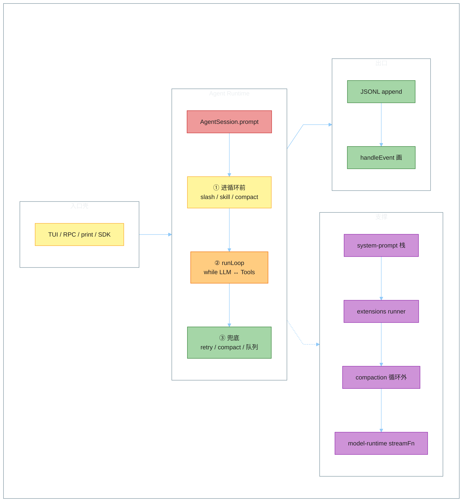

---

## 一、LOOP

一次 `prompt` 不是调一次 LLM。内层消化 tool 和 steering（中途纠偏，当前这批工具不跳过）；外层消化 follow-up（没有 tool、也没有 steering、本要停了才加一句）。有 tool 时内层会再调 LLM，不先看 follow-up。续跑不连回起点：那是同一轮再调 LLM，或兜底开的**新**一次 `runLoop`。人插进去就是这两条队列，挡工具走 `beforeToolCall`（扩展 `on("tool_call")`）。

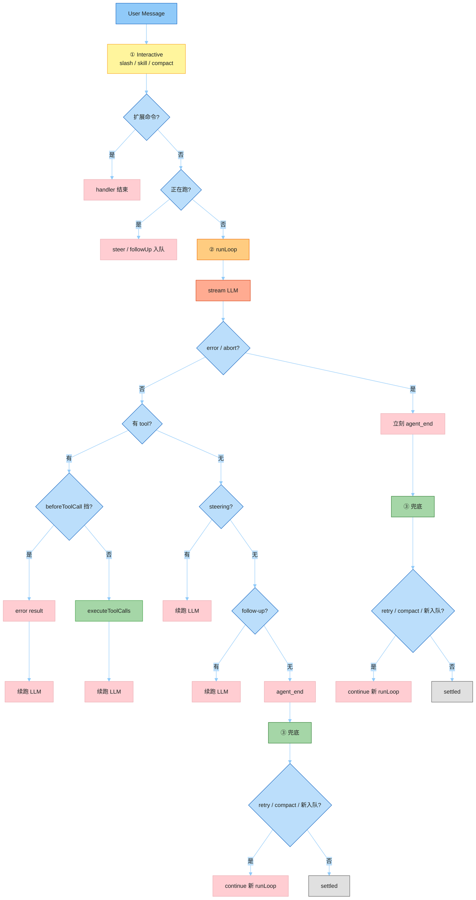

---

## 二、Runtime & memory

磁盘上是整棵树，发给模型的是当前这条 path。循环不画 UI、不写盘，只 `await emit`。UI 被踢出 await，不挡循环。

### 两份记忆

旁支、旧原文、custom 条目都还在文件里。`runLoop` 只吃 `AgentContext`：循环外叠好的 system prompt、按 compaction 裁过的当前 path、tools schema（不写进 prompt 正文）。

```mermaid
%%{init: {"theme": "dark", "flowchart": {"curve": "linear", "rankSpacing": 32, "nodeSpacing": 24, "padding": 12, "useMaxWidth": false, "htmlLabels": true}, "themeVariables": {"fontSize": "22px", "background": "#000000", "lineColor": "#CBD5E1", "clusterBkg": "#111111", "clusterBorder": "#C4B5FD", "titleColor": "#FDE68A", "edgeLabelBackground": "#111111"}, "themeCSS": ".nodeLabel,.label,.cluster-label,span{font-size:22px!important}"}}%%
flowchart LR
    DISK["磁盘：整棵 JSONL"] --> PATH["当前 leaf 回溯"]
    PATH --> CUT["按摘要裁"]
    CUT --> CTX["AgentContext"]

    classDef start fill:#BFDBFE,stroke:#93C5FD,color:#1E3A8A,font-size:22px
    classDef step fill:#A5F3FC,stroke:#67E8F9,color:#155E75,font-size:22px
    classDef prod fill:#E9D5FF,stroke:#D8B4FE,color:#6B21A8,font-size:22px
    classDef ok fill:#BBF7D0,stroke:#86EFAC,color:#14532D,font-size:22px

    class DISK start
    class PATH step
    class CUT prod
    class CTX ok
```

### 事件

`await emit` 等的是 Interactive 做完（扩展钩子 + `message_end` 落盘），不是等 TUI。TUI 订 `session.subscribe`，`_emit` 不等待。文件只 append。`message_update` 只改 `streamingMessage`，不写盘。

`Agent.waitForIdle` 等的是 `agent_end` 的 listener。`AgentSession.waitForIdle` 等的是兜底之后的 `agent_settled`。

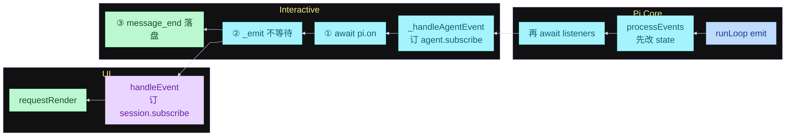

### Session 树

按 cwd 落到 `~/.pi/agent/sessions/<safe-cwd>/`。第一行是 `type: session` 的 header，之后每行一个 entry：`id` / `parentId`。当前对话位置是 `leafId`。绿是当前 path，紫的旁支仍在同一个文件里。

`/tree` 是同文件切枝（`navigateTree`）；`/fork` `/clone` 开新 JSONL。streaming 时 `navigateTree` 会抛错，界面要先 abort 再切。

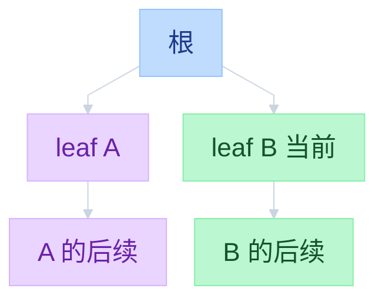

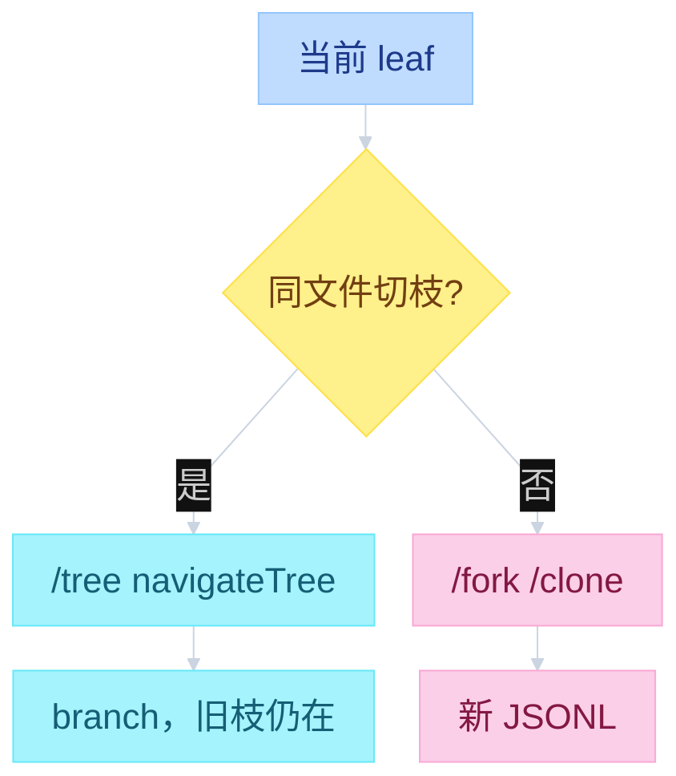

### Compaction

两处检查：发消息前、一轮结束后。模型正在说话时不压。已经撑爆可以丢掉失败回复再跑；快满了只压不重跑。磁盘旧行不改，末尾多一条 `compaction`。下次发给模型时换成 `
`。

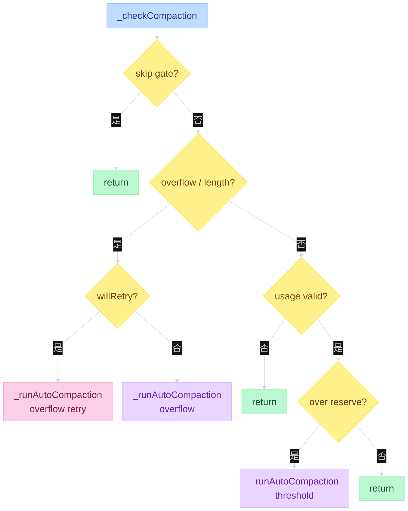

| 门 | 源码条件 | 含义 |
|----|----------|------|
| skip gate | `enabled==false` / 一轮结束后遇到 `aborted` / assistant 早于最近 compaction | 这一轮根本不该压 |
| overflow / length | **同模型**且 `isContextOverflow` 或 `isRecoverableLength` | 这一句已经撑爆或被截断。换过模型则跳过这门，仍可走 threshold |
| willRetry | overflow 分支里 `stopReason != stop` | 摘掉失败 assistant，压完 `continue`；`stop` 则只压不重跑 |
| usage valid | `calculateContextTokens` 或 `estimateContextTokens` 能拿到数 | 没有有效 usage 就不走 threshold |
| over reserve | `tokens > contextWindow - reserveTokens` | 还没爆，但留给下一句的空位不够 |

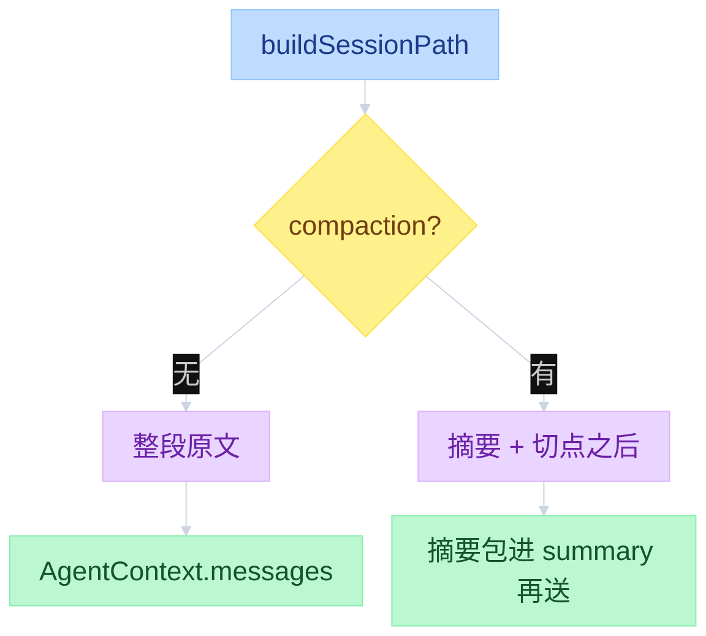

### System prompt

tools schema 走 `context.tools`。system prompt 是栈，不是单文件覆盖。项目 `.pi/SYSTEM.md` 替换全局那份；`AGENTS.md` / `CLAUDE.md` 可以从 `~/.pi/agent/` 叠到 cwd。skill 列表要有 `read` 才挂，只写 name / description / location，模型用 `read` 去拉正文；用户打 `/skill:name` 会把 SKILL.md **全文**塞进这一句。自定义 `/template` 同样在 Interactive 展开成全文。

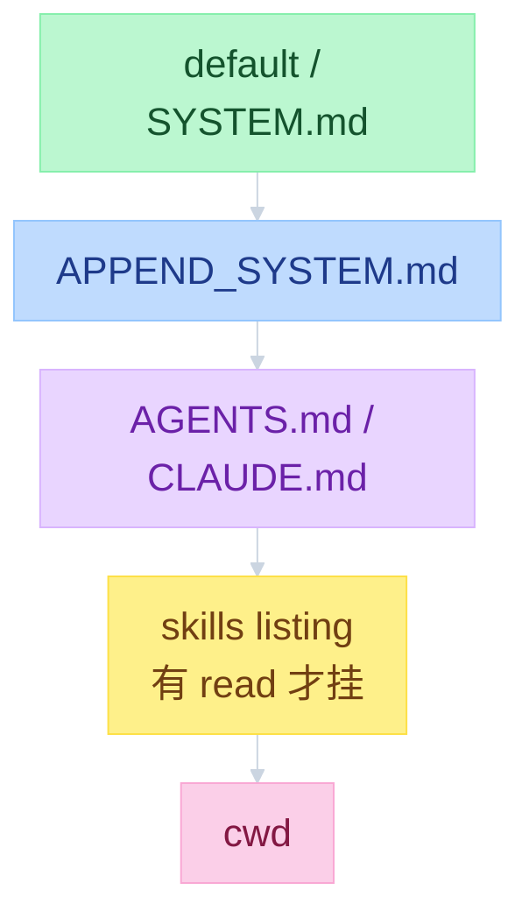

---

## 三、Extension

循环只认眼前这份工具表。缺的能力写 TS 扩展，不改 Core。默认启用四个工具（read / bash / edit / write），另有 grep / find / ls 定义但不默认打开。没有 MCP、子智能体、权限弹窗。

`registerTool` 进工具表；`registerCommand` 就地执行、不进 `Agent.prompt`；`on("tool_call")` 接到 Core 的 `beforeToolCall`，可以挡住一次工具。`pi -ne` 跳过目录和 package，仍加载 `-e`。`pi install` 写的是 `settings.packages`，不会出现在 `extensions/` 里。

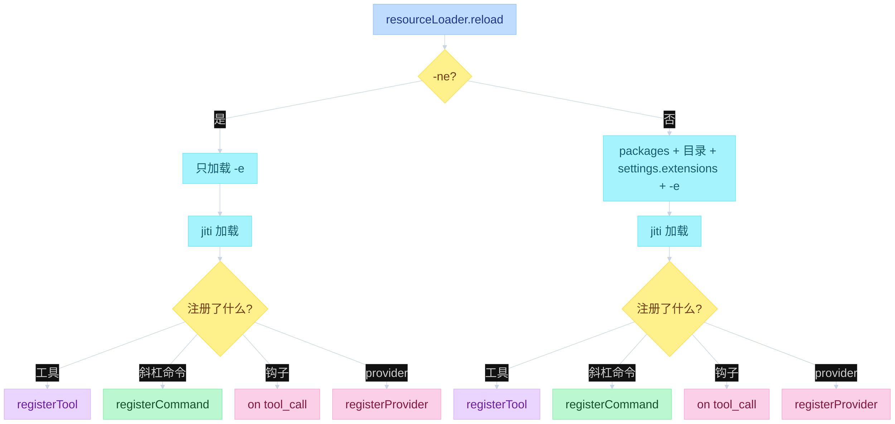

---
