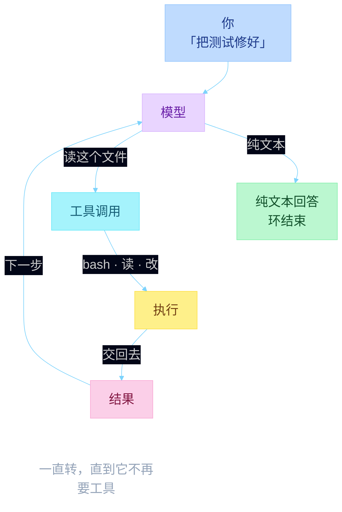
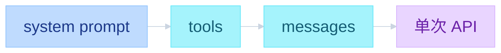
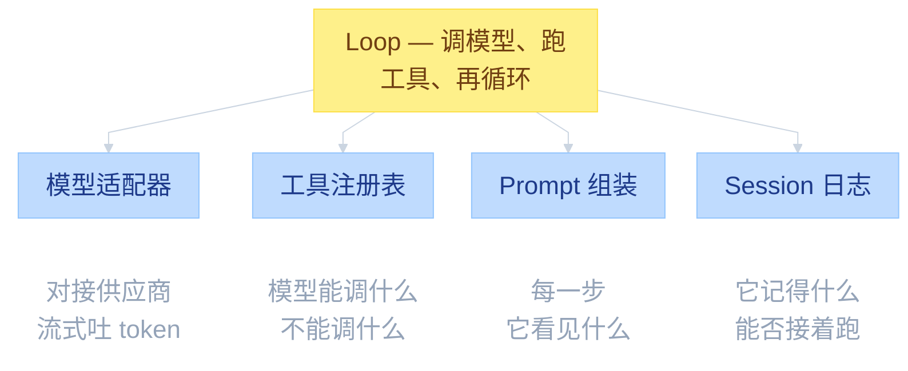
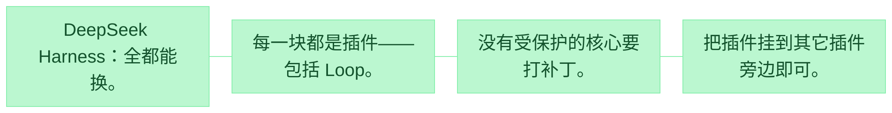
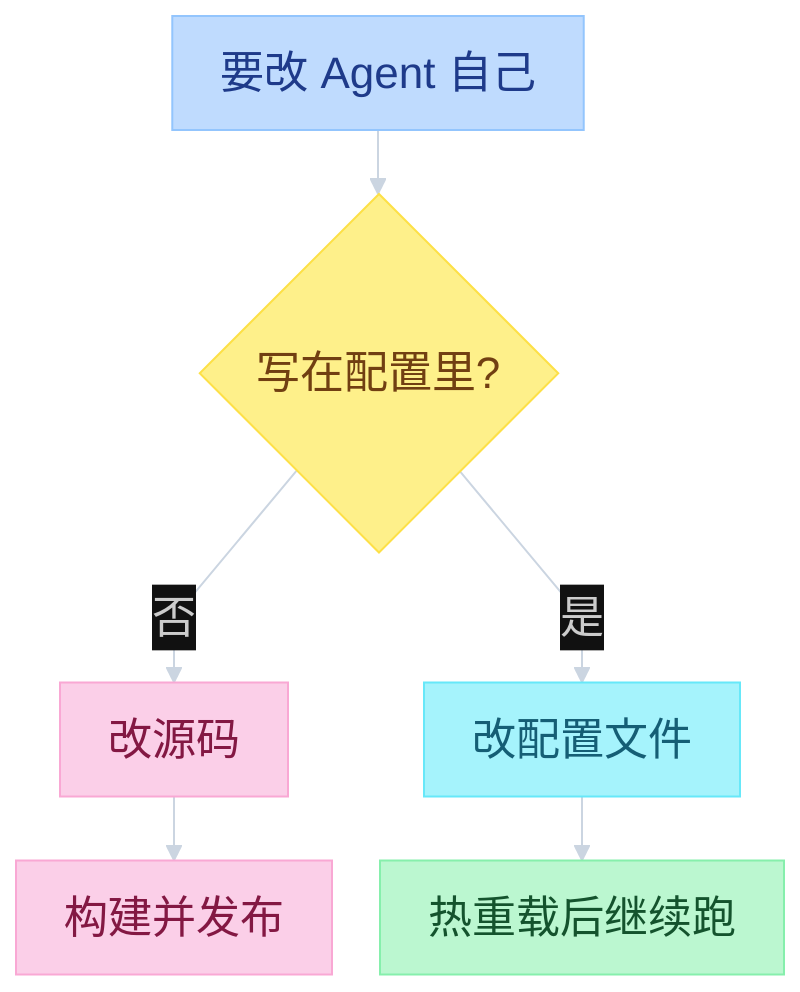
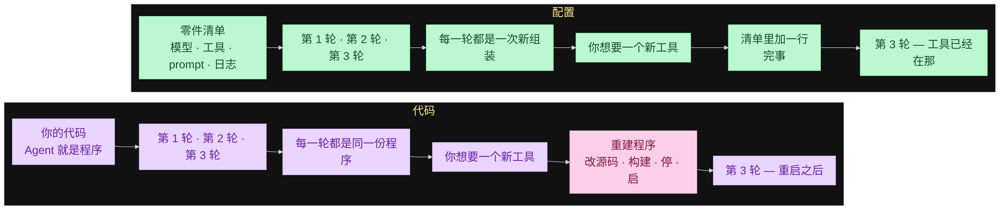
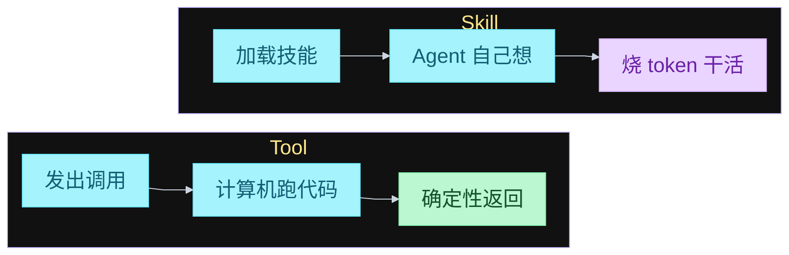

# DeepSeek Harness 架构解析 -- 到底改变了什么， 值得思考

DeepSeek Harness 刚出来不久，星数已经很高，仓库里大约有 12,000 次提交。题目偏进阶，但下面会用尽量简单的视角讲：既看清这个 Harness 为什么特别，也把「编码 Agent 到底是什么」过一遍。

适合两类人：

- 已经在用 Claude Code、Codex、Cursor，想弄清底层细节
- 想给自己的 AI 产品里嵌一套 Agent

Vibe coding 让很多人第一次能做出 SaaS 和软件。默认路径往往是：把已经用过的东西再做一遍，普通 App、普通 SaaS。AI 开发真正往前走的方向，是把 Agent 做进产品里。

---

## 所有 Harness 共用的 Agent Loop

DeepSeek Harness 和别的 Harness 一样，底层模型几乎相同。Claude Code、Hermes、DeepSeek Harness（以及讲者自己的 Shockwave）都走这一套：

这就是所有 Agent Loop 的骨架。

**Agent Loop**

模型不再要工具时，环就停。

- Step — 绕一圈。
- Turn — 一直绕到出环。
- Tool — 它可以调用的函数。

Agent 并不因为模型更好才聪明。环只是转得更久，工具更好。

一眼看去像一大坨 JSON，其实可以拆开。Agent 真正「是」的东西只有两块：

- **模型**：一次次被调用的 LLM
- **本机循环**：驱动 loop、执行工具、拼上下文——跑在你电脑上

一次「发消息」里，真正打到 Anthropic / OpenAI 的，只有那一次 API；其余编排全在本地。

---

## 一次 API 调用里到底有什么

以 Claude Opus 为例，发给模型的不是「一句话」，而是一次打包：

对话比直觉更「事务化」。第一轮：用户消息进模型 → 可能走工具 → 回复你。下一轮并不是「模型自己记得」，而是 **把整段历史再发一次**。每一次都是独立 API，只是 `messages` 越攒越长。

---

## Coding Agent 其实只有四块

Loop 拆开后，Coding Agent 就是：

1. **模型**：你选的那颗 LLM
2. **工具注册表**：塞进 API 的 tools（示例里的两个天气/机票工具）
3. **Prompt 组装**：那份 system prompt
4. **Session**：本机负责记住 messages，每轮把更长的对话送回去，让模型只「回答最新一条」

**Harness 到底是什么**

模型是租的。Harness 才是你自己的。

每个编码 Agent 都有这四块，只是不一定这么命名。

把不同 Harness 分开的那一问：

**哪几块可以换掉，而不必 fork 整个项目？**

到这里，编码 Agent 的基本盘就齐了。接下来才是：既然大家都这么干，DeepSeek Harness 差在哪？

---

## 真正的分水岭：代码 vs 配置

核心概念是 **code vs config**。讲者提到 Forcel 的 Eve 项目也走类似路线（未深挖）。

此前大多数 Harness 把「怎么跑、有哪些工具」全写在 **代码** 里。以 Shockwave 为例：里面有 AI Agent、有 tools。问「你有哪些工具？」——工具定义、整份 system prompt，全在代码里。这不一定是坏事。

Shockwave 的 system prompt 在代码里拼出来：SOUL.md（各家 Agent 都有这类 soul 文件）再加上其它片段。工具、提示、人设，全是代码。Agent **理论上**能改自己：去下源码、改文件。但它 **没法自己走完「构建 → 重新部署」**。代码要经过编译/打包才变成程序。Next.js 网站同理：改完还要 build、还要部署。代码必须被构建并发布，Agent 很难原地改自己。

DeepSeek 的做法：把「Agent 是谁、system prompt、模型、甚至 loop」全部变成 **配置**。代码仍在跑，但 **指引代码的是配置**。配置不是正在执行的程序，Agent 可以直接改配置，从而改自己。

**为什么改配置零成本**

两条路每一轮都会把 Agent 再组一遍。差别只在于：用什么来组。

代码列：进程启动时构建一次。配置列：每一步开始时重新组装。

重建反正都会发生。你不是在触发一次重建，而是在改下一次用什么来组。

现场跑过：Agent 在对话中途给自己加了一个 tool，下一步就调了。什么都没重启。

---

## Tool 和 Skill 不是一回事

Agent 能写 Skill，这大家都知道。Hermes、Shockwave 一类工具里，你可以说「做个做 XYZ 的 skill」，之后它就多了一种能力。但 **tools 和 skills 并不等价**。

| | Tool | Skill |
|--|------|--------|
| 本质 | 函数 / 代码 / 能力，挂在 Agent 上 | 由 Agent **自己执行** 的流程 |
| 谁干活 | 计算机跑代码，路径确定 | Agent 在想、跑脚本、烧 token |
| 例子 | 「今天天气？」→ 调天气 API → 原样返回 | 读 skill → 看里面有什么脚本 → 再决定怎么跑 |

天气查询是直路：调 API，天气是多少就是多少，确定性返回。Skill 则是 LLM 在干活，不是电脑替它把结果算完。

若 Agent 能 **自己造 tool、当场装进自己的 loop、改 Harness、改工具、再 reboot**，而且不用重新编译——它就可以改自己的运行方式。

天气查询更能说明差别：

- **Skill 路径**：Agent 想「上海现在什么天气」→ 加载 skill → 看到有查天气脚本 → 再跑脚本。LLM 在中间推理。
- **Tool 路径**：模型直接 `get_weather_data("Shanghai")` → 代码打 WeatherStack → 返回温度 / 天气 / 湿度 → 模型只负责把结果说出来。

天气必须落在接口里，数字才是测出来的；不能靠模型「感觉」今天多少度。

---

## 对照：AI SDK 写死代码 vs DeepSeek 读配置

讲者并排了两个项目。

**AI SDK Hello World**：有一点配置（模型、provider、base URL、system prompt），但 **定义 Agent 的主体是代码**。两个工具 `list_directory`、`read_file` 写在代码里。引擎一启动，这些代码进内存，**运行期间改不了**。

**DeepSeek Harness**：几乎全是 settings / 配置文件。不是「写代码再启动 Agent」，而是 **Agent 先跑起来，再去读配置决定自己怎么工作**。配置一改就热重载，Agent 接着干：自己定义工具、重定义自己、改配置。文件变了，它 reload，从新配置继续。

部署形态：

- **SDK**：嵌进你自己的 App。Shockwave 这类桌面应用也可以接这套 SDK，自己做界面。
- **Web 门户**：Harness 自带一套网页，直接叠在 DeepSeek Harness 上面，开箱就能聊。

---

## 这意味着什么

做软件时，可以做一个 **能改自己的 Agent**，而不必事先穷尽它能做的每一件事。

讲者承认：落地场景还要再想。你可能 **并不希望** 它什么都能改。怎么用、边界在哪，目前还开放。但方向上这是一大步：Agent 可以在自己的递归 loop 里改自己、重造自己，**不必等外部的人重新构建、重测、再发版**。

---