# 端侧 Agent（On-device Agent）

随着 NPU、端侧芯片和模型压缩成熟，AI 从云端走到手机、PC、网关和现场设备。现在的 Edge AI 不再只是 TinyML / 视觉检测，主线已经变成 **on-device LLM + 端侧 Agent**：模型、记忆、工具都在本机，默认不出域。

本文只谈**推理与 Agent 运行**（不谈训练放哪）：端侧 Agent 是什么、和云端 Agent 差在哪、一轮怎么走、工具如何拦出域，以及学它要补哪些知识。

## 什么是端侧 Agent

端侧 Agent 是跑在数据产生处的 Agent：本地 LLM 读本机上下文，调本机工具，在本机闭环动作。家庭 / 工厂 / 院区网关是**近场边缘**；云只做可选协同，默认不上完整原始流。

它和两类旧形态不同：

- **经典 Edge AI**：单次感知模型（检测、分类、TinyML），没有多步 tool loop。
- **云端 Agent**：上下文、检索、工具都在公网；端侧把这套 loop 搬到本机。

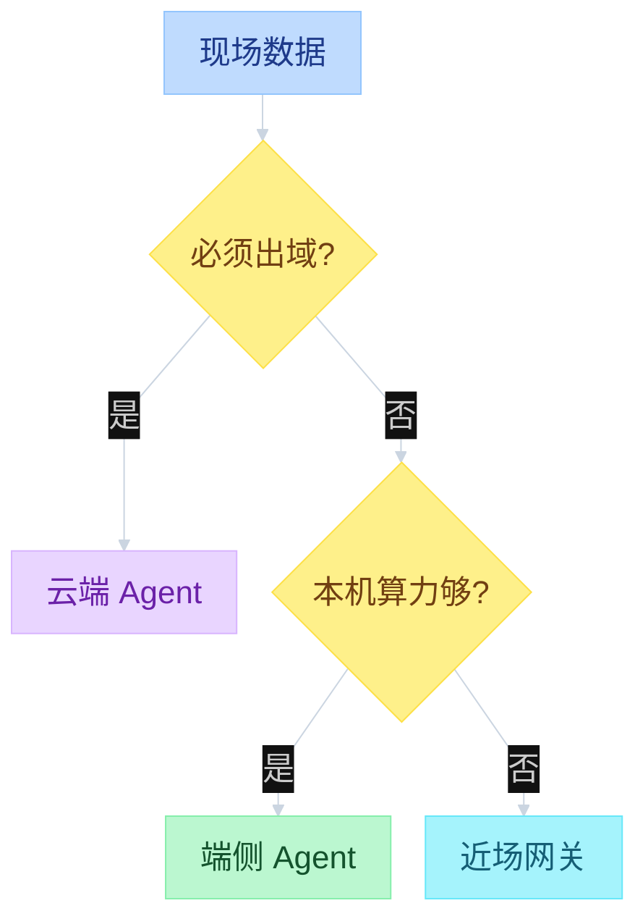

**端侧（on-device）**：手机本地大模型与 Agent（离线语音、通话翻译、计算摄影、AR 跟踪、本地摘要、隐私文本、人脸解锁）；PC 文档解析 / 会议纪要 / 本地 RAG；XR 头显；机载无人机。

**近场边缘**：家庭 Agent 网关（人形 / 烟火 / 宠物、全屋联动、录像语义检索）；工厂视觉与预测性维护；院内影像节点。

**尽量不上云**：生物信号、工业图、监控视频、企业文档。弱网仍能识别与动作。

典型落点（同一套「本机闭环、只上报警」）：

- **手机 / PC**：on-device LLM / agent，敏感内容不出本机。
- **穿戴**：心电、跌倒、睡眠；TinyML；原始生物数据不上云。
- **家居 / 工业 / 医疗 / 城市 / 零售 / 农业**：本地检测 + 现场 Agent；厂内网 / 院区闭环。
- **无人机 / XR**：机载或头显上实时识别与空间跟踪。

## 为什么跑在端侧

云端 Agent 适合超大模型、全球可达（如跨机构风控）。端侧 Agent 适合数据敏感、要离线、或动作必须贴着设备发生。

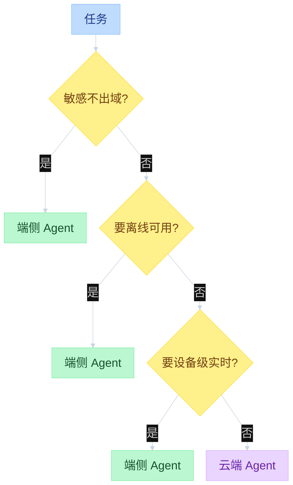

收益对应四件事：延迟（本机 NPU，不走公网 RTT）、带宽（视频 / 文档不上传）、断网（loop 仍转）、隐私（原始数据不进第三方）。

## 运行时三层

端侧 Agent 不是「把云端 API 换成本地权重」就结束。要拆成 UI、Agent loop、本机运行时。事件从本机产生，经 Agent，再到 UI。

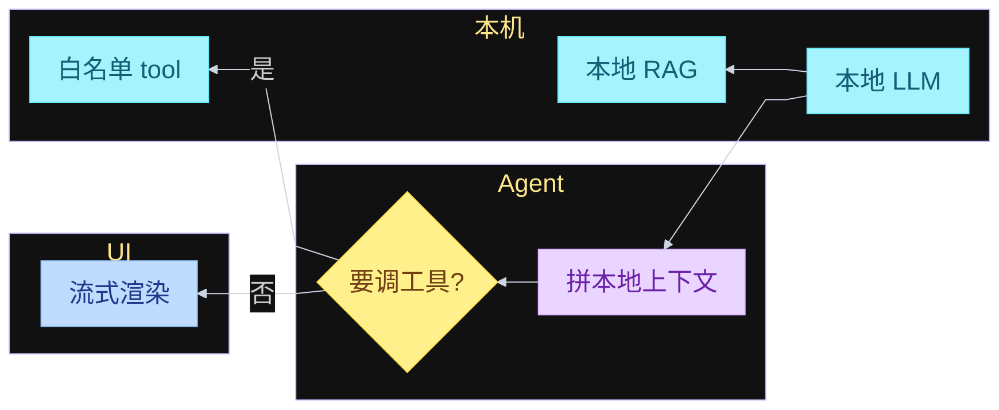

本机运行时通常包括：量化后的本地 LLM（NPU / GPU / CPU）、本地 RAG 与会话记忆、设备工具（文件、相机、家居、工业 PLC）、以及**出域网关**（默认关）。

## 一轮怎么走

和云端 Agent 一样是「LLM → 是否 tool → 再跑」；差别是 generate 和 tool 都在本机。循环不画回边：工具执行后落到「续跑」终点。

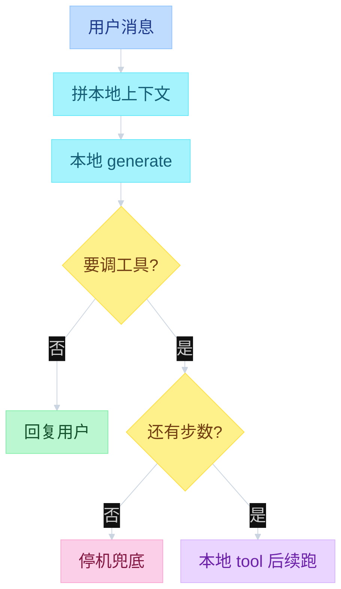

步数 / 电量 / 内存都是停机条件。端侧比云端更早停：KV cache、热和电池都是硬预算。

## 工具门：默认不出域

端侧 Agent 的安全核心不是「模型更准」，而是 **tool 不能把数据送走、不能静默改系统**。每个 `是` 单独出口。

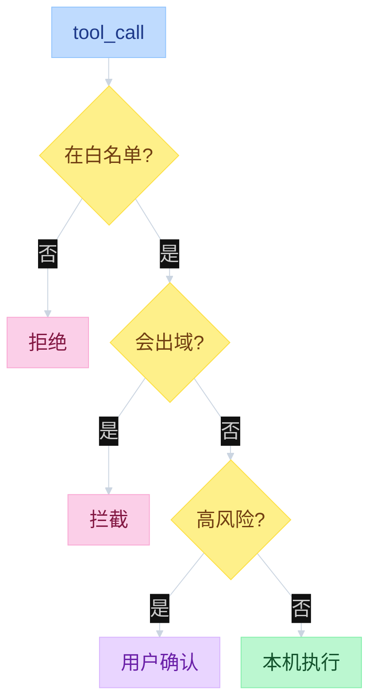

白名单只暴露本机能力：本地文件、本地检索、系统设置、相机 / 传感器、家居与工控点。网络 tool 默认没有；若业务必须协同云，只允许报警 / 摘要，并走确认。

## 工作流：力气花在塞进本机

通用 AI 流程如下。端侧与云端**步骤相同**，但相对工时不同：云端 Agent 多花在 prompt、云工具、评测；端侧还要过后半段的硬件优化、翻译上板，以及整机出域门。

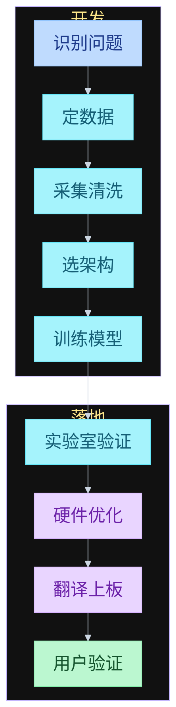

前半段是问题、数据、架构、训练；后半段才是实验室验证、为硬件优化、翻译到目标芯片、真实用户验证。步骤看起来像一条流水线，但任何一环失败都要改前面的选型（图上不绕回）。

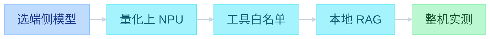

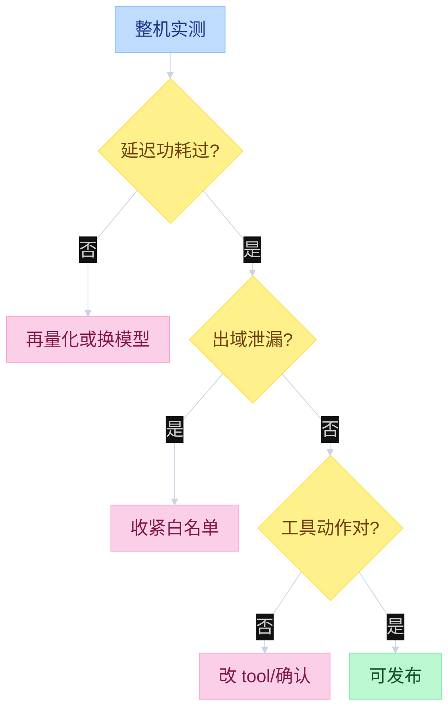

相对云端，端侧更重的是：系统级验证（和 OS / 传感器 / 家居 / PLC 一起测）、模型塞进 NPU 内存、工具与隐私门、安全关键动作的确认与兜底。

## 塞进目标硬件

端侧几乎总是资源受限：算力、内存、功耗、散热。常见手段：

- **换小模型 / 蒸馏**：端侧 1B–8B 级 instruct，而不是云端最大模型。
- **量化**：4-bit / 8-bit 上 NPU；视觉 TinyML 仍用剪枝与更激进的压缩。
- **上下文变短**：本地 RAG 只灌相关块；会话要压缩或截断，不能按云端无限 messages。
- **运行时**：llama.cpp / MLX / Core ML / QNN / ExecuTorch 等，目标是稳定吃满 NPU，而不是在本机解释器里跑完整 Python 训练栈。

感知类模型（质检、跌倒、烟火）仍可走「小模型 + 规则」；语言与编排走端侧 LLM。两者可以同时存在：摄像头本地检测，家庭 Agent 再决定联动哪盏灯。

## 安全：可预期比「更聪明」更重要

安全关键场景（工控、医疗、驾驶辅助、门锁）要求稳健，而不是偶发高分。Agent 侧常用组合：

**策略内才动**  
输入或 tool 意图超出允许分布 / 允许技能，则不用模型输出，改规则或请用户确认。

**工具确认**  
高风险（支付、删除、下发工控、解锁）必须人确认；模型不得静默执行。

**出域为零默认**  
日志、崩溃上报、语音助手「帮我搜一下」都可能把上下文带出本机。默认拒绝；要开就单独授权、只发摘要。

**设备约束当硬规则**  
功率上限、运动范围、剂量、转速写成 tool 层校验，不指望模型自己守物理定律。

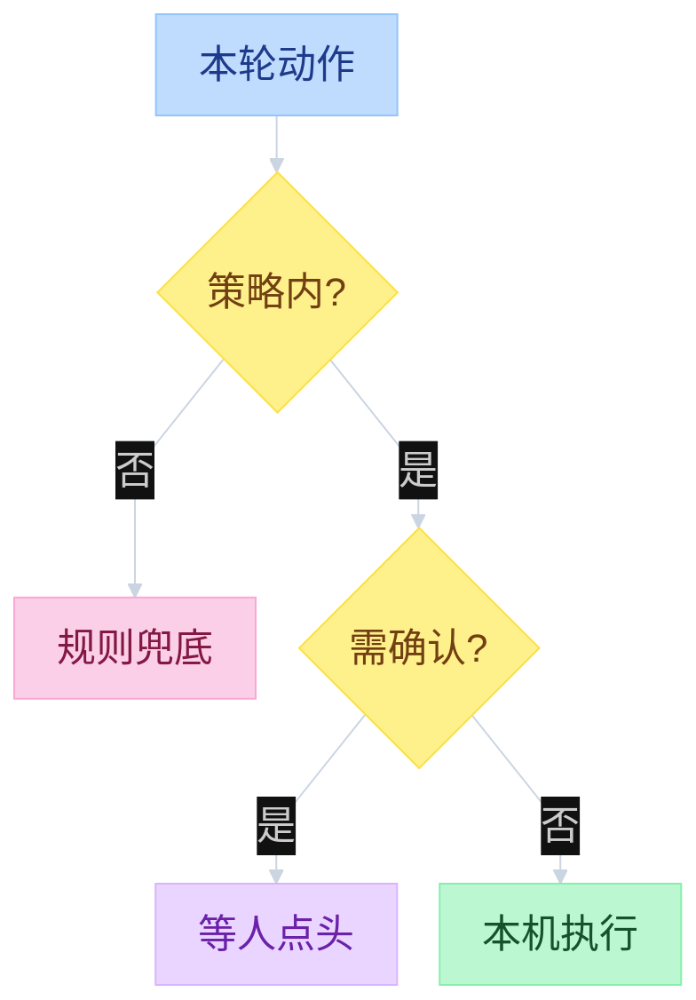

## 学端侧 Agent 要补齐什么

端侧 Agent = **云端 Agent 的 loop** + **本机推理** + **设备工具与出域门**。缺一块都会在整机上翻车：只会调云 API 的人塞不动 NPU；只会跑 GGUF 的人写不出可停机的 tool loop；只会做 TinyML 的人没有多步编排。

建议按依赖学，不要一上来堆框架名。

```mermaid
%%{init: {"theme": "dark", "flowchart": {"curve": "linear", "rankSpacing": 32, "nodeSpacing": 24, "padding": 12, "useMaxWidth": false, "htmlLabels": true}, "themeVariables": {"fontSize": "22px", "background": "#000000", "lineColor": "#CBD5E1", "edgeLabelBackground": "#111111"}, "themeCSS": ".nodeLabel,.label,span{font-size:22px!important}"}}%%
flowchart LR
    A["Agent loop"] --> B["本地 LLM"]
    B --> C["本机工具"]
    C --> D["出域与权限"]
    D --> E["硬件预算"]
    E --> F["整机评测"]
    class A start
    class B,C,D,E step
    class F ok
    classDef start fill:#BFDBFE,stroke:#93C5FD,color:#1E3A8A,font-size:22px
    classDef step fill:#A5F3FC,stroke:#67E8F9,color:#155E75,font-size:22px
    classDef ok fill:#BBF7D0,stroke:#86EFAC,color:#14532D,font-size:22px
```

已经会其中某段就跳过；不会就按门补，不要并行六条线。

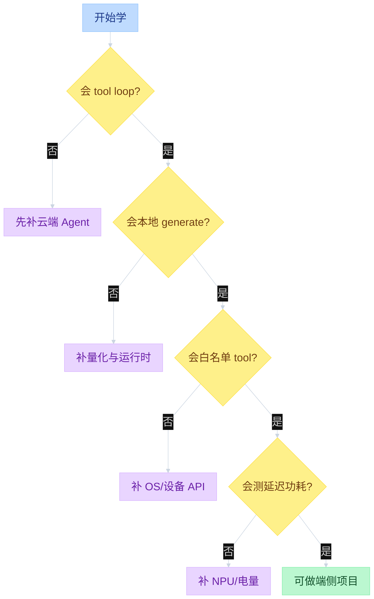

### 1. Agent 本体（可先在云端练）

和端侧无关、但必须先会：messages、system prompt、tool schema、`tool_call` 解析、多步 loop、步数停机、失败重试、把 tool 结果写回上下文。本仓库前面的 Hermes 笔记就是这块。端侧不改 loop 形态，只是把 generate 和 tool 换成本机。

补齐标志：能自己写一个「LLM → 工具 → 再 LLM」循环，并说清楚何时停。

### 2. 本地 LLM 推理

把「HTTP 调大模型」换成「本机加载权重并 decode」。

- **格式与量化**：GGUF / MLX / Core ML / QNN / ExecuTorch；4-bit / 8-bit 对质量、速度、内存的影响。
- **Decode 机制**：prefill vs decode、KV cache、上下文长度、batch=1 的端侧现实。
- **运行时**：llama.cpp、MLX、ONNX Runtime、厂商 NPU SDK。先跑通一条路径（例如 PC 上 llama.cpp），再迁手机 / 网关。
- **小模型选型**：1B–8B instruct、tool-call 是否稳定、多模态是否本机做。

补齐标志：同一台机器上能测 tokens/s、峰值内存、长上下文是否 OOM，而不是只看「能聊」。

### 3. 本机上下文：记忆与 RAG

端侧上下文短，不能把云端那套无限 messages 搬过来。

- 会话截断 / 摘要压缩。
- 本地向量库或倒排：文档块、权限范围（用户 A 看不见用户 B）。
- 何时灌 RAG、灌多少、与 KV 预算怎么抢。

补齐标志：敏感文档只在本机检索，断网仍能按文件回答。

### 4. 设备工具与 OS

这是端侧相对云端多出来的主课：Agent 要动的是相机、文件、通知、蓝牙、家居、PLC，不是搜索 API。

- 各平台能力与权限模型（Android / iOS / 桌面 / 嵌入式 Linux）。
- 工具做成**窄接口**：参数可校验、失败可结构化返回。
- 异步与生命周期：App 进后台、NPU 被系统收回、工具超时。

补齐标志：至少一个真实设备 tool（读日历、控灯、读传感器）走完白名单，而不是 mock HTTP。

### 5. 出域、权限、安全

默认假设任何网络调用都会漏上下文。

- 工具白名单、网络默认关、高风险确认。
- 日志 / 崩溃上报 / 「帮我搜一下」的数据面。
- Prompt 注入：不可信文件、截图 OCR、网页片段进本机上下文时的隔离。
- 工控 / 门锁类：物理上限写在 tool 层。

补齐标志：能画出数据从传感器到 LLM 再到 tool 的路径，并标出每一处能否出域。

### 6. 硬件预算：NPU、内存、电、热

- 芯片分工：CPU 编排、NPU 矩阵、GPU 可选。
- 内存墙：权重量化后仍要给 KV、OS、App 留 RAM。
- 功耗与热：持续 generate 会降频；穿戴更狠。
- 实时：语音 / AR / 视觉要固定帧时延，Agent loop 不能把感知线程堵住。

补齐标志：能解释「为什么 7B 在这台机上聊两轮就卡」——是权重、KV、还是没走 NPU。

### 7. 感知小模型（可选，但现场场景常要）

质检、跌倒、烟火、唤醒词往往不是 LLM 做的。需要：

- 经典 Edge：检测 / 分类、量化、TinyML。
- 和 Agent 的接法：小模型出事件，Agent 决定调哪些设备 tool。

不做工业 / 摄像头可以后补；做手机语音助手则至少要唤醒与 ASR 的端侧概念。

### 8. 整机评测

云端看正确率；端侧还要看用户愿意开。

- 延迟（首 token、工具往返）、功耗、内存峰值。
- 出域泄漏测试、权限拒绝时的降级。
- 断网、杀进程、NPU 繁忙时的行为。
- tool 轨迹是否符合白名单，而不是只看最终一句自然语言。

补齐标志：有一份本机清单（速度 / 电量 / 泄漏 / 动作），而不是只有对话截图。

### 不必先深挖的

训练从零、自研加速器编译器、云端万卡调度，对「把 Agent 跑在本机」不是第一门课。先会 **loop + 本地 generate + 白名单 tool + 测资源**，再按目标平台加 NPU SDK 或 TinyML。

## 小结

端侧 Agent 是把 **LLM + tool loop + 记忆** 放到本机：默认不出域，云只做可选摘要协同。和云端 Agent 比，loop 形态相同，工时转向 NPU 量化、上下文预算、工具白名单和整机实测。和经典 Edge AI 比，多了多步编排，而不只是单帧检测。学习上先齐 Agent loop，再补本地推理、本机工具、出域门、硬件预算和整机评测。
