# Agent 长期记忆（以 Mem0 为例）

如果你希望 Agent 能跨对话记住：关于你的事、关于它自己的事、以及它从世界里学到的东西，就需要一套 **Agent 记忆系统**。本文介绍长期记忆是什么，再拆一套常见实现：**Mem0**——它用哪些存储拼出完整长期记忆、写入（ingestion）和检索（retrieval）怎么走、以及全程用本地模型时该怎么选模型。删除单条记忆的细节不在本文范围。

## 目录

1. [长期记忆 ≠ 会话记忆](#1-长期记忆--会话记忆)
2. [Mem0 用的三套存储](#2-mem0-用的三套存储)
   - [2.1 主记忆](#21-主记忆main-memory向量库)
   - [2.2 实体库](#22-实体库entity-store--entity-memory)
   - [2.3 SQLite](#23-sqlitemem0-存储架构的账本不是第三种记忆)
3. [写入（Ingestion）](#3-写入ingestion)
   - [3.1 程序性记忆](#31-方式一程序性记忆procedural-memory)
   - [3.2 infer = false](#32-方式二infer--false)
   - [3.3 infer = true](#33-方式三infer--true本文重点)
   - [3.3.1 整轮 messages 怎么抽](#331-infertrue整轮-messages-怎么抽)
   - [3.4 加载近期上下文](#34-加载近期上下文load-recent-context)
   - [3.5 入库](#35-入库)
4. [检索（Retrieval）](#4-检索retrieval)
   - [4.0 记忆如何进入一个 turn](#40-记忆如何进入一个-turn)
   - [4.1 输入参数](#41-输入参数)
   - [4.2 管线](#42-管线)
5. [全程本地、开源模型怎么选](#5-全程本地开源模型怎么选)
   - [5.1 抽取](#51-抽取extraction)
   - [5.2 Embedding](#52-embedding)
   - [5.2.1 本地检索实用模型](#521-本地检索实用模型)
   - [5.3 微调](#53-微调)
6. [收束](#6-收束)

## 1. 长期记忆 ≠ 会话记忆

先分清：Agent 的 **长文 / 长期记忆（long-form / long-term memory）** 和 **会话记忆（conversational memory）** 不是一回事。

LLM 是 **无状态** 机器：你发一条 prompt，它处理完给出补全；你再发下一条，它 **不记得** 上一条 prompt 或上一条补全。若要助手记得自己刚才说过什么，你必须把 **整段对话历史** 和当前 prompt 一起送回去。这就是会话记忆。

```text
function flow
  LLM 无状态: 每次调用独立，第 2 次看不到第 1 次
```

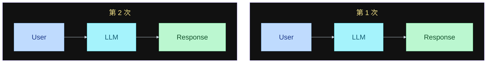

两次调用之间 **没有连线**：LLM 不持有上一轮的 prompt 或补全。

Agent scaffold / harness 会替你管这段上下文：你发一条消息 → harness 用 LLM 处理 → 拿到回复 → 把 **你的消息和回复都追加** 进它状态里的 history → 再有新消息时，把新消息接在后面，**整段再发给 LLM**。这样你在对话前半提到的事，后半还能被记住。

```text
function flow
  本轮: user message → Agent(stateful) → response
  history: message 1 .. n，结束后追加 new message + agent response
```

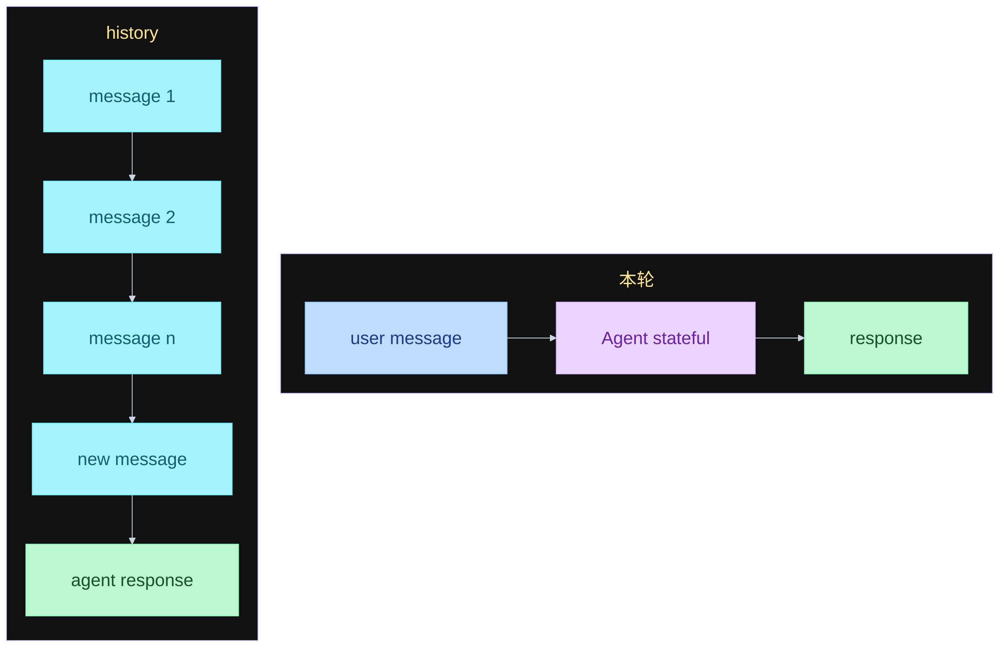

状态就是这份 `history`，在 Agent / harness 里，不在 LLM 里。本轮结束后把 new message 和 agent response 追加进去；下一轮再带整段发给 LLM。不画回边。

但这只在 **同一段会话上下文** 里有效。你新开一段对话再发消息，Agent **不会** 记得另一段会话里的事——那些内容在另一份 context 里。

要做长期记忆，就要在会话旁边再挂一个 **外部服务**：从你做过的 **每一段** 对话里存东西；Agent **每一轮** 去查这份长期记忆，用它已经知道的、关于你和关于它自己的事实来回答。这份存储 **独立于** 会话记忆。

```text
function flow
  会话记忆: 每轮把 user + assistant 追加进 history，整段再发给 LLM
  长期记忆: 独立于会话的外部存储，每轮检索，跨会话持久
```

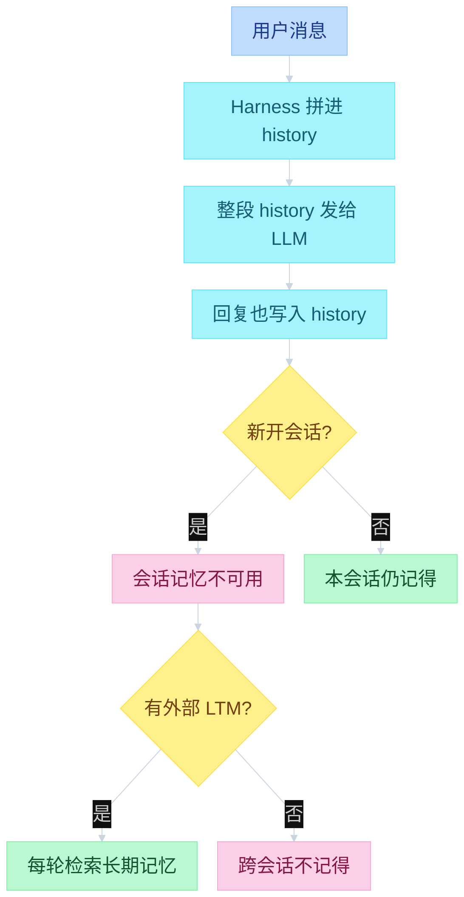

长期记忆要生效，必须 **放在会话外面**：不要和 session 写在同一个文件、同一套 store 里；要 **跨 session 持久**，也就是和你存 sessions 的地方分开。

这也意味着：若记忆是 **以用户为中心** 的，同一份记忆可以给 **多个 Agent** 用。例如你自己的口味、正在做的项目，可以在 ChatGPT、Claude、Pi 等不同 Agent 之间共享。

理想情况下，你要给 Agent **探索自己记忆的工具**；或者至少在 **每一轮 Agent turn** 上自动做写入和检索——至少也要在 **每段对话结束之后** 做一次。

---

## 2. Mem0 用的三套存储

Mem0 主要用 **三套 store**。先看总览：Main 是记忆正文 + 元数据；Entity 也是向量库，实体 **linked** 回 Main；SQLite 只做 log 和最近 10 条。实体链到 Main 写在节点上，不绕回 Mem0。

```text
function flow
  Mem0 → Stores
    Main memory: Vector DB + Memories/metadata
    Entity memory: Vector DB + Entity linked → Main
    SQLite: log + latest 10 messages
```

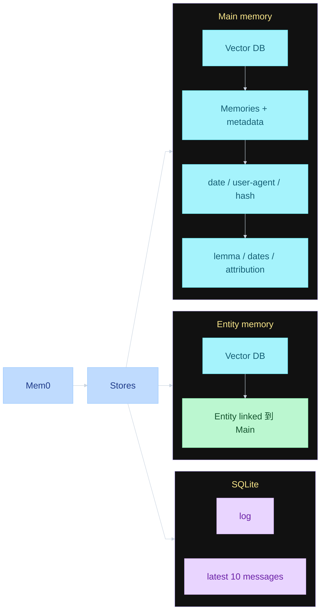

### 2.1 主记忆（Main memory，向量库）

所有记忆正文都存在这里：短段落或短句，再加上元数据。记忆本身也在这套 **向量库** 里。

例子：`用户更喜欢素食餐厅`。

元数据大致包括：

- **创建日期**；以及创建 / 更新时间
- **归属**：属于用户还是属于 Agent。用户侧例如「更喜欢素食餐厅」；Agent 侧例如学到时事、或学会某种新流程
- **记忆正文的 hash**：只用于 **去重**
- **词形还原（lemmatized）版本**：主要给后面的 **关键词检索** 用
- **过期日期（expiration date）**
- **谁创建的这条记忆**（attribution）：若有多个 Agent，记下是哪一个写进去的

这就是主记忆店：向量 store。

### 2.2 实体库（Entity store / entity memory）

Mem0 会从主记忆里抽出实体——地点、专有名词、人名等——存进 **另一套向量库**。库里每个点是一个实体；实体的元数据链到 **一条或多条** 主记忆。

例子：主记忆是「我在巴黎最喜欢的街区是蒙马特（Montmartre）」→ 实体可以是「巴黎的蒙马特」。你之后问巴黎相关的问题，会先检索到 Paris 这个实体，再看到链到该实体的全部记忆，其中就包括「最喜欢的街区是蒙马特」。

```text
function flow
  写入: 我在巴黎最喜欢的街区是蒙马特 → 抽出实体 → Paris → 链回这条主记忆
```

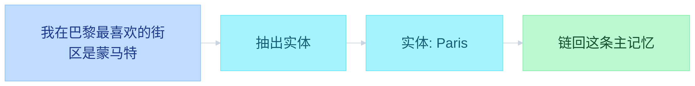

```text
function flow
  检索: 问巴黎 → 命中实体 Paris → 带回链上的这条主记忆
```

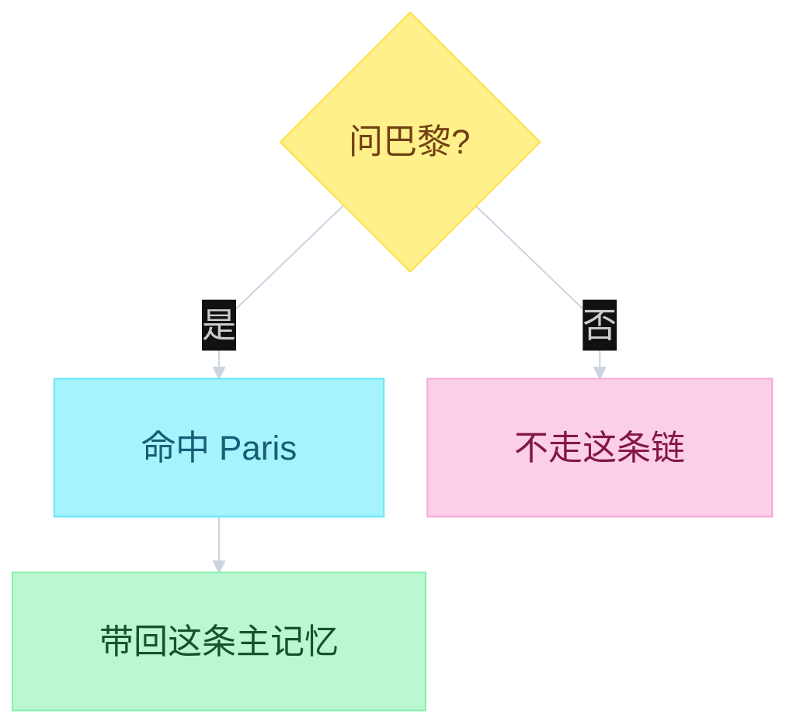

一个实体可以挂多条主记忆；问到该实体时，链上的记忆一起被看见。

### 2.3 SQLite（Mem0 存储架构的账本，不是第三种记忆）

这一节说的是 **Mem0 三套 store 里的第三块**，不是另一种记忆类型。前两块才是记忆正文：主记忆向量库、实体向量库。SQLite 是它们旁边的 **本地账本**，干两件并列的事，彼此没有先后：

1. **变更日志**：主记忆 / 实体库里每次增、改、删，都留一条流水。向量库负责「现在有什么、怎么搜」；日志负责「曾经改过什么」。对账、回放、查一条记忆怎么来的，看这份历史。
2. **最近 10 条消息**：每次写入 pipeline 被触发，把送进去的消息写入 SQLite，**只留最新 10 条**。抽记忆的 LLM 会读这 10 条，用来消解代词、接上话头。例如新消息是 `it is great` / `he's really good at this`，单独看不知道 `it` / `he` 指谁；带上前几轮，才敢写成「用户更喜欢素食餐厅」这种记忆。

一句话：**日志记向量库怎么变；最近 10 条给抽取器看此刻在聊什么。** 两者都不是长期记忆正文，正文和检索仍走前面两套向量库。

```text
function flow
  主记忆: 短句记忆 + 元数据（日期 / 用户或 Agent / hash / lemma / 过期 / 创建者）
  实体库: 实体向量点 → 实体向量库；同时实体数据链到主库
  SQLite: 变更日志、最近 10 条消息（两件并列，无先后）
```

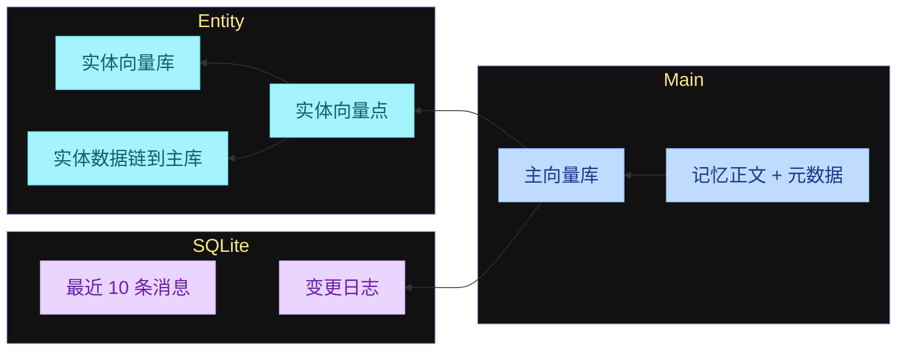

---

## 3. 写入（Ingestion）

写入在 Agent **想存新记忆** 时跑，并且是在 **每一轮 Agent turn 之后** 执行：你让 Agent 做事，它做完这一轮（继续任务或收尾），把这一轮产生的消息送进这条 pipeline。输入就是 **messages**。

消息变成库里的记忆，主要有 **三种** 方式。

### 3.1 方式一：程序性记忆（procedural memory）

吃进一批消息，**总结** Agent 做的过程 / 动作，方便以后检索并复现同一套流程。适合：Agent 刚做完一件事，你希望它精确记得用了哪些 tool call、拿到了什么结果。

这条现在不太常用——直接从对话记录里抽一条 **skill**，通常更好。

### 3.2 方式二：`infer = false`

把送进 pipeline 的输入消息 **直接 embed，原样写入数据库**，存的就是消息本身。

### 3.3 方式三：`infer = true`（本文重点）

触发 **LLM 抽取 pipeline**，这是给长期 Agent 做记忆更精细、更进阶的做法。

一个 turn 里往往既有对话，也有 tool call。它们不是两种写入方式，而是 **同一份输入**：turn 结束后，把从 user 到 final answer 的整段 messages 一次性交给 `infer=true`。LLM 从整段里抽短句事实；tool 过程只当上下文，不会再单独跑一遍 procedural。

### 3.3.1 `infer=true`：整轮 messages 怎么抽

假设这一轮结束后，送进管线的内容是：

```text
user 消息
  → assistant（可能带 tool_calls）
  → tool 结果
  → …再几轮 loop…
  → assistant final answer
```

中间 loop 写在节点上，不连回起点。

```text
function flow
  输入: 整轮 turn 的 messages（含 tool），不是只抽 user 一句
```

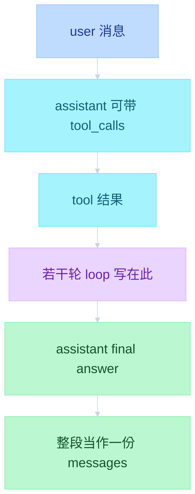

`infer=true` 吃的是上面那份 `PACK`，不是三种方式各存一次。

```text
function flow
  infer=true: 整段 messages → 加载抽取上下文 → LLM 吐 JSON → 主记忆
  主记忆落库后: 抽实体进实体库；SQLite 记近 10 条和变更日志
```

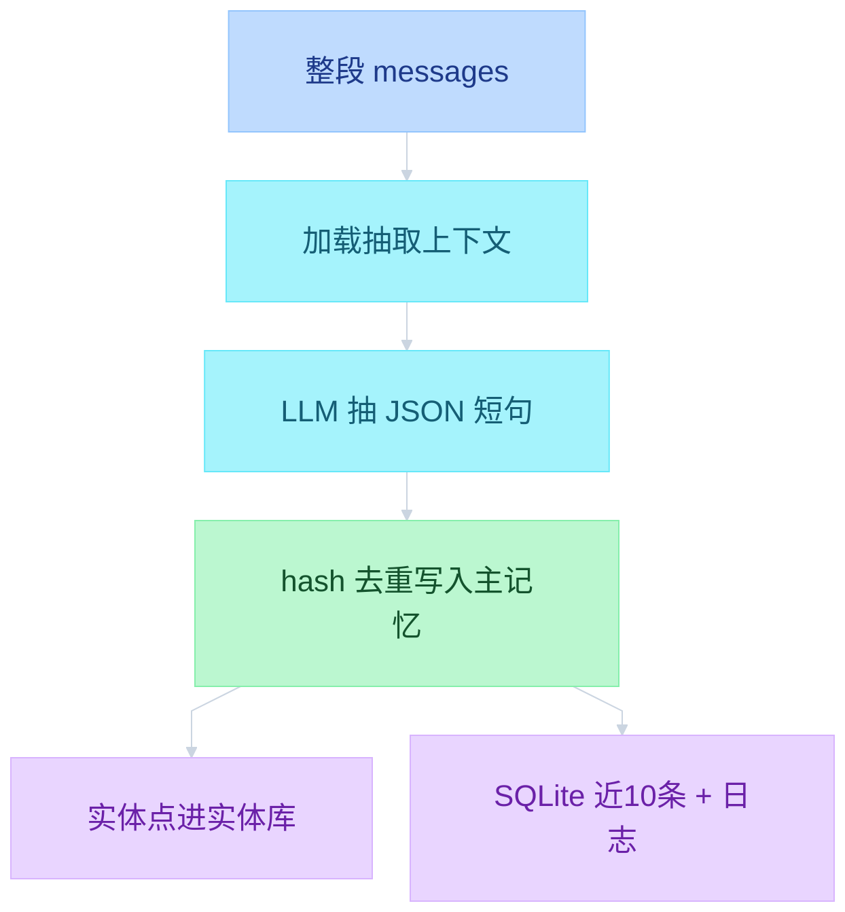

上下文里会拼：抽取器角色、用户摘要、这份 messages、主库里的相关记忆、SQLite 最近 10 条、对话日期和当前日期。细节见下一节。

设好 `infer = true` 并把输入消息送进写入管线之后：

### 3.4 加载近期上下文（load recent context）

抽取由 LLM 完成：把这些消息交给 LLM，让它吐一份 **结构化 JSON**，里面是抽出来的全部记忆。为此 LLM 需要非常具体的 prompt，以及关于用户、关于当前在谈什么的上下文，才能抽出相关记忆。

Prompt / 上下文里有：

1. **角色**：memory extractor
2. **用户摘要（user summary）**
3. **本次输入的 messages**
4. **相关记忆（relevant memories）**：把 messages **展平（flatten）成一根字符串**，对这批消息做 embedding，再在已有库里搜与之相关的记忆，把命中的相关记忆也拼进 context。相关记忆来自 **主向量库**
5. **最近 n 条消息**，理想是 **最近 10 条**，来自前面说的 **SQLite**。每次触发这条 pipeline，都会把该消息写入 SQLite，并且 **只保留最新 10 条**。用途是消解代词：新消息里若有 `it is great`、`he's really good at this`，没有前几句就不知道 `it` / `he` 指谁
6. **对话日期** 和 **当前日期**

然后 prompt 导出那份 JSON，作为要导入系统的记忆。

例子：抽到 `用户更喜欢素食餐厅`。

### 3.5 入库

这条记忆写入主记忆 store，带上：

- 添加或更新的日期
- 来自用户还是 Agent
- **hash，并与现有库做去重**。这里是 **hash 去重**，只对 **措辞完全相同** 的记忆有效。不是最精细的去重，但 Mem0 就是这么做的
- **词形还原版本**：整句 lemmatize，和记忆正文一起存，供之后关键词检索

同时写入 **SQLite**，用来跟踪最近送进 pipeline 的消息。

最关键的一步是 **基于 LLM 的抽取**。可以用很小的模型。Mem0 侧常见搭配是 **GPT-5 Mini** 量级；你也可以用很小的开源模型在自己机器上免费跑，因为任务直白、简单。本地模型推荐见文末。

```text
function flow
  本轮消息
    → procedural: 总结过程 / tool call（现多被抽 skill 替代）
    → infer=false: 直接 embed 入库
    → infer=true: 加载上下文 → LLM 抽 JSON → hash 去重 + lemma 入库
  抽取上下文 = 角色 + 用户摘要 + 本批消息 + 主库相关记忆 + SQLite 最近 10 条 + 日期
```

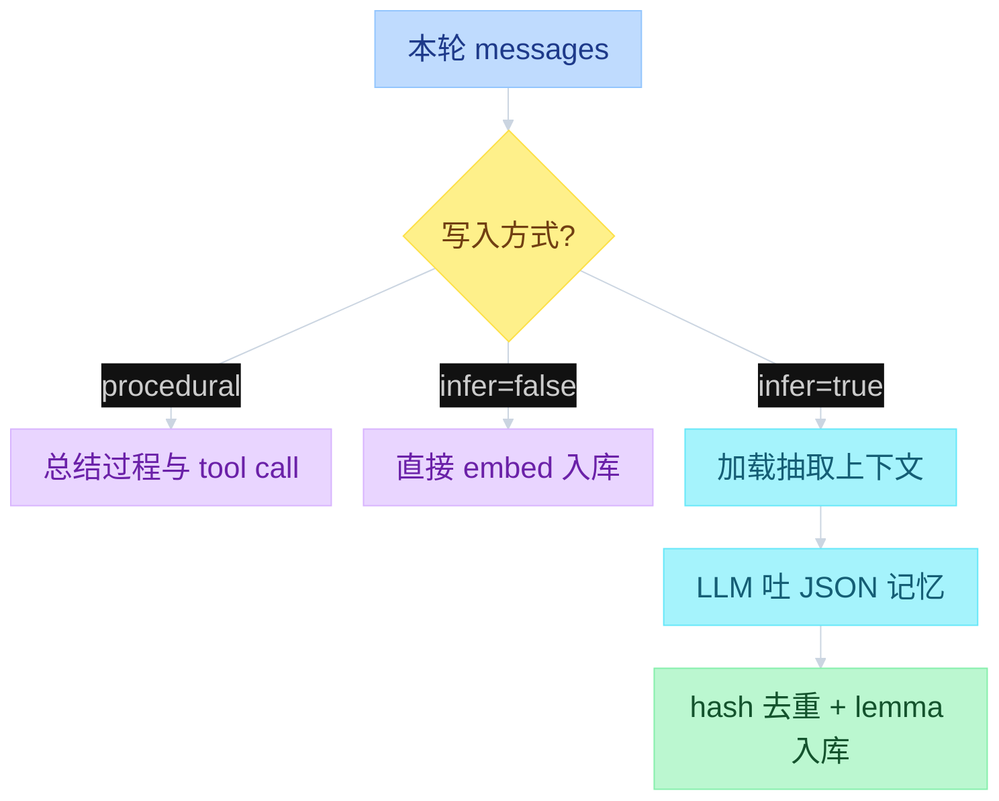

---

## 4. 检索（Retrieval）

检索 = 针对当前话题拿出 **相关记忆**。有两个时机，**后面的检索管线相同**，差别只在谁触发 Memory search。

### 4.0 记忆如何进入一个 turn

Retrieval lifecycle：记忆怎样进入 **一个 Agent turn**。四步一样，两种入口。

```text
function flow
  Explicit tool call: Agent 自己调 search memory
  Automatic retrieval: 用户一发消息就自动搜
  四步: User query → Memory search → Relevant context → LLM response
```

```mermaid
%%{init: {"theme": "dark", "flowchart": {"curve": "linear", "rankSpacing": 32, "nodeSpacing": 28, "padding": 28, "useMaxWidth": false, "htmlLabels": true}, "themeVariables": {"fontSize": "22px", "background": "#000000", "lineColor": "#CBD5E1", "edgeLabelBackground": "#111111"}, "themeCSS": ".nodeLabel,.label,span{font-size:22px!important}"}}%%
flowchart LR
    U1["① User query"] --> S1["② Memory search"]
    S1 --> C1["③ Relevant context"]
    C1 --> L1["④ LLM response"]

    classDef start fill:#BFDBFE,stroke:#93C5FD,color:#1E3A8A,font-size:22px
    classDef step fill:#A5F3FC,stroke:#67E8F9,color:#155E75,font-size:22px
    classDef prod fill:#E9D5FF,stroke:#D8B4FE,color:#6B21A8,font-size:22px
    classDef ok fill:#BBF7D0,stroke:#86EFAC,color:#14532D,font-size:22px

    class U1 start
    class S1 step
    class C1 prod
    class L1 ok
```

上图对应 **Explicit tool call**：① 用户提问后，Agent 决定调记忆工具，② 才是 Memory search。

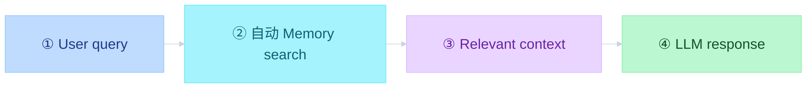

上图对应 **Automatic retrieval**：① 用户消息本身当 query，harness 自动搜，③ 拼进 context，④ 再交给 LLM。② 的内部怎么出池、打分，见 4.2。

### 4.1 输入参数

- **query**：在谈什么。若是用户消息，用户消息本身就是 query。这一步可以做 **query rewriting**，对管线很有用。**Mem0 默认不做**，要在 **harness 侧** 自己加
- **top K**：一次检索要多少条记忆，例如 10
- **threshold**：能进「相关记忆」列表的 **最低分数**
- **identity（身份，不是 ID）**：这些记忆是关于 **Agent**、关于 **用户**，还是关于 **这一次 run**。Agent 记忆可以是它从世界学到的东西、或某些办事流程；用户记忆是偏好、过往经历等

### 4.2 管线

1. **embed query**：必须用 **和建向量库时同一个 embedding 系统 / 同一个 embedding 模型**。可以用开源模型在本地跑。Mem0 默认用闭源模型；你也可以全程本地、开源 embedding。
2. 在主向量库里检索 **语义相近** 的记忆，用 **ANN（近似最近邻）**。
3. **候选池大于 top K**，因为后面要 **重排（re-ranking）**，池子越大重排越好，再从大池里选出真正的 top K。实际召回条数是 **`topK × 4` 和 `60` 取较大者**。top K = 10 时，向量检索实际拿出 **60** 条。关键词匹配和实体加分都只在这 60 条上做，**不能往池子里再加新记忆**。
4. **关键词匹配分（keyword matching score）**：query 做词形还原；记忆元数据里已经有 lemma。比的是 **词重叠**，算法是 **BM25**，最后映射成 **0～1**。
5. **实体加分（entity boost）**：先从 query 抽实体 → 在实体库里搜 → 命中的实体带着链到它们的记忆 → **只保留已经在初始 60 条（初始 top K 池）里的那些**，再给额外分。合成公式里按 **0～0.5** 计。要点：链到该实体的记忆 **越少，分越高**——实体是 Paris 且挂了 1000 条，分会低很多；只挂 2 条，更可能和当前要检索的东西相关，分会更高、更靠近 0.5。
6. **向量检索分** 也映射到 **0～1**。三路：向量 0～1 + 关键词 0～1 + 实体 0～0.5，满分 **2.5**。对池中每条：三路相加再 **除以 2.5**，得到最终分，再按这个分取真正的 **top K**，返回给用户或 Agent。

检索比写入更绕：三条分加在一起，才排出这条 query 最相关的记忆。形态像 RAG，但召回只有语义一路。

再强调：送进这条 pipeline 的 query 可以是任意内容，通常就是你塞进来的那串。pipeline **不一定带 query rewriting**。想检索更好，建议在 harness 侧加一层：用户一问，先用 **小 LLM** 改写成更好的 query，再检索。

这是一套 **RAG**：先召回、再打分、再截断。但 **不是**「语义检索 ∥ 关键词检索 → cross-rank」。

关键词 / 实体 **不能往池子里加新记忆**。只有 ANN 语义检索负责出池；BM25 和实体加分是在 **同一池上并行打分**，再和语义分做 fusion（cross-rank）。

```text
function flow
  embed query → search Vector DB (ANN)
    语义分 [0, 1]，topk = max(10×4, 60)
  池内并行:
    keyword matching: q→lemma + memory→lemma → BM25 [0, 1]
    entity boost: extract from q → search Entity DB → 只留池内 [0, 0.5]
  三路满分 1 + 1 + 0.5 = 2.5，相加后 / 2.5 取 topK
```

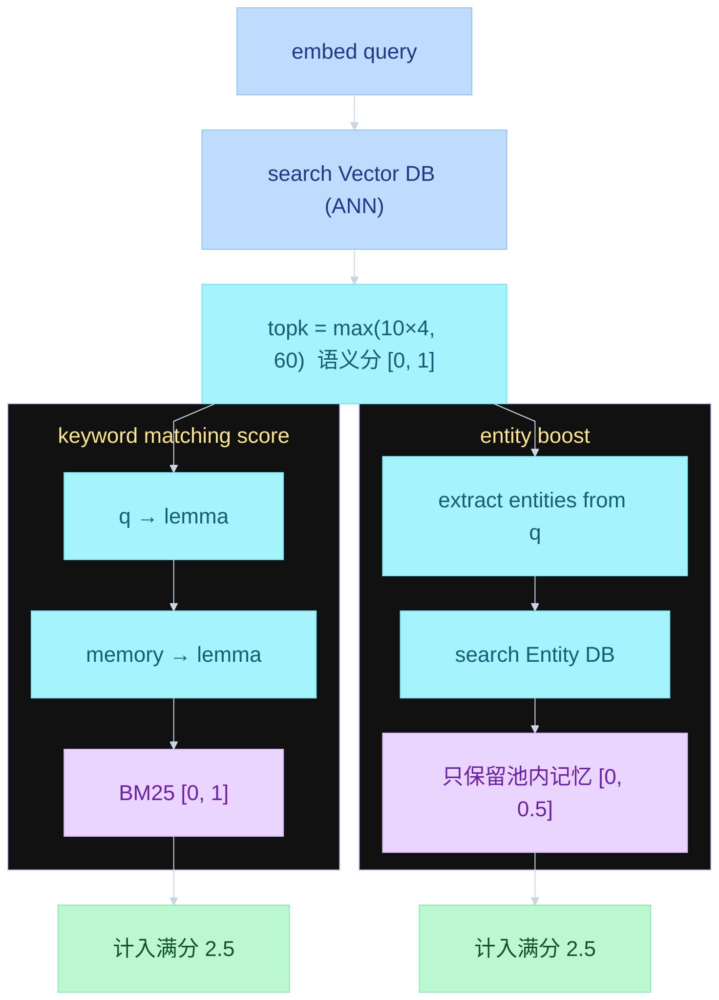

ANN 先出池；左边 BM25、右边实体加分只打这一池，不另开召回。两路各记入满分 2.5（语义 1 + BM25 1 + 实体 0.5），不三线汇进同一个框。Embedding 模型名单在 5.2.1 表格。

---

## 5. 全程本地、开源模型怎么选

以上就是 Mem0 工作方式里你需要知道的部分。若要用 **完全本地、开源** 把各阶段跑起来，可以到 Hugging Face 挑模型。

### 5.1 抽取（extraction）

这是最重要的环节之一，但任务相对简单，选 **小模型** 即可。

- 大约 **10 亿～120 亿参数（1B～12B）** 就够；不要低于 1B，除非你微调过
- 在 Hugging Face 勾 **Text Generation** 做筛选
- 例子：Llama、Qwen。实务上 **Qwen3 8B** 这一档比较合适，选该系列当时的最新版即可

### 5.2 Embedding

- 任务筛选勾 **Feature Extraction**，列表里大多是 embedding 模型，选你喜欢的
- 要看排名：对照 **口碑较好的 embedding 基准**（多语、英语、其它语言等都有）。例如你要偏医疗，就看医疗语境上表现更好的 embedding 榜

### 5.2.1 本地检索实用模型

下面这些 Open embedding models 给本地 retrieval 用。四条是 **备选**，不是一条流水线。`bge-m3` 的 dense + sparse 是模型自己的能力；Mem0 第 4 章仍是 ANN 语义出池，BM25 在池内打分。

| # | 模型 | 特点 |
|---|------|------|
| 01 | BAAI/bge-m3 | 多语 · dense + sparse |
| 02 | intfloat/e5-large-v2 | 英语检索强 |
| 03 | nomic-ai/nomic-embed-text-v1.5 | 长上下文 embedding |
| 04 | gte-Qwen2-1.5B-instruct | instruction-aware 检索 |

### 5.3 微调

长期做这件事，更稳的做法是 **微调自己的小模型**，效果更好，也更能本地跑。

```text
function flow
  抽取: Text Generation，约 1B~12B，例 Qwen3 8B（Mem0 云端常见 GPT-5 Mini 量级）
  向量: Feature Extraction，可对照各语言 / 领域 embedding 榜
  长期: 微调小模型，全程本地
```

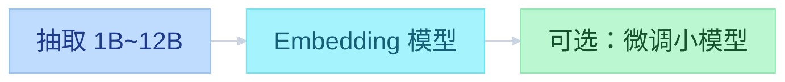

---

## 6. 收束

以上是 Agent 长期记忆的一份入门，实现用例是 **Mem0**。同类方案还有 **SuperMemory** 等，做法不同，可以对照着看。
