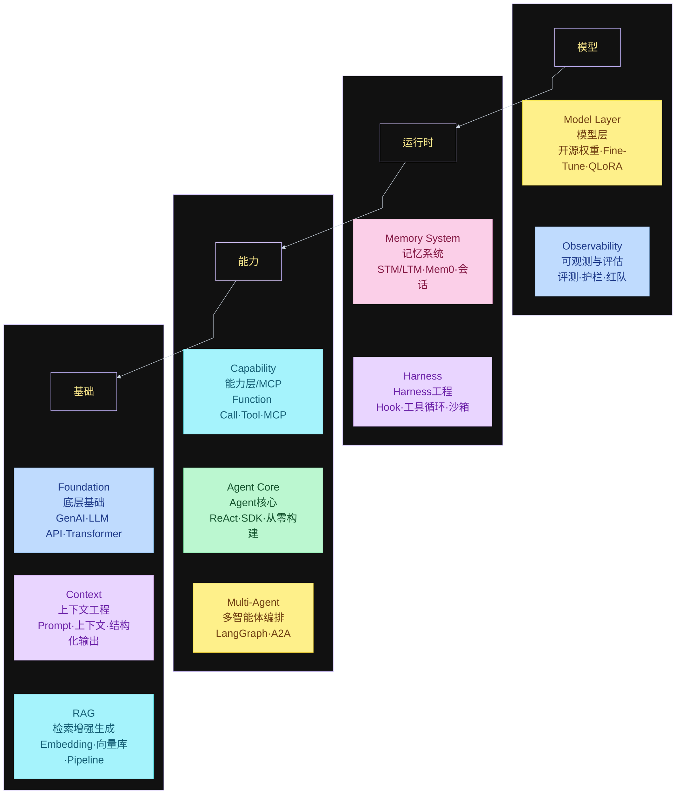

#小白 AI Agent 学习指南

自下往上叠：底层基础撑起能力，能力撑起记忆与 Harness，最上才是模型与评测。



## 本仓库学习路线

对照上面四层读 `Readme.md`。目录编号是写作顺序，真正学的时候先走概念，再上工程，源码按 Hermes → waku → Pi，最后用 Loop / CI/CD / LangGraph 收口。

```text
function flow（仓库路线）
  00 大纲
    → 01 范式 → 02 RAG → 03 Memory → 04 多智能体 → 05 路由
    → 06 Harness → 07 LLM基础
    → 08 Hermes → 12 waku → 13 Pi
    → 09 Loop工程 → 10 CI/CD → 11 LangGraph
```
