# AI Coding Full Workflow

> 来源：Matt Pocock Workshop 转录整理  
> 核心论点：**软件工程基本功对 AI 同样有效**——把任务压进 Smart Zone，用人在环做对齐，用 AFK Agent 做实现。

---

## 一、LLM 的两个奇怪约束

### 1. Smart Zone / Dumb Zone

每次开新会话时，注意力关系最松，模型最聪明。每往上下文加一个 token，注意力关系近似二次增长（像联赛每加一支球队，比赛场次平方级增加）。大约到 **~100K tokens（约窗口的 40%）** 就开始变笨——无论声称 200K 还是 1M，编码任务的 Smart Zone 大致都在这个量级。

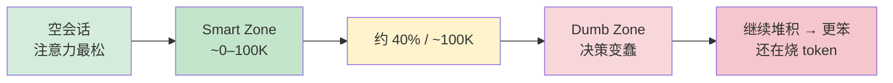

**实践含义**：任务必须切到能塞进 Smart Zone 的粒度；不要让 AI 一口吃成胖子。这和 Martin Fowler / Pragmatic Programmer 的「别咬太多」是同一条老建议。

### 2. Momento 式遗忘

LLM 像《记忆碎片》主角：清空上下文就回到基线状态。会话大致经历同一套阶段：

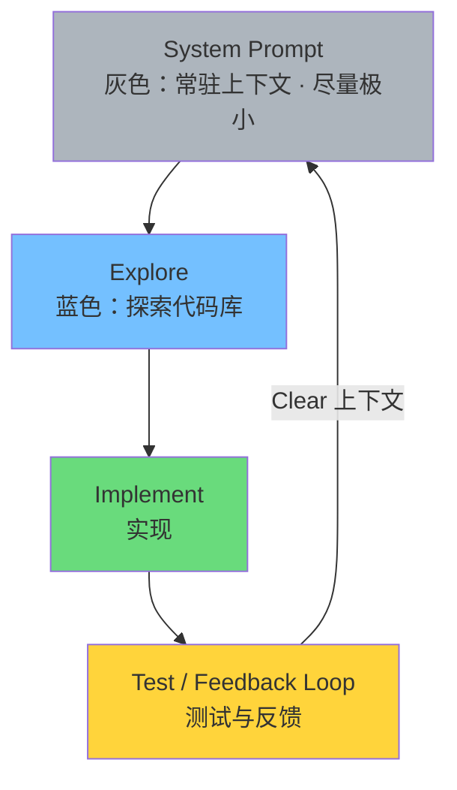

| 操作 | 行为 | Matt 的偏好 |
|------|------|-------------|
| **Clear** | 删掉一切，回到 System Prompt，状态可复现 | ✅ 优先：像 Momento，基线永远一致 |
| **Compact** | 把会话挤成一段 history 摘要再继续 | ❌ 不喜欢：引入「沉积物」，状态漂移 |

**System Prompt 原则**：越小越好。有人塞 250K，等于还没干活就进 Dumb Zone。

---

## 二、大任务怎么拆？从多阶段计划到循环

### 错误路径：一路干到 Dumb Zone 再 Compact

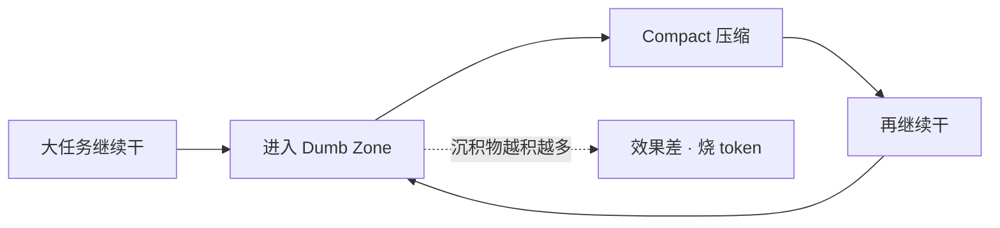

### 常见做法：Multi-phase Plan

把大任务拆成 Phase 1 → 2 → 3 → 4，每段都在 Smart Zone 里做。

### 更好看法：这本来就是一个 Loop

开发者会一眼看出「Phase 1..N 就是循环」。于是有 **Ralph Wiggum** 实践：写好终点（PRD），让 AI 每次只做一小步，逼近终点。

Matt 更偏好**多一点结构**：不是裸 Ralph，而是「目的地文档 + 旅程看板（Kanban / DAG）」。

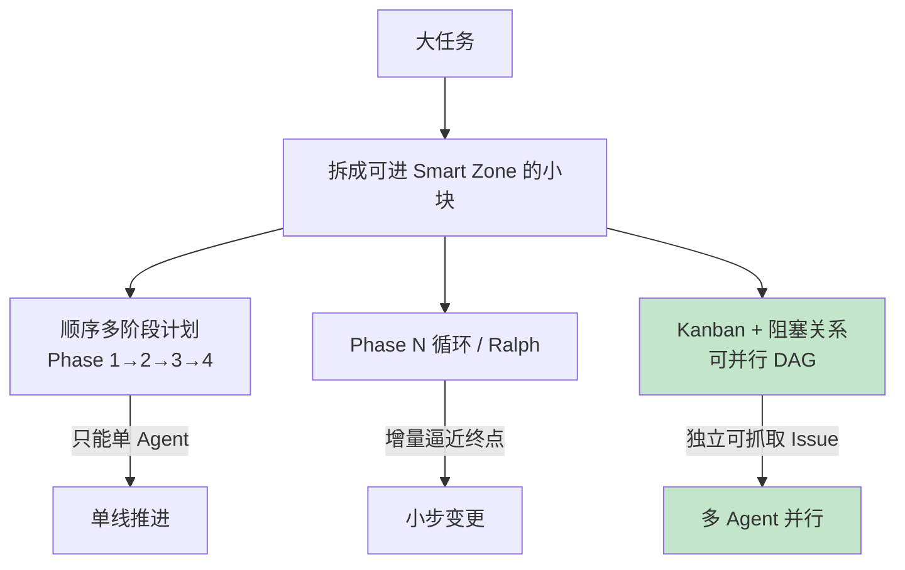

---

## 三、端到端工作流总览

人在环做对齐与拆分；实现交给 AFK Agent；**机器 Auto Review 后再由人做重点 Code Review / QA**。

### 先明确两件事

1. **Issue 粒度**：Idea / PRD 是大的；Kanban 上的 Issue 是 **PRD 已拆好的小垂直切片**。AFK 一次只捡一个小 Issue。
2. **人要 Code Review**：不是纯手工唯一关卡——反馈环 → Auto Review（Agent）→ **人重点审** → Team Review。

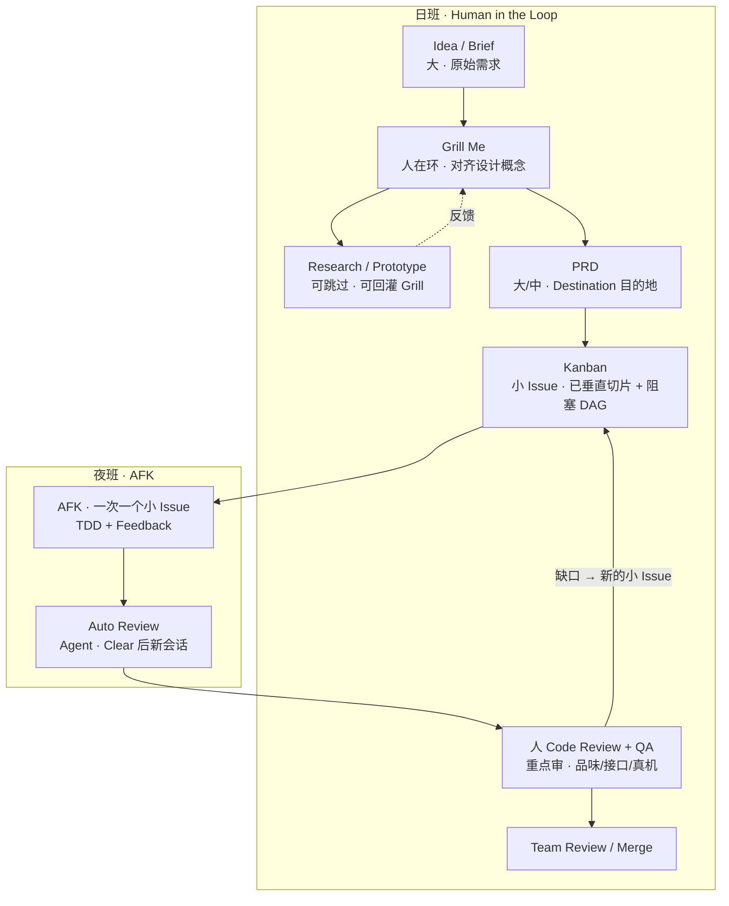

| 资产 | 粒度 | 谁消费 |
|------|------|--------|
| Idea / Brief | **大** | Grill 输入 |
| PRD | **大/中**（整块功能终点） | 拆 Issue 时；AFK 不整份啃 |
| Kanban Issue | **小**（已拆垂直切片） | AFK / Ralph **只吃这个** |

**两条任务类型**：

| 类型 | 含义 | 例子 |
|------|------|------|
| **Human-in-the-loop** | 必须人坐镇 | Grill、审小 Issue 切片形状、**人 Code Review + QA** |
| **AFK** | 人可离键 | 单个小 Issue 的 TDD 实现、Auto Review |

---

## 四、阶段详解

### 1. Grill Me —— 先对齐，不先 Spec→Code

反对「Specs to Code / 只改规格不看代码」：那是 vibe coding 换皮，代码才是战场。

**Grill Me Skill 要点**（极短）：

- 无情追问计划的每个分支，直到共享理解（Design Concept，Frederick Brooks）
- 一次只问一个问题，并给出推荐答案
- 目标是**同频**，不是急着产出 Plan 资产

```mermaid
flowchart LR
    Brief[Client Brief] --> Skill[/grill-me]
    Skill --> Explore[Sub-agent Explore<br/>隔离上下文 · 只回摘要]
    Explore --> Q1[问题1 + 推荐答案]
    Q1 --> A1[人回答 / 可口述]
    A1 --> Qn[… 可持续几十上百问]
    Qn --> Align[共享 Design Concept<br/>会话历史本身就是资产]

    style Align fill:#c3e6cb
```

**Sub-agent**：另开隔离上下文干重活（如 Explore），只把摘要 drip 回父 Agent——父会话 token 不暴涨。

**输入也可来自世界**：会议纪要 → 再 Grill，校验没问到的假设。

> 对齐阶段**不能** Ralph 掉：规划必须人在环；实现才可 AFK。

### 2. PRD —— 目的地文档（Destination）

Grill 结束后（例如 ~25K 高质量 token），写成 PRD：**总结已对齐的设计概念**。

典型结构：

- Problem / Solution
- User Stories（定义「长什么样」+ Definition of Done）
- Implementation Decisions
- Testing Decisions
- **Out of Scope**（保留否定决策，防范围漂移）
- Proposed Modules（要改哪些模块——始终把代码放在脑子里）

```mermaid
flowchart LR
    GrillHist[Grill 会话历史] --> WritePRD[/write-prd]
    WritePRD --> Dest[PRD = Destination<br/>我们要到哪]
    Dest --> Modules[Proposed Modules<br/>深模块接口意识]
```

**要不要精读 PRD？** Matt 通常不读：已通过 Grill 同频，LLM 擅长摘要；此时再读只是在测摘要能力。价值在对齐本身，不在把 PRD 打磨到「完美」。

### 3. PRD → Issues —— 旅程文档（Journey / Kanban）

需要两份本质文档：

| 文档 | 回答的问题 |
|------|------------|
| **Destination（PRD）** | 终点长什么样？Done 是什么？ |
| **Journey（Kanban Issues）** | 怎么切、谁阻塞谁、能否并行？ |

#### 水平切片 vs 垂直切片（Tracer Bullets）

AI 默认爱**水平**编码：先整库 Schema → 再整层 API → 再前端。问题是：要到最后一层才有端到端反馈，前面等于盲写。

应强制 **Vertical Slice / Tracer Bullet**：薄而穿层的功能条，Phase 1 结束就能测整条链路。

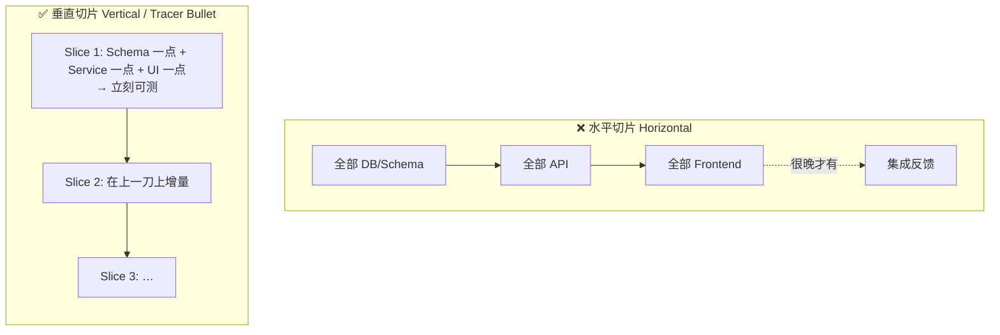

**Tracer Bullet 隐喻**：曳光弹——每隔几发能看见弹道，立即知道瞄哪；否则 AI 在后期阶段之前一直在盲射。

#### Kanban = 带阻塞关系的 DAG（可并行）

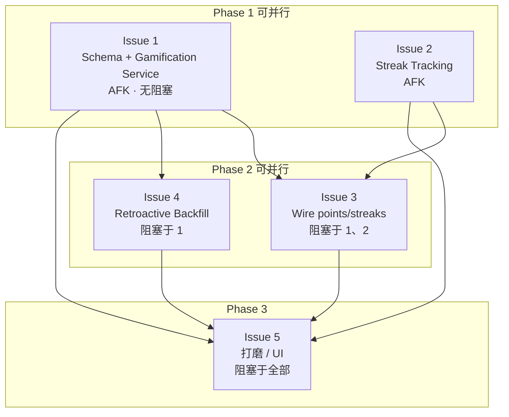

顺序编号的 Multi-phase Plan **只能单 Agent**；Kanban DAG 才能把 backlog 交给夜班并行。

### 4. AFK Implementation —— Ralph / Night Shift

人退出环：把本地 Issue 文件注入上下文，跑 sandbox（如 Docker）里的循环。

**单次（once）用于调 prompt**；**AFK 版**是真正的循环。

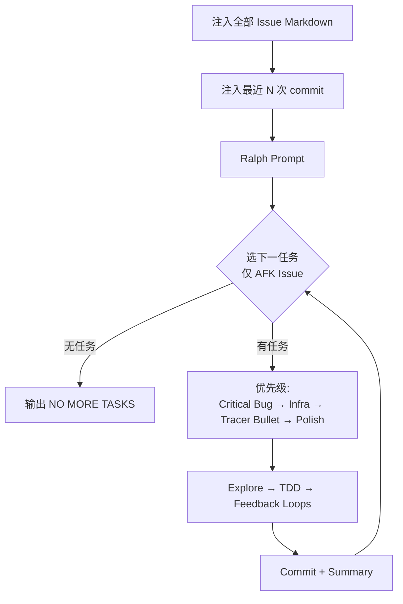

**任务优先级（示例）**：Critical bug → Dev infra → Tracer bullets → Polish / quick wins / refactor。

### 5. TDD + Feedback Loops —— AI 的天花板

无反馈环 = AI 盲写。**反馈环质量 = AI 产出质量的天花板**。

TDD（Red → Green → Refactor）尤其有效：

- 先写失败测试，再写实现 → 更难「作弊写测试」
- 给代码库持续增加有意义的测试

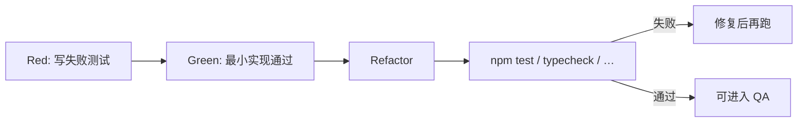

实现后应用 **独立上下文** 做自动 Review（否则 Review 落在 Dumb Zone，审的人比写的人还笨）：

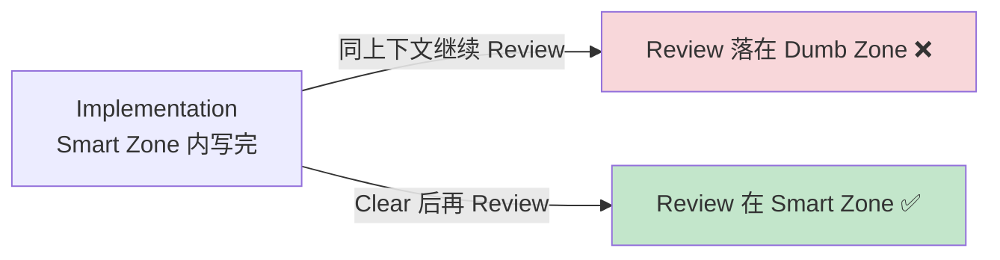

### 6. QA —— 把品味压回代码库

自动化不能包办一切。QA 是人把 **taste / 约束** 压回系统的环节；只自动化 Idea→QA 容易得到无品味的 slop。

QA 还可**边实现边开新 Issue** 回灌 Kanban（阻塞关系可无限加）。

前端尤需人眼：Playwright/Browser MCP 尚弱。做法：让 AI 在一次性路由上吐 **多个原型** → 人点选 → 资产回灌 Grill。

---

## 五、代码库形状：浅模块 vs 深模块

来自 John Ousterhout《A Philosophy of Software Design》。

### 浅模块（Shallow）—— AI 难导航、难测

小文件多、导出碎、依赖网乱；测试边界难画（逐函数测会 mock 地狱；大组测又糊成一团）。

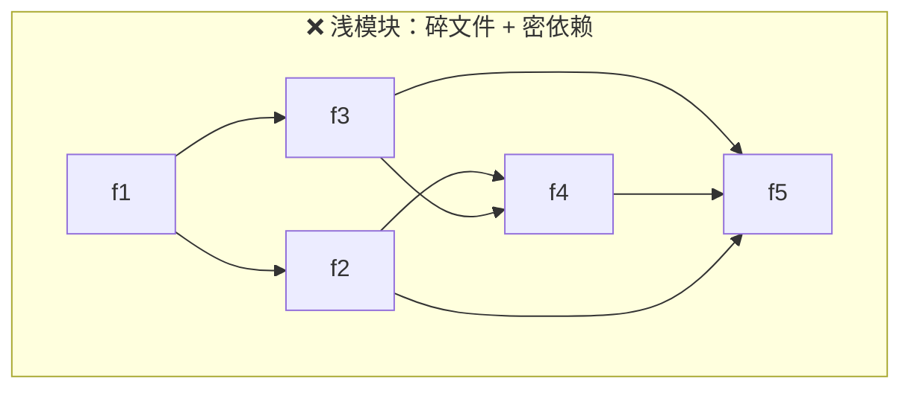

无人看管时，AI 容易产出这种形状。

### 深模块（Deep）—— 小接口、大能力、易测

简单接口 + 内部丰富实现；测试边界围住整个模块，调用方只面对清晰契约。

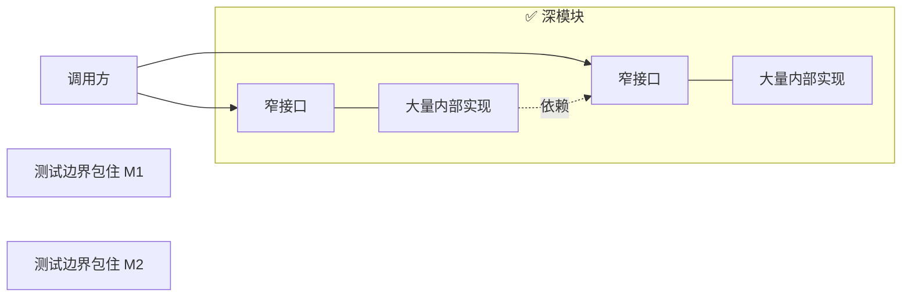

**心智技巧**：把模块当灰盒——**人设计接口与行为，委托内部实现**；不必事事 code review 内部，仍能保持对代码库形状的掌控。

PRD 里写明：新建哪个 deep module、改哪些边界（如 `GamificationService`）。

可用 skill：`improve codebase architecture` —— 扫描可加深的模块簇与测试缺口。

---

## 六、编码规范：Push vs Pull

| 方向 | 含义 | 用在哪 |
|------|------|--------|
| **Push** | 指令强制注入（如 CLAUDE.md） | **Reviewer**：把 coding standards 推给审阅者 |
| **Pull** | Agent 按需拉取（Skills 描述头） | **Implementer**：需要时再拉标准，避免常驻撑爆 System Prompt |

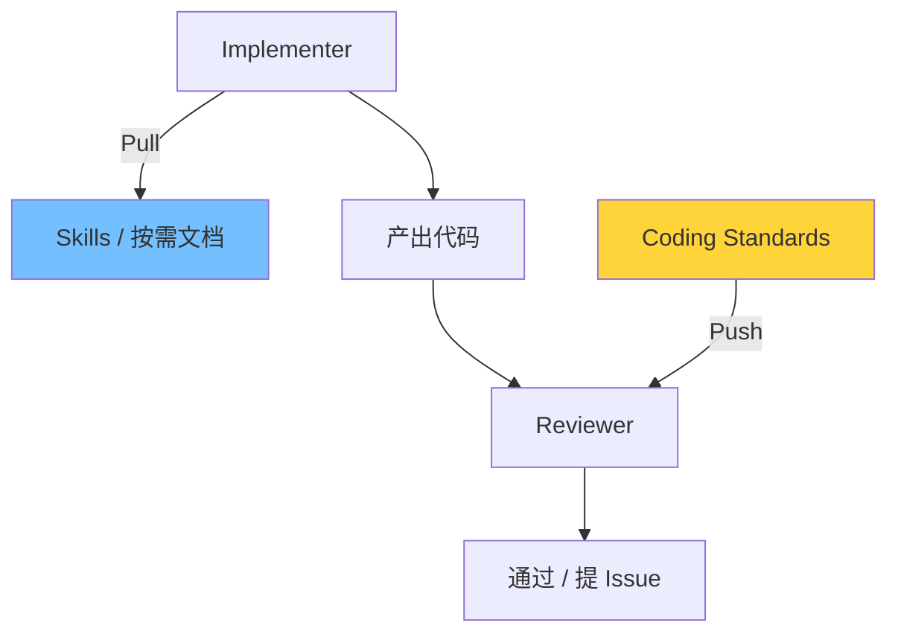

模型分工示例：Sonnet 实现、Opus 审查（审查更吃智能）。

---

## 七、并行化：Sand Castle 式流水线

从顺序 Ralph 升级为：Planner 选可并行 Issue → 每 Issue 一个 worktree/Docker sandbox → Implement → Review → Merger。

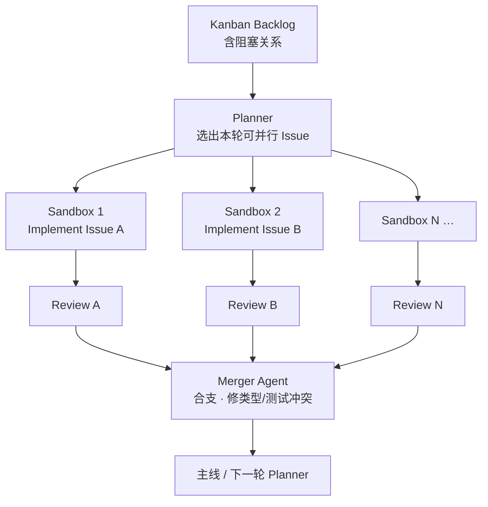

---

## 八、团队与现实世界的杂乱

真实世界不是一条直线：

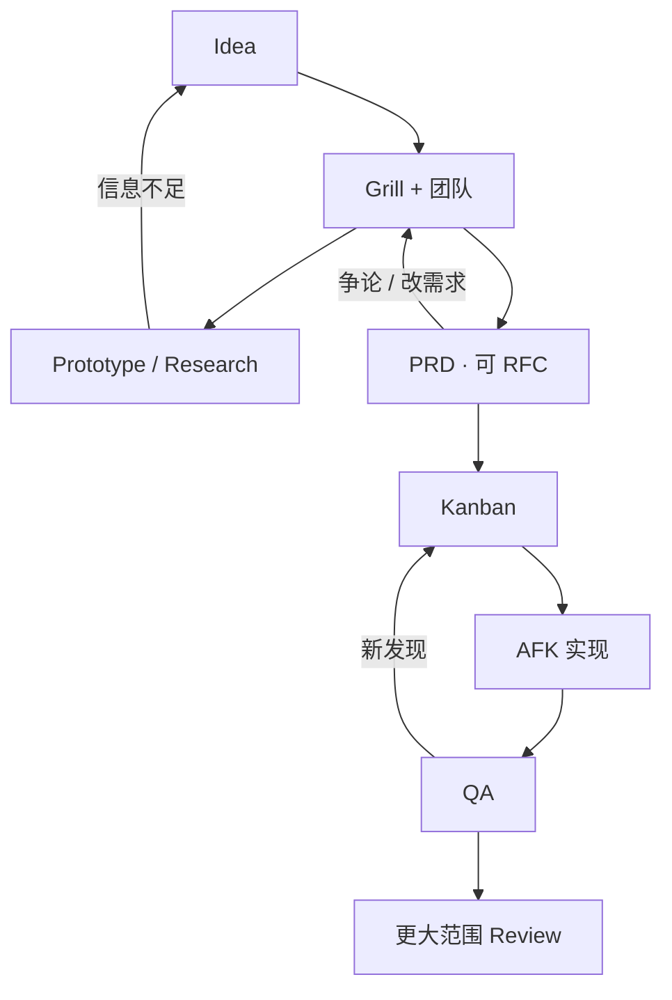

到 PRD / Journey 之前都属于**团队资产**（可 mob programming：领域专家 + 开发 + AI 同场 Grill）。一旦终点清晰，再放夜班。

---

## 九、文档要不要留在仓库？

| 做法 | 风险 / 好处 |
|------|-------------|
| Markdown PRD 长期留 repo | **Doc rot**：代码已变，旧 PRD 误导 Agent |
| GitHub Issue 关闭后可查 | 有「已完成」视觉信号，按需 fetch，Matt 更偏好 |

迁移文件另论：有确定性变更记录，与「腐烂规格」不同。

---

## 十、原则速查

1. **Smart Zone 优先**：~100K 内做事；Clear 优于 Compact；System Prompt 极瘦。
2. **先 Grill 对齐，再 PRD 摘要**；不要 Specs-to-Code 无视代码。
3. **两份文档**：Destination（PRD）+ Journey（垂直切片 Kanban/DAG）。
4. **Tracer Bullet**：穿层薄片，尽早端到端反馈。
5. **日班规划 / 夜班 AFK**；QA 与关键决策必须人在环。
6. **深模块 + TDD + 强反馈环** = Agent 能打的天花板。
7. **实现 Pull 标准，审查 Push 标准**；审查用独立 Smart Zone。
8. **拥有自己的规划栈**（Inversion of Control），别盲目绑死某个框架。
9. 经典书（《重构》《Pragmatic Programmer》《Philosophy of Software Design》《Design of Design》）是可直接喂进 prompt 的金矿。

---

## 附录：技能与资产地图

```mermaid
flowchart LR
    Brief[client-brief] --> Grill[/grill-me]
    Grill --> PRD[/write-prd]
    PRD --> Issues[/prd-to-issues<br/>vertical slices]
    Issues --> Ralph[ralph-once / AFK loop]
    Ralph --> QA[人工 QA]
    Codebase[(Codebase)] --> Arch[/improve-codebase-architecture]
    Arch --> Codebase
```

| Skill / 资产 | 作用 |
|--------------|------|
| `grill-me` | 人在环对齐 Design Concept |
| `write-prd` | 目的地文档 |
| `prd-to-issues` | 垂直切片 + 阻塞关系 Issue |
| Ralph once / AFK | 夜班实现循环 |
| TDD skill | Red-Green-Refactor |
| `improve-codebase-architecture` | 加深模块、找测试边界 |
| Out of Scope（PRD） | 持久化「决定不做」 |
