# AI Coding Agent 完整 Workflow（面试版）

> 一句话：**人负责对齐与品味，Agent 负责在 Smart Zone 里按垂直切片 AFK 实现；反馈环质量决定产出天花板。**

配套详解见同目录 `full_workflow.md`。

---
youtube：https://www.youtube.com/watch?v=-QFHIoCo-Ko

我用的不是「Specs→Code 甩锅式 vibe coding」，而是一套**人机分工流水线**：

1. 先用人在环把需求和代码形状**对齐**（Grill）
2. 产出**目的地（PRD）+ 旅程（垂直切片 Kanban/DAG）**
3. 实现交给 **AFK Agent 循环**（TDD + 测试/类型反馈环）
4. **先 Auto Review，再人做重点 Code Review / QA**（不是纯手搓逐行，也不是人不审）
5. 发现问题挂回看板（挂的是**小 Issue**，不是重新写一整份大 PRD）

底层约束只有两条：上下文有 **Smart/Dumb Zone**；会话清空后像 Momento **记忆归零**——所以任务要小、常 Clear、少堆 Compact。

---

## 0.5 两个必须说清的点

### A. Workflow 里的 Issue = 已拆好的小切片（不是大需求）

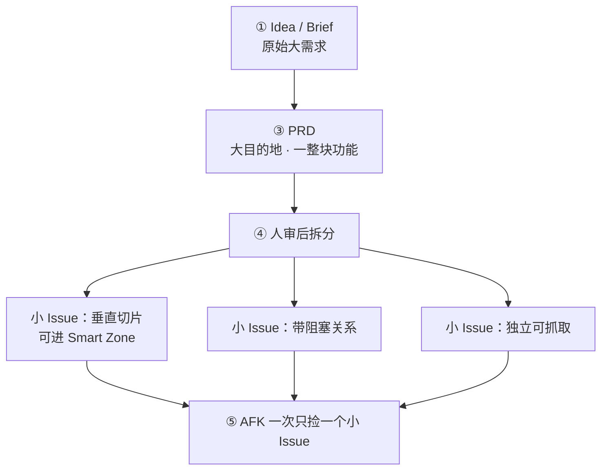

| 名字 | 粒度 | Agent 何时碰 |
|------|------|----------------|
| Idea / Brief | **大** | 只作 Grill 输入 |
| PRD | **大/中**（一整块功能的终点） | 拆 Issue 时读；AFK 不整份啃 |
| **Kanban Issue** | **小**（已垂直切片） | AFK / Ralph **只消费这类** |

**面试一句话**：PRD 是大目的地；看板里的 Issue 是已经拆过的、能塞进 Smart Zone 的小切片。

### B. 人要做 Code Review，但是分层审（不是纯手工唯一关卡）

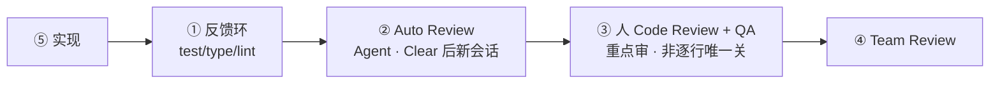

| 层 | 谁 | 审什么 |
|----|-----|--------|
| 反馈环 | 机器 | 测试 / 类型 / lint |
| Auto Review | Agent | 编码规范、明显 bug（Push standards） |
| **人 Code Review + QA** | **人（要做）** | 测试是否测到点、模块接口、真实可用、品味 |
| Team Review | 团队 | 合入前共享审查 |

人怎么审（重点，不是纯逐行）：先测再实现代码 → 深模块当灰盒盯接口/行为 → 手点 QA（尤其前端）→ 缺口拆成**新的小 Issue**回灌。

**面试一句话**：人要 Code Review；机器先挡一层，人审重点，不是纯手工唯一关卡。

---

## 1. 完整 Workflow 总图（必背）

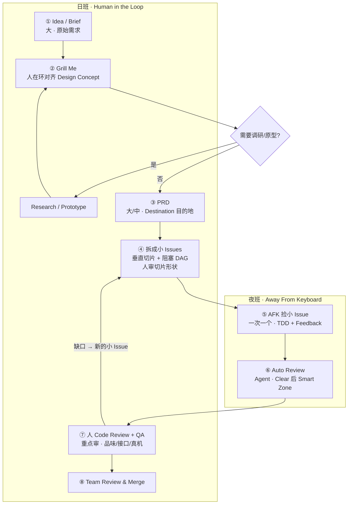

| 阶段 | 谁做 | 产出粒度 | 面试一句话 |
|------|------|----------|------------|
| ① Idea | 人/产品 | **大** Brief | 原始需求，未对齐 |
| ② Grill | **人 + Agent** | 对齐结果 | 防 misalignment，不问出 Plan |
| ③ PRD | Agent 摘要，人可不精读 | **大/中** Destination | 终点 + DoD + Out of Scope |
| ④ Issues | **人审切片** | **小** · 已拆垂直切片 | AFK 只吃这些小 Issue |
| ⑤ AFK | Agent | 针对**单个小 Issue**的 Commit | 一次只做一个小切片 |
| ⑥ Auto Review | Agent（新会话） | 审查意见 | 机器先审，必须在 Smart Zone |
| ⑦ 人 CR + QA | **人（要做）** | 通过 / 新的小 Issue | 重点审，不是纯手搓唯一关 |
| ⑧ Merge | 人/团队 | 合入 | 共享资产落地 |

---

## 2. 两条硬约束（区分候选人深度）

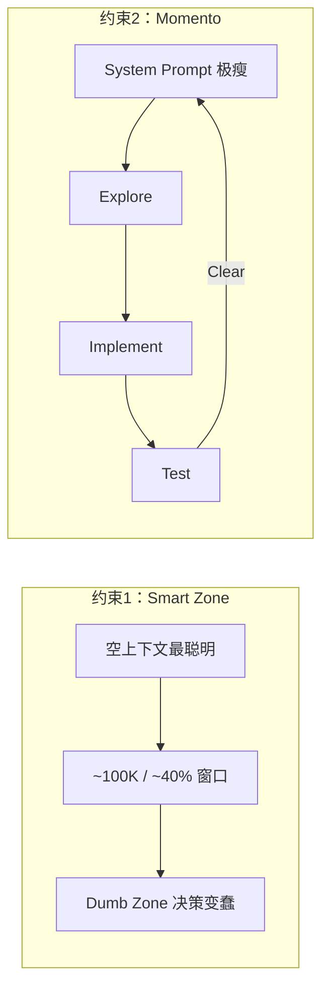

| 做法 | 面试怎么说 |
|------|------------|
| 任务切小 | 每块工作必须落在 Smart Zone，不一口吃成胖子 |
| Clear > Compact | Clear 状态可复现；Compact 有沉积物，越压越糊 |
| System Prompt 极瘦 | 常驻上下文过大 = 还没干活就进 Dumb Zone |
| 大窗口 ≠ 更聪明 | 1M 窗口多半是加长了 Dumb Zone；检索可用，编码仍约 100K |

---

## 3. 各阶段怎么讲（2 分钟版展开）

### ①→② Grill：先对齐，反对 Specs-to-Code

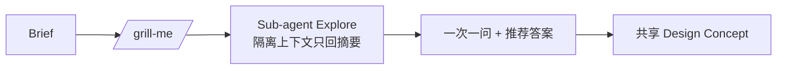

**面试要点**：

- 目标是 Frederick Brooks 说的 **Design Concept（共享理解）**，不是急着出 Plan
- Specs-to-Code 只改文档不看代码 = vibe coding；**代码才是战场**
- 规划阶段必须 **Human-in-the-loop**，不能 Ralph 掉
- 否定决策写进 PRD 的 **Out of Scope**，否则 Agent 会反复提议已否方案

### ③ PRD：Destination（目的地）——仍是「大」文档

包含：Problem / Solution / User Stories / Implementation & Testing Decisions / Out of Scope / **Proposed Modules（深模块边界）**。

**注意**：PRD 描述整块功能终点，**不是** AFK 直接执行的工作单元。

**面试反常识点**：Grill 已对齐后，PRD 往往**不精读**——此时读 PRD 只是在测模型摘要能力；精力留给**小 Issue 切片审核**和人审。

### ④ 小 Issues：Journey（旅程）= 已拆垂直切片 + DAG

> **明确**：这里的 Issue = 从 PRD 拆出来的**小任务**（独立可抓取、可进 Smart Zone），不是未拆的大需求。

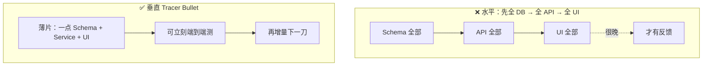

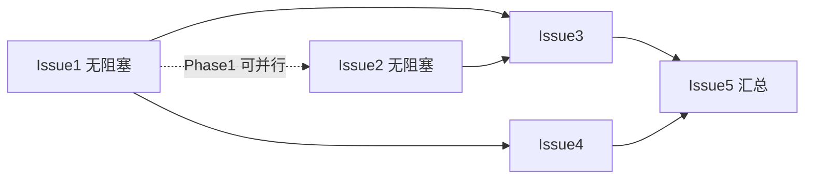

**面试要点**：

- AI 默认爱水平编码 → 反馈来得太晚 = 盲写
- **Tracer Bullet（曳光弹）**：尽早看见弹道
- 顺序 Phase 只能单 Agent；**Kanban 阻塞图 = DAG** 才能并行
- 人在本阶段的职责是**审切片形状**（够不够竖、会不会太大），不是开始写代码

### ⑤→⑥ AFK + Auto Review（机器层）

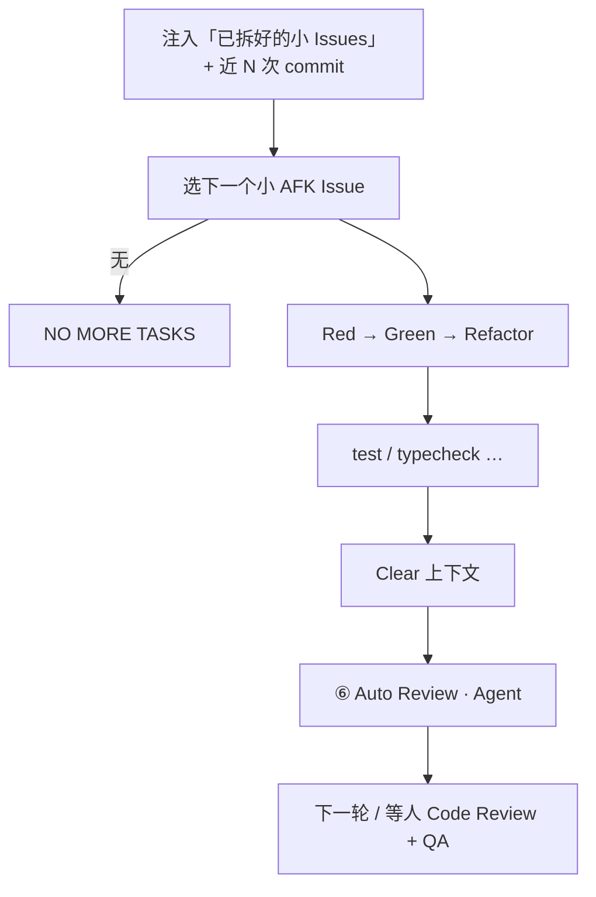

**优先级（可背）**：Critical Bug → Infra → Tracer Bullet → Polish/Refactor

**TDD 为什么必要**：先测后码更难「作弊写测试」；**反馈环质量 = Agent 产出天花板**。

### ⑦ 人 Code Review + QA（人要做）

**要做 Code Review**，但是重点审，流程是：

1. **机器已审过**：反馈环 + Auto Review
2. **人再审**：测试是否测到点 → 深模块接口/行为（灰盒）→ 手点真机/前端
3. **不通过**：拆成**新的小 Issue**回灌看板（不是回头重写整份大 PRD）

自动化全流程、人不审 → 容易 slop。前端用「多原型一次性路由 → 人点选 → 回灌 Grill」。

---

## 4. 代码库侧：让 Agent「能打」

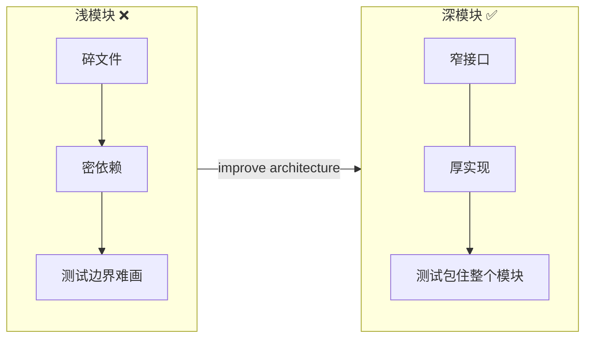

| 概念 | 面试表述 |
|------|----------|
| 深模块 | 小接口、大能力；人设计契约，委托内部实现（灰盒） |
| 浅模块 | AI 难导航、难测，无人看管易产出 |
| 模块地图 | PRD/Issue 里写清改哪些 deep module，规划期就带着代码形状 |

**规范落地 Push vs Pull**：

| | Implementer | Reviewer |
|--|-------------|----------|
| 标准 | **Pull**（Skills 按需） | **Push**（强制注入 standards） |
| 原因 | 少占常驻上下文 | 对照标准审代码需要完整准则 |

---

## 5. 并行夜班（加分项）

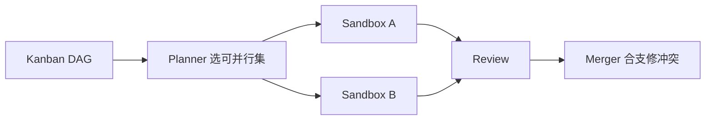

顺序 Ralph 入门；成熟形态 = Planner + 多 worktree/sandbox + Review + Merger。

---

## 6. 高频面试问答（背答案）

**Q1：你怎么保证 Agent 不跑偏？**  
A：Grill 对齐 Design Concept → PRD 锁终点与 Out of Scope → 垂直切片 Issue 锁范围 → QA 回灌；对齐阶段人必须在环。

**Q2：上下文很长怎么办？Compact 行不行？**  
A：优先 Clear 新开；任务切到 Smart Zone（约 100K）。Compact 有沉积，越压越糊。大窗口偏检索，不代表编码更聪明。

**Q3：为什么反对纯 Specs-to-Code？**  
A：只改规格不碰代码会丢失对代码库的掌控；坏代码库养出坏 Agent。规格是目的地摘要，战场在模块与反馈环。

**Q4：任务怎么切？看板里的 Issue 是大的还是小的？**  
A：Idea/PRD 是大的；看板 Issue 是**已经拆好的小垂直切片**，AFK 一次只做一个。用阻塞关系做成 DAG，可并行。

**Q5：实现能否全自动？人还要 Code Review 吗？**  
A：实现可 AFK；**人要做 Code Review + QA**，但是分层——机器 Auto Review 先挡，人审测试/接口/品味/真机。Grill、切片形状、关键架构也必须人在环。

**Q6：如何提高 Agent 代码质量？**  
A：加深模块 + TDD + 强反馈环（test/type/lint）；审查用独立会话；实现 Pull、审查 Push 编码规范。

**Q7：PRD / Issue 文档留不留仓库？**  
A：警惕 Doc Rot——代码已变、旧 PRD 误导 Agent。倾向 Issue 关闭可查，不长期当「现行真理」喂给模型。

**Q8：和 Ralph Loop 什么关系？**  
A：Ralph = 有终点后小步循环；我加结构：Destination(大 PRD) + Journey(已拆小 Issue 的 Kanban DAG) + 人审切片，再进循环。

---

## 7. 口述模板（直接背）

> 我的 AI Coding Workflow 分日班夜班。  
> **日班**：Brief → Grill 对齐 →（可选原型）→ **大 PRD** 定目的地 → **拆成小的垂直切片 Issue**（带阻塞，可并行），人审切片形状。  
> **夜班**：Agent **一次只捡一个小 Issue** 做 TDD + 反馈环；写完 Clear 后再 **Auto Review**。  
> **人回来做重点 Code Review + QA**（不是纯逐行唯一关），缺口拆成新的小 Issue 回灌看板，满意再 Team Review。  
> 设计原则是：任务压进 Smart Zone、Clear 优于 Compact、深模块好测、反馈环质量决定天花板——软件工程基本功对 Agent 同样成立。

---

## 8. 一张图记住全流程（极简）

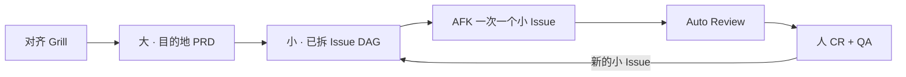

**五个词**：对齐 → 大目的地 → **小切片** → 机器审 → **人重点审**。

---

## 9. 产品经理面试也能用吗？——能，但重画「谁主责」

**结论：流程图能用，角色重心不同。**  
同一条流水线，PM 主责「对齐 / 目的地 / 验收」，研发主责「小切片工程化 / AFK 实现 / 代码审」。不要把整条讲成「PM 自己写代码」。

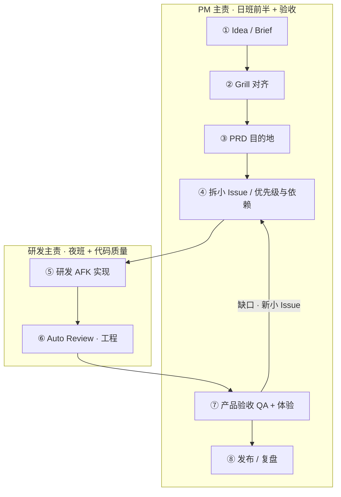

| 阶段 | PM 面试怎么说 | 别说成 |
|------|----------------|--------|
| Grill | 和 AI / 研发 / 领域专家对齐假设；一次一问，锁定范围与否定决策 | 甩给 AI 自己出方案 |
| PRD | 我 lock 目的地、User Story、DoD、Out of Scope | Specs→Code 改完文档就上线 |
| 小 Issue | 参与优先级、依赖、何为「可验收的一刀」；垂直切片 = 尽早可体验 | 我自己拆技术任务细节 |
| AFK | 理解研发可离键实现；我提供清晰 backlog | 我盯着 Agent 写每一行 |
| 验收 | **产品要验收**：体验、路径、是否达 PRD；缺口变小 Issue 回灌 | 只看报表不点真机 |
| Review | 产品审「对不对、好不好用」；代码规范审交给工程 Auto Review + 研发 CR | PM 逐行 Code Review |

**PM 口述模板（约 40 秒）**：

> 我和研发共用一条 AI 协作流水线：需求先 Grill 对齐，再落成 PRD 目的地，再拆成可验收的小切片进看板。研发侧 Agent 按小 Issue AFK 实现并自动审查；我负责范围、优先级和验收体验，发现问题拆成新的小 Issue 回灌，而不是改一版大规格就当交付。核心是人机分工——PM 锁「做什么、做到什么算完」，工程锁「怎么在 Smart Zone 里做对」。

**和研发面试的差异（追问用）**：

- 同图：Idea → Grill → PRD → 小 Issue → 实现 → 审 → 验收  
- 不同点：PM 不深讲 TDD/深模块/Push-Pull；改讲 **对齐质量、范围控制、可验收切片、Out of Scope、验收回灌**  
- 加分：提「Grill 常需要 PO/领域专家在场」——很多题不是纯开发能答的  
